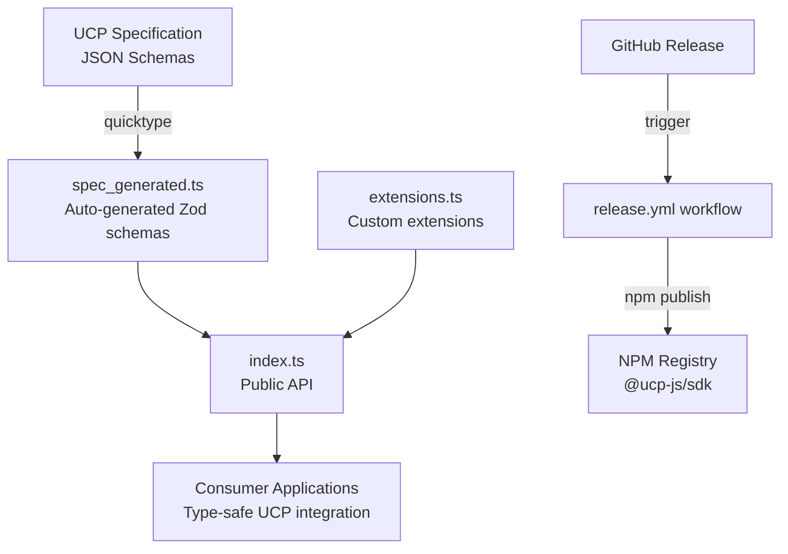
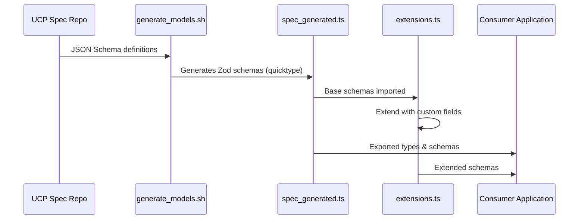

# Project Exploration: UCP JavaScript SDK

## Overview

The UCP JavaScript SDK is the official JavaScript/TypeScript library for the Universal Commerce Protocol (UCP). It provides strongly-typed TypeScript interfaces and Zod validation schemas for UCP data models, enabling developers to build UCP-compliant e-commerce applications with full type safety.

The SDK is designed as a lightweight, schema-only library that exports generated types from the UCP specification. It serves as a contract definition layer for any JavaScript/TypeScript application integrating with UCP-compatible commerce platforms, handling checkout flows, payment processing, fulfillment, and order management.

## Repository

- **Location:** `/home/darkvoid/Boxxed/@formulas/src.rust/src.llamacpp/src.protocols/js-sdk`
- **Remote:** `git@github.com:Universal-Commerce-Protocol/js-sdk.git`
- **Primary Language:** TypeScript
- **License:** Apache License 2.0

## Directory Structure

```
js-sdk/
├── index.ts                    # Main entry point - re-exports all modules
├── package.json                # Package configuration (NPM metadata, scripts, deps)
├── package-lock.json           # Dependency lock file
├── LICENSE                     # Apache 2.0 license
├── README.md                   # Usage and contribution documentation
├── generate_models.sh          # Code generation script using quicktype
├── tsconfig.json               # Base TypeScript configuration
├── tsconfig.cjs.json           # CommonJS build configuration
├── tsconfig.esm.json           # ESM build configuration
├── tsconfig.types.json         # Type declarations build configuration
├── .github/
│   ├── CODEOWNERS              # Code ownership definitions
│   └── workflows/
│       └── release.yml         # GitHub Actions: NPM publish on release
└── src/
    ├── spec_generated.ts       # Auto-generated Zod schemas from UCP spec
    └── extensions.ts           # Extended/custom schemas beyond generated code
```

## Architecture

### High-Level Diagram



### Component Breakdown

#### Entry Point (`index.ts`)
- **Location:** `index.ts`
- **Purpose:** Main module entry that re-exports all public APIs
- **Exports:** All schemas from `extensions.ts` and `spec_generated.ts`

#### Generated Specifications (`src/spec_generated.ts`)
- **Location:** `src/spec_generated.ts`
- **Purpose:** Auto-generated Zod schemas representing the complete UCP data model
- **Dependencies:** UCP specification JSON schemas (via `generate_models.sh`)
- **Dependents:** All consumer applications using the SDK
- **Key Schemas:** 100+ exported Zod schemas covering:
  - Checkout flows (create, update, response types)
  - Payment instruments and credentials
  - Order management
  - Fulfillment (shipping, pickup, digital)
  - Discounts and promotions
  - Buyer information and consent
  - Line items and totals
  - Messages and errors
  - UCP discovery and capabilities

#### Extensions (`src/extensions.ts`)
- **Location:** `src/extensions.ts`
- **Purpose:** Custom schema extensions that augment generated types
- **Dependencies:** `spec_generated.ts`
- **Extensions:**
  - `ExtendedPaymentCredentialSchema` - Adds optional `token` field
  - `PlatformConfigSchema` - Platform webhook configuration
  - `ExtendedCheckoutResponseSchema` - Combines fulfillment, discounts, buyer consent, and order info
  - `ExtendedCheckoutCreateRequestSchema` - Unified create request with all optional features
  - `ExtendedCheckoutUpdateRequestSchema` - Unified update request with all optional features
  - `OrderUpdateSchema` - Type alias for order updates

#### Code Generation (`generate_models.sh`)
- **Location:** `generate_models.sh`
- **Purpose:** Generates TypeScript Zod schemas from UCP JSON specification
- **Tool:** Uses `quicktype` with `typescript-zod` target
- **Input:** UCP spec JSON schemas from discovery, shopping schemas, and specific $defs references

## Data Flow



## External Dependencies

| Dependency | Version | Purpose |
|------------|---------|---------|
| zod | ^3.23.8 | Runtime type validation and TypeScript inference |
| typescript | ^5.4.5 | Type checking and compilation (dev) |
| quicktype | ^23.2.6 | Code generation from JSON schemas (dev) |

## Configuration

### Build Configuration

The SDK supports dual module format output:

| Config File | Output | Purpose |
|-------------|--------|---------|
| `tsconfig.json` | `dist/` | Base configuration |
| `tsconfig.cjs.json` | `dist/cjs/` | CommonJS modules for Node.js `require()` |
| `tsconfig.esm.json` | `dist/esm/` | ES Modules for modern bundlers |
| `tsconfig.types.json` | `dist/` | TypeScript declaration files (`.d.ts`) |

### Environment Requirements

- Node.js LTS (for building)
- npm for package management

### Package Exports

```json
{
  "main": "./dist/cjs/index.js",
  "module": "./dist/esm/index.js",
  "types": "./dist/index.d.ts"
}
```

## Testing

This SDK currently has **no automated tests**. The testing strategy relies on:

1. TypeScript compilation (`npm run build:noEmit`) for type safety
2. Manual validation of generated schemas against UCP spec
3. Integration testing by consuming applications

## Release Process

The release workflow (`.github/workflows/release.yml`) automates NPM publishing:

1. Triggered by GitHub release publication
2. Checks out code and installs Node.js LTS
3. Runs `npm ci` for clean dependency installation
4. Builds all output formats (CJS, ESM, types)
5. Publishes to NPM with provenance and public access

## Key Insights

- **Schema-only library**: This SDK provides types and validation schemas only - no HTTP client or business logic
- **Generated from spec**: The core schemas are auto-generated from the UCP JSON specification using `quicktype`, ensuring consistency across UCP implementations
- **Dual-module support**: Ships with both CommonJS and ESM outputs for maximum compatibility
- **Zod-based validation**: Uses Zod for runtime validation with automatic TypeScript type inference via `z.infer<>`
- **Extensible design**: The `extensions.ts` file allows custom schemas that compose generated base schemas
- **Apache 2.0 licensed**: Permissive license suitable for commercial use
- **Governance model**: CODEOWNERS includes multiple oversight groups (devops-maintainers, tech-council, governance-council)

## Open Questions

1. **No test coverage**: Consider adding unit tests for schema validation behavior
2. **Version sync**: How is the SDK version kept in sync with the UCP specification version?
3. **Breaking changes**: What is the strategy for handling breaking changes in the UCP spec?
4. **Documentation**: Could benefit from JSDoc comments on exported schemas for better IDE integration
