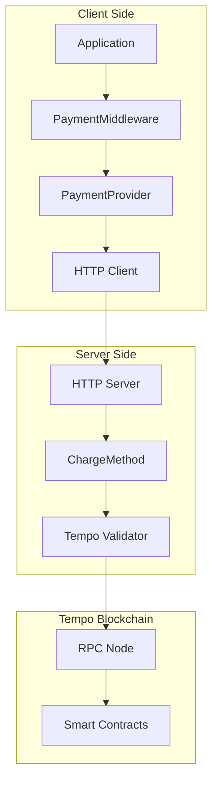
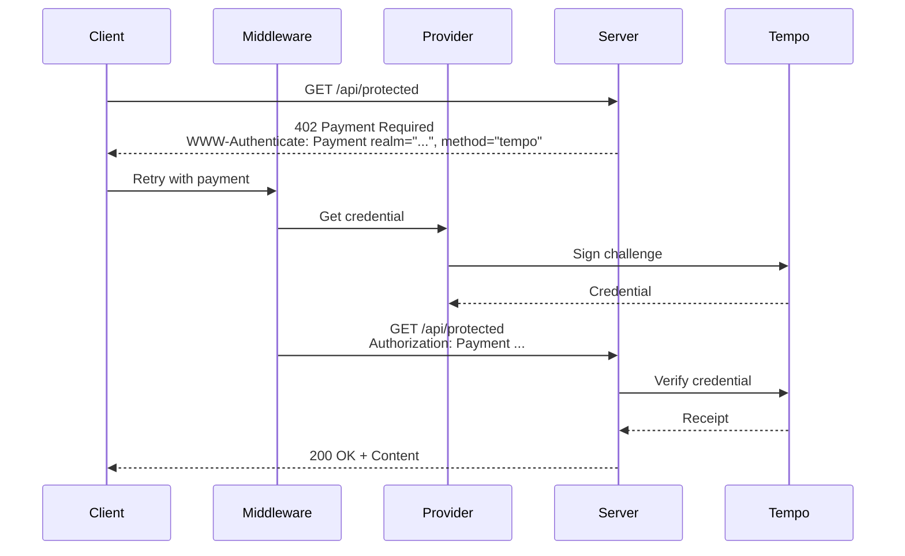
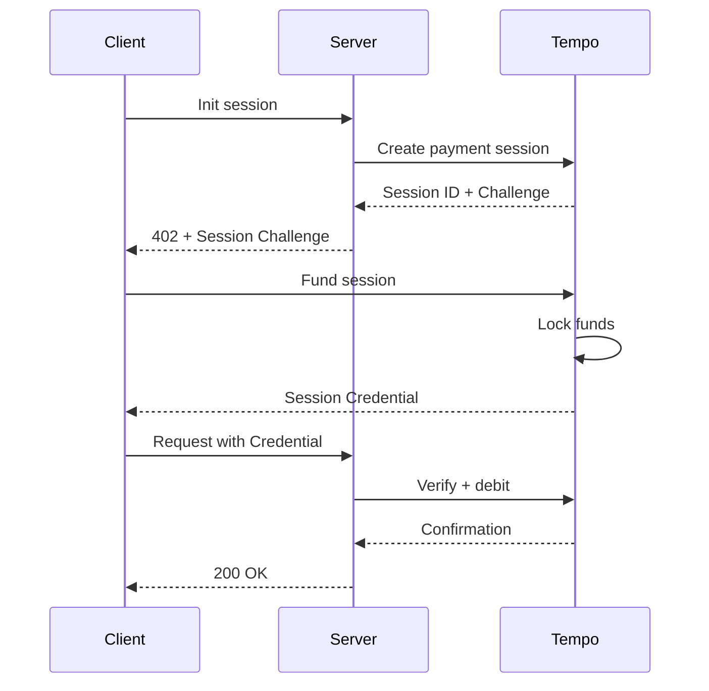

# Project Exploration: mpp-rs (Machine Payments Protocol)

## Overview

mpp-rs is the Rust SDK for the Machine Payments Protocol (MPP), an open protocol built on HTTP 402 Payment Required that enables clients (agents, apps, humans) to pay for services in the same HTTP request. The protocol eliminates the need for API keys, billing accounts, or checkout flows by standardizing payment-required responses.

The SDK provides middleware-based integration with popular HTTP libraries (reqwest, tower, axum) and implements the Tempo blockchain payment method with support for charge and session intents.

## Repository

- **Location:** `/home/darkvoid/Boxxed/@formulas/src.rust/src.llamacpp/src.protocols/mpp-rs`
- **Remote:** `git@github.com:tempoxyz/mpp-rs.git`
- **Primary Language:** Rust 1.93+
- **License:** MIT OR Apache-2.0 (dual licensed)
- **Crate:** `mpp` on crates.io

## Directory Structure

```
mpp-rs/
├── src/
│   ├── lib.rs                     # Root library exports
│   ├── error.rs                   # Error types
│   ├── credential.rs              # Payment credential types
│   ├── receipt.rs                 # Payment receipt types
│   │
│   ├── client/                    # Client-side components
│   │   ├── mod.rs
│   │   ├── provider.rs            # PaymentProvider trait
│   │   ├── tempo/                 # Tempo provider
│   │   │   ├── mod.rs
│   │   │   ├── provider.rs        # TempoProvider implementation
│   │   │   ├── signer.rs          # Signer trait
│   │   │   └── ops.rs             # Channel operations
│   │   ├── middleware.rs          # reqwest-middleware integration
│   │   └── fetch.rs               # Fetch trait extension
│   │
│   ├── server/                    # Server-side components
│   │   ├── mod.rs
│   │   ├── charge.rs              # Charge method trait
│   │   ├── tempo/                 # Tempo server implementation
│   │   │   ├── mod.rs
│   │   │   ├── config.rs          # TempoConfig
│   │   │   └── charge.rs          # Tempo charge implementation
│   │   ├── tower/                 # Tower middleware
│   │   │   └── mod.rs
│   │   └── axum/                  # Axum extractors
│   │       └── mod.rs
│   │
│   ├── http/                      # HTTP primitives
│   │   ├── mod.rs
│   │   ├── challenge.rs           # Payment challenge
│   │   └── header.rs              # WWW-Authenticate/Authorization
│   │
│   └── utils/                     # Utilities (dev/test)
│       ├── hex.rs
│       └── random.rs
│
├── examples/
│   ├── server/                    # Server examples
│   │   └── basic.rs
│   ├── client/                    # Client examples
│   │   └── basic.rs
│   └── middleware/                # Middleware examples
│       └── axum.rs
│
├── fuzz/                          # Fuzzing infrastructure
│   ├── Cargo.toml
│   └── fuzz_targets/
│       ├── credential_parse.rs
│       └── receipt_parse.rs
│
├── .changelog/                    # Unreleased changes
│   └── ...
│
├── Cargo.toml                     # Crate configuration
├── CHANGELOG.md                   # Version history
├── LICENSE-APACHE                 # Apache 2.0 license
├── LICENSE-MIT                    # MIT license
├── docker-compose.yml             # Test infrastructure
├── examples/                      # Runnable examples
└── README.md                      # Project overview
```

## Architecture

### High-Level Architecture



### Payment Flow (Charge Intent)



### Payment Flow (Session Intent)



## Component Breakdown

### Core Types

#### Payment Credential

```rust
pub struct Credential {
    pub method: String,           // "tempo"
    pub params: CredentialParams,
}

pub enum CredentialParams {
    Charge(ChargeCredential),
    Session(SessionCredential),
}

pub struct ChargeCredential {
    pub recipient: Address,
    pub amount: U256,
    pub signature: Signature,
    pub nonce: u64,
}

pub struct SessionCredential {
    pub session_id: H256,
    pub signature: Signature,
}
```

#### Payment Receipt

```rust
pub struct Receipt {
    pub method: String,
    pub amount: U256,
    pub recipient: Address,
    pub tx_hash: H256,
    pub block_number: u64,
}
```

#### HTTP Headers

```rust
// WWW-Authenticate: Payment realm="api", method="tempo", challenge="..."
pub struct WwwAuthenticate {
    pub realm: String,
    pub method: String,
    pub challenge: Option<String>,
}

// Authorization: Payment method="tempo", credential="..."
pub struct Authorization {
    pub method: String,
    pub credential: Credential,
}
```

### Client Components

#### PaymentProvider Trait

```rust
#[async_trait]
pub trait PaymentProvider: Send + Sync {
    /// Get credential for a payment challenge
    async fn get_credential(&self, challenge: &Challenge) -> Result<Credential>;

    /// Get the payment method name
    fn method(&self) -> &str;
}
```

#### TempoProvider

```rust
pub struct TempoProvider {
    signer: Arc<dyn Signer>,
    rpc_url: String,
    recipient: Address,
    gas_limit: u64,
}

impl TempoProvider {
    pub fn new(signer: Arc<dyn Signer>, rpc_url: impl Into<String>) -> Result<Self>;

    pub fn with_recipient(mut self, recipient: Address) -> Self;
    pub fn with_gas_limit(mut self, limit: u64) -> Self;
}

#[async_trait]
impl PaymentProvider for TempoProvider {
    async fn get_credential(&self, challenge: &Challenge) -> Result<Credential> {
        // Parse challenge
        // Sign with Tempo channel ops
        // Return credential
    }
}
```

#### Signer Trait

```rust
pub trait Signer: Send + Sync {
    fn address(&self) -> Address;
    async fn sign_message(&self, message: &[u8]) -> Result<Signature>;
}

// Implementations for:
// - LocalSigner (private key in memory)
// - LedgerSigner (hardware wallet)
// - Custom signers
```

#### PaymentMiddleware (reqwest-middleware)

```rust
pub struct PaymentMiddleware<P: PaymentProvider> {
    provider: P,
    max_retries: u32,
}

impl<P: PaymentProvider> PaymentMiddleware<P> {
    pub fn new(provider: P) -> Self;
    pub fn with_max_retries(mut self, retries: u32) -> Self;
}

#[async_trait]
impl<P, B> Middleware<B> for PaymentMiddleware<P>
where
    P: PaymentProvider,
    B: Body,
{
    async fn execute(
        &self,
        req: Request<B>,
        extensions: &mut Extensions,
        next: Next<'_, B>,
    ) -> Result<Response> {
        // Execute request
        // If 402, get credential and retry
        // Return response
    }
}
```

**Usage:**
```rust
use mpp::client::{PaymentMiddleware, TempoProvider};
use reqwest_middleware::ClientBuilder;

let signer = LocalSigner::from(private_key);
let provider = TempoProvider::new(Arc::new(signer), "https://rpc.moderato.tempo.xyz");

let client = ClientBuilder::new(reqwest::Client::new())
    .with(PaymentMiddleware::new(provider))
    .build();

// All requests now handle 402 automatically
let resp = client.get("https://api.example.com/protected").send().await?;
```

### Server Components

#### ChargeMethod Trait

```rust
pub trait ChargeMethod: Send + Sync + 'static {
    /// Create a new charge
    fn charge(&self, amount: &str) -> Result<Challenge>;

    /// Verify a credential and return receipt
    fn verify_credential(&self, credential: &Credential) -> impl Future<Output = Result<Receipt>>;
}
```

#### Tempo Charge Implementation

```rust
pub struct TempoCharge {
    config: TempoConfig,
    client: TempoRpcClient,
}

pub struct TempoConfig {
    pub recipient: Address,
    pub rpc_url: Option<String>,
    pub gas_limit: Option<u64>,
}

impl ChargeMethod for TempoCharge {
    fn charge(&self, amount: &str) -> Result<Challenge> {
        // Create challenge with nonce
        // Return WWW-Authenticate header
    }

    async fn verify_credential(&self, credential: &Credential) -> Result<Receipt> {
        // Verify signature
        // Submit to Tempo
        // Return receipt
    }
}
```

#### Tower Middleware

```rust
pub struct MppLayer<P: PaymentProvider> {
    provider: P,
}

impl<P, S> Layer<S> for MppLayer<P>
where
    P: PaymentProvider + Clone,
{
    type Service = MppService<S, P>;

    fn layer(&self, inner: S) -> Self::Service {
        MppService {
            inner,
            provider: self.provider.clone(),
        }
    }
}
```

#### Axum Extractor

```rust
/// Extractor for verified payment receipts
pub struct Paid(Receipt);

#[axum::async_trait]
impl<S, B> FromRequest<S, B> for Paid
where
    S: Send + Sync,
    B: Send + Sync + 'static,
{
    type Rejection = MppRejection;

    async fn from_request(req: Request<B>, _state: &S) -> Result<Self, Self::Rejection> {
        // Extract Authorization header
        // Verify credential
        // Return receipt
    }
}

// Usage:
async fn paid_endpoint(Paid(receipt): Paid) -> Response {
    format!("Payment of {} confirmed!", receipt.amount)
}
```

## Entry Points

### Server Example

```rust
use mpp::server::{Mpp, tempo, TempoConfig};
use axum::{Router, routing::get, extract::State};

#[tokio::main]
async fn main() {
    // Create MPP with Tempo
    let mpp = Mpp::create(tempo(TempoConfig {
        recipient: "0x742d35Cc6634C0532925a3b844Bc9e7595f1B0F2".parse()?,
        rpc_url: Some("https://rpc.moderato.tempo.xyz".into()),
    }))?;

    // Axum router
    let app = Router::new()
        .route("/paid", get(paid_endpoint))
        .layer(mpp.layer());

    let listener = tokio::net::TcpListener::bind("0.0.0.0:3000").await?;
    axum::serve(listener, app).await?;
}

async fn paid_endpoint(
    _receipt: mpp::server::axum::Paid,
) -> impl axum::response::IntoResponse {
    "Payment verified!"
}
```

### Client Example

```rust
use mpp::client::{PaymentMiddleware, TempoProvider, LocalSigner};
use reqwest_middleware::ClientBuilder;

#[tokio::main]
async fn main() {
    // Create signer from private key
    let private_key = "0x..."; // Never hardcode in production!
    let signer = LocalSigner::from(private_key.parse()?);

    // Create Tempo provider
    let provider = TempoProvider::new(
        std::sync::Arc::new(signer),
        "https://rpc.moderato.tempo.xyz"
    )?;

    // Build HTTP client with payment middleware
    let client = ClientBuilder::new(reqwest::Client::new())
        .with(PaymentMiddleware::new(provider))
        .build();

    // Request automatically handles 402
    let response = client
        .get("https://api.example.com/protected/resource")
        .send()
        .await?;

    println!("Status: {}", response.status());
    println!("Body: {}", response.text().await?);
}
```

## External Dependencies

| Dependency | Version | Purpose |
|------------|---------|---------|
| `alloy` | ^1.6 | Ethereum/Tempo types and RPC |
| `alloy-primitives` | ^1.5 | Address, U256, Signature types |
| `reqwest` | ^0.13 | HTTP client |
| `reqwest-middleware` | ^0.4 | Middleware framework |
| `tower` | ^0.5 | Service middleware |
| `axum` | ^0.8 | Web framework |
| `tokio` | ^1.49 | Async runtime |
| `thiserror` | ^2.0 | Error handling |
| `async-trait` | ^0.1 | Async traits |

## Configuration

### Cargo Features

```toml
[features]
default = ["client", "server", "tempo"]
client = ["dep:reqwest", "dep:reqwest-middleware"]
server = ["dep:tower", "dep:axum"]
tempo = ["evm", "dep:alloy"]
evm = ["dep:alloy-primitives", "dep:alloy"]
middleware = ["client", "dep:reqwest-middleware"]
tower = ["dep:tower"]
axum = ["tower", "dep:axum"]
utils = ["dep:hex", "dep:rand"]
```

### Tempo Configuration

```rust
pub struct TempoConfig {
    /// Recipient address for payments
    pub recipient: Address,

    /// RPC endpoint (defaults to testnet)
    pub rpc_url: Option<String>,

    /// Gas limit for transactions
    pub gas_limit: Option<u64>,

    /// Private key for signing (use Signer trait in production)
    pub private_key: Option<String>,
}
```

## Testing

### Test Structure

- **Unit Tests:** Inline `#[cfg(test)]` modules
- **Integration Tests:** `tests/` directory with test RPC
- **Fuzzing:** Property-based fuzzing for parsing

### Running Tests

```bash
# All tests
cargo test

# With features
cargo test --all-features

# Fuzzing
cd fuzz && cargo fuzz run credential_parse
```

### Test Example

```rust
#[cfg(test)]
mod tests {
    use super::*;

    #[test]
    fn test_parse_credential() {
        let json = r#"{"method":"tempo","params":{...}}"#;
        let credential: Credential = serde_json::from_str(json)?;
        assert_eq!(credential.method, "tempo");
    }

    #[tokio::test]
    async fn test_charge_flow() {
        let mpp = Mpp::create(tempo(TempoConfig {
            recipient: test_address(),
        }))?;

        let challenge = mpp.charge("100")?;
        let credential = create_test_credential(&challenge);
        let receipt = mpp.verify_credential(&credential).await?;

        assert_eq!(receipt.amount, U256::from(100));
    }
}
```

## Key Insights

1. **HTTP 402 Standardization:** Builds on the standardized "Payment Required" status code, not a custom mechanism

2. **Middleware-First Design:** Client-side middleware pattern means existing code automatically handles payments

3. **Payment Method Extensibility:** While Tempo is the first implementation, the trait design supports multiple payment methods

4. **Charge vs Session Intents:** Two payment patterns - immediate charge for one-off payments, sessions for streaming/multiple requests

5. **Rust Type Safety:** Strong typing for addresses, amounts, and signatures prevents common payment bugs

6. **Framework Agnostic:** Server-side works with any HTTP framework via Tower trait

## Edge Cases & Safety Guarantees

| Edge Case | Handling |
|-----------|----------|
| Invalid credential format | Returns parse error before verification |
| Expired challenge | Nonce tracking prevents replay |
| Insufficient funds | Transaction revert, credential invalid |
| Race condition (double spend) | Channel ops use atomic sequence numbers |
| Network failure | Idempotent credential generation |

## Performance Considerations

- **Credential Caching:** Credentials can be cached for the challenge lifetime
- **Batch Verification:** Server can batch credential verification
- **Gas Optimization:** Channel ops minimize on-chain transactions

## Migration Path

For existing services wanting to add MPP:

1. Add `mpp` crate with `server` and `axum` features
2. Wrap existing routes with `MppLayer`
3. Configure `TempoConfig` with recipient address
4. For clients: add middleware to existing HTTP clients

## Open Considerations

1. **Payment Method Discovery:** How should clients discover which payment methods a server supports?

2. **Amount Negotiation:** Protocol supports amount in challenge - should clients be able to suggest amounts?

3. **Refund Mechanism:** No standard refund mechanism defined in current protocol

4. **Subscription Patterns:** Session intent partially addresses this, but recurring payment patterns could be more explicit
