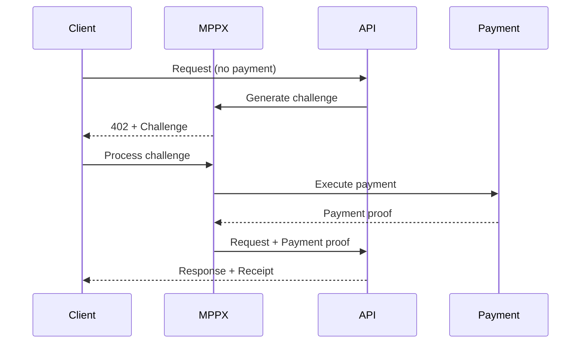

# MPPX Exploration - Machine Payments Protocol SDK

## Overview

MPPX is the TypeScript SDK for the Machine Payments Protocol (MPP), built on the "Payment" HTTP Authentication Scheme (IETF draft-ryan-httpauth-payment). It enables microtransactions and pay-per-use APIs through HTTP 402 Payment Required responses.

The SDK provides both server-side and client-side implementations for handling payment challenges, supporting multiple payment methods including Tempo (crypto) and Stripe (traditional payments).

## Repository

- **Location:** `/home/darkvoid/Boxxed/@formulas/src.rust/src.llamacpp/src.protocols/mppx`
- **Remote:** `git@github.com:wevm/mppx.git`
- **Primary Language:** TypeScript
- **License:** MIT

## Directory Structure

```
mppx/
├── src/
│   ├── index.ts              # Main entry point
│   ├── bin.ts                # CLI entry point
│   ├── BodyDigest.ts         # Request body digest utilities
│   ├── Challenge.ts          # Payment challenge handling (402 responses)
│   ├── Credential.ts         # Payment credential management
│   ├── Errors.ts             # Error types and handling
│   ├── Expires.ts            # Challenge expiration handling
│   ├── Mcp.ts                # Model Context Protocol integration
│   ├── Method.ts             # Payment method abstraction
│   ├── PaymentRequest.ts     # Payment request construction
│   ├── Receipt.ts            # Payment receipt handling
│   ├── Store.ts              # State persistence abstraction
│   ├── zod.ts                # Zod schema utilities
│   ├── cli/                  # CLI implementation
│   ├── client/               # Client-side SDK
│   ├── server/               # Server-side SDK
│   ├── proxy/                # Payments proxy server
│   ├── middlewares/          # Framework middlewares (Hono, Express, Next.js, Elysia)
│   ├── stripe/               # Stripe payment method
│   ├── tempo/                # Tempo payment method
│   ├── internal/             # Internal utilities
│   └── viem/                 # Viem (ethereum) utilities
├── examples/                 # Usage examples
├── test/                     # Test suite
└── scripts/                  # Build scripts
```

## Architecture

### High-Level Flow



### Core Modules

| Module | Purpose |
|--------|---------|
| **Challenge** | Handles 402 payment challenges from servers |
| **Credential** | Manages payment credentials and keys |
| **Method** | Abstracts payment method implementations |
| **Receipt** | Validates and stores payment receipts |
| **Store** | Abstracts state persistence (sessions, credentials) |
| **Proxy** | Creates payment proxies for any API |

## Key Components

### Challenge System

The Challenge module handles HTTP 402 Payment Required responses:

```typescript
// Challenge schema fields
{
  id: string,           // Unique challenge ID (HMAC-bound)
  realm: string,        // Server realm
  method: string,       // Payment method (tempo, stripe)
  intent: string,       // Intent type (charge, session)
  request: object,      // Method-specific request data
  description?: string, // Human-readable description
  expires?: datetime,   // Optional expiration
  digest?: string,      // Optional body digest
  opaque?: object       // Server correlation data
}
```

### Payment Methods

1. **Tempo** - Crypto payments using blockchain
2. **Stripe** - Traditional payment processor (SPT - Single Payment Token)

### Server API

```typescript
import { Mppx, tempo } from 'mppx/server'

const mppx = Mppx.create({
  methods: [
    tempo({
      currency: '0x20c000...',
      recipient: '0x742d35...',
    }),
  ],
})

// Charge endpoint
export async function handler(request: Request) {
  const response = await mppx.charge({ amount: '1' })(request)
  if (response.status === 402) return response.challenge
  return response.withReceipt(Response.json({ data: '...' }))
}
```

### Client API

```typescript
import { Mppx, tempo } from 'mppx/client'
import { privateKeyToAccount } from 'viem/accounts'

Mppx.create({
  methods: [tempo({ account: privateKeyToAccount('0x...') })],
})

// Global fetch now handles 402 automatically
const res = await fetch('https://mpp.dev/api/ping/paid')
```

### Payments Proxy

MPPX can create payment proxies for any API:

```typescript
import { openai, stripe, Proxy } from 'mppx/proxy'
import { Mppx, tempo } from 'mppx/server'

const mppx = Mppx.create({ methods: [tempo()] })

const proxy = Proxy.create({
  services: [
    openai({
      apiKey: 'sk-...',
      routes: {
        'POST /v1/chat/completions': mppx.charge({ amount: '0.05' }),
        'GET /v1/models': mppx.free(),
      },
    }),
  ],
})
```

## External Dependencies

| Dependency | Purpose |
|------------|---------|
| ox | Low-level crypto primitives |
| viem | Ethereum interactions |
| zod | Runtime type validation |
| incur | Error handling |
| @remix-run/* | Fetch utilities |

## Framework Support

MPPX provides middlewares for:
- **Hono** - `./hono`
- **Express** - `./express`
- **Next.js** - `./nextjs`
- **Elysia** - `./elysia`
- **Bun** - Native support
- **Deno** - Native support

## CLI

MPPX includes a CLI for making HTTP requests with automatic payment handling:

```bash
# Create account (stored in keychain)
mppx account create

# Make request (automatic payment)
mppx example.com
```

## Examples

| Example | Description |
|---------|-------------|
| charge | Payment-gated photo generation API |
| charge-wagmi | React + Wagmi integration |
| session/multi-fetch | Multiple requests over single payment |
| session/sse | Pay-per-token LLM streaming |
| stripe | Stripe SPT integration |

## Key Insights

1. **HTTP 402 Standard**: Built on IETF draft for "Payment" HTTP Authentication Scheme
2. **Framework Agnostic**: Works with any fetch-compatible runtime
3. **Multi-Method**: Supports both crypto (Tempo) and traditional (Stripe) payments
4. **Proxy Pattern**: Can wrap any existing API with payment gating
5. **Session Support**: Single payment can cover multiple requests within a session
6. **Streaming**: Supports pay-per-token streaming for LLM APIs

## Related Projects

| Project | Relationship |
|---------|-------------|
| tempo | Blockchain payment settlement layer |
| prool | RPC mock library for testing |
| mpp-rs | Rust implementation of MPP |
| pympp | Python implementation of MPP |

## Testing

Uses Vitest for testing with:
- Unit tests for core modules
- Integration tests with Testcontainers
- Browser tests via Playwright

## Open Considerations

1. Version sync with MPP specification
2. Additional payment method integrations
3. Receipt validation security considerations
