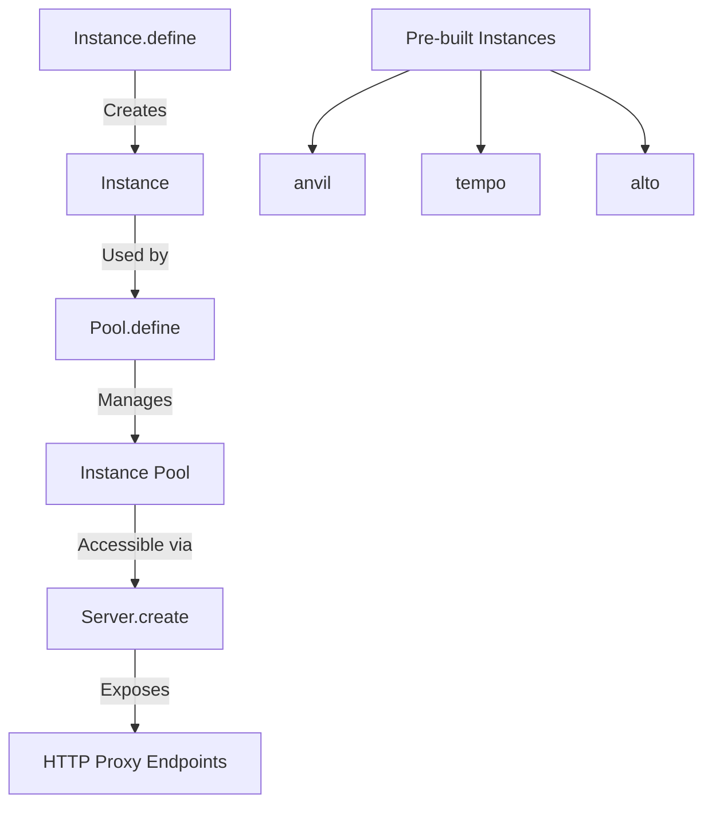

# Prool Exploration - HTTP Testing Instances for Ethereum

## Overview

Prool is a library that provides programmatic HTTP testing instances for Ethereum. It is designed for testing environments where you need to interact with Ethereum server instances (Execution Nodes, 4337 Bundlers, Indexers) over HTTP or WebSocket.

Prool contains pre-configured instances for simulating Ethereum server environments and allows creating custom instances.

## Repository

- **Location:** `/home/darkvoid/Boxxed/@formulas/src.rust/src.llamacpp/src.protocols/prool`
- **Remote:** `git@github.com:wevm/prool.git`
- **Primary Language:** TypeScript
- **License:** MIT

## Directory Structure

```
prool/
├── src/
│   ├── index.ts              # Main entry point
│   ├── Instance.ts           # Instance definition and management
│   ├── Pool.ts               # Instance pool management
│   ├── Server.ts             # HTTP server with proxy
│   ├── anvil/                # Anvil (Foundry) instance
│   ├── tempo/                # Tempo execution node instance
│   ├── alto/                 # ERC-4337 Bundler node instance
│   └── testcontainers/       # Docker-based test containers
├── test/                     # Test suite
└── .changeset/               # Changeset configurations
```

## Architecture

### Core Concepts



### Server Architecture

```
┌─────────────────────────────────────────────────────────┐
│                    Server.create()                       │
│  ┌─────────────────────────────────────────────────┐    │
│  │              HTTP Proxy Server                   │    │
│  │  Routes:                                         │    │
│  │  - /:key          → Proxy to instance            │    │
│  │  - /:key/start    → Start instance               │    │
│  │  - /:key/stop     → Stop instance                │    │
│  │  - /:key/restart  → Restart instance             │    │
│  │  - /healthcheck   → Health check                 │    │
│  └─────────────────────────────────────────────────┘    │
│                          │                               │
│                          ▼                               │
│  ┌─────────────────────────────────────────────────┐    │
│  │              Instance Pool                       │    │
│  │  - Instance 1 (http://localhost:8545/1)         │    │
│  │  - Instance 2 (http://localhost:8545/2)         │    │
│  │  - Instance 3 (http://localhost:8545/3)         │    │
│  │  - Instance n (http://localhost:8545/n)         │    │
│  └─────────────────────────────────────────────────┘    │
└─────────────────────────────────────────────────────────┘
```

## Pre-configured Instances

### 1. Anvil (Execution Node)

Uses Foundry's Anvil for local Ethereum development:

```typescript
import { Instance, Server } from 'prool'

const server = Server.create({
  instance: Instance.anvil(),
})

await server.start()
// Instances at: http://localhost:8545/1, /2, /3, etc.
```

**Requirements:** `curl -L https://foundry.paradigm.xyz | bash`

### 2. Tempo (Execution Node)

Uses Tempo for payment-enabled Ethereum testing:

```typescript
const server = Server.create({
  instance: Instance.tempo(),
})
```

**Requirements:** `curl -L https://tempo.xyz/install | bash`

### 3. Alto (ERC-4337 Bundler Node)

Uses Pimlico's Alto for account abstraction testing:

```typescript
const bundlerServer = Server.create({
  instance: (key) => Instance.alto({
    entrypoints: ['0x0000000071727De22E5E9d8BAf0edAc6f37da032'],
    rpcUrl: `http://localhost:8545/${key}`,
    executorPrivateKeys: ['0x...'],
  })
})
```

**Requirements:** `npm i @pimlico/alto`

## Key APIs

### Server.create

Creates a server managing a pool of instances via HTTP proxy:

```typescript
const server = Server.create({
  instance: Instance.anvil(),
  limit?: number,      // Max instances in pool
  host?: string,       // Server host
  port?: number,       // Server port
})
```

### Instance.define

Creates custom instance definitions:

```typescript
const foo = Instance.define((parameters: FooParameters) => {
  return {
    name: 'foo',
    host: 'localhost',
    port: 3000,
    async start() { /* ... */ },
    async stop() { /* ... */ },
  }
})
```

### Pool.define

Defines a pool of instances with start/stop caching:

```typescript
const pool = Pool.define({
  instance: Instance.anvil(),
  limit?: number,
})

const instance1 = await pool.start(1)
const instance2 = await pool.start(2)
```

## External Dependencies

| Dependency | Purpose |
|------------|---------|
| execa | Process execution for spawning nodes |
| http-proxy | HTTP proxying to instances |
| tar | Archive extraction |
| get-port | Dynamic port allocation |
| testcontainers | Docker-based testing (optional) |
| @pimlico/alto | ERC-4337 bundler (optional) |

## Testing Integration

### Vitest Example

```typescript
import { Instance, Server } from 'prool'
import { describe, beforeAll, afterAll } from 'vitest'

describe('Contract Tests', () => {
  let server
  
  beforeAll(async () => {
    server = Server.create({ instance: Instance.anvil() })
    await server.start()
  })
  
  afterAll(async () => {
    await server.stop()
  })
  
  test('should deploy contract', async () => {
    const rpcUrl = 'http://localhost:8545/1'
    // Use rpcUrl for testing
  })
})
```

## Key Insights

1. **Multi-Instance Architecture**: Single server can manage multiple isolated instances via URL path routing

2. **Instance Lifecycle**: Instances can be started, stopped, and restarted without recreating the server

3. **Chainable Setup**: Bundler nodes can chain through execution nodes (alto → anvil)

4. **Test Isolation**: Each test can get its own isolated blockchain instance

5. **Custom Instances**: `Instance.define` allows creating custom node implementations

6. **Container Support**: Optional testcontainers integration for Docker-based instances

## Usage in MPPX Testing

Prool is used by mppx for testing payment flows against real Ethereum nodes:

```typescript
// From mppx test suite
import { prool } from 'prool'
import { tempo } from 'tempo.ts'

// Spin up tempo node for payment testing
const server = Server.create({
  instance: Instance.tempo(),
})
```

## Related Projects

| Project | Relationship |
|---------|-------------|
| mppx | Uses prool for testing |
| tempo | Execution node available in prool |
| viem | Ethereum TypeScript library |
| foundry | Source of anvil instance |

## Authors

- [@jxom](https://github.com/jxom) (jxom.eth)
- [@tmm](https://github.com/tmm) (awkweb.eth)

## Open Considerations

1. WebSocket support completeness
2. State snapshot/restore capabilities
3. Multi-chain testing support
