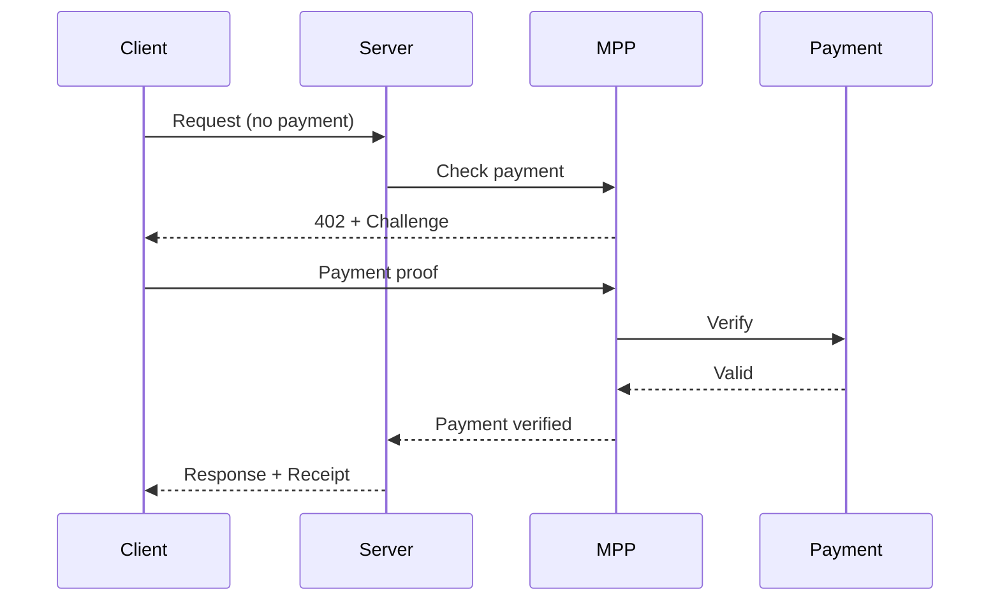
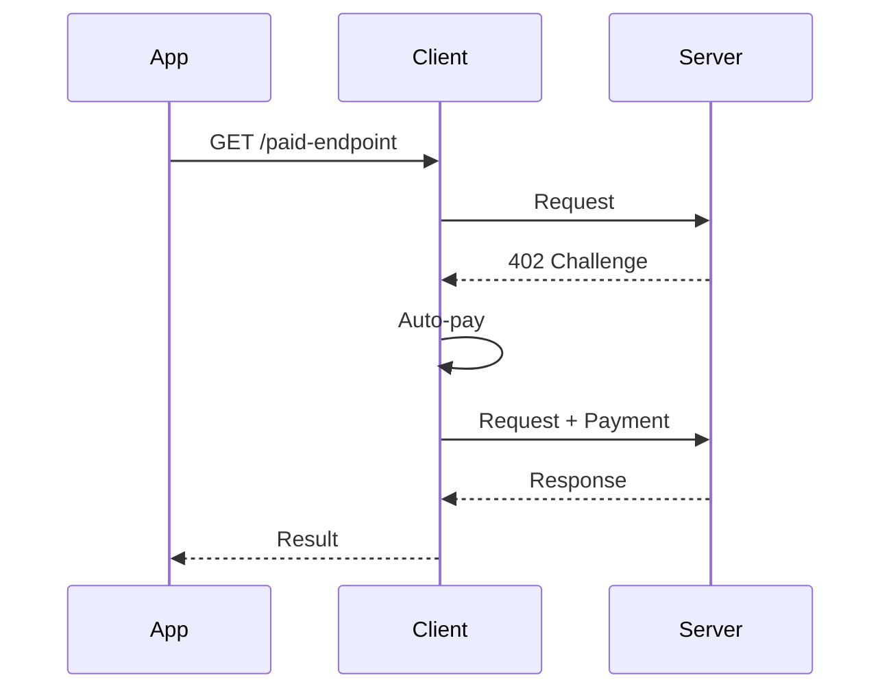

# pympp Exploration - Python SDK for Machine Payments Protocol

## Overview

pympp is the Python SDK for the Machine Payments Protocol (MPP), built on the "Payment" HTTP Authentication Scheme (IETF draft-ryan-httpauth-payment). It enables Python applications to send and receive microtransactions through HTTP 402 Payment Required responses.

## Repository

- **Location:** `/home/darkvoid/Boxxed/@formulas/src.rust/src.llamacpp/src.protocols/pympp`
- **Remote:** `git@github.com:tempoxyz/pympp.git`
- **Primary Language:** Python
- **License:** MIT OR Apache-2.0

## Directory Structure

```
pympp/
├── src/
│   └── pympp/
│       ├── __init__.py         # Package entry point
│       ├── credential.py       # Payment credential handling
│       ├── receipt.py          # Payment receipt validation
│       ├── challenge.py        # 402 challenge processing
│       ├── client.py           # Client-side SDK
│       └── server/
│           ├── __init__.py     # Server SDK entry
│           ├── mpp.py          # MPP server class
│           └── methods/
│               └── tempo/      # Tempo payment method
├── examples/
│   ├── api-server/             # Payment-gated API example
│   ├── fetch/                  # CLI fetch tool
│   └── mcp-server/             # MCP server with payments
├── tests/                      # Test suite
├── pyproject.toml              # Python project config
├── Makefile                    # Build commands
└── docker-compose.yml          # Test infrastructure
```

## Architecture

### Server-Side Flow



### Client-Side Flow



## Quick Start

### Server

```python
from mpp import Credential, Receipt
from mpp.server import Mpp
from mpp.methods.tempo import tempo, ChargeIntent

server = Mpp.create(
    method=tempo(
        intents={"charge": ChargeIntent()},
        recipient="0x742d35Cc6634c0532925a3b844bC9e7595F8fE00",
    ),
)

@app.get("/paid")
@server.pay(amount="0.50")
async def handler(request, credential: Credential, receipt: Receipt):
    return {"data": "...", "payer": credential.source}
```

### Client

```python
from mpp.client import Client
from mpp.methods.tempo import tempo, TempoAccount, ChargeIntent

account = TempoAccount.from_key("0x...")

async with Client(
    methods=[tempo(account=account, intents={"charge": ChargeIntent()})]
) as client:
    response = await client.get("https://mpp.dev/api/ping/paid")
```

## Key Components

### Credential

Represents payment credentials used for authentication:

```python
@dataclass
class Credential:
    method: str       # Payment method name
    source: str       # Payer identifier
    token: str        # Payment token
```

### Receipt

Proof of payment for verification:

```python
@dataclass
class Receipt:
    id: str           # Receipt identifier
    amount: str       # Paid amount
    method: str       # Payment method
    signature: str    # Cryptographic proof
```

### Challenge

Server-generated payment request:

```python
@dataclass
class Challenge:
    id: str           # Unique challenge ID
    realm: str        # Server realm
    method: str       # Accepted payment method
    intent: str       # Payment intent type
    request: dict     # Method-specific data
    expires: datetime # Optional expiration
```

### Mpp Server Class

Main server-side interface:

```python
class Mpp:
    @classmethod
    def create(cls, method: Method) -> "Mpp"
    
    def pay(self, amount: str) -> Callable:
        """Decorator to protect endpoints with payment"""
```

## Examples

### 1. API Server

Payment-gated API endpoint:

```python
from mpp.server import Mpp
from mpp.methods.tempo import tempo

mpp = Mpp.create(method=tempo(recipient="0x..."))

@app.post("/generate")
@mpp.pay(amount="0.01")
async def generate(request):
    return {"image": await generate_image()}
```

### 2. Fetch CLI

Command-line tool for fetching URLs with automatic payment:

```python
from mpp.client import Client
from mpp.methods.tempo import tempo, TempoAccount

async def fetch_with_payment(url: str, private_key: str):
    account = TempoAccount.from_key(private_key)
    async with Client(methods=[tempo(account=account)]) as client:
        return await client.get(url)
```

### 3. MCP Server

Model Context Protocol server with payment-protected tools:

```python
from mpp.server import Mpp
from mcp.server import Server

mpp = Mpp.create(method=tempo())

@mcp.tool()
@mpp.pay(amount="0.05")
async def expensive_tool(data: str) -> str:
    return await process(data)
```

## External Dependencies

| Dependency | Purpose |
|------------|---------|
| httpx | Async HTTP client |
| pydantic | Data validation |
| eth-account | Ethereum account handling |
| eth-keys | Cryptographic operations |

## Testing

Uses pytest with docker-compose for test infrastructure:

```bash
# Run tests
make test

# With coverage
make coverage
```

## Protocol

Built on the ["Payment" HTTP Authentication Scheme](https://datatracker.ietf.org/doc/draft-ryan-httpauth-payment/).

Key headers:
- `WWW-Authenticate: Payment realm="...", method="..."` - 402 challenge
- `Authorization: Payment id="...", signature="..."` - Payment proof

## Related Projects

| Project | Relationship |
|---------|-------------|
| mppx | TypeScript/JavaScript SDK |
| mpp-rs | Rust SDK |
| tempo | Payment settlement layer |
| prool | Testing infrastructure |

## Key Insights

1. **Decorator Pattern**: Python decorators provide clean payment protection for endpoints

2. **Async First**: Built on async/await for non-blocking payment flows

3. **Method Extensibility**: Payment methods can be added via plugin architecture

4. **MCP Integration**: Native support for Model Context Protocol servers

5. **Dual License**: MIT OR Apache-2.0 for maximum flexibility

## Open Considerations

1. Additional payment method implementations beyond Tempo
2. Session-based payment caching
3. Streaming payment support
