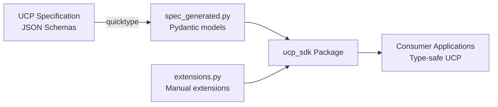

# UCP Python SDK Exploration

## Overview

The UCP Python SDK is the official Python library for the Universal Commerce Protocol (UCP). It provides Pydantic models for UCP schemas, enabling Python developers to build UCP-compliant e-commerce applications with type safety and runtime validation.

The SDK is auto-generated from the UCP specification JSON schemas, ensuring consistency with the protocol.

## Repository

- **Location:** `/home/darkvoid/Boxxed/@formulas/src.rust/src.llamacpp/src.protocols/python-sdk`
- **Remote:** `git@github.com:Universal-Commerce-Protocol/python-sdk.git`
- **Primary Language:** Python
- **License:** Apache-2.0

## Directory Structure

```
python-sdk/
├── src/
│   └── ucp_sdk/
│       ├── __init__.py         # Package entry
│       ├── models/
│       │   ├── __init__.py     # Model exports
│       │   └── spec_generated.py  # Auto-generated Pydantic models
│       ├── extensions.py       # Manual model extensions
│       └── utils/
│           └── validators.py   # Custom validators
├── generate_models.sh          # Code generation script
├── pyproject.toml              # Python project config
├── tests/                      # Test suite
└── README.md                   # Documentation
```

## Architecture

### Model Generation Pipeline



### Key Models

The SDK generates Pydantic models for all UCP types:

| Category | Models |
|----------|--------|
| **Checkout** | `CheckoutResponse`, `CheckoutCreateRequest`, `CheckoutUpdateRequest` |
| **Payment** | `PaymentInstrument`, `PaymentCredential`, `CardPaymentInstrument` |
| **Order** | `Order`, `OrderLineItem`, `Adjustment` |
| **Fulfillment** | `FulfillmentResponse`, `FulfillmentMethod`, `FulfillmentEvent` |
| **Buyer** | `Buyer`, `PostalAddress`, `BuyerWithConsent` |
| **Discovery** | `CapabilityResponse`, `UcpDiscoveryProfile` |

## Usage

### Installation

```bash
mkdir sdk
git clone https://github.com/Universal-Commerce-Protocol/python-sdk.git sdk/python
cd sdk/python
uv sync
```

### Basic Usage

```python
from ucp_sdk.models import CheckoutResponse, CheckoutCreateRequest

# Validate incoming checkout response
checkout = CheckoutResponse.model_validate(api_response)

# Create request
request = CheckoutCreateRequest(
    currency="USD",
    line_items=[
        {"item": {"id": "product-1"}, "quantity": 2}
    ],
    payment={"selected_instrument_id": "card-1"}
)
```

### Model Extensions

```python
from ucp_sdk.models import CheckoutResponseSchema
from pydantic import BaseModel

class ExtendedCheckout(CheckoutResponse):
    """Extended checkout with platform-specific fields"""
    platform_config: Optional[PlatformConfig] = None
    order_id: Optional[str] = None
```

## Model Generation

### Regenerating Models

```bash
uv sync
./generate_models.sh
```

The generation script uses `quicktype` to convert UCP JSON schemas to Pydantic models:

```bash
quicktype \
  --lang python \
  --src-lang schema \
  --src spec/discovery/*.json \
  --src spec/schemas/shopping/*.json \
  -o src/ucp_sdk/models/spec_generated.py
```

## External Dependencies

| Dependency | Purpose |
|------------|---------|
| pydantic | Runtime type validation |
| uv | Dependency management |
| ruff | Code formatting |

## Testing

The SDK uses pytest for testing:

```bash
# Run tests
uv run pytest

# With coverage
uv run pytest --cov=ucp_sdk
```

## Comparison with js-sdk

| Feature | Python SDK | JavaScript SDK |
|---------|-----------|----------------|
| Validation | Pydantic | Zod |
| Package Manager | uv | npm/pnpm |
| Type System | Runtime + mypy | TypeScript + Zod |
| Code Gen | quicktype (Python) | quicktype (TypeScript) |

## Key Insights

1. **Schema-First**: All models generated from UCP specification JSON schemas

2. **Pydantic V2**: Uses modern Pydantic V2 for validation

3. **uv Management**: Uses uv for fast dependency management

4. **Auto-Formatting**: Generated code is automatically formatted with ruff

5. **Apache-2.0**: Permissive license for commercial use

## Related Projects

| Project | Relationship |
|---------|-------------|
| js-sdk | TypeScript/JavaScript equivalent |
| ucp/spec | Source of truth for schemas |
| protocols/conformance | Conformance tests |
| protocols/samples | Sample implementations |

## Open Considerations

1. PyPI publishing workflow
2. Version sync with UCP specification
3. Additional convenience methods
4. Async client implementation
