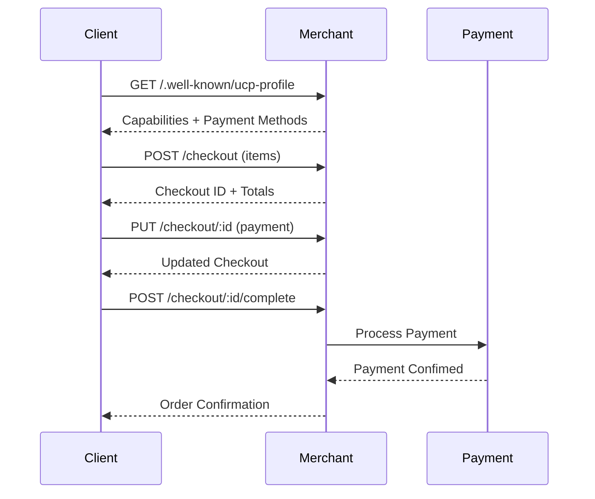

# UCP Samples Exploration

## Overview

The UCP Samples repository contains reference implementations and client scripts demonstrating the Universal Commerce Protocol (UCP) in action. It provides practical examples of merchant servers, client journeys, and AI agent integrations.

## Repository

- **Location:** `/home/darkvoid/Boxxed/@formulas/src.rust/src.llamacpp/src.protocols/samples`
- **Remote:** `git@github.com:Universal-Commerce-Protocol/samples.git`
- **Primary Languages:** Python, Node.js/TypeScript
- **License:** Apache-2.0

## Directory Structure

```
samples/
├── a2a/                          # A2A (Agent-to-Agent) samples
│   ├── business_agent/
│   │   ├── agent/                # AI shopping assistant
│   │   ├── client/               # Chat interface
│   │   └── README.md
│   └── README.md
├── rest/                         # REST API samples
│   ├── python/
│   │   ├── server/               # Python FastAPI merchant
│   │   └── client/               # Python client scripts
│   │       └── flower_shop/
│   │           └── simple_happy_path_client.py
│   └── nodejs/
│       └── server/               # Node.js Hono merchant
└── README.md
```

## Sample Implementations

### 1. Python Merchant Server (FastAPI)

**Location:** `rest/python/server/`

A reference UCP merchant implementation using Python and FastAPI:

**Features:**
- Capability discovery endpoint
- Checkout session management
- Payment processing
- Order lifecycle management
- Simulation endpoints for testing

**Key Endpoints:**
```
GET  /.well-known/ucp-profile  # Capability discovery
POST /checkout                 # Create checkout
GET  /checkout/:id             # Get checkout status
PUT  /checkout/:id             # Update checkout
POST /checkout/:id/complete    # Complete checkout
GET  /order/:id                # Get order details
```

### 2. Python Client (Happy Path)

**Location:** `rest/python/client/flower_shop/`

Demonstrates a complete user journey:

```python
# simple_happy_path_client.py
# 1. Discover merchant capabilities
profile = discover_merchant(base_url)

# 2. Create checkout
checkout = create_checkout(items=[...])

# 3. Select payment instrument
checkout = update_payment(checkout.id, card_token)

# 4. Complete purchase
order = complete_checkout(checkout.id)
```

### 3. Node.js Merchant Server (Hono)

**Location:** `rest/nodejs/`

A UCP merchant implementation using Node.js, Hono, and Zod:

**Tech Stack:**
- **Runtime:** Node.js
- **Framework:** Hono
- **Validation:** Zod
- **Package Manager:** pnpm

**Features:**
- UCP shopping specification implementation
- Checkout and order management
- TypeScript type safety

### 4. A2A Business Agent (Cymbal Retail)

**Location:** `a2a/business_agent/`

An AI-powered retail agent implementing UCP via the A2A (Agent-to-Agent) protocol:

**Architecture:**
```
┌─────────────────┐         ┌─────────────────┐
│   User Client   │◄───────►│  Business Agent │
│   (React Chat)  │         │  (Google ADK)   │
└─────────────────┘         └────────┬────────┘
                                     │ A2A Protocol
                                     ▼
                            ┌─────────────────┐
                            │  UCP Merchant   │
                            │  (via UCP Ext)  │
                            └─────────────────┘
```

**Components:**
- **Agent:** Google ADK + Gemini for AI-powered shopping assistance
- **Client:** React-based chat interface
- **Protocol:** A2A with UCP Extension

**Features:**
- Natural language shopping assistance
- Product search and recommendations
- Checkout via agent
- Payment processing integration

## Getting Started

### Python Server

```bash
cd rest/python/server
uv sync
uv run uvicorn main:app --reload
```

### Node.js Server

```bash
cd rest/nodejs
pnpm install
pnpm dev
```

### A2A Agent

```bash
cd a2a/business_agent
# See a2a/README.md for setup instructions
```

## UCP Flow Examples

### Happy Path Flow



### Capability Discovery

```python
import requests

# Discover merchant capabilities
response = requests.get(
    "https://merchant.example.com/.well-known/ucp-profile"
)
profile = response.json()

# Profile contains:
# - Supported capabilities
# - Payment methods
# - API endpoints (REST, MCP, A2A)
# - Signing keys for verification
```

## Key Insights

1. **Multi-Language**: Samples in both Python and Node.js for broad developer reach

2. **Framework Choice**: 
   - Python uses FastAPI (modern, async, auto-docs)
   - Node.js uses Hono (lightweight, fast)

3. **AI Integration**: A2A samples show how AI agents can use UCP for commerce

4. **Full Journey**: Happy path client demonstrates complete flow

5. **Simulation**: Server includes simulation endpoints for testing without real payments

6. **Progressive Disclosure**: Samples range from simple (happy path) to complex (A2A agent)

## Related Documentation

| Document | Purpose |
|----------|---------|
| UCP Specification | Protocol definition |
| js-sdk SDK | TypeScript client library |
| python-sdk SDK | Python client library |
| conformance | Test suite for compliance |

## Open Considerations

1. Additional framework samples (Go, Rust, Java)
2. Webhook handling examples
3. Error handling patterns
4. Production deployment guides
