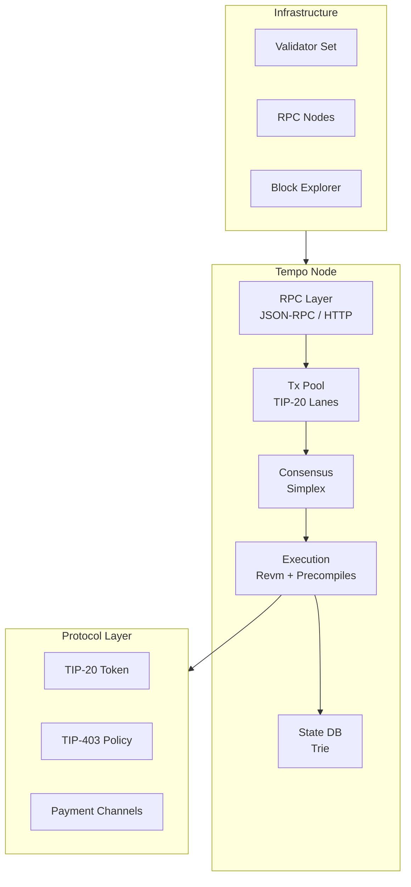
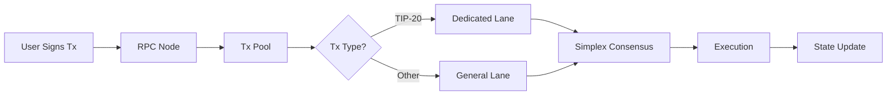
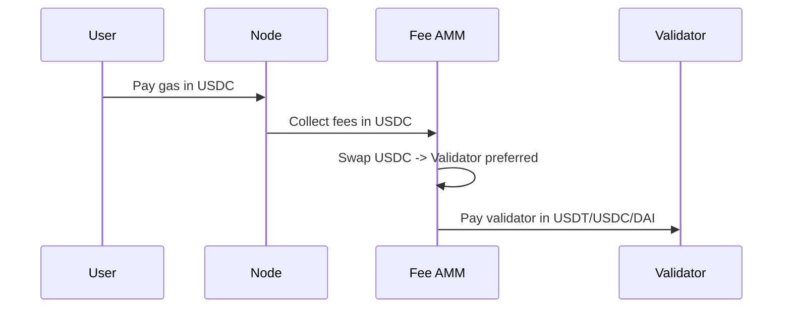

# Project Exploration: Tempo Blockchain

## Overview

Tempo is a blockchain designed specifically for stablecoin payments at scale. Built on the Reth SDK (Rust Ethereum implementation), Tempo provides high throughput, low cost, and features that financial institutions, payment service providers, and fintech platforms expect from modern payment infrastructure.

The key innovation is the TIP-20 token standard with dedicated payment lanes that eliminate noisy-neighbor contention, enabling predictable payment throughput. Users pay gas directly in USD-stablecoins, and the Fee AMM automatically converts to validators' preferred stablecoins.

## Repository

- **Location:** `/home/darkvoid/Boxxed/@formulas/src.rust/src.llamacpp/src.protocols/tempo`
- **Remote:** `git@github.com:tempoxyz/tempo.git`
- **Primary Language:** Rust 1.93+ (Edition 2024)
- **License:** MIT OR Apache-2.0 (dual licensed)
- **Base:** Reth SDK @ `a0b0d88`

## Directory Structure

```
tempo/
├── bin/                           # Binary targets
│   ├── tempo/                     # Main node binary
│   │   ├── main.rs
│   │   └── cli.rs
│   ├── tempo-bench/               # Benchmarking tool
│   └── tempo-sidecar/             # Observability sidecar
│
├── crates/                        # Workspace crates
│   ├── alloy/                     # Alloy extensions
│   │   └── src/
│   │       ├── lib.rs
│   │       ├── network.rs         # Tempo network type
│   │       └── tx.rs              # Transaction types
│   │
│   ├── chainspec/                 # Chain specification
│   │   └── src/
│   │       ├── lib.rs
│   │       └── spec.rs            # Tempo chain params
│   │
│   ├── commonware-node/           # Commonware consensus integration
│   │   └── src/
│   │
│   ├── commonware-node-config/    # Node configuration
│   │   └── src/
│   │
│   ├── consensus/                 # Simplex consensus
│   │   └── src/
│   │       ├── lib.rs
│   │       ├── simplex.rs         # Simplex implementation
│   │       └── validator.rs       # Validator logic
│   │
│   ├── contracts/                 # Smart contract bindings
│   │   └── src/
│   │       ├── lib.rs
│   │       ├── tip20.rs           # TIP-20 token
│   │       ├── tip403.rs          # TIP-403 policy
│   │       └── channel.rs         # Payment channels
│   │
│   ├── dkg-onchain-artifacts/     # DKG contract artifacts
│   │   └── src/
│   │
│   ├── e2e/                       # End-to-end test utilities
│   │   └── src/
│   │
│   ├── evm/                       # EVM extensions
│   │   └── src/
│   │       ├── lib.rs
│   │       ├── tip20_precompile.rs
│   │       └── tip403_precompile.rs
│   │
│   ├── ext/                       # External utilities
│   │   └── src/
│   │
│   ├── eyre/                      # Error handling wrapper
│   │   └── src/
│   │
│   ├── faucet/                    # Testnet faucet
│   │   └── src/
│   │
│   ├── node/                      # Main node implementation
│   │   ├── src/
│   │   │   ├── lib.rs
│   │   │   ├── builder.rs         # Node builder
│   │   │   ├── handle.rs          # Node handle
│   │   │   ├── rpc.rs             # RPC configuration
│   │   │   └── config.rs          # Node config
│   │   └── Cargo.toml
│   │
│   ├── payload/                   # Payload building
│   │   ├── builder/               # Payload builder
│   │   │   └── src/
│   │   └── types/                 # Payload types
│   │       └── src/
│   │
│   ├── precompiles/               # EVM precompiles
│   │   └── src/
│   │       ├── lib.rs
│   │       ├── tip20.rs
│   │       ├── tip403.rs
│   │       └── validator_config.rs
│   │
│   ├── precompiles-macros/        # Precompile macros
│   │   └── src/
│   │
│   ├── primitives/                # Core primitives
│   │   └── src/
│   │       ├── lib.rs
│   │       ├── transaction.rs
│   │       └── receipt.rs
│   │
│   ├── revm/                      # Revm integration
│   │   └── src/
│   │
│   ├── telemetry-util/            # Telemetry utilities
│   │   └── src/
│   │
│   ├── transaction-pool/          # Transaction pool
│   │   └── src/
│   │       ├── lib.rs
│   │       ├── pool.rs
│   │       ├── tip20_lane.rs      # TIP-20 priority lane
│   │       └── config.rs
│   │
│   └── validator-config/          # Validator configuration
│       └── src/
│
├── .changelog/                    # Unreleased changes
│   └── ...
│
├── .cargo/                        # Cargo configuration
│   └── config.toml
│
├── .config/                       # Additional config
│   └── nextest.toml
│
├── .github/                       # GitHub configuration
│   ├── workflows/
│   └── ...
│
├── contrib/                       # Community contributions
│   └── ...
│
├── Cargo.toml                     # Workspace root
├── Cargo.lock                     # Dependency lock
├── Cross.toml                     # Cross-compilation config
├── CHANGELOG.md                   # Version history
├── README.md                      # Project overview
└── docs/                          # Additional docs
```

## Architecture

### High-Level Architecture



### Transaction Flow



### Fee AMM Flow



## Component Breakdown

### Workspace Members

#### Core Node (`tempo-node`)

Main node implementation built on Reth:

```rust
// crates/node/src/lib.rs
pub struct TempoNode {
    config: NodeConfig,
    consensus: SimplexConsensus,
    evm: TempoEvm,
    pool: TransactionPool,
}

impl TempoNode {
    pub fn builder() -> NodeBuilder;
    pub async fn run(self) -> eyre::Result<()>;
}
```

#### Chain Specification (`tempo-chainspec`)

Defines chain parameters:

```rust
// crates/chainspec/src/spec.rs
pub const TEMPO_TESTNET: ChainSpec = ChainSpec {
    chain: Chain::from(42431),  // Moderato testnet
    genesis_hash: H256::ZERO,
    genesis: Genesis {
        config: ChainConfig {
            eip_150_block: Some(0),
            // ... all Ethereum EIPs enabled
        },
        // TIP-20 precompiles enabled at genesis
        precompiles: vec![
            TIP20_PRECOMPILE_ADDRESS,
            TIP403_PRECOMPILE_ADDRESS,
        ],
    },
};
```

#### Consensus (`tempo-consensus`)

Simplex consensus implementation:

```rust
// crates/consensus/src/simplex.rs
pub struct SimplexConsensus {
    validators: ValidatorSet,
    config: ConsensusConfig,
}

impl Consensus for SimplexConsensus {
    fn verify_header(&self, header: &Header) -> Result<()>;
    fn pre_validate_block(&self, block: &Block) -> Result<()>;
    fn calculate_difficulty(&self, parent: &Header) -> U256;
}
```

#### Transaction Pool (`tempo-transaction-pool`)

TIP-20 dedicated lanes:

```rust
// crates/transaction-pool/src/pool.rs
pub struct TransactionPool {
    tip20_lane: Tip20Lane,      // Priority lane for TIP-20
    general_lane: GeneralLane,  // Everything else
    config: PoolConfig,
}

impl TransactionPool {
    pub fn add_transaction(&self, tx: ValidPoolTransaction) -> Result<()>;
    pub fn pending_transactions(&self) -> Vec<Arc<ValidPoolTransaction>>;
}
```

#### TIP-20 Precompile (`tempo-precompiles`)

Native TIP-20 operations:

```rust
// crates/precompiles/src/tip20.rs
#[precompile]
pub fn transfer(input: &mut PrecompileInput) -> PrecompileResult {
    // Parse transfer parameters
    // Execute transfer with memo support
    // Return success/failure
}

#[precompile]
pub fn transfer_with_commitment(input: &mut PrecompileInput) -> PrecompileResult {
    // Transfer with off-chain PII commitment
}
```

#### TIP-403 Policy Registry

Shared compliance policy:

```rust
// crates/precompiles/src/tip403.rs
pub struct PolicyRegistry {
    policies: Vec<Policy>,
    version: u64,
}

#[precompile]
pub fn register_policy(input: &mut PrecompileInput) -> PrecompileResult {
    // Register new policy
}

#[precompile]
pub fn check_compliance(input: &mut PrecompileInput) -> PrecompileResult {
    // Check if transfer complies with policies
}
```

### Network Configuration

#### Testnet (Moderato)

| Property | Value |
|----------|-------|
| Network Name | Tempo Testnet (Moderato) |
| Chain ID | 42431 |
| Currency | USD (stablecoin) |
| RPC URL | `https://rpc.moderato.tempo.xyz` |
| WS URL | `wss://rpc.moderato.tempo.xyz` |
| Explorer | `https://explore.tempo.xyz` |
| Faucet | Available via `tempo_fundAddress` RPC |

### Alloy Extensions

Custom network type:

```rust
// crates/alloy/src/network.rs
#[derive(Clone, Debug)]
pub struct TempoNetwork;

impl Network for TempoNetwork {
    type TransactionRequest = TempoTransactionRequest;
    type ReceiptEnvelope = TempoReceiptEnvelope;
    type Header = Header;
    type Transaction = TransactionSigned;
    type Response = TransactionResponse;
}

pub struct TempoTransactionRequest {
    pub from: Address,
    pub to: TransactionKind,
    pub value: U256,
    pub input: Bytes,
    pub gas_limit: u64,
    pub gas_price: U256,
    pub memo: Option<Bytes>,  // TIP-20 memo
}
```

## Entry Points

### Running a Node

```bash
# Using just (recommended)
just run

# Or directly with cargo
cargo run --bin tempo -- node --chain tempo-testnet

# With custom config
tempo node \
    --config tempo.toml \
    --chain tempo-testnet \
    --http \
    --http.addr 0.0.0.0 \
    --http.port 8545
```

### Configuration Example

```toml
# tempo.toml

[Node]
chain = "tempo-testnet"
datadir = "/data/tempo"

[Rpc]
http = true
http_addr = "0.0.0.0"
http_port = 8545
ws = true
ws_addr = "0.0.0.0"
ws_port = 8546

[Consensus]
validator = false
# If validator:
# private_key = "0x..."
# rpc_url = "https://rpc.moderato.tempo.xyz"

[Network]
discovery = true
listen_addr = "0.0.0.0"
listen_port = 30303
```

### Using Tempo RPC

```rust
use alloy::{providers::Provider, rpc::client::RpcClient};
use reqwest::Client;

#[tokio::main]
async fn main() {
    let client = RpcClient::new_http(
        "https://rpc.moderato.tempo.xyz".parse().unwrap()
    );

    // Get chain ID
    let chain_id = client
        .request::<_, U64>("eth_chainId", ())
        .await?;
    println!("Chain ID: {}", chain_id);

    // Get block number
    let block_number = client
        .request::<_, U64>("eth_blockNumber", ())
        .await?;
    println!("Block: {}", block_number);

    // Tempo-specific: fund address (testnet only)
    let result = client
        .request::<_, serde_json::Value>(
            "tempo_fundAddress",
            ("0xYourAddress",)
        )
        .await?;
    println!("Funded: {}", result);
}
```

### Deploying TIP-20 Contract

```solidity
// TIP-20 extends ERC-20 with memo support
interface ITIP20 {
    event TransferWithMemo(
        address indexed from,
        address indexed to,
        uint256 value,
        bytes memo
    );

    function transferWithMemo(
        address to,
        uint256 amount,
        bytes calldata memo
    ) external returns (bool);

    function transferWithCommitment(
        address to,
        uint256 amount,
        bytes32 commitment
    ) external returns (bool);
}
```

## External Dependencies

| Dependency | Version | Purpose |
|------------|---------|---------|
| `reth-*` | git@a0b0d88 | Reth node framework |
| `alloy` | ^1.6 | Ethereum types and RPC |
| `revm` | ^36 | EVM execution |
| `commonware-*` | 2026.3.0 | Consensus primitives |
| `tokio` | ^1.49 | Async runtime |
| `tracing` | ^0.1 | Logging/tracing |
| `serde` | ^1.0 | Serialization |
| `thiserror` | ^2.0 | Error handling |
| `clap` | ^4.5 | CLI parsing |
| `axum` | ^0.8 | HTTP server |

## Testing

### Test Structure

- **Unit Tests:** Inline `#[cfg(test)]` modules
- **Integration Tests:** `crates/e2e/` with localnet
- **Consensus Tests:** `crates/consensus/tests/`

### Running Tests

```bash
# All tests
cargo nextest run

# Specific crate
cargo test -p tempo-consensus

# E2E tests (requires localnet)
just test-e2e

# Coverage
cargo llvm-cov --workspace
```

### Localnet for Testing

```bash
# Start localnet
just localnet

# In another terminal, run tests
just test-e2e
```

## Key Insights

1. **Reth-Based:** Building on Reth provides battle-tested Ethereum compatibility while enabling custom extensions

2. **TIP-20 Payment Lanes:** Dedicated transaction pool lanes for TIP-20 transfers prevent fee market contention

3. **Stablecoin Gas:** Users pay gas in stablecoins, not native token - critical for payment UX

4. **Fee AMM:** Automatic conversion of fees to validator-preferred stablecoins removes manual management

5. **Simplex Consensus:** Sub-second finality with graceful degradation under adverse conditions

6. **Precompile Efficiency:** TIP-20 and TIP-403 as precompiles (not contracts) for gas efficiency

7. **Policy Registry:** Single shared policy for multiple tokens reduces deployment overhead

## Performance Considerations

| Aspect | Target | Implementation |
|--------|--------|----------------|
| Throughput | 10,000+ TPS | Parallel execution, dedicated lanes |
| Finality | < 1 second | Simplex consensus |
| Block Time | 100ms | Fast block production |
| Gas Price | <$0.001 per tx | Efficient execution, high throughput |
| State Bloat | Controlled | State expiration, pruning |

## Open Considerations

1. **Mainnet Launch:** Timeline and requirements for mainnet vs current testnet

2. **Private Token Standard:** Planned private token feature needs careful cryptoeconomic design

3. **Cross-Chain Bridges:** How will assets move between Tempo and other chains?

4. **Governance:** On-chain vs off-chain governance for protocol upgrades

5. **Validator Economics:** Staking requirements, rewards, and slashing conditions
