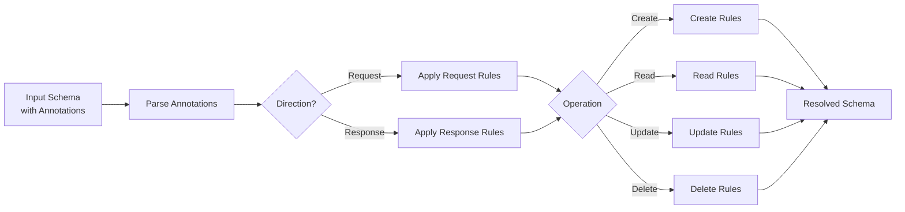

# Project Exploration: UCP Schema Resolver

## Overview

UCP Schema Resolver is a Rust library for runtime resolution of `ucp_request` and `ucp_response` annotations in JSON Schema. It transforms JSON Schemas with UCP annotations into standard JSON Schemas based on direction (request/response) and operation (create, read, update, etc.).

## Repository

- **Location:** `/home/darkvoid/Boxxed/@formulas/src.rust/src.llamacpp/src.protocols/ucp-schema`
- **Remote:** `git@github.com:Universal-Commerce-Protocol/ucp-schema.git`
- **Primary Language:** Rust
- **License:** Apache License 2.0
- **Crate:** `ucp-schema` on crates.io

## Directory Structure

```
ucp-schema/
├── src/
│   ├── lib.rs                 # Root exports
│   ├── compose.rs             # Schema composition utilities
│   ├── error.rs               # Error types
│   ├── linter.rs              # Schema linter
│   ├── loader.rs              # Schema loading and bundling
│   ├── resolver.rs            # Core resolution logic
│   ├── types.rs               # Type definitions
│   └── validator.rs           # Schema validation
│
├── fixtures/                  # Test fixtures
│   ├── schemas/               # Test schemas
│   └── examples/              # Example schemas
│
├── Cargo.toml
├── Cargo.lock
├── Makefile                   # Common commands
├── LICENSE
├── README.md
├── FAQ.md
└── .pre-commit-config.yaml
```

## Architecture

### Resolution Flow



## Key Components

### Direction and Operation

```rust
// src/types.rs
#[derive(Debug, Clone, Copy)]
pub enum Direction {
    Request,
    Response,
}

pub type Operation = &'static str;
// Common operations: "create", "read", "update", "delete", "list"

#[derive(Debug, Clone)]
pub struct ResolveOptions {
    pub direction: Direction,
    pub operation: Operation,
}
```

### Visibility Rules

| Visibility | Effect on `properties` | Effect on `required` |
|------------|------------------------|----------------------|
| `"omit"` | Remove field | Remove from required |
| `"required"` | Keep field | Add to required |
| `"optional"` | Keep field | Remove from required |
| (none) | Keep field | Preserve original |

### Annotation Format

```json
// Shorthand (applies to all operations)
{
  "ucp_request": "omit"
}

// Per-operation
{
  "ucp_request": {
    "create": "omit",
    "update": "required",
    "read": "optional"
  }
}
```

## Entry Points

### Basic Resolution

```rust
use ucp_schema::{resolve, Direction, ResolveOptions};
use serde_json::json;

let schema = json!({
    "type": "object",
    "properties": {
        "id": {
            "type": "string",
            "ucp_request": {
                "create": "omit",
                "update": "required"
            }
        },
        "name": { "type": "string" }
    }
});

let options = ResolveOptions::new(Direction::Request, "create");
let resolved = resolve(&schema, &options).unwrap();

// In resolved schema, "id" is omitted for create requests
assert!(resolved["properties"].get("id").is_none());
assert!(resolved["properties"].get("name").is_some());
```

### Schema Loading

```rust
use ucp_schema::{load_schema, bundle_refs};

// Load schema from file
let schema = load_schema("schemas/user.json")?;

// Bundle all $ref references
let bundled = bundle_refs(&schema)?;
```

### Linting

```rust
use ucp_schema::{lint, lint_file};

// Lint schema in memory
let diagnostics = lint(&schema)?;
for diag in diagnostics {
    eprintln!("{}: {}", diag.severity, diag.message);
}

// Lint schema file
let result = lint_file("schemas/user.json")?;
println!("Status: {:?}", result.status);
```

## API Reference

### Core Functions

```rust
/// Resolve schema based on direction and operation
pub fn resolve(schema: &Value, options: &ResolveOptions) -> Result<Value>;

/// Strip all UCP annotations from schema
pub fn strip_annotations(schema: &Value) -> Value;

/// Load schema from path or URL
pub fn load_schema(path: &str) -> Result<Value>;

/// Bundle all $ref references into single schema
pub fn bundle_refs(schema: &Value) -> Result<Value>;

/// Lint schema for errors and warnings
pub fn lint(schema: &Value) -> Result<Vec<Diagnostic>>;

/// Validate data against schema
pub fn validate(data: &Value, schema: &Value) -> Result<()>;
```

### Schema Composition

```rust
/// Extract capabilities from UCP profile
pub fn extract_capabilities(profile: &Value) -> Result<Vec<Capability>>;

/// Compose schema from payload
pub fn compose_from_payload(payload: &Value) -> Result<Value>;

/// Detect direction from JSON-RPC method
pub fn detect_direction(method: &str) -> Option<DetectedDirection>;
```

## Dependencies

| Dependency | Purpose |
|------------|---------|
| serde_json | JSON handling |
| serde | Serialization |
| thiserror | Error handling |
| jsonschema | Schema validation |
| uriparse | URI parsing |
| serde_yaml | YAML support |

## Features

| Feature | Description |
|---------|-------------|
| `remote` | Remote schema loading via HTTP |
| `yaml` | YAML schema support |
| `cli` | Command-line interface |

## Testing

```bash
# Run tests
cargo test

# Run with coverage
cargo llvm-cov

# Lint
cargo clippy

# Format
cargo fmt --check
```

## Use Cases

1. **API Validation:** Generate request/response schemas from single source
2. **Type Generation:** Generate TypeScript/Rust types from annotated schemas
3. **Documentation:** Create operation-specific documentation
4. **Contract Testing:** Validate API contracts per operation

## Example: Full Schema

```json
{
  "$schema": "https://json-schema.org/draft/2020-12/schema",
  "type": "object",
  "properties": {
    "id": {
      "type": "string",
      "format": "uuid",
      "ucp_request": "omit",
      "ucp_response": "required"
    },
    "email": {
      "type": "string",
      "format": "email",
      "ucp_request": { "create": "required", "update": "optional" }
    },
    "name": {
      "type": "string",
      "ucp_request": { "create": "required", "update": "optional" }
    },
    "createdAt": {
      "type": "string",
      "format": "date-time",
      "ucp_request": "omit",
      "ucp_response": "required"
    },
    "updatedAt": {
      "type": "string",
      "format": "date-time",
      "ucp_request": "omit",
      "ucp_response": "optional"
    }
  }
}
```

Resolved for create request:
```json
{
  "type": "object",
  "properties": {
    "email": { "type": "string", "format": "email" },
    "name": { "type": "string" }
  },
  "required": ["email", "name"]
}
```

Resolved for read response:
```json
{
  "type": "object",
  "properties": {
    "id": { "type": "string", "format": "uuid" },
    "email": { "type": "string", "format": "email" },
    "name": { "type": "string" },
    "createdAt": { "type": "string", "format": "date-time" },
    "updatedAt": { "type": "string", "format": "date-time" }
  },
  "required": ["id", "email", "name", "createdAt"]
}
```

## Open Questions

1. **Custom Operations:** How to handle custom operations beyond CRUD?
2. **Nested Annotations:** Should annotations work recursively?
3. **Default Values:** How should defaults interact with visibility?
