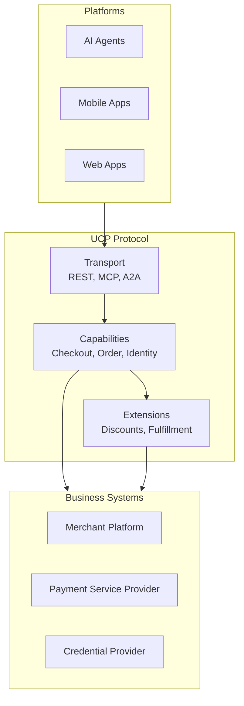
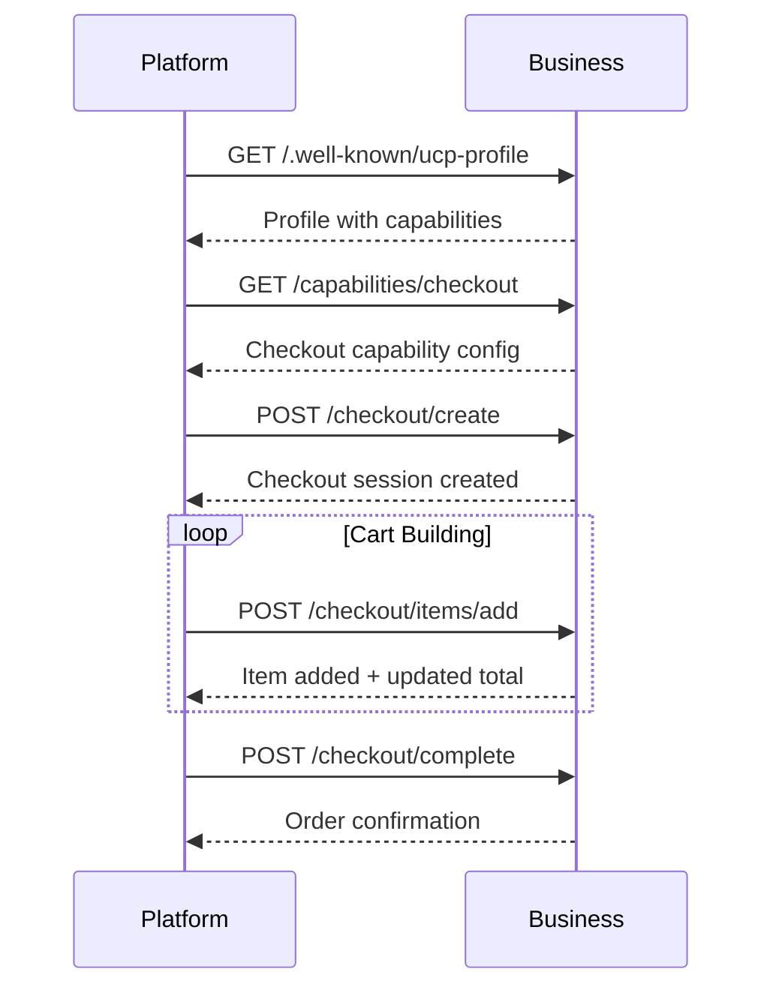
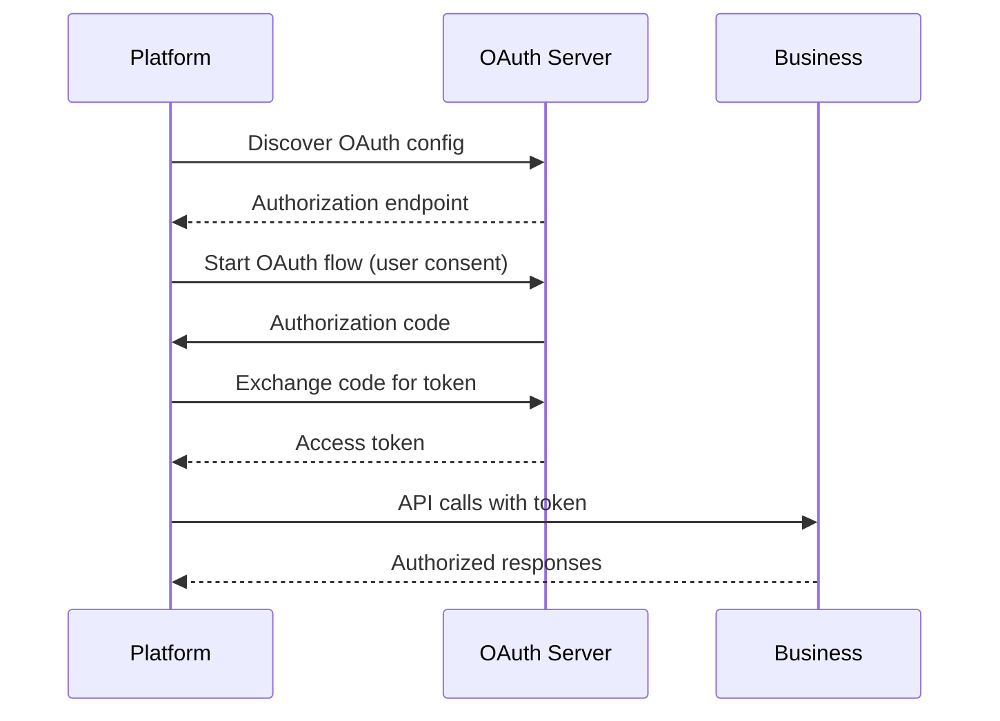

# Project Exploration: UCP (Universal Commerce Protocol)

## Overview

The Universal Commerce Protocol (UCP) is an open standard enabling interoperability between various commerce entities to facilitate seamless commerce integrations. It addresses the fragmented commerce landscape by providing a standardized common language and functional primitives for platforms (AI agents, apps), businesses, Payment Service Providers (PSPs), and Credential Providers (CPs) to communicate effectively.

UCP is designed from the ground up to support agentic commerce - enabling AI agents to discover products, fill carts, and complete purchases securely on behalf of users.

## Repository

- **Location:** `/home/darkvoid/Boxxed/@formulas/src.rust/src.llamacpp/src.protocols/ucp`
- **Remote:** `git@github.com:Universal-Commerce-Protocol/ucp.git`
- **Primary Language:** TypeScript
- **License:** Apache License 2.0
- **Documentation:** [ucp.dev](https://ucp.dev)

## Directory Structure

```
ucp/
├── docs/                          # Specification documentation
│   ├── overview.md                # Protocol overview
│   ├── capabilities/              # Capability definitions
│   │   ├── checkout.md            # Checkout capability
│   │   ├── identity-linking.md    # Identity linking
│   │   ├── order.md               # Order management
│   │   └── payment-token-exchange.md
│   ├── extensions/                # Extension definitions
│   │   ├── discounts.md           # Discount extension
│   │   ├── fulfillment.md         # Fulfillment extension
│   │   └── loyalty.md             # Loyalty extension
│   ├── security/                  # Security specifications
│   │   ├── ap2.md                 # AP2 authentication
│   │   └── credentials.md         # Verifiable credentials
│   └── roadmap.md                 # Development roadmap
│
├── generated/                     # Generated code
│   ├── ts/                        # TypeScript types
│   ├── json-schema/               # JSON Schemas
│   └── openapi/                   # OpenAPI specs
│
├── src/                           # Source code (if any)
│   └── ...
│
├── scripts/                       # Build scripts
│   ├── generate_ts_schema_types.js # TypeScript generation
│   └── ...
│
├── .cspell/                       # Spell check configuration
├── .github/                       # GitHub configuration
│   └── workflows/
│
├── .gitignore                     # Git ignore rules
├── biome.json                     # Biome lint/format config
├── .cspell.json                   # Spell check config
├── hooks.py                       # Specification hooks
├── LICENSE                        # Apache 2.0
├── README.md                      # Project overview
└── .linkignore                    # Link check ignore
```

## Architecture

### High-Level Architecture



### Capability Discovery Flow



### Identity Linking Flow



## Component Breakdown

### Core Capabilities

#### Checkout Capability

The Checkout capability enables cart management and checkout flows:

```typescript
interface CheckoutCapability {
  id: "checkout";
  transports: ("rest" | "mcp" | "a2a")[];
  endpoint: string;

  methods: {
    createCheckout(): Promise<CheckoutSession>;
    addItem(itemId: string, quantity: number): Promise<CheckoutSession>;
    removeItem(itemId: string): Promise<CheckoutSession>;
    updateItem(itemId: string, quantity: number): Promise<CheckoutSession>;
    applyDiscount(code: string): Promise<CheckoutSession>;
    getShippingOptions(): Promise<ShippingOption[]>;
    selectShipping(optionId: string): Promise<CheckoutSession>;
    complete(payment: PaymentMethod): Promise<OrderConfirmation>;
  };
}

interface CheckoutSession {
  id: string;
  items: CartItem[];
  subtotal: Money;
  shipping: Money | null;
  tax: Money | null;
  total: Money;
  shippingAddress?: Address;
  status: "active" | "completed" | "abandoned" | "expired";
}
```

#### Identity Linking Capability

Enables platforms to obtain authorization to act on user's behalf:

```typescript
interface IdentityLinkingCapability {
  id: "identity-linking";
  transports: ("rest" | "oauth")[];
  endpoint: string;

  oauth: {
    authorizationUrl: string;
    tokenUrl: string;
    scopes: string[];
    grantTypes: ("authorization_code" | "client_credentials")[];
  };
}
```

#### Order Capability

Webhook-based order lifecycle updates:

```typescript
interface OrderCapability {
  id: "order";
  transports: ("webhook" | "polling")[];
  endpoint: string;

  webhookUrl?: string;  // Where to send updates

  events: {
    ORDER_CREATED: OrderCreatedEvent;
    ORDER_CONFIRMED: OrderConfirmedEvent;
    ORDER_SHIPPED: OrderShippedEvent;
    ORDER_DELIVERED: OrderDeliveredEvent;
    ORDER_RETURNED: OrderReturnedEvent;
    ORDER_CANCELLED: OrderCancelledEvent;
  };
}
```

#### Payment Token Exchange Capability

Secure payment token/credential exchange between PSPs and CPs:

```typescript
interface PaymentTokenExchangeCapability {
  id: "payment-token-exchange";
  transports: ("rest")[];
  endpoint: string;

  methods: {
    requestToken(request: TokenRequest): Promise<TokenResponse>;
    validateToken(token: string): Promise<TokenValidationResult>;
    revokeToken(token: string): Promise<void>;
  };
}
```

### Extensions

Extensions enhance capabilities without bloating core definitions:

```typescript
interface Extension {
  id: string;
  name: string;
  description: string;
  version: string;
  schema: JsonSchema;
  appliesTo: string[];  // Capability IDs
}

// Example: Discount Extension
const discountExtension: Extension = {
  id: "discounts",
  name: "Discounts",
  description: "Discount code and promotional offer support",
  version: "1.0.0",
  schema: {
    type: "object",
    properties: {
      code: { type: "string" },
      type: { enum: ["percentage", "fixed", "bogo"] },
      value: { type: "number" },
      minimumPurchase: { type: "number" },
      maximumDiscount: { type: "number" },
    },
  },
  appliesTo: ["checkout"],
};
```

### Profile Format

Businesses declare capabilities via a profile:

```json
{
  "$schema": "https://ucp.dev/schema/profile.json",
  "version": "1.0.0",
  "business": {
    "name": "Example Store",
    "url": "https://store.example.com",
    "logo": "https://store.example.com/logo.png"
  },
  "capabilities": [
    {
      "id": "checkout",
      "transports": ["rest", "mcp"],
      "endpoint": "https://store.example.com/api/checkout",
      "extensions": ["discounts", "fulfillment"]
    },
    {
      "id": "identity-linking",
      "transports": ["oauth"],
      "oauth": {
        "authorizationUrl": "https://store.example.com/oauth/authorize",
        "tokenUrl": "https://store.example.com/oauth/token",
        "scopes": ["profile", "orders", "payments"]
      }
    }
  ],
  "extensions": {
    "discounts": {
      "supportedTypes": ["percentage", "fixed"],
      "maxCodesPerOrder": 1
    }
  }
}
```

## Entry Points

### Profile Discovery

```typescript
async function discoverUCPProfile(businessUrl: string): Promise<UCPProfile> {
  // Try well-known endpoints in order:
  const endpoints = [
    `${businessUrl}/.well-known/ucp-profile`,
    `${businessUrl}/ucp/profile.json`,
    `${businessUrl}/api/ucp/profile`,
  ];

  for (const endpoint of endpoints) {
    try {
      const response = await fetch(endpoint);
      if (response.ok) {
        return response.json();
      }
    } catch {
      continue;
    }
  }

  throw new Error("UCP profile not found");
}
```

### Using Checkout Capability

```typescript
async function checkoutExample() {
  // Discover profile
  const profile = await discoverUCPProfile("https://store.example.com");

  // Find checkout capability
  const checkout = profile.capabilities.find(c => c.id === "checkout");
  if (!checkout) throw new Error("Checkout not supported");

  // Create checkout session
  const session = await fetch(`${checkout.endpoint}/create`, {
    method: "POST",
    headers: { "Content-Type": "application/json" },
  }).then(r => r.json());

  // Add items
  await fetch(`${checkout.endpoint}/items/add`, {
    method: "POST",
    headers: { "Content-Type": "application/json" },
    body: JSON.stringify({
      sessionId: session.id,
      itemId: "product-123",
      quantity: 2,
    }),
  });

  // Apply discount
  await fetch(`${checkout.endpoint}/discounts/apply`, {
    method: "POST",
    body: JSON.stringify({
      sessionId: session.id,
      code: "SAVE20",
    }),
  });

  // Get shipping options
  const shippingOptions = await fetch(
    `${checkout.endpoint}/shipping?sessionId=${session.id}`
  ).then(r => r.json());

  // Select shipping
  await fetch(`${checkout.endpoint}/shipping/select`, {
    method: "POST",
    body: JSON.stringify({
      sessionId: session.id,
      optionId: shippingOptions[0].id,
    }),
  });

  // Complete checkout
  const confirmation = await fetch(`${checkout.endpoint}/complete`, {
    method: "POST",
    body: JSON.stringify({
      sessionId: session.id,
      payment: {
        type: "card",
        token: "tok_123456",
      },
    }),
  }).then(r => r.json());

  console.log(`Order confirmed: ${confirmation.orderNumber}`);
}
```

### OAuth Identity Linking

```typescript
async function identityLinkingExample() {
  const profile = await discoverUCPProfile("https://store.example.com");

  const identityCap = profile.capabilities.find(
    c => c.id === "identity-linking"
  );

  // Redirect user to OAuth flow
  const authUrl = new URL(identityCap.oauth.authorizationUrl);
  authUrl.searchParams.set("client_id", CLIENT_ID);
  authUrl.searchParams.set("redirect_uri", CALLBACK_URL);
  authUrl.searchParams.set("scope", identityCap.oauth.scopes.join(" "));
  authUrl.searchParams.set("response_type", "code");

  // User authorizes, we get code
  const code = await waitForOAuthCallback(authUrl.toString());

  // Exchange for token
  const tokenResponse = await fetch(identityCap.oauth.tokenUrl, {
    method: "POST",
    headers: { "Content-Type": "application/json" },
    body: JSON.stringify({
      grant_type: "authorization_code",
      code,
      client_id: CLIENT_ID,
      client_secret: CLIENT_SECRET,
    }),
  }).then(r => r.json());

  // Use access token for API calls
  const orders = await fetch(`${profile.baseUrl}/orders`, {
    headers: {
      Authorization: `Bearer ${tokenResponse.access_token}`,
    },
  }).then(r => r.json());

  return orders;
}
```

## External Dependencies

| Dependency | Purpose |
|------------|---------|
| TypeScript | Type system |
| JSON Schema | Schema validation |
| OAuth 2.0 | Identity linking |
| OpenID Connect | Identity verification |
| AP2 | Agent-to-protocol authentication |

## Configuration

### Biome Configuration

```json
{
  "formatter": {
    "enabled": true,
    "indentWidth": 2,
    "indentStyle": "space"
  },
  "linter": {
    "enabled": true,
    "rules": {
      "recommended": true
    }
  }
}
```

## Testing

### Conformance Tests

UCP provides conformance tests in the `conformance` repository:

```python
# conformance/business_logic_test.py
def test_checkout_flow():
    """Test complete checkout flow"""
    session = client.create_checkout()
    session = client.add_item(session.id, "product-123", 2)
    session = client.apply_discount(session.id, "SAVE20")
    confirmation = client.complete(session.id, payment_method)
    assert confirmation.status == "confirmed"
```

### Running Conformance Tests

```bash
cd conformance
pytest business_logic_test.py -v
```

## Key Insights

1. **Capability-First Design:** Businesses implement only the capabilities they need, enabling gradual adoption

2. **Transport Agnostic:** Works over REST, MCP (Model Context Protocol), A2A, or any future transport

3. **Extension System:** Extensions enable innovation without breaking core capabilities

4. **Agent-Native:** Designed from the start for AI agents, not just human users

5. **OAuth Integration:** Leverages OAuth 2.0 for identity linking rather than reinventing auth

6. **Schema-Driven:** JSON Schema enables automatic validation and type generation

7. **Composable:** Capabilities can be mixed and matched based on business needs

## Open Considerations

1. **Version Negotiation:** How should clients and servers negotiate capability versions?

2. **Error Standardization:** What error formats should be standardized across capabilities?

3. **Rate Limiting:** Should rate limiting be standardized in the protocol?

4. **Webhook Security:** How should webhook signatures be standardized?

5. **Localization:** How should multi-language support be handled?

6. **Currency Handling:** Should currency conversion be part of the protocol?

## Roadmap (from docs/roadmap.md)

### Current Focus (v1.0)
- Checkout capability
- Identity linking
- Order lifecycle
- Payment token exchange

### Future Verticals
- Travel bookings
- Service reservations
- Digital goods
- Subscription management

### Planned Enhancements
- Loyalty program support
- Personalization signals
- Return/exchange flows
- Multi-vendor carts
