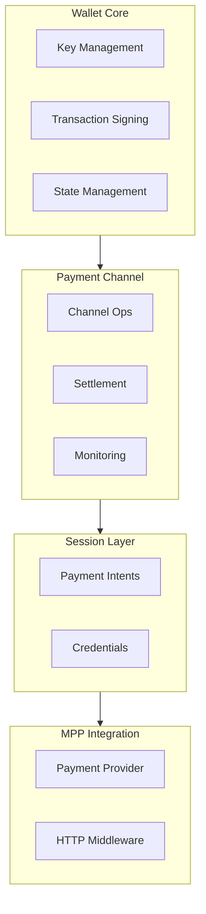

# Project Exploration: Tempo Wallet

## Overview

Tempo Wallet is a Rust implementation of a non-custodial wallet for the Tempo blockchain, with support for payment channels, session management, and MPP (Machine Payments Protocol) integration.

## Repository

- **Location:** `/home/darkvoid/Boxxed/@formulas/src.rust/src.llamacpp/src.protocols/wallet`
- **Remote:** `git@github.com:tempoxyz/wallet.git`
- **Primary Language:** Rust
- **License:** MIT OR Apache-2.0

## Directory Structure

```
wallet/
├── crates/                      # Workspace crates
│   ├── wallet-core/             # Core wallet logic
│   │   ├── src/
│   │   │   ├── lib.rs
│   │   │   ├── wallet.rs        # Wallet struct
│   │   │   ├── signer.rs        # Transaction signing
│   │   │   └── keys.rs          # Key management
│   │
│   ├── wallet-channel/          # Payment channel logic
│   │   ├── src/
│   │   │   ├── lib.rs
│   │   │   ├── channel.rs       # Channel state
│   │   │   ├── ops.rs           # Channel operations
│   │   │   └── settlement.rs    # Channel settlement
│   │
│   ├── wallet-session/          # Session management
│   │   ├── src/
│   │   │   ├── lib.rs
│   │   │   ├── session.rs       # Payment sessions
│   │   │   └── intents.rs       # Session intents
│   │
│   ├── wallet-mpp/              # MPP integration
│   │   ├── src/
│   │   │   ├── lib.rs
│   │   │   ├── credential.rs    # Credential generation
│   │   │   └── provider.rs      # Payment provider
│   │
│   └── wallet-cli/              # Command-line interface
│       ├── src/
│       │   ├── main.rs
│       │   ├── commands/        # CLI commands
│       │   └── config.rs        # CLI config
│
├── .changelog/                  # Unreleased changes
├── .git/
├── .github/
├── AGENTS.md                    # Agent usage
├── ARCHITECTURE.md              # Architecture docs
├── CONTRIBUTING.md              # Contribution guide
├── Cargo.toml                   # Workspace root
├── Cargo.lock
├── CHANGELOG.md
└── README.md
```

## Architecture

### Wallet Architecture



## Key Components

### Wallet Core

```rust
// wallet-core/src/wallet.rs
pub struct Wallet {
    config: WalletConfig,
    signer: Box<dyn Signer>,
    state: WalletState,
}

impl Wallet {
    pub fn new(config: WalletConfig, signer: Box<dyn Signer>) -> Self;

    pub fn balance(&self) -> Result<Balance>;

    pub fn send(&self, to: Address, amount: U256) -> Result<Transaction>;

    pub fn create_channel(&self, amount: U256) -> Result<Channel>;
}
```

### Payment Channel

```rust
// wallet-channel/src/channel.rs
pub struct PaymentChannel {
    id: ChannelId,
    state: ChannelState,
    local_balance: U256,
    remote_balance: U256,
    sequence: u64,
}

impl PaymentChannel {
    pub fn sign_payment(&self, amount: U256, recipient: Address) -> Result<Credential>;

    pub fn close(&self) -> Result<SettlementTransaction>;
}
```

### Session Management

```rust
// wallet-session/src/session.rs
pub struct PaymentSession {
    id: SessionId,
    challenge: Challenge,
    total_spent: U256,
    limit: U256,
}

impl PaymentSession {
    pub fn new(challenge: Challenge, limit: U256) -> Self;

    pub fn credential(&self, amount: U256) -> Result<Credential>;

    pub fn is_expired(&self) -> bool;
}
```

## Entry Points

### CLI Usage

```bash
# Create new wallet
wallet-cli init --name my-wallet

# Check balance
wallet-cli balance

# Send payment
wallet-cli send --to 0x... --amount 100

# Create payment channel
wallet-cli channel create --amount 1000

# Close channel
wallet-cli channel close --id <channel-id>
```

### Library Usage

```rust
use wallet_core::{Wallet, WalletConfig};
use wallet_channel::PaymentChannel;

let config = WalletConfig::load_from_file("wallet.toml")?;
let signer = LocalSigner::from_private_key(private_key);

let wallet = Wallet::new(config, Box::new(signer));

// Send payment
let tx = wallet.send(recipient, amount)?;
println!("Transaction: {:?}", tx.hash);

// Create channel
let channel = wallet.create_channel(amount)?;
let credential = channel.sign_payment(10, merchant)?;
```

## Dependencies

| Dependency | Purpose |
|------------|---------|
| alloy | Ethereum/Tempo types |
| mpp | MPP protocol integration |
| tokio | Async runtime |
| clap | CLI parsing |
| serde | Serialization |

## Features

1. **Non-Custodial:** User controls all keys
2. **Payment Channels:** Off-chain payment scaling
3. **Session Support:** Multi-payment sessions
4. **MPP Integration:** Automatic 402 handling
5. **CLI Interface:** Command-line wallet management

## Security Considerations

1. **Key Storage:** Keys should be encrypted at rest
2. **Transaction Signing:** All signing happens locally
3. **Channel Monitoring:** Watch for channel attempts to close
4. **Rate Limiting:** Prevent unauthorized rapid transactions

## Open Questions

1. **Hardware Wallet:** Ledger/Trezor support planned?
2. **Multi-Sig:** Multi-signature wallet support?
3. **Recovery:** Seed phrase backup and recovery?
