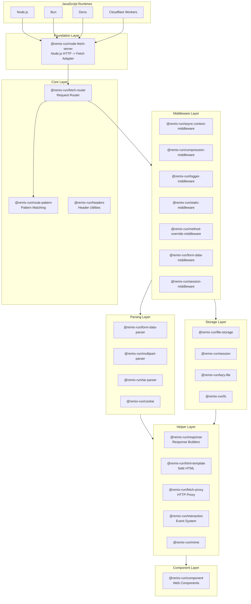
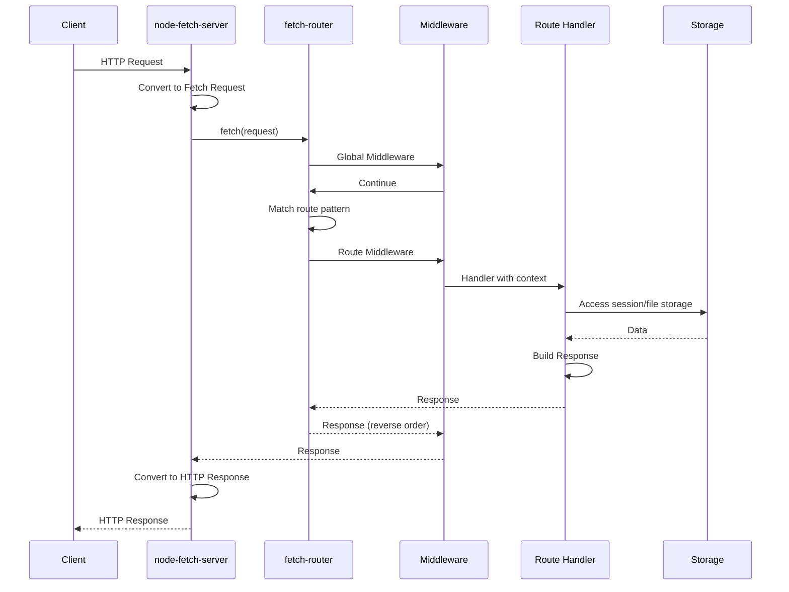

# Project Exploration: Remix 3

## Overview

Remix 3 is a complete reimagining of the Remix web framework, built from the ground up with a new philosophy centered on Web APIs, runtime agnosticism, and zero dependencies. Unlike Remix v2 which was a full-stack React framework, Remix 3 is a collection of composable, low-level packages that work across Node.js, Bun, Deno, Cloudflare Workers, and any JavaScript runtime that supports the Web Fetch API.

The core philosophy of Remix 3 is built on six principles:

1. **Model-First Development** - Optimize source code, documentation, and abstractions for LLMs
2. **Build on Web APIs** - Share abstractions across the stack using Web APIs and JavaScript
3. **Religiously Runtime** - No bundlers/compilers/typegen expectations; tests run without bundling
4. **Avoid Dependencies** - Choose dependencies wisely, wrap them completely, expect to replace them
5. **Demand Composition** - Single-purpose, replaceable abstractions that are easy to add/remove
6. **Distribute Cohesively** - Distributed as a single `remix` package for distribution and documentation

## Repository

- **Location:** `/home/darkvoid/Boxxed/@formulas/src.UIFrameworks/src.remix-run/remix`
- **Remote:** `https://github.com/remix-run/remix`
- **Primary Language:** TypeScript
- **License:** MIT
- **Package Manager:** pnpm (v10.22.0)
- **Node Version:** 22+

## Directory Structure

```
remix/
├── package.json                  # Monorepo root with pnpm workspaces
├── pnpm-lock.yaml               # Dependency lock file
├── pnpm-workspace.yaml          # Workspace configuration
├── README.md                    # Remix 3 philosophy and goals
├── AGENTS.md                    # Development guide and conventions
├── CONTRIBUTING.md              # Contribution guidelines
├── eslint.config.js             # ESLint configuration
├── .prettierrc                  # Prettier configuration
├── decisions/                   # Architecture decision records
├── demos/                       # Demo applications
├── scripts/                     # Build and release scripts
├── .vscode/                     # VS Code settings
├── packages/                    # All Remix packages
│   ├── async-context-middleware/ # Request context via AsyncLocalStorage
│   ├── component/               # Web components for Remix
│   ├── compression-middleware/  # HTTP response compression
│   ├── cookie/                  # Cookie toolkit (v0.5.0)
│   ├── fetch-proxy/             # HTTP proxy for Fetch API (v0.7.0)
│   ├── fetch-router/            # Minimal composable router (v0.12.0)
│   ├── file-storage/            # Key/value storage for File objects (v0.13.0)
│   ├── form-data-middleware/    # Middleware for parsing FormData (v0.1.0)
│   ├── form-data-parser/        # formData() with streaming uploads (v0.14.0)
│   ├── fs/                      # Filesystem utilities using Web File API (v0.3.0)
│   ├── headers/                 # HTTP headers toolkit (v0.18.0)
│   ├── html-template/           # HTML template tag with auto-escaping (v0.3.0)
│   ├── interaction/             # Event-based interaction system (v0.3.0)
│   ├── lazy-file/               # Lazy, streaming files (v4.2.0)
│   ├── logger-middleware/       # HTTP request/response logging (v0.1.0)
│   ├── method-override-middleware/ # HTTP method override from forms (v0.1.1)
│   ├── mime/                    # MIME type utilities (v0.1.0)
│   ├── multipart-parser/        # Multipart stream parser (v0.14.0)
│   ├── node-fetch-server/       # Fetch API servers for Node.js (v0.12.0)
│   ├── response/                # Response helpers for Fetch API (v0.2.0)
│   ├── route-pattern/           # Type-safe route pattern matching (v0.15.3)
│   ├── session/                 # Session management (v0.4.0)
│   ├── session-middleware/      # Cookie-based session middleware (v0.1.0)
│   ├── static-middleware/       # Static file serving middleware (v0.4.0)
│   └── tar-parser/              # Tar stream parser (v0.7.0)
└── node_modules/
```

## Architecture

### High-Level Diagram



### Web Standards Foundation

Remix 3 is built entirely on Web APIs, ensuring maximum portability:

| Web API | Node.js Equivalent | Remix Package |
|---------|-------------------|---------------|
| `Request` / `Response` | `http.IncomingMessage` / `http.ServerResponse` | `node-fetch-server` |
| `ReadableStream` | `node:stream.Readable` | Built-in |
| `Uint8Array` | `Buffer` | Built-in |
| `File` / `Blob` | `node:fs` streams | `fs`, `lazy-file` |
| `Headers` | Custom header objects | `headers` |
| `FormData` | Custom parsing | `form-data-parser` |
| `crypto.subtle` | `node:crypto` | `cookie` (for signing) |
| `URL` | `node:url` | Built-in |

## Package Breakdown

### Core Routing

#### @remix-run/fetch-router (v0.12.0)

The minimal, composable router built on the Fetch API.

**Key Features:**
- Type-safe route patterns with compile-time validation
- Composable middleware (global and per-route)
- Nested routers for hierarchical organization
- Works with standard `fetch()` for testing

**Route Definition:**
```typescript
import { createRouter, route, formAction, resources } from '@remix-run/fetch-router'

let routes = route({
  home: '/',
  contact: formAction('/contact'), // GET index + POST action
  users: resources('users', { only: ['index', 'show'] }),
})

let router = createRouter({
  middleware: [logger(), auth()],
})

router.map(routes, {
  home() {
    return new Response('Home')
  },
  contact: {
    index() { /* GET /contact */ },
    action({ formData }) { /* POST /contact */ },
  },
})
```

#### @remix-run/route-pattern (v0.15.3)

Type-safe route pattern matching and URL generation.

**Key Features:**
- Pattern parsing and compilation
- Parameter extraction with TypeScript inference
- Trie-based matcher for O(1) lookups
- RegExp-based matcher for complex patterns

**Pattern Syntax:**
```typescript
// Static routes
'/'
'/about'

// Dynamic routes
'/users/:id'
'/posts/:slug'

// Nested params
'/brands/:brandId/products/:productId'

// Wildcards
'/files/*'
```

### Server & Runtime

#### @remix-run/node-fetch-server (v0.12.0)

Brings Fetch API to Node.js HTTP servers.

**Key Features:**
- Converts `http.IncomingMessage` to `Request`
- Converts `Response` to `http.ServerResponse`
- Supports HTTP/2, HTTPS
- Client info (IP, port) access
- Streaming responses

**Usage:**
```typescript
import * as http from 'node:http'
import { createRequestListener } from '@remix-run/node-fetch-server'

async function handler(request: Request) {
  return Response.json({ message: 'Hello' })
}

let server = http.createServer(createRequestListener(handler))
server.listen(3000)
```

#### @remix-run/fetch-proxy (v0.7.0)

Build HTTP proxy servers using Fetch API.

**Key Features:**
- Transparent proxying
- Request/response transformation
- Works across runtimes

### Data & Storage

#### @remix-run/lazy-file (v4.2.0)

Lazy, streaming file operations.

**Key Features:**
- Zero-copy file reads
- Byte-range requests
- Streaming to HTTP responses

#### @remix-run/file-storage (v0.13.0)

Key/value storage for File objects.

**Key Features:**
- In-memory and persistent storage
- File streaming
- Automatic cleanup

#### @remix-run/session (v0.4.0)

Session management primitives.

**Key Features:**
- Cookie-based sessions
- Flash messages
- Session signing

### Parsing

#### @remix-run/multipart-parser (v0.14.0)

Fast, efficient multipart form data parser.

**Key Features:**
- Streaming parser
- Works in any JS runtime
- File upload handling
- Benchmarks against busboy, multipasta

**Performance:**
```
@remix-run/multipart-parser: ~2x faster than busboy
```

#### @remix-run/form-data-parser (v0.14.0)

`request.formData()` wrapper with streaming upload handling.

**Key Features:**
- Upload progress callbacks
- File size limits
- Custom upload handlers

#### @remix-run/tar-parser (v0.7.0)

Tar archive stream parser.

**Key Features:**
- Streaming tar parsing
- Entry extraction
- Works with any ReadableStream

### HTTP Utilities

#### @remix-run/headers (v0.18.0)

Comprehensive HTTP header toolkit.

**Features:**
- Accept headers parsing (Accept, Accept-Encoding, Accept-Language)
- Content negotiation
- Range requests
- Content-Disposition
- If-None-Match / If-Match
- Cookie header parsing

```typescript
import { acceptEncoding, acceptLanguage, range } from '@remix-run/headers'

let encodings = acceptEncoding(request.headers)
// [{ encoding: 'gzip', quality: 1 }, { encoding: 'deflate', quality: 0.5 }]

let languages = acceptLanguage(request.headers)
// [{ lang: 'en-US', quality: 1 }, { lang: 'en', quality: 0.8 }]

let ranges = range(request.headers, fileSize)
// [{ start: 0, end: 1023 }]
```

#### @remix-run/cookie (v0.5.0)

Cookie creation, parsing, and signing.

**Features:**
- Cookie serialization
- Signed cookies (using Web Crypto API)
- Secure defaults

#### @remix-run/response

Response helpers for common HTTP responses.

```typescript
import { createHtmlResponse } from '@remix-run/response/html'
import { createRedirectResponse } from '@remix-run/response/redirect'
import { createFileResponse } from '@remix-run/response/file'
import { compressResponse } from '@remix-run/response/compress'

let html = createHtmlResponse('<h1>Hello</h1>')
let redirect = createRedirectResponse('/dashboard')
let file = createFileResponse(lazyFile)
let compressed = compressResponse(response, request)
```

#### @remix-run/html-template (v0.3.0)

HTML template tag with auto-escaping.

```typescript
import { html } from '@remix-run/html-template'

// Auto-escaped
let unsafe = '<script>alert(1)</script>'
let safe = html`<h1>${unsafe}</h1>` // <h1>&lt;script&gt;alert(1)&lt;/script&gt;</h1>

// Raw HTML (use with trusted content only)
let trusted = '<b>Bold</b>'
let raw = html.raw`<div>${trusted}</div>`
```

### Middleware

| Package | Purpose |
|---------|---------|
| `@remix-run/async-context-middleware` | Request context via AsyncLocalStorage |
| `@remix-run/compression-middleware` | Gzip/deflate compression |
| `@remix-run/logger-middleware` | HTTP request/response logging |
| `@remix-run/static-middleware` | Static file serving |
| `@remix-run/method-override-middleware` | Form-based method override (PUT/DELETE) |
| `@remix-run/form-data-middleware` | FormData parsing |
| `@remix-run/session-middleware` | Cookie-based sessions |

### Additional Packages

| Package | Version | Purpose |
|---------|---------|---------|
| `@remix-run/mime` | v0.1.0 | MIME type detection and mapping |
| `@remix-run/fs` | v0.3.0 | Filesystem utilities using Web File API |
| `@remix-run/interaction` | v0.3.0 | Event-based interaction system (like components for events) |
| `@remix-run/component` | v0.1.0 | Web components for Remix |

## Data Flow



## Request Context

Middleware and handlers receive a context object:

```typescript
{
  request: Request,      // Original Fetch Request
  url: URL,              // Parsed URL object
  params: Record<string, string>,  // Route params (type-safe)
  headers: Headers,      // Request headers
  formData?: FormData,   // Parsed form data (if middleware applied)
  files?: File[],        // Uploaded files (if middleware applied)
  storage: AppStorage,   // Request-scoped key/value storage
  client: {              // Client connection info
    address: string,
    port: number
  }
}
```

## Configuration

### TypeScript Configuration

```json
{
  "compilerOptions": {
    "target": "ESNext",
    "module": "ES2022",
    "moduleResolution": "bundler",
    "strict": true,
    "verbatimModuleSyntax": true,
    "noEmit": true
  }
}
```

### Package.json Structure

```json
{
  "name": "remix-the-web",
  "type": "module",
  "packageManager": "pnpm@10.22.0",
  "scripts": {
    "build": "pnpm -r build",
    "test": "pnpm --parallel run test",
    "typecheck": "pnpm -r typecheck",
    "lint": "eslint . --max-warnings=0"
  },
  "engines": {
    "node": ">=22"
  }
}
```

## Testing

Remix 3 uses Node.js's built-in test runner with no external test framework dependencies.

**Test Structure:**
```typescript
import * as assert from 'node:assert/strict'
import { describe, it } from 'node:test'
import { createRouter, route } from '@remix-run/fetch-router'

describe('router', () => {
  let router = createRouter()

  it('handles GET /', async () => {
    let response = await router.fetch('http://localhost/')
    assert.equal(response.status, 200)
  })

  it('returns 404 for unknown routes', async () => {
    let response = await router.fetch('http://localhost/unknown')
    assert.equal(response.status, 404)
  })
})
```

**Key Testing Principles:**
- Tests run from source (no build required)
- No loops or conditionals in `describe()` blocks (breaks test runner)
- Use standard `fetch()` API for testing

## Key Insights

1. **Zero Dependency Philosophy**: Remix 3 aims for zero external dependencies. Every package is self-contained and doesn't rely on npm packages.

2. **Runtime Agnostic**: All packages work across Node.js, Bun, Deno, and Cloudflare Workers by using only Web APIs.

3. **Composable Architecture**: Small, single-purpose packages that compose together. Each can be used independently.

4. **Type-Safe by Default**: Heavy use of TypeScript's type system for route patterns, params, and handler contexts.

5. **Streaming First**: All file and form data operations support streaming for memory efficiency.

6. **No Magic**: Unlike Remix v2, there's no hidden magic or conventions. Everything is explicit.

7. **LLM-Optimized**: Code structure and naming are designed to be easily understood by AI assistants.

8. **Test Without Bundling**: Tests run directly from TypeScript source using Node.js's experimental TypeScript support.

## Migration from Remix v2

| Remix v2 | Remix 3 |
|----------|---------|
| `@remix-run/node` | `@remix-run/node-fetch-server` |
| `@remix-run/server-runtime` | `@remix-run/fetch-router` |
| `createRequestHandler` | `createRequestListener` + `createRouter` |
| `json()`, `redirect()` | `@remix-run/response` helpers |
| File-based routes | Explicit route maps |
| Magic conventions | Explicit configuration |

## Open Considerations

1. **React Integration**: How does Remix 3 integrate with React? The `@remix-run/component` package is minimal - is there a separate React renderer?

2. **Server-Side Rendering**: How is SSR handled without the conventions of Remix v2?

3. **Deployment**: What are the recommended deployment patterns for different runtimes?

4. **Production Readiness**: Many packages are at v0.x - what features are still in development?

5. **Documentation Strategy**: How does the single `remix` package distribute cohesive documentation?

6. **Error Boundaries**: How are error boundaries implemented without file-based conventions?

7. **Nested Routes**: How are nested layouts and route segments handled?

8. **Data Loading**: What replaces `loader()` and `action()` functions from Remix v2?
