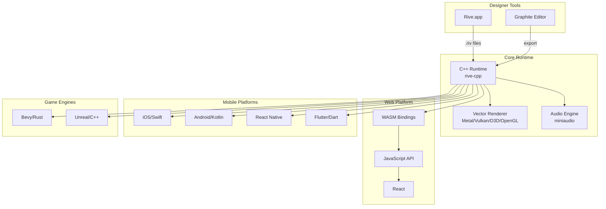

# Project Exploration: Renderlet (Rive Animation Ecosystem)

## Overview

The `/home/darkvoid/Boxxed/@formulas/src.rust/src.renderlet/` directory contains a comprehensive collection of Rive animation runtime implementations across multiple platforms, along with related graphics technologies including the Wander renderer, Graphite graphics editor, and supporting libraries.

Rive is a real-time interactive design and animation tool that enables teams to create motion graphics that respond to different states and user inputs. The runtime libraries are lightweight, open-source, and designed for loading animations into apps, games, and websites.

## Directory Structure

```
@formulas/src.rust/src.renderlet/
├── rive-runtime/           # Core C++ runtime (rive-cpp)
├── rive-wasm/              # WebAssembly/JavaScript bindings
├── rive-react/             # React integration
├── rive-react-native/      # React Native (legacy)
├── rive-nitro-react-native/# React Native (Nitro Modules)
├── rive-flutter/           # Flutter/Dart integration
├── rive-ios/               # iOS/macOS native runtime
├── rive-android/           # Android native runtime
├── rive-bevy/              # Bevy game engine integration
├── rive-unreal/            # Unreal Engine integration
├── rive-docs/              # Documentation (Mintlify)
├── Graphite/               # Vector/raster graphics editor
├── wander/                 # Wasm GPU renderer framework
├── yoga/                   # Facebook layout engine
├── miniaudio/              # Audio playback library
├── compiler-types/         # Compiler type definitions
├── geo-buffer/             # Geometry buffer utilities
├── glb-to-webgpu/          # GLB to WebGPU converter
├── step2gltf/              # STEP to glTF converter
├── wasi-webgpu/            # WASI WebGPU interface definitions
└── rust/                   # Rust buildpack/tooling
```

## Architecture

### High-Level Diagram



## Core Runtime (rive-runtime)

### Architecture

The C++ runtime (`rive-cpp`) is the foundation for all platform bindings. Key components:

**File: `/home/darkvoid/Boxxed/@formulas/src.rust/src.renderlet/rive-runtime/src/artboard.cpp`**
- `Artboard` - Root container for all animation content
- Manages component hierarchy, animations, and state machines
- Handles layout, data binding, and audio events

**File: `/home/darkvoid/Boxxed/@formulas/src.rust/src.renderlet/rive-runtime/include/rive/artboard.hpp`**
```cpp
class Artboard : public ArtboardBase,
                 public CoreContext,
                 public Virtualizable,
                 public ResettingComponent,
                 public DataBindContainer
{
    std::vector<Core*> m_Objects;
    std::vector<LinearAnimation*> m_Animations;
    std::vector<StateMachine*> m_StateMachines;
    std::vector<Drawable*> m_Drawables;
    std::vector<ClippingShape*> m_clippingShapes;
    // ... more component collections
};
```

### Key Runtime Features

1. **Artboard Loading** - Parse and instantiate .riv file content
2. **Animation Querying** - Access LinearAnimations and StateMachines
3. **Hierarchy Manipulation** - Modify artboard object hierarchy at runtime
4. **Efficient Advancement** - `Artboard::advance()` processes all changes
5. **Vector Rendering** - Support for Metal, Vulkan, D3D12, D3D11, OpenGL/WebGL
6. **Abstract Renderer** - Interface for external renderer integration

### Build System

- Uses **premake5** for cross-platform builds
- Clang required for vector builtins support
- Testing via Catch2 framework
- clang-format for code formatting

## Animation System

### Animation Types

**File: `/home/darkvoid/Boxxed/@formulas/src.rust/src.renderlet/rive-runtime/src/animation/`**

1. **LinearAnimation** (`linear_animation.cpp`, `linear_animation_instance.cpp`)
   - Keyframe-based animation playback
   - Supports looping, timing modes, and blending

2. **StateMachine** (`state_machine.cpp`, `state_machine_instance.cpp`)
   - Interactive animation control
   - State transitions with conditions
   - Input-driven behavior

3. **BlendAnimations** (`blend_animation_1d.cpp`, etc.)
   - Smooth interpolation between animations
   - 1D blend trees based on input values

### State Machine Architecture

**File: `/home/darkvoid/Boxxed/@formulas/src.rust/src.renderlet/rive-runtime/src/animation/state_machine.cpp`**

```cpp
StateMachine::addLayer()    // State machine layers
StateMachine::addInput()    // Inputs (bool, number, trigger)
StateMachine::addListener() // Event listeners
StateMachine::addDataBind() // Data binding connections
```

**State Machine Instance** (`state_machine_instance.cpp` - 83KB)
- Manages runtime state machine execution
- Handles transitions between states
- Processes input changes and triggers
- Evaluates transition conditions

### Keyframe System

- `KeyFrameInterpolator` - Base interpolation logic
- `KeyFrameBool`, `KeyFrameDouble`, `KeyFrameColor`, `KeyFrameString`
- `CubicInterpolator` - Smooth curve interpolation
- `ElasticEase` - Elastic easing functions

### Data Binding

Modern approach for runtime control:
- `ViewModel` and `ViewModelInstance` for state management
- `DataBind` connects runtime values to artboard properties
- Supports: numbers, strings, booleans, colors, enums, triggers, images, lists, artboards

## Platform Bindings

### rive-wasm (Web)

**File: `/home/darkvoid/Boxxed/@formulas/src.rust/src.renderlet/rive-wasm/`**

- WebAssembly bindings for web browsers
- High-level API for simple interactions
- Low-level API for custom render loops
- Supports TypeScript/JavaScript

**Key Features:**
- Full state machine control
- Event handling
- Multiple artboards per canvas
- Custom render loop support

### rive-react

**File: `/home/darkvoid/Boxxed/@formulas/src.rust/src.renderlet/rive-react/src/index.ts`**

```typescript
export {
    useRive,
    useStateMachineInput,
    useResizeCanvas,
    useRiveFile,
    useViewModel,
    useViewModelInstance,
    useViewModelInstanceNumber,
    useViewModelInstanceString,
    useViewModelInstanceBoolean,
    useViewModelInstanceColor,
    useViewModelInstanceEnum,
    useViewModelInstanceTrigger,
    useViewModelInstanceImage,
    useViewModelInstanceList,
    useViewModelInstanceArtboard,
};
```

Hooks-based React integration with full data binding support.

### rive-react-native

Two implementations:

1. **Legacy** (`rive-react-native/`) - Bridge-based
2. **Nitro** (`rive-nitro-react-native/`) - Nitro Modules (high performance)

**Nitro Version Features:**
- React Native 0.78+
- iOS 15.1+, Android 7.0+
- Full data binding support
- Error handling with typed errors
- Reusable .riv file resources

### rive-flutter

**File: `/home/darkvoid/Boxxed/@formulas/src.rust/src.renderlet/rive-flutter/lib/rive.dart`**

Dart bindings for Flutter applications. Uses platform channels to communicate with native C++ runtime.

### rive-ios (Apple Platforms)

**File: `/home/darkvoid/Boxxed/@formulas/src.rust/src.renderlet/rive-ios/`**

- Supports iOS, macOS, tvOS, visionOS
- UIKit, AppKit, and SwiftUI integration
- `RiveViewModel` for high-level API
- Distributed via Swift Package Manager and CocoaPods

### rive-android

**File: `/home/darkvoid/Boxxed/@formulas/src.rust/src.renderlet/rive-android/`**

- Kotlin/Java bindings
- Minimum SDK 21, Target SDK 35
- Uses CMake and Gradle build system
- Optional audio engine (miniaudio linking)
- Supports ABI filtering for size optimization

### rive-bevy

**File: `/home/darkvoid/Boxxed/@formulas/src.rust/src.renderlet/rive-bevy/`**

- Rust/Bevy game engine integration
- Uses **Vello** as render backend
- Known limitations:
  - Image mesh inconsistencies at triangle borders
  - Very high clip counts render incorrectly
  - All strokes use round joins/caps

### rive-unreal

**File: `/home/darkvoid/Boxxed/@formulas/src.rust/src.renderlet/rive-unreal/`**

- Unreal Engine plugin
- C++ integration with Unreal rendering pipeline

## Graphite Graphics

**File: `/home/darkvoid/Boxxed/@formulas/src.rust/src.renderlet/Graphite/`**

Graphite is a separate but related project - a free, open-source vector and raster graphics engine.

### Key Characteristics

- **Nondestructive editing** - Layer-based compositing with node-based generative design
- **Procedural workflow** - Node graph core with user-friendly tools
- **Multiple competencies**: Photo editing, motion graphics, digital painting, desktop publishing, VFX
- **Built in Rust** - Performance-focused implementation

### Architecture

```
Graphite/
├── editor/          # Main editor application
├── frontend/        # UI frontend
├── node-graph/      # Node-based graph system
├── libraries/       # Shared libraries
├── proc-macros/     # Rust procedural macros
├── desktop/         # Desktop application
└── website/         # Documentation site
```

## Wander Renderer

**File: `/home/darkvoid/Boxxed/@formulas/src.rust/src.renderlet/wander/`**

Wander is a GPU-based rendering framework for "renderlets" - self-contained WebAssembly modules containing graphics data and code.

### What are Renderlets?

- High performance 2D and 3D graphics modules
- Fully portable rendering pipelines
- Sandboxed third-party code execution
- No game engine or platform dependencies

### Platform Support

| API      | Windows | Linux/Android | macOS/iOS | Web (wasm) |
|----------|---------|---------------|-----------|------------|
| OpenGL   | Yes     | In progress   | Yes       | WebGL2     |
| DX11     | Yes     | -             | -         | -          |
| DX12     | In progress | -         | -         | -          |
| WebGPU   | -       | -             | -         | In progress |
| Vulkan   | Planned | Planned       | Planned   | -          |
| Metal    | -       | -             | Planned   | -          |

### API Usage

```cpp
auto pal = wander::Factory::CreatePal(wander::EPalType::D3D11, device, context);
auto runtime = wander::Factory::CreateRuntime(pal);

auto renderlet_id = runtime->LoadFromFile(L"Building.wasm", "run");
auto tree_id = runtime->Render(renderlet_id);
auto tree = runtime->GetRenderTree(tree_id);

// Render loop
for (auto i = 0; i < tree->Length(); ++i) {
    tree->NodeAt(i)->RenderFixedStride(runtime, stride);
}
```

### Rive-Renderer Integration

Wander has experimental support for 2D vector operations via `rive-renderer`, currently only in the Windows/D3D11 backend.

## Supporting Libraries

### Yoga (`yoga/`)

Facebook's open-source layout engine implementing Flexbox. Used by Rive for layout calculations across platforms.

### Miniaudio (`miniaudio/`)

Single-header audio playback library. Provides audio asset playback for Rive animations.
- ~4MB header-only library
- Cross-platform audio API abstraction
- Optional in builds (can exclude for 600KB savings)

### Compiler Types (`compiler-types/`)

Type definitions for the Rive compiler toolchain.

### Geo Buffer (`geo-buffer/`)

Geometry buffer utilities for efficient mesh/data handling.

### WASI WebGPU (`wasi-webgpu/wit/`)

WebGPU interface definitions for WASI:
- `webgpu.wit` - WebGPU API bindings
- `surface.wit` - Surface/presentation APIs
- `graphics-context.wit` - Graphics context management
- `frame-buffer.wit` - Frame buffer operations
- `world.wit` - World/context management

## Performance Characteristics

### Vector Rendering

1. **GPU-Accelerated** - Modern backends use Metal, Vulkan, D3D12 for GPU tessellation
2. **Batching** - Draw calls are batched for efficiency
3. **Tessellation** - CPU or GPU tessellation of vector paths
4. **Clipping** - Stencil-based clipping with performance considerations at high counts

### Memory Management

- Reference-counted objects (`rcp<>` in C++)
- Component hierarchy ownership
- Artboard instances share source data
- Explicit cleanup required for focus trees and audio

### Size Optimization

- WASM builds can be queried for size (`generate_size_report.sh`)
- Audio engine can be excluded (~600KB savings)
- ABI filtering on Android for APK size reduction

## Key Insights

### Animation Model

1. **Artboards** are the root container - each .riv file can contain multiple artboards
2. **State Machines** provide interactivity - states, transitions, inputs (bool/number/trigger)
3. **Data Binding** is the modern control mechanism - supersedes direct state machine input manipulation
4. **ViewModels** provide reactive state - changes propagate through the component hierarchy

### Runtime Architecture

1. **C++ Core** - All platforms ultimately call into the same C++ runtime
2. **Thin Bindings** - Platform bindings are minimal wrappers (except WASM which has additional JS layer)
3. **Renderer Abstraction** - Multiple backends through abstract renderer interface
4. **Modular Features** - Audio, text, scripting can be compiled in/out

### Platform Binding Patterns

1. **WASM** - Emscripten compilation with JS API wrapper
2. **Apple** - Swift/Objective-C wrapper with C++ bridging
3. **Android** - JNI bridge from Kotlin/Java to C++
4. **Flutter** - Dart FFI or platform channels
5. **React Native** - Turbo Modules/Nitro for direct C++ access

### Graphite's Role

Graphite is NOT directly part of the Rive runtime but represents related graphics technology:
- Procedural, node-based graphics editing
- Could potentially export to Rive-compatible formats
- Shares Rust-based performance philosophy

### Wander's Relationship

Wander is a more general renderlet framework that can optionally use Rive:
- Renderlets = portable WASM graphics modules
- Rive is one possible renderlet source
- Provides GPU abstraction across all platforms
- Future WASI WebGPU integration enables sandboxed GPU compute

## File Locations Reference

| Component | Path |
|-----------|------|
| Core Runtime | `/home/darkvoid/Boxxed/@formulas/src.rust/src.renderlet/rive-runtime/` |
| WASM Bindings | `/home/darkvoid/Boxxed/@formulas/src.rust/src.renderlet/rive-wasm/` |
| React | `/home/darkvoid/Boxxed/@formulas/src.rust/src.renderlet/rive-react/` |
| React Native (Nitro) | `/home/darkvoid/Boxxed/@formulas/src.rust/src.renderlet/rive-nitro-react-native/` |
| Flutter | `/home/darkvoid/Boxxed/@formulas/src.rust/src.renderlet/rive-flutter/` |
| iOS | `/home/darkvoid/Boxxed/@formulas/src.rust/src.renderlet/rive-ios/` |
| Android | `/home/darkvoid/Boxxed/@formulas/src.rust/src.renderlet/rive-android/` |
| Bevy | `/home/darkvoid/Boxxed/@formulas/src.rust/src.renderlet/rive-bevy/` |
| Unreal | `/home/darkvoid/Boxxed/@formulas/src.rust/src.renderlet/rive-unreal/` |
| Graphite | `/home/darkvoid/Boxxed/@formulas/src.rust/src.renderlet/Graphite/` |
| Wander | `/home/darkvoid/Boxxed/@formulas/src.rust/src.renderlet/wander/` |
| Documentation | `/home/darkvoid/Boxxed/@formulas/src.rust/src.renderlet/rive-docs/` |
