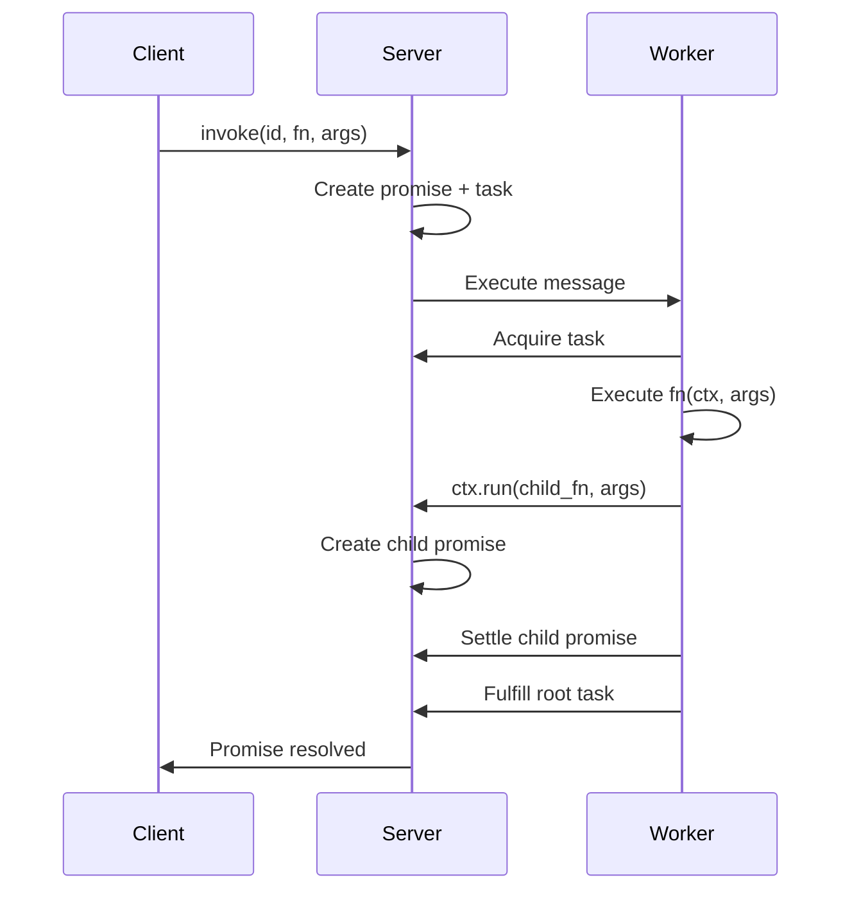

# Resonate -- Overview

## What Resonate Is

Resonate is an open-source durable execution engine. It implements the **Distributed Async Await** specification — extending traditional async/await from single-process, ephemeral execution to distributed systems where functions survive crashes, restarts, and network partitions.

The core thesis: **write your business logic as normal async functions.** Resonate handles durability, retries, crash recovery, and distributed coordination automatically. If your process crashes mid-workflow, execution resumes from the last checkpoint — not from the beginning.

```rust
#[resonate_sdk::function]
async fn process_order(ctx: &Context, order: Order) -> Result<Receipt> {
    let payment = ctx.run(charge_card, order.payment).await?;
    let shipment = ctx.run(ship_items, order.items).await?;
    let receipt = ctx.run(send_confirmation, (payment, shipment)).await?;
    Ok(receipt)
}
```

If the process crashes after `charge_card` succeeds but before `ship_items` completes, Resonate replays the stored payment result and only re-executes `ship_items`. The card is never charged twice.

## The Component Map

```
┌──────────────────────────────────────────────────────────────────────┐
│                         APPLICATIONS                                  │
│                                                                       │
│  Your TypeScript app    Your Rust service    Your Python worker       │
│  (npm: @resonatehq/sdk) (crate: resonate-sdk) (pip: resonate)       │
│                                                                       │
├──────────────────────────────────────────────────────────────────────┤
│                         INTEGRATIONS                                  │
│                                                                       │
│  resonate-faas-aws-ts        resonate-opentelemetry-ts               │
│  resonate-faas-cloudflare-ts resonate-transport-kafka-ts             │
│  resonate-faas-supabase-ts   resonate-transport-webserver-ts         │
│                                                                       │
├──────────────────────────────────────────────────────────────────────┤
│                       RESONATE SERVER (Rust)                          │
│                                                                       │
│  Single binary: resonate serve                                        │
│  HTTP API (port 8001) + Metrics (port 9090)                          │
│  Persistence: SQLite | PostgreSQL | MySQL                            │
│  Transports: HTTP push | HTTP poll (SSE) | GCP Pub/Sub | Bash        │
│                                                                       │
├──────────────────────────────────────────────────────────────────────┤
│                      SPECIFICATION                                    │
│                                                                       │
│  distributed-async-await.io                                          │
│  Formal definition of durable promises and durable functions         │
│                                                                       │
└──────────────────────────────────────────────────────────────────────┘
```

## Core Concepts

### Durable Promises

A durable promise is a promise that persists in storage and survives process boundaries. Unlike ephemeral in-memory promises, durable promises:

- Are globally addressable by ID
- Survive process crashes
- Can be resolved/rejected by any worker
- Support callbacks (await from other promises)
- Support listeners (push notifications to addresses)

### Ephemeral vs Durable World

| Aspect | Ephemeral World | Durable World |
|--------|----------------|---------------|
| Entry point | HTTP handler, main(), CLI | Inside `ctx.run()` / `yield*` |
| State | In-memory, lost on crash | Persisted, survives crashes |
| Scope | Single process | Distributed, cross-process |
| Coordination | Locks, queues | Durable promises, callbacks |
| Example | `resonate.run(id, fn, args)` | `ctx.run(fn, args)` |

### The Execution Model

1. **Register** — declare functions with the SDK
2. **Invoke** — create a durable promise with a function name and arguments
3. **Dispatch** — server routes the invocation to a worker
4. **Execute** — worker runs the function, checkpointing each step
5. **Suspend** — if a step depends on an unresolved promise, suspend and release the worker
6. **Resume** — when the dependency resolves, server dispatches the task again
7. **Settle** — when the function completes, resolve or reject the root promise



## Philosophy

### 1. Code Writes Like There Are No Crashes

The fundamental property of durable functions:

```
(⟨p⟩, →(+interruption)) ≃ (⟨p⟩, →(-interruption))
```

A function's definition is **interruption-agnostic** — you write it without thinking about crashes. Its execution is **interruption-transparent** — whether crashes occur or not, the outcome is identical.

### 2. Resonate IS the Infrastructure

Do not build additional state management. Resonate persists the full execution graph. Query it directly:

```bash
resonate tree order.123
```

This shows the complete call graph — which steps completed, which are pending, which failed.

### 3. At-Least-Once with Idempotency

Resonate guarantees at-least-once execution per step. Combined with deterministic replay of completed steps, the observable behavior is effectively-once. For external side effects (HTTP calls, database writes), use idempotency keys.

### 4. Language-Agnostic Protocol

The server speaks a JSON-over-HTTP protocol. SDKs in any language can participate. A TypeScript worker can invoke a Rust worker's function via `ctx.rpc()`, and vice versa.

## Repository Map

| Repository | Purpose | Language |
|------------|---------|----------|
| `resonate` | Server binary | Rust |
| `resonate-sdk-ts` | TypeScript SDK | TypeScript |
| `resonate-sdk-rs` | Rust SDK | Rust |
| `resonate-sdk-py` | Python SDK | Python |
| `distributed-async-await.io` | Specification website | MDX |
| `docs.resonatehq.io` | User documentation | MDX (Docusaurus) |
| `resonate-skills` | AI agent skills for Resonate development | Markdown |
| `resonate-faas-aws-ts` | AWS Lambda integration | TypeScript |
| `resonate-faas-cloudflare-ts` | Cloudflare Workers integration | TypeScript |
| `resonate-faas-supabase-ts` | Supabase Edge Functions integration | TypeScript |
| `resonate-opentelemetry-ts` | OpenTelemetry tracing | TypeScript |
| `resonate-transport-kafka-ts` | Kafka transport | TypeScript |
| `resonate-transport-webserver-ts` | Webserver transport | TypeScript |
| `resonate-telemetry` | Telemetry collection | Rust |
| `example-async-rpc-ts` | Example: cross-worker RPC | TypeScript |
| `p-resonate-workers` | Worker process management | TypeScript |
| `design` | Design documents and RFCs | Markdown |

## Technology Stack

| Concern | Choice |
|---------|--------|
| Server language | Rust (tokio, axum) |
| Persistence | SQLite (rusqlite) / PostgreSQL, MySQL (sqlx) |
| HTTP framework | Axum 0.7 |
| Configuration | Figment (TOML + env vars) |
| Auth | JWT (jsonwebtoken crate) |
| Metrics | Prometheus (prometheus crate) |
| Cron | cron 0.12 + chrono |
| GCP integration | google-cloud-auth, google-cloud-pubsub |
| TS SDK | Node.js, EventSource (SSE) |
| Rust SDK | tokio, reqwest, serde |
| Python SDK | asyncio, requests, jsonpickle |

## Source

All repositories: `/home/darkvoid/Boxxed/@formulas/src.rust/src.resonatehq/`
