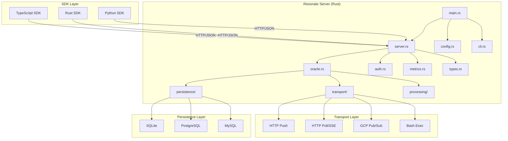
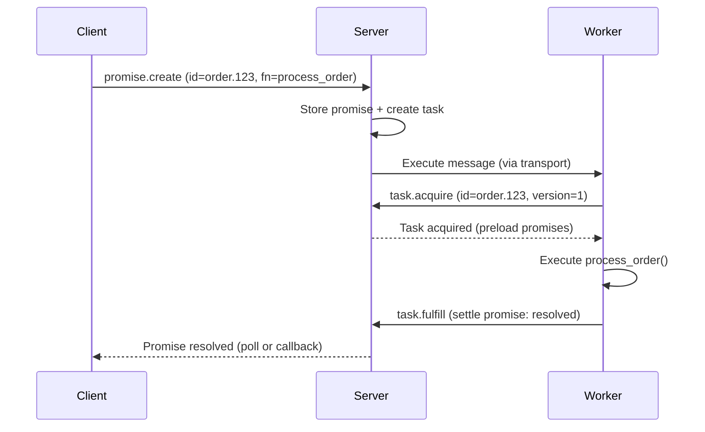
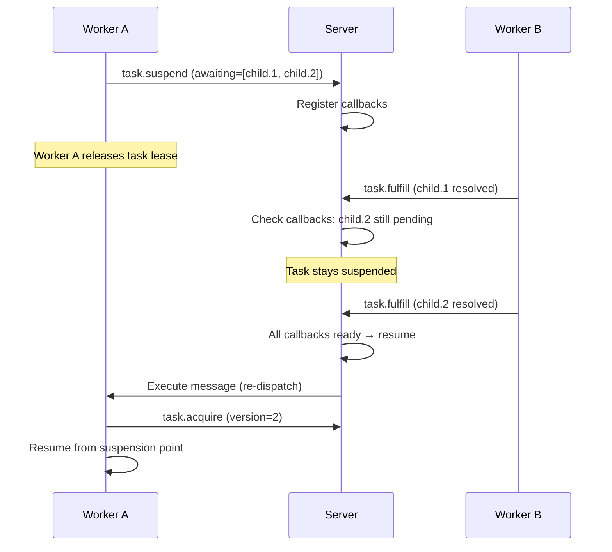
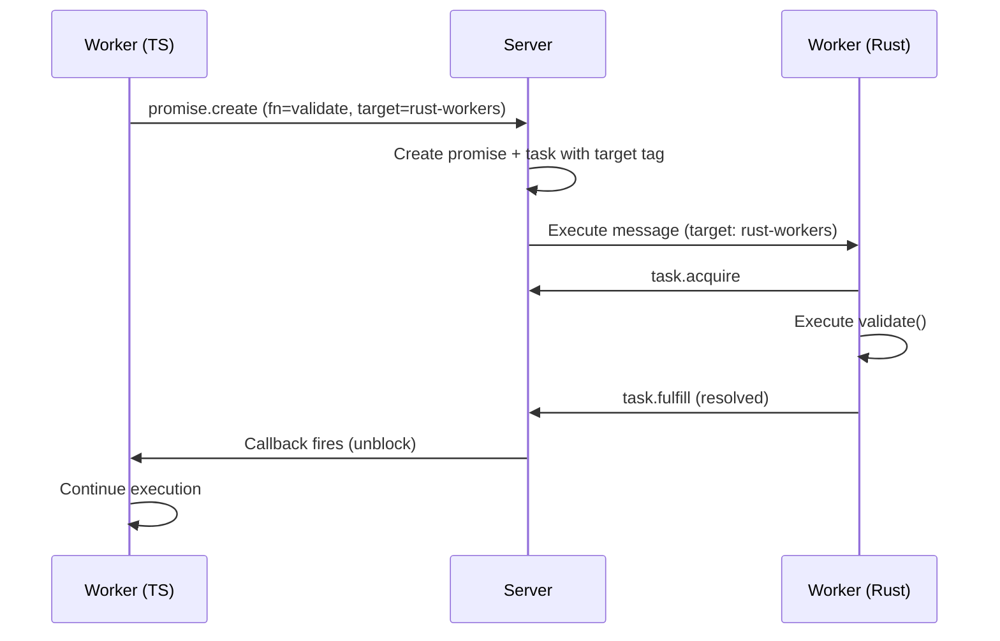

# Resonate -- Architecture

## System Architecture

Resonate follows a hub-and-spoke architecture. The server is the hub — it owns all durable state. Workers (running SDKs) are spokes — they execute functions and report results back to the server.

```
┌─────────────────────────────────────────────────────────────────────┐
│                        WORKER LAYER                                   │
│                                                                       │
│  ┌──────────────┐  ┌──────────────┐  ┌──────────────┐              │
│  │ TS Worker    │  │ Rust Worker  │  │ Python Worker│              │
│  │ (generator)  │  │ (async/await)│  │ (generator)  │              │
│  │              │  │              │  │              │              │
│  │ Registry     │  │ Registry     │  │ Registry     │              │
│  │ Heartbeat    │  │ Heartbeat    │  │ Heartbeat    │              │
│  │ Network      │  │ Network      │  │ Network      │              │
│  └──────┬───────┘  └──────┬───────┘  └──────┬───────┘              │
│         │                  │                  │                       │
└─────────┼──────────────────┼──────────────────┼──────────────────────┘
          │    HTTP/JSON      │                  │
          │    Protocol       │                  │
          ▼                   ▼                  ▼
┌─────────────────────────────────────────────────────────────────────┐
│                      RESONATE SERVER                                  │
│                                                                       │
│  ┌─────────────┐  ┌──────────────┐  ┌──────────────────────┐       │
│  │  HTTP API   │  │   Oracle     │  │  Background Loops    │       │
│  │  (Axum)     │  │  (State Mch) │  │                      │       │
│  │             │  │              │  │  Timeout Processing  │       │
│  │  /          │  │  26 ops      │  │  Message Delivery    │       │
│  │  /health    │  │  Validation  │  │  Schedule Expiry     │       │
│  │  /ready     │  │  Auth        │  │                      │       │
│  │  /poll/:g   │  │              │  │                      │       │
│  └──────┬──────┘  └──────┬───────┘  └──────────┬───────────┘       │
│         │                 │                      │                    │
│         ▼                 ▼                      ▼                    │
│  ┌─────────────────────────────────────────────────────────────┐    │
│  │                    PERSISTENCE (Db trait)                     │    │
│  │                                                              │    │
│  │  SQLite (rusqlite)  |  PostgreSQL (sqlx)  |  MySQL (sqlx)   │    │
│  │  12 tables          |  Connection pool    |  Connection pool │    │
│  │  WAL mode           |  CTE operations     |  CTE operations │    │
│  └─────────────────────────────────────────────────────────────┘    │
│                                                                       │
│  ┌─────────────────────────────────────────────────────────────┐    │
│  │                    TRANSPORTS                                 │    │
│  │                                                              │    │
│  │  HTTP Push    |  HTTP Poll (SSE)  |  GCP Pub/Sub  |  Bash   │    │
│  │  (webhooks)   |  (long-polling)   |  (topics)     |  (exec) │    │
│  └─────────────────────────────────────────────────────────────┘    │
│                                                                       │
└─────────────────────────────────────────────────────────────────────┘
```

## Component Dependency Graph



## The Protocol

All communication between SDKs and the server uses a JSON envelope protocol over HTTP.

### Request Envelope

```json
{
  "kind": "promise.create",
  "head": {
    "corrId": "1714400000000",
    "version": "2026-04-01",
    "auth": "Bearer eyJ...",
    "debugTime": null
  },
  "data": {
    "id": "order.123",
    "timeout": 86400000,
    "param": {
      "headers": {"Content-Type": "application/json"},
      "data": "eyJpdGVtcyI6WzEsMiwzXX0="
    },
    "tags": {
      "resonate:invoke": "process_order",
      "resonate:target": "order-workers"
    }
  }
}
```

### Response Envelope

```json
{
  "kind": "promise.create",
  "head": {
    "corrId": "1714400000000",
    "status": 201,
    "version": "2026-04-01"
  },
  "data": {
    "id": "order.123",
    "state": "pending",
    "timeout": 86400000,
    "param": {"headers": {}, "data": "eyJ..."},
    "value": null,
    "tags": {},
    "createdAt": 1714400000000
  }
}
```

### Operations (26 total)

| Category | Operations |
|----------|-----------|
| Promise | get, create, settle, register_callback, register_listener, search |
| Task | get, create, acquire, release, fulfill, suspend, fence, heartbeat, halt, continue, search |
| Schedule | get, create, delete, search |
| Debug | start, stop, reset, snap, tick |

## Communication Patterns

### Pattern 1: Direct Invocation (Client → Server → Worker)



### Pattern 2: Suspension (Worker blocks on dependency)



### Pattern 3: Remote Procedure Call (Cross-worker)



## Server Internal Architecture

### Request Lifecycle

```
HTTP POST / (JSON body)
    │
    ▼
Deserialize RequestEnvelope
    │
    ▼
Validate (non-empty kind, protocol version, data shape)
    │
    ▼
Authenticate (JWT verify if configured)
    │
    ▼
Authorize (prefix check for resource ID)
    │
    ▼
Dispatch to operation handler
    │
    ├── promise.create → create promise + optional task
    ├── task.acquire → increment version, set lease timeout
    ├── task.suspend → register callbacks on awaited promises
    ├── task.fulfill → settle promise, fire callbacks, notify listeners
    └── ... (26 operations)
    │
    ▼
Record metrics (request_total, request_duration)
    │
    ▼
Return ResponseEnvelope (HTTP status mapped from operation result)
```

### Background Processing

Two async loops run alongside the HTTP server:

**Timeout Loop** (default: 1000ms interval):
1. Scan expired promise timeouts → settle as `rejected_timedout`
2. Scan expired task lease timeouts → release task (retry)
3. Scan expired task retry timeouts → re-dispatch task
4. Scan expired schedule timeouts → create new promise from template

**Message Loop** (default: 100ms interval):
1. Claim batch of outgoing messages (default: 100)
2. For each execute message: dispatch to worker via transport
3. For each unblock message: notify listener at address
4. Delete delivered messages from outgoing tables

### Settlement Chain

When a promise settles, a cascade of effects fires atomically:

```
Promise settles (resolved | rejected)
    │
    ├── Delete promise timeout
    │
    ├── Fulfill dependent tasks
    │   └── Delete their task timeouts
    │
    ├── Mark callbacks as ready
    │   └── If all callbacks for a suspended task are ready:
    │       └── Resume task → insert outgoing execute message
    │
    └── Notify listeners
        └── Insert outgoing unblock messages
```

This entire chain executes in a single database transaction, ensuring atomicity.

## Configuration Layering

```
Defaults (hardcoded)
    ↓ merged with
resonate.toml (file)
    ↓ merged with
RESONATE_* environment variables (__ for nesting)
    ↓ merged with
CLI flags (--server-port, --storage-type, etc.)
```

Later layers override earlier ones. Environment variables use `RESONATE_` prefix with `__` for nested fields (e.g., `RESONATE_TRANSPORTS__HTTP_PUSH__AUTH__MODE=gcp`).

## Source Paths

| Component | Path |
|-----------|------|
| Server binary | `resonate/src/main.rs` |
| HTTP API | `resonate/src/server.rs` |
| State machine | `resonate/src/oracle.rs` |
| Types | `resonate/src/types.rs` |
| Config | `resonate/src/config.rs` |
| Persistence trait | `resonate/src/persistence/mod.rs` |
| SQLite backend | `resonate/src/persistence/persistence_sqlite.rs` |
| Transport dispatch | `resonate/src/transport/mod.rs` |
| Background loops | `resonate/src/processing/` |
