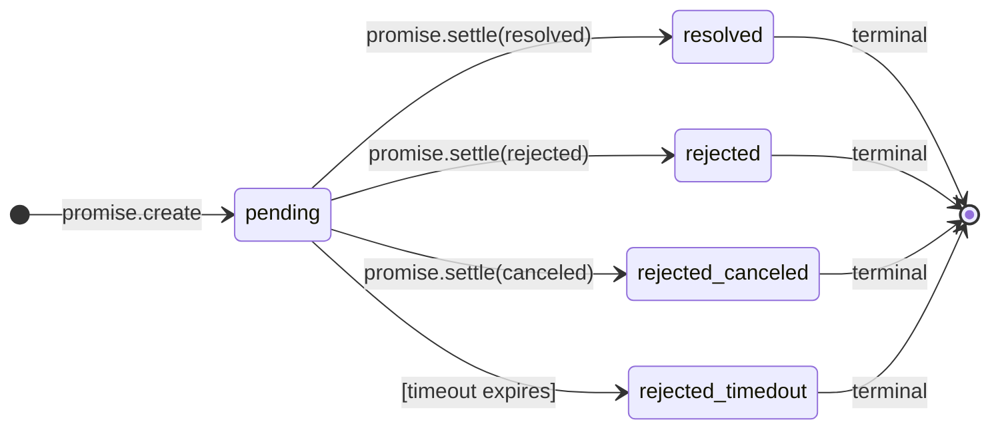
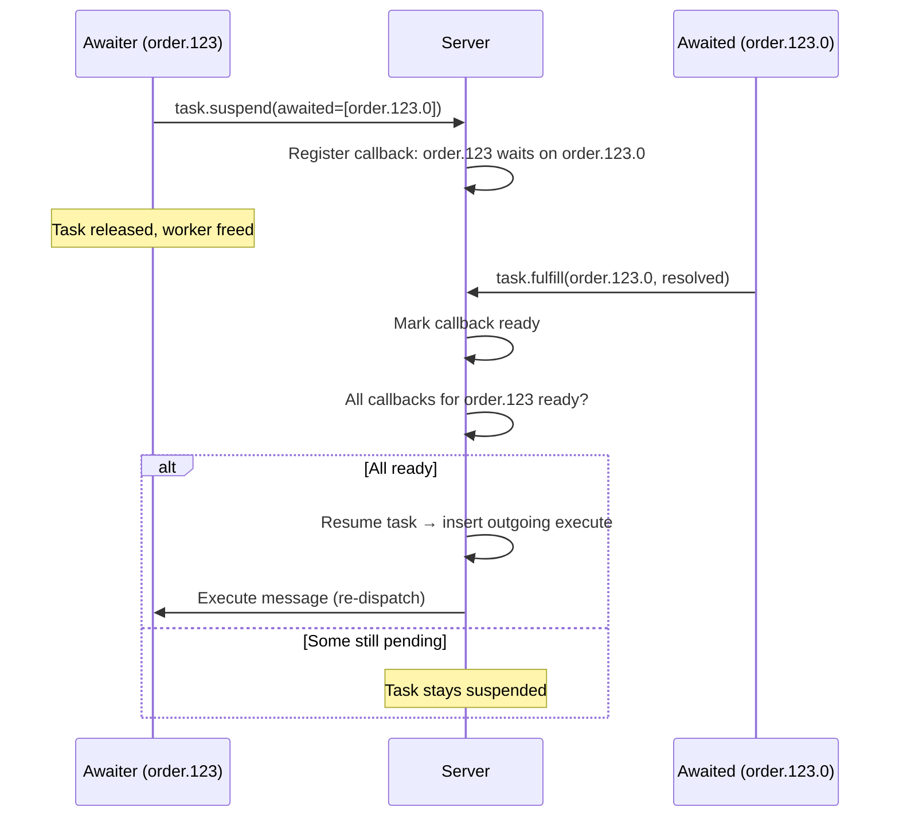

# Resonate -- Durable Promises

## What Is a Durable Promise

A durable promise extends the concept of an in-memory promise (JavaScript `Promise`, Rust `Future`) to distributed, persistent storage. It is a named, persistent container that transitions through states and coordinates work across process boundaries.

| Property | Ephemeral Promise | Durable Promise |
|----------|------------------|-----------------|
| Lifetime | Process memory | Persistent storage |
| Identity | Anonymous (reference) | Named (string ID) |
| Visibility | Single process | Global (any worker) |
| Crash behavior | Lost | Survives |
| Resolution | Same process | Any process |
| Observation | `.then()` / `await` | Callbacks + listeners |

## Promise Structure

```json
{
  "id": "order.123.0",
  "state": "pending",
  "param": {
    "headers": {"Content-Type": "application/json"},
    "data": "eyJhbW91bnQiOjk5OTl9"
  },
  "value": null,
  "tags": {
    "resonate:invoke": "charge_card",
    "resonate:target": "payment-workers",
    "resonate:origin": "order.123"
  },
  "timeout_at": 1714486400000,
  "created_at": 1714400000000,
  "settled_at": null
}
```

### Fields

| Field | Type | Description |
|-------|------|-------------|
| `id` | string | Globally unique identifier |
| `state` | enum | pending, resolved, rejected, rejected_canceled, rejected_timedout |
| `param` | object | Input data (headers + base64-encoded body) |
| `value` | object | Output data (set on settlement) |
| `tags` | map | Metadata: function name, target, origin, custom tags |
| `timeout_at` | i64 | Unix ms when promise auto-rejects if still pending |
| `created_at` | i64 | Unix ms when created |
| `settled_at` | i64 | Unix ms when settled (null if pending) |

### Reserved Tags

| Tag | Purpose |
|-----|---------|
| `resonate:invoke` | Function name to execute |
| `resonate:target` | Worker group that should acquire |
| `resonate:origin` | Parent promise ID (call graph) |
| `resonate:timer` | If present, promise is a durable sleep |

## Promise Lifecycle



### State Descriptions

| State | Meaning |
|-------|---------|
| `pending` | Created but not yet settled. Work may be in progress. |
| `resolved` | Successfully completed. `value` contains the result. |
| `rejected` | Failed with an error. `value` contains error details. |
| `rejected_canceled` | Explicitly canceled before completion. |
| `rejected_timedout` | Timed out before settling. Automatic transition. |

## Idempotent Creation

Promise creation is idempotent on ID. If you call `promise.create` with an ID that already exists:

- If the promise is still pending → return existing promise (status 200, not 201)
- If the promise is settled → return settled promise

This enables safe retries: a client can re-invoke after a network timeout without creating duplicates.

## Callbacks (Promise-to-Promise Coordination)

A callback links an **awaiter** (suspended task's promise) to an **awaited** (dependency promise). When the awaited promise settles, the callback fires and potentially resumes the awaiter.



### Callback Rules

1. A task can await multiple promises simultaneously
2. The task resumes only when ALL awaited promises settle
3. Awaiter and awaited must be different promises (no self-suspension)
4. Callbacks are stored in a `callbacks` table with a `ready` boolean flag

### Database Representation

```sql
CREATE TABLE callbacks (
    awaited_id TEXT NOT NULL REFERENCES promises(id),
    awaiter_id TEXT NOT NULL REFERENCES promises(id),
    ready INTEGER NOT NULL DEFAULT 0,
    PRIMARY KEY (awaited_id, awaiter_id)
);
```

## Listeners (Push Notifications)

A listener is an address registered on a promise. When the promise settles, the server sends an unblock message to that address.

Unlike callbacks (which coordinate tasks), listeners notify external systems — useful for clients waiting on a result.

```rust
// Register a listener
{
  "kind": "promise.register_listener",
  "data": {
    "awaited": "order.123",
    "address": "http://my-service.com/webhook/order-done"
  }
}
```

When `order.123` settles, the server POSTs the settled promise to the webhook URL.

### Listener vs Callback

| Aspect | Callback | Listener |
|--------|----------|----------|
| Target | Another promise/task | External address |
| Fires | Marks callback ready, resumes task | Sends HTTP/message to address |
| Multiplicity | Many-to-one (many deps per task) | Many-to-one (many listeners per promise) |
| Use case | Internal: workflow suspension | External: webhook, client notification |

## Settlement Chain

When a promise settles, the server fires a cascade of effects in a single atomic transaction:

```
┌─────────────────────────────────────────────────────────────┐
│ TRANSACTION START                                            │
│                                                              │
│ 1. Update promise: state → settled, value → result           │
│                                                              │
│ 2. Delete promise_timeout entry                              │
│                                                              │
│ 3. SettlementEnqueued:                                       │
│    - Find tasks depending on this promise                    │
│    - Transition them to fulfilled                            │
│    - Delete their task_timeout entries                       │
│    - Delete callbacks where awaiter_id = settled promise     │
│                                                              │
│ 4. ResumptionEnqueued:                                       │
│    - Mark callbacks ready (awaited_id = settled promise)     │
│    - For each suspended task with ALL callbacks ready:       │
│      → Transition task to pending                            │
│      → Insert into outgoing_execute table                    │
│                                                              │
│ 5. ListenerUnblocked:                                        │
│    - Insert into outgoing_unblock for each listener          │
│    - Delete listener entries                                 │
│                                                              │
│ TRANSACTION COMMIT                                           │
└─────────────────────────────────────────────────────────────┘
```

This atomicity guarantees that no state is left inconsistent — either the entire settlement chain fires or none of it does.

## Promise Timeouts

Every promise has a `timeout_at` field. A background loop scans for expired timeouts:

```rust
// Simplified timeout processing
loop {
    let expired = storage.get_expired_promise_timeouts(now).await?;
    for promise_id in expired {
        // Settle as rejected_timedout
        storage.promise_settle(promise_id, "rejected_timedout", timeout_value).await?;
        // Settlement chain fires (callbacks, listeners, etc.)
    }
    sleep(config.timeouts.poll_interval).await;
}
```

### Timeout Semantics

- Timeout is absolute (Unix ms), not relative
- Expired promises transition to `rejected_timedout`
- This fires the full settlement chain (callbacks resume, listeners notify)
- Tasks depending on a timed-out promise receive the timeout as a rejection

## ID Conventions

Promise IDs form a hierarchical tree that represents the call graph:

```
order.123           ← root invocation
order.123.0         ← first child (charge_card)
order.123.1         ← second child (ship_items)
order.123.1.0       ← grandchild (check_inventory)
order.123.1.1       ← grandchild (create_shipment)
order.123.2         ← third child (send_confirmation)
```

This convention is enforced by the SDKs (deterministic ID generation from parent + child index), not the server. The server treats IDs as opaque strings.

## Durable Timers (Sleep)

A durable sleep is a promise with a `resonate:timer` tag and a `timeout_at` set to the wake time. When the timeout expires, it settles as `resolved` (not rejected), which resumes the sleeping workflow.

```rust
// SDK creates a timer promise
ctx.sleep(Duration::from_secs(3600)).await?;
// Creates: { id: "wf.123.2", tags: {"resonate:timer": "true"}, timeout_at: now + 3600000 }
// When timeout fires: settled as resolved → workflow resumes
```

## Promise Search

Promises can be searched by ID pattern:

```bash
resonate promises search --id "order.*" --state pending --limit 50
```

The server supports glob-style patterns and filtering by state. Useful for monitoring and debugging active workflows.

## Source Paths

| Concept | File |
|---------|------|
| Promise types | `resonate/src/types.rs` |
| Promise operations (oracle) | `resonate/src/oracle.rs` |
| Promise persistence (SQLite) | `resonate/src/persistence/persistence_sqlite.rs` |
| Settlement chain | `resonate/src/persistence/persistence_sqlite.rs` (settle function) |
| Timeout processing | `resonate/src/processing/processing_timeouts.rs` |
| Promise HTTP handlers | `resonate/src/server.rs` |
