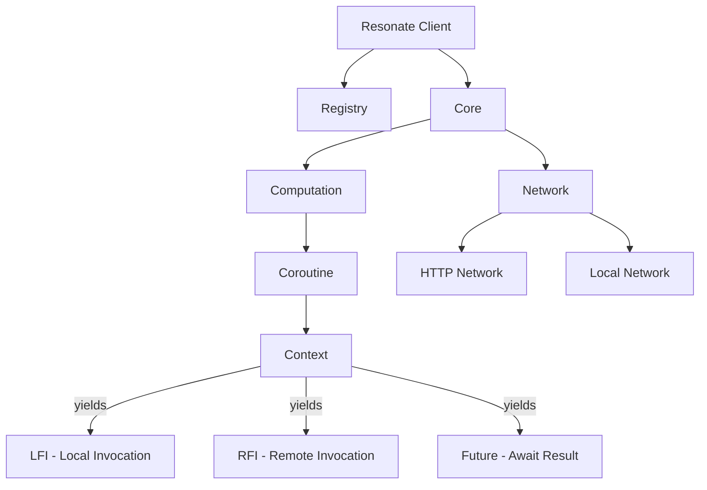
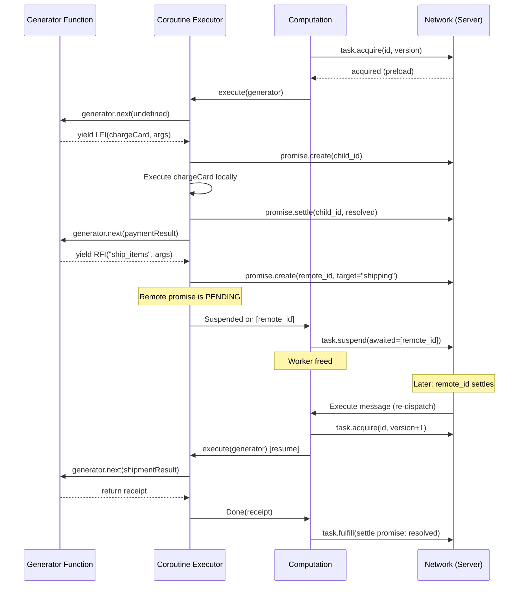

# Resonate -- TypeScript SDK

## Overview

The TypeScript SDK (`@resonatehq/sdk`) uses JavaScript generator functions to implement durable execution. Each `yield*` is a checkpoint — the point where execution can suspend, crash, and resume without re-executing completed work.

**Package:** `@resonatehq/sdk` (npm)
**Source:** `resonate-sdk-ts/src/`
**Runtime:** Node.js 22+
**Key files:** `resonate.ts`, `context.ts`, `core.ts`, `coroutine.ts`, `computation.ts`

## Core Abstractions



### Resonate (Entry Point)

```typescript
import { Resonate, type Context } from "@resonatehq/sdk";

const resonate = new Resonate({ url: "http://localhost:8001" });

// Register functions
resonate.register(processOrder);
resonate.register(chargeCard);

// Invoke (ephemeral world)
const result = await resonate.run("order.123", processOrder, orderData);
```

The `Resonate` class manages:
- Function registry (name → function mapping)
- Network connection (HTTP or local)
- Core message loop (task acquisition, execution, settlement)
- Heartbeat management

### Context (Durable World)

Inside a registered function, `Context` provides durable operations:

```typescript
function* processOrder(context: Context, order: Order): Generator<any, Receipt, any> {
    // Local invocation — runs in same process, result checkpointed
    const payment = yield* context.run(chargeCard, order.payment);
    
    // Remote invocation — dispatched to another worker
    const shipment = yield* context.rpc<Shipment>("ship_items", order.items);
    
    // Durable sleep — survives crashes
    yield* context.sleep(60_000); // 1 minute
    
    // Parallel execution
    const [a, b] = yield* context.all([
        context.run(taskA, input1),
        context.run(taskB, input2),
    ]);
    
    return { payment, shipment, a, b };
}
```

### Coroutine Types (Yieldables)

| Type | Class | Description |
|------|-------|-------------|
| Local Function Invocation | `LFI<T>` | Run function locally, return Future |
| Local Function Completion | `LFC<T>` | Run function locally, return value directly |
| Remote Function Invocation | `RFI<T>` | Create remote promise, return Future |
| Remote Function Completion | `RFC<T>` | Create remote promise, return value when done |
| Future | `Future<T>` | Await an already-created promise |
| Durable If Error | `DIE` | Conditional suspension on error state |

When a generator yields one of these objects, the Coroutine executor intercepts it, performs the durable operation (create promise, acquire task, etc.), and feeds the result back via `generator.next(value)`.

## Execution Model



### Key Insight: Generators as Coroutines

JavaScript generators provide the pause/resume semantics that durable execution needs:

```typescript
// Generator pauses at each yield
function* workflow(ctx: Context) {
    const a = yield* ctx.run(step1, input);  // PAUSE → checkpoint → RESUME with result
    const b = yield* ctx.run(step2, a);      // PAUSE → checkpoint → RESUME with result
    return b;
}
```

On replay (after crash), the executor feeds stored results back into the generator without re-executing the functions. The generator sees the same values it saw before the crash.

## The Computation Layer

`computation.ts` orchestrates the high-level task lifecycle:

```
acquire → execute → outcome
                      │
                      ├── Done → task.fulfill (settle promise)
                      ├── Suspended → task.suspend (register callbacks)
                      └── Error → task.release (retry later)
```

### Suspend-Redirect Optimization

If a remote dependency resolves while the worker is still processing other local work, the computation can **redirect** — re-execute the generator from the top, replaying stored results until it hits the now-resolved dependency, and continue without a round-trip to the server.

## The Core Layer

`core.ts` manages the message loop:

```typescript
class Core {
    // Receive execute messages from server (via SSE or polling)
    onMessage(taskId: string, version: number) {
        const computation = new Computation(taskId, version, this.network);
        computation.run();
    }
    
    // Subscribe to promise settlement notifications
    onUnblock(promiseId: string, result: any) {
        // Resume waiting computations
    }
}
```

## Network Layer

Two implementations behind a common interface:

| Implementation | Use Case | Transport |
|---------------|----------|-----------|
| `HttpNetwork` | Production | HTTP POST + EventSource (SSE) |
| `LocalNetwork` | Testing / local mode | In-memory state machine |

The HTTP network uses Server-Sent Events for real-time message delivery:

```typescript
// Worker registers for execute messages
const es = new EventSource(`${url}/poll/${group}/${workerId}`);
es.onmessage = (event) => {
    const { task } = JSON.parse(event.data);
    core.onMessage(task.id, task.version);
};
```

## Registry & Versioning

Functions are registered with optional version numbers:

```typescript
resonate.register(processOrder);                    // version 1 (default)
resonate.register(processOrder_v2, { version: 2 }); // version 2

// SDK resolves version from task tags
// Allows gradual migration: old tasks use v1, new tasks use v2
```

The registry maintains bidirectional maps: `name → versions → function` and `function → versions → name`.

## Retry & Error Handling

```typescript
resonate.register(unreliableTask, {
    retry: {
        maxAttempts: 5,
        baseDelay: 1000,
        maxDelay: 30000,
        backoffMultiplier: 2,
    }
});
```

Retry policies control server-side retry behavior. When a task fails (worker crashes or returns error), the server re-dispatches after the retry delay.

## Heartbeat

While executing, the SDK sends periodic heartbeat messages to extend the task lease:

```typescript
// Computation sends heartbeat every lease_timeout / 3
const heartbeatInterval = setInterval(() => {
    network.send({ kind: "task.heartbeat", data: { id: taskId, version } });
}, leaseTimeout / 3);
```

If a worker dies without heartbeating, the server releases the task after `lease_timeout` and re-dispatches to another worker.

## Codec & Encryption

Data flowing through promises can be encoded and encrypted:

```typescript
const resonate = new Resonate({
    url: "http://localhost:8001",
    encoder: new JsonEncoder(),
    encryptor: new AesEncryptor(key),
});
```

- **Encoder:** Serializes function arguments and return values (JSON by default)
- **Encryptor:** Encrypts param/value data before storing in the server

## Tracing & Observability

The SDK emits trace events for each operation:

```typescript
resonate.register(processOrder, {
    trace: true,  // Enable OpenTelemetry spans
});
```

Each `ctx.run()` and `ctx.rpc()` becomes a child span, creating a full distributed trace across workers.

## Source Paths

| File | Purpose |
|------|---------|
| `src/resonate.ts` | Entry point, configuration, registration |
| `src/context.ts` | Durable world API (run, rpc, sleep, all) |
| `src/core.ts` | Message loop, task routing |
| `src/coroutine.ts` | Generator executor, yield handling |
| `src/computation.ts` | Task lifecycle (acquire → execute → settle) |
| `src/types.ts` | Protocol types, state enums |
| `src/promises.ts` | Promise sub-client for direct operations |
| `src/schedules.ts` | Schedule sub-client |
| `src/registry.ts` | Function registry with versioning |
| `src/network/` | HTTP + local network implementations |
| `src/codec.ts` | Encoding/decoding data |
| `src/encryptor.ts` | Optional encryption layer |
| `src/heartbeat.ts` | Lease extension |
| `src/retries.ts` | Retry policy definitions |
| `src/options.ts` | Builder pattern options |
