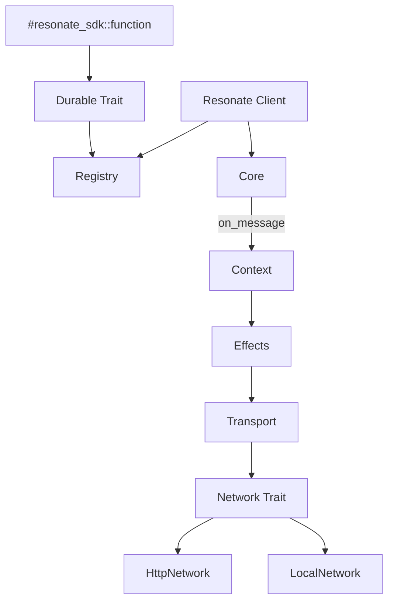
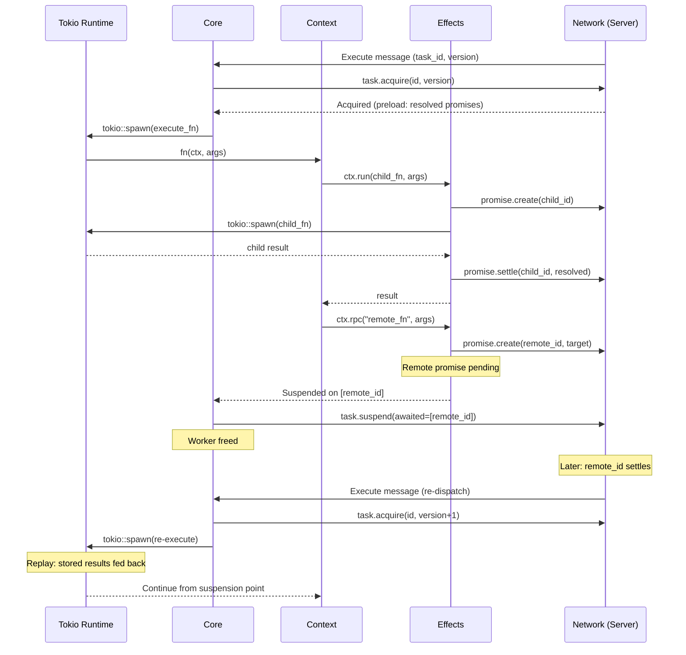

# Resonate -- Rust SDK

## Overview

The Rust SDK (`resonate-sdk`) uses native async/await with a proc macro (`#[resonate_sdk::function]`) to implement durable execution. Functions are standard async Rust functions — the macro generates the registration glue and the `Durable` trait implementation.

**Crate:** `resonate-sdk` (crates.io)
**Source:** `resonate-sdk-rs/resonate/src/`
**Macro crate:** `resonate-sdk-rs/resonate-macros/src/`
**Runtime:** tokio
**Key files:** `resonate.rs`, `context.rs`, `core.rs`, `durable.rs`, `effects.rs`

## Core Abstractions



### Resonate (Entry Point)

```rust
use resonate_sdk::prelude::*;

#[tokio::main]
async fn main() {
    let resonate = Resonate::new(ResonateConfig {
        url: Some("http://localhost:8001".into()),
        group: Some("order-workers".into()),
        ..Default::default()
    });

    resonate.register(process_order).unwrap();
    resonate.register(charge_card).unwrap();

    // Invoke (ephemeral world)
    let receipt: Receipt = resonate
        .run("order.123", process_order, order_data)
        .await
        .expect("workflow failed");
}
```

---

## Deep Dive: The `#[resonate_sdk::function]` Proc Macro

This section details exactly what the macro generates, why the zero-sized type pattern is used, and how the generated code connects to the runtime.

### Source: `resonate-macros/src/lib.rs`

The macro is an **attribute proc macro** (`#[proc_macro_attribute]`). When you write:

```rust
#[resonate_sdk::function]
async fn charge_card(ctx: &Context, payment: Payment) -> Result<Receipt> {
    // body
}
```

The macro consumes the entire function definition and replaces it with three pieces of generated code:

### 1. A hidden `#[doc(hidden)]` unit struct

```rust
#[derive(Debug, Clone, Copy)]
#[doc(hidden)]
pub struct __Durable_ChargeCard;
```

This is a **zero-sized type** (ZST) — it carries no data at runtime. The struct is derived with `Clone` and `Copy` so it can be freely duplicated. The `__Durable_` prefix plus PascalCase naming ensures it won't collide with user types.

### 2. A `const` alias with the original function name

```rust
#[allow(non_upper_case_globals)]
pub const charge_card: __Durable_ChargeCard = __Durable_ChargeCard;
```

This is the key to why `ctx.run(charge_card, args)` compiles. `charge_card` is **not a function pointer** — it is a `const` holding the unit struct. This means:
- `charge_card` has a concrete type (`__Durable_ChargeCard`) that can be used as a generic parameter.
- No runtime memory is allocated for the "value" — it's a compile-time constant.
- The original function name is still available as a value, matching how you'd call a function, but semantically it's a type.

### 3. A `Durable<Args, T>` trait implementation

```rust
impl Durable<(Payment,), Result<Receipt>> for __Durable_ChargeCard {
    const NAME: &'static str = "charge_card";
    const KIND: DurableKind = DurableKind::Workflow;

    async fn execute(
        &self,
        env: ExecutionEnv<'_>,
        args: (Payment,),
    ) -> Result<Receipt> {
        let ctx = env.into_context();
        let payment = args.0;
        async move {
            // original function body inlined here
        }.await
    }
}
```

The `Durable` trait is defined in `durable.rs:45-57`:

```rust
pub trait Durable<Args, T>: Send + Sync + 'static {
    const NAME: &'static str;
    const KIND: DurableKind;
    fn execute(&self, env: ExecutionEnv<'_>, args: Args) -> impl Future<Output = Result<T>> + Send;
}
```

**Type parameters**: `Args` is the function's input (tuple for multi-arg, single type for one arg, `()` for zero args). `T` is extracted from the `Result<T>` return type.

### How the macro detects function kind

The macro inspects the **first parameter's type** (`lib.rs:301-318`):

| First parameter type | `FunctionKind` | `KIND` constant | What happens in `execute` |
|---|---|---|---|
| `&Context` | `Workflow` | `DurableKind::Workflow` | `env.into_context()` is called to extract `&Context` |
| `&Info` | `LeafWithInfo` | `DurableKind::Function` | `env.into_info()` is called to extract `&Info` |
| anything else | `PureLeaf` | `DurableKind::Function` | `env` is ignored (`let _ = env;`) |

The detection uses `is_reference_to()`, which checks if the type is a `&Type` where the inner type's path ends with the given name (`lib.rs:321-330`). This means `&resonate_sdk::Context` and `&Context` both match.

### Args type assembly

```
0 user params  →  Args = ()
1 user param   →  Args = T  (the type directly, no tuple wrapper)
2+ user params →  Args = (T1, T2, ...)
```

This matters for how args are destructured in `execute`:
- Single arg: `let name = args;` — no tuple indexing.
- Multiple args: `let name0 = args.0; let name1 = args.1;` — tuple indexing.

### The `name = "..."` attribute

The macro supports an optional attribute to override the registered name:

```rust
#[resonate_sdk::function(name = "payment.process")]
async fn process_payment(ctx: &Context, payment: Payment) -> Result<Receipt> { ... }
```

This sets `const NAME` to `"payment.process"` instead of the function's identifier.

### ExecutionEnv: the bridge between registry and function

`ExecutionEnv` (`durable.rs:12-37`) is an enum:

```rust
pub enum ExecutionEnv<'a> {
    Function(&'a Info),    // leaf function — read-only metadata
    Workflow(&'a Context), // workflow — full orchestration capability
}
```

The `into_context()` and `into_info()` methods panic if called on the wrong variant. This means the macro's kind detection **must** match the actual usage — if you write `ctx: &Context` but the runtime passes `ExecutionEnv::Function`, you'll get a panic at execution time.

### What the macro does NOT generate

- **No registration**: The macro doesn't auto-register the function. You still call `resonate.register(charge_card)`.
- **No serialization**: The macro doesn't handle ser/de of args. That happens at the registry/transport layer.
- **No promise management**: The macro doesn't create or settle promises. That's the `Context`/`Effects` layer's job.
- **No error handling wrapper**: Panics are caught by `Core` via `std::panic::catch_unwind()`, not by the macro.

---

## Deep Dive: How `ctx.run(charge_card, order.payment)` Resolves the Function

This is the most surprising part of the SDK: how does passing `charge_card` (which looks like a function name) resolve to the correct function identity, and how does the runtime know which function to execute?

### The answer: it's not a function, it's a type

As explained above, `charge_card` is a **const zero-sized struct** that implements `Durable`. The macro ensures:

1. **Type-level identity**: `charge_card` has type `__Durable_ChargeCard`, which implements `Durable<(Payment,), Result<Receipt>>`. This is the compile-time identity.
2. **Static `NAME` constant**: `__Durable_ChargeCard::NAME` is `"charge_card"` (or the custom name from the attribute). This is the runtime name used for function registry lookup.
3. **Static `KIND` constant**: `__Durable_ChargeCard::KIND` tells the runtime whether to create a `Context` or `Info` for execution.

### The call chain, step by step

**Step 1 — `ctx.run(func, args)`** (`context.rs:244-259`):

```rust
pub fn run<D, Args, T>(&self, func: D, args: Args) -> RunTask<'_, D, Args, T>
where
    D: Durable<Args, T>,
    Args: Serialize,
```

The generic `D` is constrained to `Durable<Args, T>`. When you pass `charge_card`, the compiler infers `D = __Durable_ChargeCard`. The function does **not** execute anything yet — it returns a `RunTask` builder struct.

**Step 2 — Deterministic child ID generation** (`context.rs:120-123`):

```rust
fn next_id(&self) -> String {
    let seq = self.seq.fetch_add(1, Ordering::Relaxed);
    format!("{}.{}", self.id, seq)
}
```

The ID is purely based on the **position** in the execution flow, not the function itself. If `charge_card` is the first `ctx.run()` call in a workflow with ID `"order.123"`, the child gets ID `"order.123.0"`. This is critical for durability — on replay, the same position gets the same ID.

**Step 3 — Promise creation on `.await`** (`context.rs:719-720`):

```rust
let req = ctx.local_create_req(&child_id, &args, timeout_override)?;
let record = consume_promise_record(cell, req, &ctx.effects).await?;
```

The `local_create_req` (`context.rs:174-192`) builds a `PromiseCreateReq` with tags:
- `resonate:scope = "local"` — distinguishes from remote calls
- `resonate:branch = self.branch_id` — links to the workflow's branch
- `resonate:parent = self.id` — parent context ID
- `resonate:origin = self.origin_id` — root workflow ID

**Step 4 — Execution dispatch** (`context.rs:733-745`):

```rust
let info = ctx.child_info(&child_id, D::NAME, timeout_at);
let child_ctx = ctx.child(&child_id, D::NAME, timeout_at);

let env = match D::KIND {
    DurableKind::Function => ExecutionEnv::Function(&info),
    DurableKind::Workflow => ExecutionEnv::Workflow(&child_ctx),
};
let result = func.execute(env, args).await;
```

Here `D::NAME` and `D::KIND` are the **associated constants** from the `Durable` trait impl. These are resolved at compile time from the generic type parameter. `func.execute()` calls the inlined function body generated by the macro.

### Why not use function pointers or trait objects?

Function pointers (`fn()`) don't carry type information for args/return types and can't have associated constants. Trait objects (`&dyn Durable`) lose the `Args` and `T` type parameters and require `dyn` dispatch. The ZST + `Durable` trait approach gives:
- **Zero runtime cost**: the struct is a ZST, so passing it is free.
- **Full type safety**: the compiler enforces `Args` and `T` match.
- **Static dispatch**: no vtable lookups, all resolved at compile time.
- **Associated constants**: `NAME` and `KIND` are compile-time constants.

---

## Deep Dive: How `ctx.sleep()` Identifies the Correct Promise Across Replays

`ctx.sleep()` looks like a simple timer, but its durability mechanism is the same as every other context operation — it's a promise with a special tag.

### Sleep is a promise, not a special primitive

`ctx.sleep(duration)` (`context.rs:319-328`):

```rust
pub fn sleep(&self, duration: Duration) -> SleepTask<'_> {
    let child_id = self.next_id();   // deterministic: parent_id.seq
    let req = self.sleep_create_req(&child_id, duration);
    SleepTask { child_id, ctx: self, req, record: OnceCell::new() }
}
```

The `sleep_create_req` (`context.rs:286-303`) sets:

```rust
tags.insert("resonate:timer".to_string(), "true".to_string());
// plus: scope=global, branch=id, parent=parent_id, origin=origin_id
```

The `timeout_at` is set to `now + duration` (capped to the parent's timeout).

### First execution: what happens

When `.await` is called (`context.rs:1065-1090`):

1. **Create the promise** on the server via `effects.create_promise(req)`. The server stores it as `Pending` with `resonate:timer=true` and a `timeout_at`.
2. **Check the state**: the server returns the promise record. If `Pending` (the normal case for a new sleep), the SDK pushes `child_id` to `spawned_remote` and returns `Error::Suspended`.
3. **The workflow suspends**: `Core::suspend_task()` sends the list of remote promise IDs to the server via `task.suspend`. The server registers the task as an awaiter on each promise and transitions the task to `Suspended` state.

### Server-side timer resolution

The server maintains a `p_timeouts` list (`network.rs:1234-1243`). On each `tick()`:

```rust
for pt in &self.p_timeouts {
    if now >= pt.timeout {
        if let Some(p) = self.promises.get(&pt.id) {
            if p.state == PromiseState::Pending {
                // Settle it
                let state = self.timeout_state(&p.tags);  // line 1226
                // state = Resolved if resonate:timer=true, else RejectedTimedout
            }
        }
    }
}
```

`timeout_state()` (`network.rs:1226-1232`) is the key:

```rust
fn timeout_state(&self, tags: &HashMap<String, String>) -> PromiseState {
    if tags.get("resonate:timer").is_some_and(|v| v == "true") {
        PromiseState::Resolved   // timers resolve (success)
    } else {
        PromiseState::RejectedTimedout  // normal promises reject on timeout
    }
}
```

So a sleep promise **resolves** (not rejects) when the timer fires. This means `ctx.sleep().await` returns `Ok(())`, not an error.

### Replay: how the SDK knows the sleep was already created

On re-execution after a crash or resume:

1. The workflow is re-dispatched with the same task ID.
2. The server returns a **preload** of all resolved promises in the same `resonate:branch` (`network.rs:1209-1224`).
3. These preloaded promises are inserted into the `Effects` cache (`effects.rs:20-33`).
4. When the re-executed workflow reaches the same `ctx.sleep()` call:
   - `next_id()` produces the **same** `child_id` (deterministic: `{parent_id}.{seq}`).
   - `consume_promise_record` calls `effects.create_promise(req)`.
   - `create_promise` checks the cache first (`effects.rs:39`): `if let Some(cached) = self.cache.get(&req.id)`.
   - **The sleep promise is found in the cache** with state `Resolved` (timer already fired).
   - `record.as_result::<()>()` returns `Some(Ok(()))` — the `.await` returns immediately without creating a new server promise or waiting.

### The key insight: position-based ID, not content-based ID

The sleep promise's ID is **not** derived from the duration, timestamp, or any content of the sleep call. It's purely `{parent_context_id}.{sequential_counter}`. This means:

- If you insert a `ctx.run()` call **before** a `ctx.sleep()`, the sleep's ID changes on replay (because `seq` increments earlier).
- This is the same constraint as the TypeScript SDK — the execution path must be deterministic.
- The `OnceCell` ensures the promise is created at most once per `RunTask`/`SleepTask` instance.

### What happens if the sleep hasn't fired yet

If the promise is `Pending` (sleep still running), the SDK:
1. Pushes the child_id to `spawned_remote`.
2. Returns `Error::Suspended`.
3. The parent workflow suspends on the server.
4. When the timer fires, the server resolves the promise, calls `resume_awaiters()`, and re-dispatches the workflow.
5. On re-execution, the promise is `Resolved` in the preload, so the sleep returns immediately.

---

## Deep Dive: Tasks vs Promises — Storage, Relationship, and Lifecycle

Tasks and promises are **distinct but coupled** primitives. Understanding their separation is essential to understanding how Resonate works.

### They live in separate HashMaps

In `ServerState` (`network.rs:139-146`):

```rust
struct ServerState {
    promises: HashMap<String, DurablePromise>,
    tasks: HashMap<String, Task>,
    // ...
}
```

### Promise: the durability primitive

A `DurablePromise` (`network.rs:36-47`) stores:

| Field | Purpose |
|---|---|
| `id` | Unique identifier (shared with its task) |
| `state` | `Pending`, `Resolved`, `Rejected`, `RejectedCanceled`, `RejectedTimedout` |
| `param` | Input data (what was passed to create the promise) |
| `value` | Output data (the result after settlement) |
| `tags` | Metadata map (`resonate:scope`, `resonate:target`, `resonate:timer`, etc.) |
| `timeout_at` | Absolute millisecond timestamp for auto-timeout |
| `awaiters` | `HashSet<String>` of task IDs waiting on this promise |
| `subscribers` | `HashSet<String>` of listener addresses (for push notifications) |

**Promise lifecycle**: `Pending` → `Resolved`/`Rejected`/`RejectedCanceled`/`RejectedTimedout`

Promises are created via `promise.create` and settled via `promise.settle`. Once settled, they cannot be changed.

### Task: the execution primitive

A `Task` (`network.rs:67-74`) stores:

| Field | Purpose |
|---|---|
| `id` | Unique identifier (matches its promise ID) |
| `state` | `Pending`, `Acquired`, `Suspended`, `Halted`, `Fulfilled` |
| `version` | Monotonically increasing counter (bumped on each re-dispatch) |
| `pid` | Process ID of the worker that acquired this task |
| `ttl` | Lease timeout (heartbeat must refresh before this) |
| `resumes` | `HashSet<String>` of promise IDs that resolved while this task was acquired |

**Task lifecycle**: `Pending` → `Acquired` → `Suspended` or `Fulfilled`

Tasks are acquired by workers and represent units of work that need to be done.

### How tasks and promises are linked

**Every task shares its ID with a promise**, but not every promise has a task.

| Promise type | Has a task? | Why |
|---|---|---|
| `ctx.run()` (local) | **No** | Local promises are created and settled by the same worker. No task dispatch needed. |
| `ctx.rpc()` (remote) | **Yes** | The `resonate:target` tag triggers auto-task-creation and dispatch (`network.rs:442-469`). |
| `ctx.sleep()` (timer) | **No** | Timer promises are resolved by the server's tick loop, not by a worker. |
| `ctx.promise()` (latent) | **No** | Latent promises are resolved externally. |
| Root workflow invocation | **Yes** | The root has a `resonate:target` tag pointing to the worker group. |

**Auto-task-creation** (`network.rs:442-469`): when `promise.create` sees a `resonate:target` tag, it automatically creates a task with the same ID, sets it to `Pending`, and sends an `execute` message to the target address.

### The awaiter mechanism

When a task suspends waiting on remote promises (`task.suspend`), the server registers it as an **awaiter** on each promise (`network.rs:906-918`):

```rust
for awaited_id in &callbacks {
    match self.promises.get_mut(awaited_id) {
        Some(p) if p.state == PromiseState::Pending => {
            p.awaiters.insert(task_id.to_string());
        }
        Some(_) => any_settled = true,  // already settled
        None => {}  // doesn't exist
    }
}
```

When a promise settles, `resume_awaiters()` (`network.rs:1142-1181`) finds all tasks in the `awaiters` set and transitions them from `Suspended` back to `Pending` with a version bump, then dispatches an `execute` message.

### The preload optimization

When a task is acquired (`task.acquire`), the server returns all resolved promises in the same `resonate:branch` as a **preload** array (`network.rs:1209-1224`):

```rust
fn preload(&self, promise_id: &str) -> Vec<serde_json::Value> {
    let branch = ...;  // from the promise's tags
    self.promises.values()
        .filter(|p| p.id != promise_id && p.tags.get("resonate:branch") == Some(&branch))
        .map(|p| p.to_record())
        .collect()
}
```

This enables the SDK to replay without network round-trips for already-completed child operations.

### Database schema perspective

In a production deployment (PostgreSQL/MySQL), these map to separate tables. The `LocalNetwork` in-memory implementation uses `HashMap`s, but the server's real persistence layer uses:

- `promises` table — stores promise state, param, value, tags, timeouts
- `tasks` table — stores task state, version, pid, ttl
- `promises.awaiters` — typically a join table or JSON array
- `promises.subscribers` — typically a join table

---

## Deep Dive: Callback Mechanism — How Suspended Workflows Resume

The callback system has **two distinct channels**: awaiters (task-to-task) and subscribers (push notifications). They serve different purposes and operate at different levels.

### Channel 1: Awaiters (task-to-task resume)

Awaiters are the primary mechanism for workflow continuation after suspension.

**Registration** — When a workflow suspends:

1. The SDK's `Core::suspend_task()` collects the list of remote promise IDs the workflow is waiting on.
2. For each awaited promise, it sends a `PromiseRegisterCallbackData { awaited, awaiter: task_id }` action.
3. The server's `task_suspend()` (`network.rs:903-919`) inserts the task_id into each promise's `awaiters` HashSet.

**Resolution** — When a promise settles:

1. `resume_awaiters()` (`network.rs:1142-1181`) is called.
2. For each task in the promise's `awaiters` set:
   - If `Suspended`: transition to `Pending`, bump version, set `resumes = {promise_id}`, dispatch `execute`.
   - If `Pending`/`Acquired`/`Halted`: just add the promise_id to `resumes`.
3. The `awaiters` set is cleared.

**The `resumes` set** is a critical detail. If a promise resolves while a task is still running (between await points), the task isn't suspended yet. The `resumes` set accumulates these "early" resolutions. When the task later tries to suspend, the server checks `resumes` (`network.rs:870-882`):

```rust
if has_resumes {
    // Redirect: re-execute with preload of the already-resolved promises
    return json!({ "status": 300, "redirect": true, "preload": preload });
}
```

The **300 redirect** is key — instead of suspending and waiting for a re-dispatch, the task immediately re-executes with the preloaded promise states. This is an optimization that avoids a full suspend/resume cycle.

### Channel 2: Subscribers (push notification listeners)

Subscribers are used for **real-time push notifications** to external listeners (like the SDK's in-process handle system).

**Registration** — When `handle.create` or similar is called:

1. The SDK calls `promise_register_listener(awaited, address)` on the server.
2. The server inserts the `address` into the promise's `subscribers` HashSet (`network.rs:519-542`).
3. Only `Pending` promises get subscribers — already-settled promises return their result directly.

**Notification** — When a promise settles:

1. `notify_subscribers()` (`network.rs:1184-1206`) is called.
2. For each subscriber address, an `unblock` message is pushed:
   ```json
   { "kind": "unblock", "data": { "promise": { /* promise record */ } } }
   ```
3. The subscribers set is cleared (one-shot notification).

### SDK-side message dispatch

The SDK's transport layer receives messages via `recv()` callback (`resonate.rs`):

- **`execute` message**: spawns `core.on_message()` to handle task execution (acquire → run → settle/suspend).
- **`unblock` message**: sends the settled promise result through a `watch::Sender`, unblocking any `DurableFuture` or `RemoteFuture` waiting on it.

### The subscription refresh mechanism

A background task runs every 60 seconds (`resonate.rs:660-702`):

1. Iterate over all pending promises in the SDK's subscription map.
2. Re-register listeners for each one with the server.
3. This handles server restarts or connection drops where listener registrations were lost.

### End-to-end flow: rpc → suspend → resume

```
Workflow A: ctx.rpc("remote_fn", args).await

Step 1 (first execution):
  A. ctx.rpc creates a remote promise with resonate:target tag
  B. Server auto-creates a task and dispatches execute to target worker
  C. Promise is Pending, so RPC pushes child_id to spawned_remote
  D. Returns Error::Suspended
  E. Core::suspend_task() registers A as awaiter on the remote promise
  F. Task A → Suspended

Step 2 (remote worker executes):
  A. Worker acquires the remote task
  B. Executes remote_fn
  C. Settles the remote promise with the result

Step 3 (promise settlement):
  A. Server calls resume_awaiters() on the settled promise
  B. Finds task A in awaiters set
  C. Transitions A from Suspended → Pending, bumps version
  D. Dispatches execute message to A's worker group

Step 4 (workflow A resumes):
  A. SDK receives execute message, calls core.on_message()
  B. Re-acquires task A with new version
  C. Re-executes the workflow function
  D. ctx.rpc reaches the same child_id (deterministic)
  E. create_promise finds the promise already Resolved in preload
  F. record.as_result() returns the result immediately
  G. Workflow continues past the ctx.rpc() call
```

### Callback vs Promise: is a callback a promise?

No. A callback is a **registration**, not a data structure. The awaiters and subscribers are `HashSet`s stored **on** the promise. When a promise settles, these sets determine who gets notified. The promise is the durable data; the callback registration is transient metadata on that data.

---

## Context API (Durable World)

### Sequential Execution

```rust
#[resonate_sdk::function]
async fn workflow(ctx: &Context, input: Input) -> Result<Output> {
    // Each .await is a durable checkpoint
    let a = ctx.run(step_one, input.clone()).await?;
    let b = ctx.run(step_two, a).await?;
    let c = ctx.run(step_three, b).await?;
    Ok(c)
}
```

### Parallel Execution (Fan-Out)

```rust
#[resonate_sdk::function]
async fn fan_out(ctx: &Context, items: Vec<Item>) -> Result<Vec<Output>> {
    // .spawn() returns a handle — execution starts immediately
    let h1 = ctx.run(process, items[0].clone()).spawn().await?;
    let h2 = ctx.run(process, items[1].clone()).spawn().await?;
    let h3 = ctx.run(process, items[2].clone()).spawn().await?;

    // Collect results — each individually durable
    let r1 = h1.await?;
    let r2 = h2.await?;
    let r3 = h3.await?;

    Ok(vec![r1, r2, r3])
}
```

If the process crashes after `h1` completes but before `h2` finishes, only `h2` and `h3` re-execute on recovery.

### Remote Procedure Call

```rust
#[resonate_sdk::function]
async fn orchestrator(ctx: &Context, data: Data) -> Result<Combined> {
    // Invoke function on remote worker by name
    let validated: ValidationResult = ctx
        .rpc::<ValidationResult>("validate", data.clone())
        .target("validation-workers")
        .await?;

    let enriched: EnrichedData = ctx
        .rpc::<EnrichedData>("enrich", data)
        .target("enrichment-workers")
        .await?;

    Ok(Combined { validated, enriched })
}
```

### Durable Sleep

```rust
#[resonate_sdk::function]
async fn scheduled_workflow(ctx: &Context, config: Config) -> Result<()> {
    ctx.run(initial_setup, config.clone()).await?;

    // Sleep for 1 hour — survives crashes
    ctx.sleep(Duration::from_secs(3600)).await?;

    ctx.run(follow_up, config).await?;
    Ok(())
}
```

### Builder Options

All context operations support builder methods:

```rust
ctx.run(expensive_task, input)
    .timeout(Duration::from_secs(300))  // 5-minute timeout
    .target("gpu-workers")               // Route to specific worker group
    .await?;
```

---

## Execution Model



### Preload Optimization

When acquiring a task, the server returns all resolved promises in the same branch. The SDK caches these locally so that replayed `ctx.run()` calls return immediately from cache without network round-trips.

### Panic Recovery

The SDK wraps function execution in `std::panic::catch_unwind()`:

```rust
match catch_unwind(AssertUnwindSafe(|| execute(ctx, args))) {
    Ok(result) => handle_result(result),
    Err(panic) => {
        // Release task for retry — don't settle as rejected
        transport.send(task_release(id, version)).await;
    }
}
```

A panic doesn't permanently fail the promise — the task is released and another worker can retry.

---

## The Durable Trait

```rust
pub trait Durable<Args, T>: Send + Sync + 'static {
    const NAME: &'static str;
    const KIND: DurableKind;
    fn execute(&self, env: ExecutionEnv<'_>, args: Args) -> impl Future<Output = Result<T>> + Send;
}
```

The `#[resonate_sdk::function]` macro generates implementations that handle:
- Deserializing args from bytes (via codec)
- Creating the appropriate Context/Info
- Calling the user function
- Serializing the return value to bytes

---

## Effects (Durable Operations)

`effects.rs` provides the bridge between Context API calls and network operations:

```rust
impl Effects {
    // Create or get a child promise
    async fn create_promise(&self, id: &str, param: Param) -> Result<Promise> {
        // Check local cache first (preloaded or previously created)
        if let Some(cached) = self.cache.get(id) {
            return Ok(cached);
        }
        // Create on server
        let promise = self.transport.promise_create(id, param).await?;
        self.cache.insert(id.to_string(), promise.clone());
        Ok(promise)
    }

    // Settle a child promise
    async fn settle_promise(&self, id: &str, value: Value) -> Result<()> {
        self.transport.promise_settle(id, value).await
    }
}
```

### Promise Cache (DashMap)

The SDK uses `DashMap` (lock-free concurrent hashmap) to cache promise states during execution. This enables:
- Preload optimization (bulk-insert resolved promises at task acquisition)
- Idempotent local operations (don't re-create existing promises)
- Fast replay (return cached results without network call)

---

## Dependency Injection

Functions can access shared state via typed dependency injection:

```rust
// Register dependency
resonate.with_dependency::<DatabasePool>(pool);
resonate.with_dependency::<Config>(app_config);

// Access in function
#[resonate_sdk::function]
async fn query_user(ctx: &Context, user_id: String) -> Result<User> {
    let pool = ctx.get_dependency::<DatabasePool>()?;
    let user = sqlx::query_as("SELECT * FROM users WHERE id = $1")
        .bind(&user_id)
        .fetch_one(pool)
        .await?;
    Ok(user)
}
```

Dependencies are stored in a type-keyed `Arc` map.

---

## Network & Transport

### Network Trait

```rust
#[async_trait::async_trait]
pub trait Network: Send + Sync {
    async fn request(&self, msg: Message) -> Result<Response>;
}
```

### Implementations

| Implementation | Mode | Description |
|---------------|------|-------------|
| `HttpNetwork` | Remote | HTTP POST to server, reqwest client |
| `LocalNetwork` | Local | In-memory state machine, no server needed |

```rust
// Remote mode (production)
let resonate = Resonate::new(ResonateConfig {
    url: Some("http://localhost:8001".into()),
    ..Default::default()
});

// Local mode (testing, single-process)
let resonate = Resonate::local();
```

---

## Heartbeat

A background tokio task sends heartbeats during execution:

```rust
// Spawned when task is acquired
tokio::spawn(async move {
    let interval = lease_timeout / 3;
    loop {
        tokio::time::sleep(interval).await;
        if transport.heartbeat(task_id, version).await.is_err() {
            break; // Task lost lease
        }
    }
});
```

If the heartbeat fails (task was released due to timeout), the execution is aborted.

---

## Client APIs (Ephemeral World)

| Method | Description |
|--------|-------------|
| `resonate.run(id, fn, args)` | Execute locally, return result |
| `resonate.rpc(id, fn_name, args)` | Execute remotely (by name) |
| `resonate.schedule(name, cron, fn, args)` | Cron-based execution |
| `resonate.get(id)` | Get handle to existing execution |
| `resonate.stop()` | Graceful shutdown |
| `resonate.promises` | Sub-client for raw promise operations |
| `resonate.schedules` | Sub-client for schedule management |

---

## Environment Variables

| Variable | Description | Default |
|----------|-------------|---------|
| `RESONATE_URL` | Full server URL | *(local mode)* |
| `RESONATE_HOST` | Server hostname | *(unset)* |
| `RESONATE_PORT` | Server port | `8001` |
| `RESONATE_TOKEN` | JWT auth token | *(unset)* |
| `RESONATE_PREFIX` | Promise ID prefix | *(empty)* |

Constructor arguments override environment variables. No URL = local mode.

---

## Source Paths

| File | Purpose |
|------|---------|
| `resonate/src/resonate.rs` | Client entry point, config, registration |
| `resonate/src/context.rs` | Durable world API (run, rpc, sleep, spawn) |
| `resonate/src/core.rs` | Task lifecycle (acquire → execute → settle/suspend) |
| `resonate/src/durable.rs` | Durable trait definition |
| `resonate/src/effects.rs` | Promise creation, caching, settlement |
| `resonate/src/futures.rs` | Custom future types for spawn handles |
| `resonate/src/handle.rs` | Execution handle (await result) |
| `resonate/src/heartbeat.rs` | Lease extension loop |
| `resonate/src/network.rs` | Network trait definition + LocalNetwork server |
| `resonate/src/http_network.rs` | HTTP implementation |
| `resonate/src/transport.rs` | Transport wrapper (Arc<Network>) |
| `resonate/src/registry.rs` | Function registry |
| `resonate/src/codec.rs` | Serialization (JSON default) |
| `resonate/src/types.rs` | Protocol types, promise states |
| `resonate/src/options.rs` | Builder pattern options |
| `resonate/src/promises.rs` | Promise sub-client |
| `resonate/src/info.rs` | Read-only execution metadata |
| `resonate/src/error.rs` | Error types |
| `resonate-macros/src/lib.rs` | Proc macro (#[function]) |
