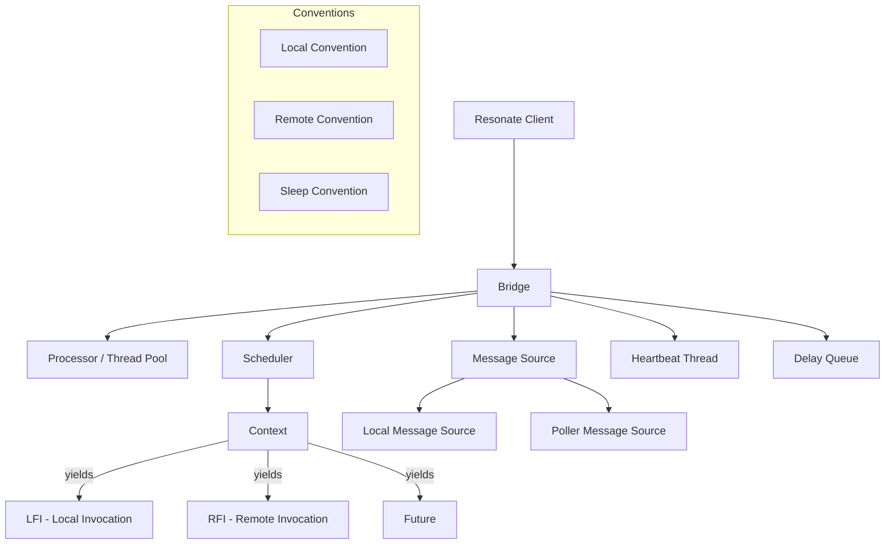
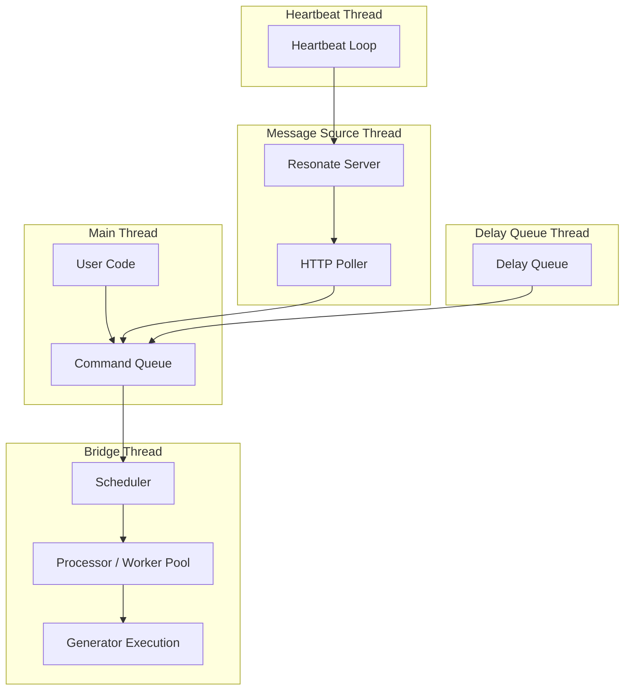
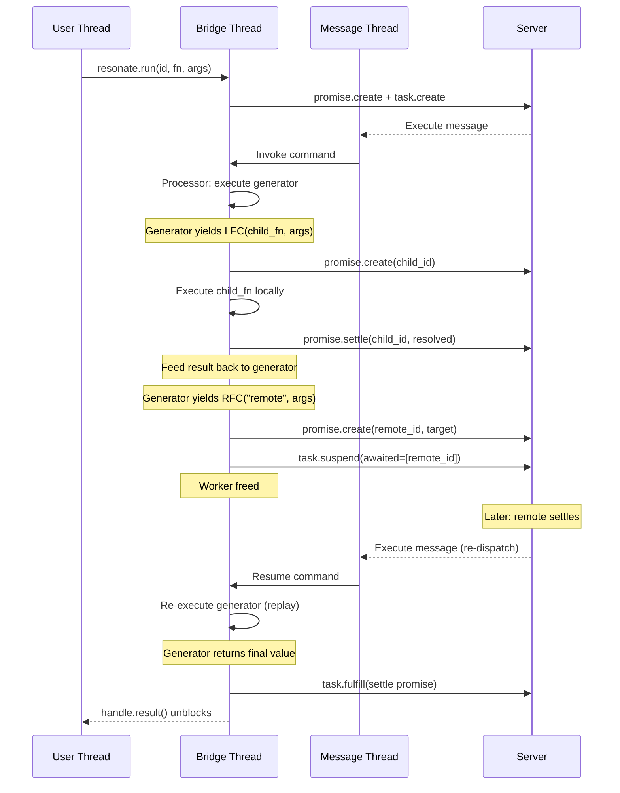

# Resonate -- Python SDK

## Overview

The Python SDK (`resonate`) uses generator functions with a multi-threaded bridge architecture. Durable operations are expressed as `yield` statements that pause execution, while a background bridge coordinates task acquisition, message delivery, and heartbeat management.

**Package:** `resonate` (PyPI)
**Source:** `resonate-sdk-py/resonate/`
**Runtime:** Python 3.12+
**Key files:** `bridge.py`, `coroutine.py`, `graph.py`, `conventions/`, `message_sources/`

## Core Abstractions



### Resonate (Entry Point)

```python
from resonate import Resonate

resonate = Resonate(url="http://localhost:8001")

@resonate.function
def process_order(ctx, order):
    payment = yield ctx.lfc(charge_card, order["payment"])
    shipment = yield ctx.lfc(ship_items, order["items"])
    return {"payment": payment, "shipment": shipment}

@resonate.function
def charge_card(ctx, payment_info):
    # Pure computation — no ctx.lfc/lfi needed
    return {"charged": True, "amount": payment_info["amount"]}

# Invoke (ephemeral world)
handle = resonate.run("order.123", process_order, order_data)
result = handle.result()  # Blocks until complete
```

## Coroutine Types

The SDK defines dataclass-based yieldable types:

| Type | Class | Description |
|------|-------|-------------|
| `LFI[T]` | Local Function Invocation | Run locally, return Future handle |
| `LFC[T]` | Local Function Completion | Run locally, return value directly |
| `RFI[T]` | Remote Function Invocation | Create remote promise, return Future |
| `RFC[T]` | Remote Function Completion | Create remote promise, return value |

```python
@resonate.function
def workflow(ctx, data):
    # LFC: blocks until child completes, returns value
    result = yield ctx.lfc(compute, data)
    
    # LFI: starts child, returns Future immediately
    future = yield ctx.lfi(long_task, data)
    # ... do other work ...
    value = yield future  # await the future
    
    # RFC: remote call, blocks until remote worker completes
    remote_result = yield ctx.rfc("remote_fn", data, target="other-workers")
    
    # RFI: remote call, returns Future immediately
    remote_future = yield ctx.rfi("remote_fn", data)
    remote_value = yield remote_future
    
    return {"result": result, "remote": remote_result}
```

### Options Builder

All coroutine types support fluent configuration:

```python
yield ctx.lfc(task, data).options(
    id="custom-child-id",
    timeout=300_000,  # 5 minutes
    retry_policy=RetryPolicy(max_attempts=3, base_delay=1000),
    tags={"priority": "high"},
)
```

## The Bridge Architecture

The Bridge is the central coordinator — a multi-threaded component that manages all I/O:



### Bridge Components

| Component | Thread | Purpose |
|-----------|--------|---------|
| Command Queue | Shared | Thread-safe queue for inter-component messages |
| Scheduler | Bridge | Creates contexts, tracks promise state, handles resumption |
| Processor | Bridge (pool) | Executes functions with configurable parallelism |
| Message Source | Dedicated | Receives execute/unblock messages from server |
| Heartbeat | Dedicated | Sends periodic keep-alives to maintain task lease |
| Delay Queue | Dedicated | Manages retry delays with exponential backoff |

### Thread Communication

```python
# Command types flowing through the queue
class Invoke:     task_id, version, function, args
class Resume:     task_id, version, resolved_promises
class Heartbeat:  task_id, version
class Retry:      task_id, delay_ms
class Complete:   task_id, result
class Error:      task_id, error
```

## Execution Model



## Conventions (ID Generation)

Conventions define how child promise IDs are generated:

```python
# Local convention
class LocalConvention:
    def id(self, parent_id: str, index: int) -> str:
        return f"{parent_id}.{index}"
    
    def timeout(self, parent_timeout: int) -> int:
        return parent_timeout  # inherit
    
    def idempotency_key(self, id: str) -> str:
        return id  # ID is the key

# Remote convention
class RemoteConvention:
    def id(self, parent_id: str, func_name: str, index: int) -> str:
        return f"{parent_id}.{index}"
    
    def target(self) -> Optional[str]:
        return self._target  # worker group routing

# Sleep convention
class SleepConvention:
    def id(self, parent_id: str, index: int) -> str:
        return f"{parent_id}.{index}"
    
    def timeout(self, duration_ms: int) -> int:
        return duration_ms  # sleep duration as timeout
```

Conventions are pluggable — you can override ID generation for custom sharding or namespacing.

## Message Sources

| Source | Mode | Description |
|--------|------|-------------|
| `LocalMessageSource` | In-memory | For testing, single-process execution |
| `PollerMessageSource` | HTTP | Polls server for execute/unblock messages |

```python
# Poller message source (production)
class PollerMessageSource:
    def __init__(self, url: str, group: str, worker_id: str):
        self.url = f"{url}/poll/{group}/{worker_id}"
    
    def poll(self) -> List[Message]:
        # Long-poll for messages
        response = requests.get(self.url, timeout=30)
        return parse_messages(response.json())
```

## Execution Graph

`graph.py` provides a DAG structure for tracking execution traces:

```python
from resonate.graph import Graph, Node

# Each execution builds a graph
graph = Graph(root_id="order.123")
graph.add_node("order.123.0", label="charge_card", state="resolved")
graph.add_node("order.123.1", label="ship_items", state="pending")
graph.add_edge("order.123", "order.123.0", edge_type="default")
graph.add_edge("order.123", "order.123.1", edge_type="default")

# Traverse for debugging
for node in graph.level_order():
    print(f"{node.id}: {node.state}")
```

## Encoders

The Python SDK provides pluggable encoding:

| Encoder | Description |
|---------|-------------|
| `JsonEncoder` | Standard JSON serialization |
| `JsonPickleEncoder` | Python object serialization (classes, exceptions) |
| `Base64Encoder` | Binary data encoding |
| `CombinedEncoder` | Header-based routing to sub-encoders |
| `NoopEncoder` | Pass-through (raw bytes) |

```python
from resonate.encoders import CombinedEncoder, JsonEncoder, JsonPickleEncoder

resonate = Resonate(
    url="http://localhost:8001",
    encoder=CombinedEncoder(
        default=JsonEncoder(),
        encoders={"application/x-jsonpickle": JsonPickleEncoder()},
    ),
)
```

## Error Handling

```python
from resonate.errors import ResonateError, TimeoutError, CancelledError

@resonate.function
def safe_workflow(ctx, data):
    try:
        result = yield ctx.lfc(risky_operation, data)
    except TimeoutError:
        # Child timed out — run compensation
        yield ctx.lfc(compensate, data)
        return {"status": "compensated"}
    except ResonateError as e:
        # Generic failure — log and re-raise
        raise
    
    return result
```

## Loggers

| Logger | Purpose |
|--------|---------|
| `ContextLogger` | Logs with execution context (task_id, promise_id) |
| `DSTLogger` | Deterministic Simulation Testing logger |

## Comparison with TS/Rust SDKs

| Aspect | Python | TypeScript | Rust |
|--------|--------|-----------|------|
| Async model | OS threads + generators | Event loop + generators | tokio + async/await |
| Function syntax | `yield ctx.lfc(fn, args)` | `yield* context.run(fn, args)` | `ctx.run(fn, args).await?` |
| Parallelism | Thread pool (workers param) | Single-threaded (async) | tokio tasks |
| Decorator | `@resonate.function` | None (register call) | `#[resonate_sdk::function]` |
| Message delivery | Polling (HTTP) | SSE (EventSource) | SSE or polling |
| State machine | Bridge + Scheduler | Core + Computation | Core |
| Error propagation | Exception raising | Generator throw | Result<T> |

## Source Paths

| File | Purpose |
|------|---------|
| `resonate/__init__.py` | Entry point, Resonate class, decorator |
| `resonate/bridge.py` | Multi-threaded coordinator |
| `resonate/coroutine.py` | Yieldable types (LFI, LFC, RFI, RFC, Future) |
| `resonate/graph.py` | Execution trace DAG |
| `resonate/delay_q.py` | Retry delay queue |
| `resonate/dependencies.py` | Dependency injection container |
| `resonate/conventions/base.py` | Convention base class |
| `resonate/conventions/local.py` | Local invocation ID generation |
| `resonate/conventions/remote.py` | Remote invocation ID generation |
| `resonate/conventions/sleep.py` | Durable sleep convention |
| `resonate/message_sources/local.py` | In-memory message source |
| `resonate/message_sources/poller.py` | HTTP polling message source |
| `resonate/encoders/` | Serialization plugins |
| `resonate/errors/` | Error types |
| `resonate/loggers/` | Structured logging |
