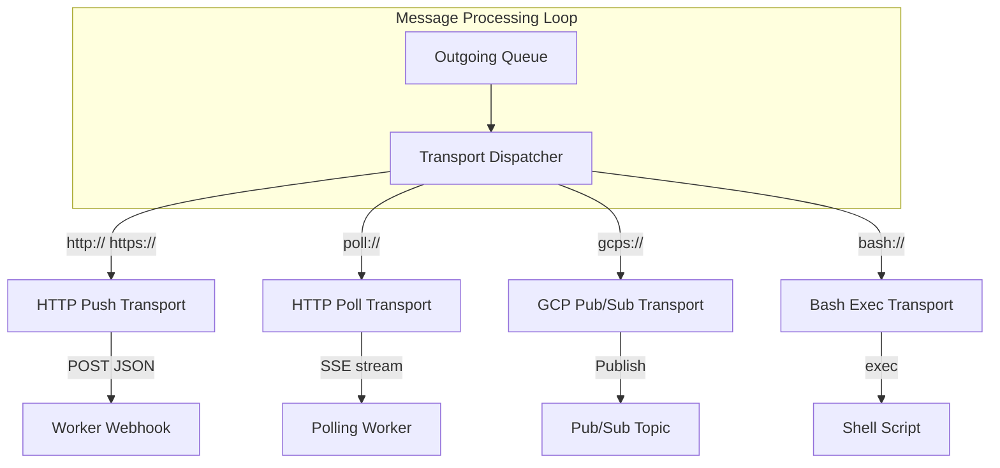
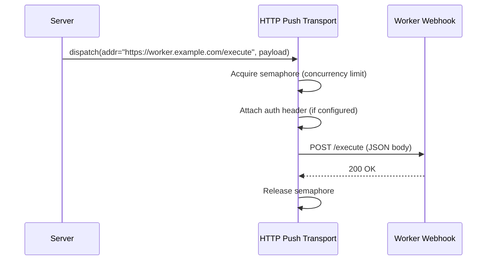
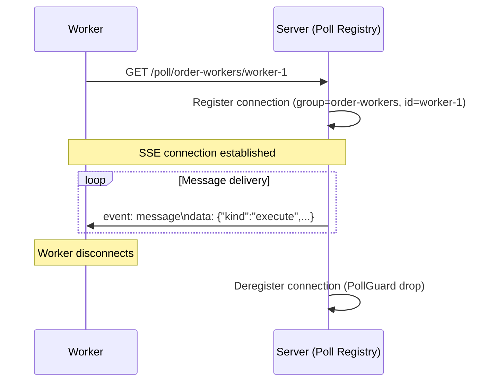

# Resonate -- Transport System

## Overview

The transport system delivers messages from the server to workers. When a task needs execution (new invocation or resumed after suspension), the server inserts a message into the outgoing queue. The message processing loop claims these messages and dispatches them via the appropriate transport based on the destination address scheme.

## Transport Architecture



## Address Schemes

Every promise/task has an associated address that determines delivery. The address is set when the task is created (from the `resonate:target` tag or explicit listener registration).

| Scheme | Format | Example |
|--------|--------|---------|
| HTTP Push | `http[s]://host/path` | `https://api.myservice.com/resonate/execute` |
| HTTP Poll | `poll://cast@group[/id]` | `poll://any@order-workers/worker-1` |
| GCP Pub/Sub | `gcps://project/topic` | `gcps://my-project/resonate-tasks` |
| Bash Exec | `bash://[path]` | `bash:///scripts/handler.sh` |

### Poll Address Components

```
poll://cast@group/id
       │     │     │
       │     │     └── Worker ID (optional, for unicast)
       │     └── Worker group name
       └── Cast type: "uni" (one worker) or "any" (round-robin)
```

## Transport Dispatcher

`src/transport/mod.rs` implements the routing logic:

```rust
pub struct TransportDispatcher {
    http: Option<Arc<dyn HttpTransport>>,
    poll: Option<Arc<dyn PollTransport>>,
    gcps: Option<Arc<dyn GcpsTransport>>,
    bash: Option<Arc<dyn BashTransport>>,
}

impl TransportDispatcher {
    pub async fn dispatch(&self, address: &str, payload: &Value) {
        match parse_address(address) {
            Address::Http(addr) => {
                if let Some(t) = &self.http { t.send(&addr, payload).await; }
            }
            Address::Poll(addr) => {
                if let Some(t) = &self.poll { t.send(&addr, payload).await; }
            }
            Address::Gcps(addr) => {
                if let Some(t) = &self.gcps { t.send(&addr, payload).await; }
            }
            Address::Bash(addr) => {
                if let Some(t) = &self.bash { t.send(&addr, payload).await; }
            }
        }
    }
}
```

If a transport is disabled (not configured), messages to that scheme are logged as warnings and dropped.

## Message Types

### Execute Message

Sent when a task needs execution (new or resumed):

```json
{
  "kind": "execute",
  "data": {
    "task": {
      "id": "order.123",
      "version": 2
    }
  }
}
```

### Unblock Message

Sent to registered listeners when a promise settles:

```json
{
  "kind": "unblock",
  "data": {
    "promise": {
      "id": "order.123",
      "state": "resolved",
      "value": {"headers": {}, "data": "eyJyZXN1bHQiOiJvayJ9"},
      "tags": {},
      "createdAt": 1714400000000,
      "settledAt": 1714400060000
    }
  }
}
```

## HTTP Push Transport

**Purpose:** Deliver messages via HTTP POST to webhook URLs.



### Configuration

```toml
[transports.http_push]
enabled = true
concurrency = 16          # Max concurrent outbound requests
connect_timeout = "10s"   # TCP connection timeout
request_timeout = "3m"    # Full request timeout (including body)
```

### Outbound Authentication

The server can attach auth headers to outbound webhook deliveries:

| Mode | Header Value | Use Case |
|------|-------------|----------|
| `none` | *(no header)* | Open endpoints |
| `bearer` | `Authorization: Bearer <static-token>` | Simple shared secret |
| `gcp` | `Authorization: Bearer <OIDC-token>` | Cloud Run / Cloud Functions |

```toml
[transports.http_push.auth]
mode = "gcp"
# audience defaults to delivery URL; override:
# audience = "https://my-function.example.com"
# header = "X-Custom-Auth"  # override header name
```

GCP mode obtains OIDC tokens via Application Default Credentials. Tokens are cached and auto-refreshed.

### Delivery Semantics

- Fire-and-forget: no retry logic in the transport itself
- Failed deliveries are logged but not re-queued
- The server's retry mechanism (task lease timeout) handles redelivery: if a worker doesn't acquire the task within the lease period, the task returns to pending

## HTTP Poll Transport (SSE)

**Purpose:** Workers maintain persistent SSE connections. Server pushes messages down the connection.



### Configuration

```toml
[transports.http_poll]
enabled = true
max_connections = 1000    # Maximum concurrent SSE connections
buffer_size = 100         # Per-connection message buffer
```

### Poll Registry

```rust
pub struct PollRegistry {
    connections: DashMap<String, Vec<PollConnection>>,  // group → connections
}

pub struct PollConnection {
    conn_id: String,
    group: String,
    cast: CastType,  // Uni or Any
    id: Option<String>,
    tx: mpsc::Sender<Value>,  // Channel to SSE stream
}
```

### Cast Types

| Cast | Behavior |
|------|----------|
| `any` | Round-robin across all connections in the group |
| `uni` | Deliver to specific worker by ID |

### Connection Lifecycle

1. Worker opens `GET /poll/:group/:id`
2. Server creates `PollConnection` with MPSC channel
3. Axum handler converts channel receiver to SSE stream
4. On disconnect, `PollGuard` (Drop impl) removes connection from registry
5. Messages in-flight at disconnect are lost (task lease handles retry)

## GCP Pub/Sub Transport

**Purpose:** Publish messages to Google Cloud Pub/Sub topics for serverless workers.

```toml
[transports.gcps]
enabled = true
project = "my-gcp-project"
```

### Implementation

```rust
pub struct GcpsTransport {
    hub: Lazy<PubsubHub>,  // Lazily initialized on first use
}

impl GcpsTransport {
    async fn send(&self, addr: &GcpsAddress, payload: &Value) {
        let topic = format!("projects/{}/topics/{}", addr.project, addr.topic);
        let message = PubsubMessage {
            data: serde_json::to_vec(payload)?,
            ..Default::default()
        };
        self.hub.publish(&topic, vec![message]).await?;
    }
}
```

Authentication uses Application Default Credentials (ADC) — automatic on GCP, via service account JSON elsewhere.

### Use Case: Serverless Workers

```
resonate invoke order.123 --func process_order \
    --address "gcps://my-project/order-tasks"
```

A Cloud Function subscribes to the `order-tasks` topic, acquires the task, executes, and settles.

## Bash Exec Transport

**Purpose:** Execute shell scripts with promise/task data for simple automation.

### Address Formats

| Address | Behavior |
|---------|----------|
| `bash://` | Inline execution (script from payload) |
| `bash:///relative/path.sh` | Named script (relative to `root_dir`) |

### Configuration

```toml
[transports.bash]
enabled = true
root_dir = "/opt/resonate/scripts"
working_dir = "<root>"   # <root> | <script> | /absolute/path
```

### Script Environment

| Variable | Value |
|----------|-------|
| `PROMISE_ID` | The promise ID |
| `TASK_ID` | The task ID |
| `PAYLOAD` | JSON-encoded message |

```bash
#!/bin/bash
# /opt/resonate/scripts/notify.sh
echo "Processing promise: $PROMISE_ID"
RESULT=$(echo "$PAYLOAD" | jq -r '.data.promise.value.data' | base64 -d)
curl -X POST "https://slack.webhook/..." -d "{\"text\": \"$RESULT\"}"
```

### Execution Model

- Script receives JSON on stdin (full promise record + message)
- Environment variables provide quick access to key fields
- stdout/stderr are logged by the server
- No timeout enforcement (inherits from process)

## Message Processing Loop

`src/processing/processing_messages.rs` drives delivery:

```rust
pub async fn processing_messages(server: Arc<Server>) {
    loop {
        if server.debug_mode.load(Ordering::Relaxed) {
            sleep(Duration::from_millis(100)).await;
            continue;
        }

        // Claim batch from outgoing tables
        let (executes, unblocks) = server.storage.take_outgoing(
            server.config.messages.batch_size
        ).await?;

        // Dispatch execute messages
        for (id, version, address) in executes {
            let payload = json!({
                "kind": "execute",
                "data": {"task": {"id": id, "version": version}}
            });
            server.transports.dispatch(&address, &payload).await;
            MESSAGES_TOTAL.with_label_values(&["execute"]).inc();
        }

        // Dispatch unblock messages
        for (address, promise) in unblocks {
            let payload = json!({
                "kind": "unblock",
                "data": {"promise": promise}
            });
            server.transports.dispatch(&address, &payload).await;
            MESSAGES_TOTAL.with_label_values(&["unblock"]).inc();
        }

        sleep(server.config.messages.poll_interval).await;
    }
}
```

### Outgoing Tables

```sql
-- Execute messages (task dispatches)
CREATE TABLE outgoing_execute (
    id TEXT NOT NULL,
    version INTEGER NOT NULL,
    address TEXT NOT NULL,
    PRIMARY KEY (id)
);

-- Unblock messages (listener notifications)
CREATE TABLE outgoing_unblock (
    promise_id TEXT NOT NULL,
    address TEXT NOT NULL,
    PRIMARY KEY (promise_id, address)
);
```

Messages are inserted during settlement chains and claimed/deleted by the processing loop.

## Source Paths

| File | Purpose |
|------|---------|
| `src/transport/mod.rs` | Dispatcher, address parsing, traits |
| `src/transport/transport_http_push.rs` | Webhook delivery with auth |
| `src/transport/transport_http_poll.rs` | SSE connections, PollRegistry |
| `src/transport/transport_gcps.rs` | GCP Pub/Sub publishing |
| `src/transport/transport_exec_bash.rs` | Shell script execution |
| `src/processing/processing_messages.rs` | Message delivery loop |
