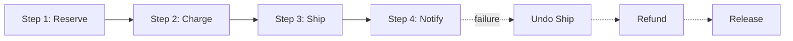
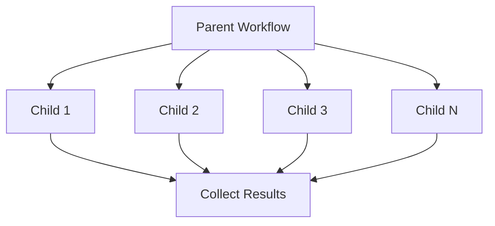
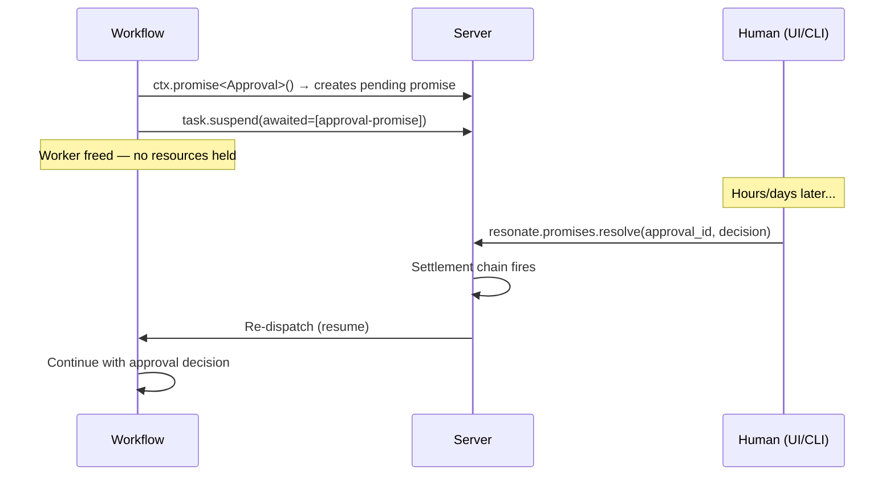
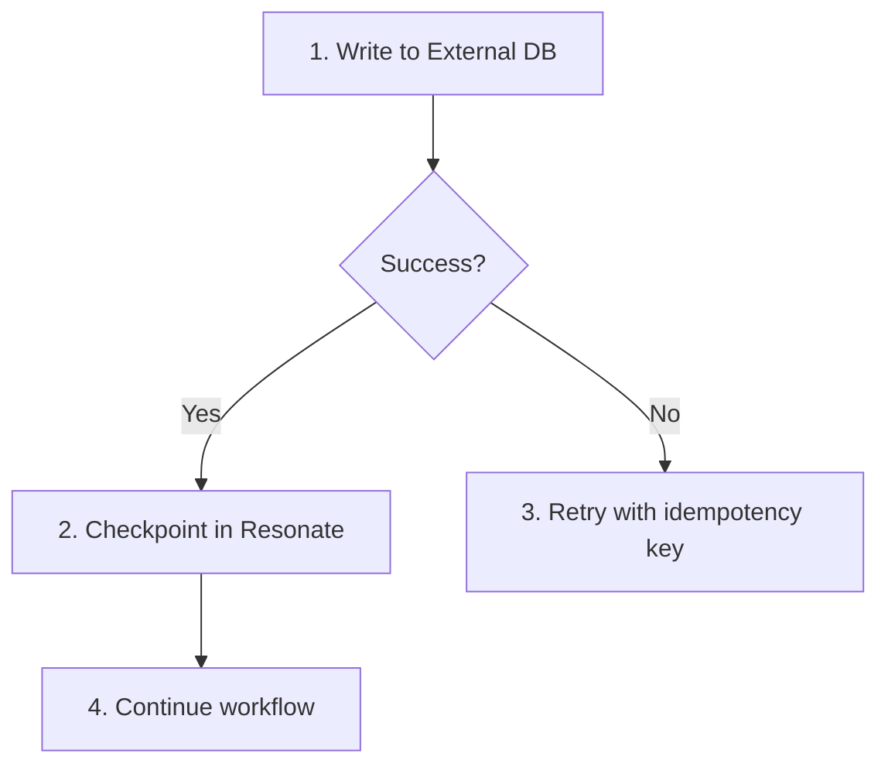
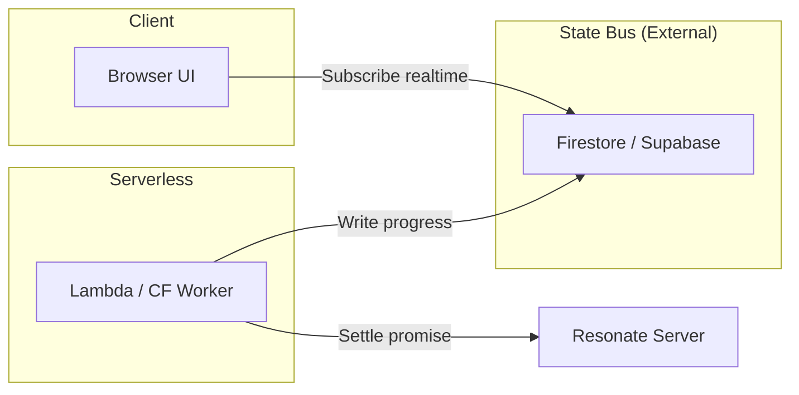

# Resonate -- Design Patterns

## Overview

Resonate enables several distributed systems patterns that are traditionally complex to implement. Each pattern emerges naturally from the durable promise primitive — no special frameworks or additional infrastructure needed.

## Pattern 1: Saga (Compensating Transactions)

Multi-step workflows with automatic rollback on failure. Forward steps execute top-to-bottom; on failure, compensating actions run bottom-to-top.



### Implementation (Rust)

```rust
#[resonate_sdk::function]
async fn order_saga(ctx: &Context, order: Order) -> Result<Receipt> {
    // Step 1: Reserve inventory
    let reservation = ctx.run(reserve_inventory, order.items.clone()).await?;
    
    // Step 2: Charge payment
    let charge = match ctx.run(charge_card, order.payment.clone()).await {
        Ok(c) => c,
        Err(e) => {
            // Compensate: release inventory
            ctx.run(release_inventory, reservation.id).await?;
            return Err(e);
        }
    };
    
    // Step 3: Create shipment
    let shipment = match ctx.run(create_shipment, order.address.clone()).await {
        Ok(s) => s,
        Err(e) => {
            // Compensate in reverse order
            ctx.run(refund_charge, charge.id).await?;
            ctx.run(release_inventory, reservation.id).await?;
            return Err(e);
        }
    };
    
    Ok(Receipt { reservation, charge, shipment })
}
```

### Implementation (TypeScript)

```typescript
function* orderSaga(ctx: Context, order: Order): Generator<any, Receipt, any> {
    const compensations: Array<() => Generator> = [];
    
    try {
        const reservation = yield* ctx.run(reserveInventory, order.items);
        compensations.push(() => ctx.run(releaseInventory, reservation.id));
        
        const charge = yield* ctx.run(chargeCard, order.payment);
        compensations.push(() => ctx.run(refundCharge, charge.id));
        
        const shipment = yield* ctx.run(createShipment, order.address);
        
        return { reservation, charge, shipment };
    } catch (error) {
        // Run compensations in reverse
        for (const compensate of compensations.reverse()) {
            yield* compensate();
        }
        throw error;
    }
}
```

### Key Properties

- Each step is individually durable (crash-safe)
- Compensations are also durable (won't be lost on crash)
- Partial failure is handled: only completed steps need compensation
- Compensations run in reverse order (LIFO)

## Pattern 2: Recursive Fan-Out (Parallel Execution)

Spawn N sub-workflows in parallel, collect results. Each child is independently durable.



### Implementation (Rust)

```rust
#[resonate_sdk::function]
async fn batch_process(ctx: &Context, items: Vec<Item>) -> Result<Vec<Output>> {
    // Spawn all tasks in parallel
    let handles: Vec<_> = items.iter().enumerate().map(|(i, item)| {
        ctx.run(process_item, item.clone()).spawn()
    }).collect();
    
    // Await handles — spawn() returns Future<Handle>
    let mut handles_awaited = vec![];
    for h in handles {
        handles_awaited.push(h.await?);
    }
    
    // Collect results
    let mut results = vec![];
    for handle in handles_awaited {
        results.push(handle.await?);
    }
    
    Ok(results)
}

// Bounded concurrency variant
#[resonate_sdk::function]
async fn bounded_fanout(ctx: &Context, items: Vec<Item>) -> Result<Vec<Output>> {
    let mut results = vec![];
    
    for chunk in items.chunks(10) {
        let handles: Vec<_> = chunk.iter().map(|item| {
            ctx.run(process_item, item.clone()).spawn()
        }).collect();
        
        let mut awaited = vec![];
        for h in handles { awaited.push(h.await?); }
        for h in awaited { results.push(h.await?); }
    }
    
    Ok(results)
}
```

### Recovery Semantics

If the process crashes after children 1 and 2 complete but before child 3:
- On resume, children 1 and 2 replay from stored results (no re-execution)
- Only child 3 re-executes
- Parent continues from where it left off

## Pattern 3: Human-in-the-Loop (External Resolution)

Workflows that pause indefinitely until a human (or external system) provides input.



### Implementation (Rust)

```rust
#[resonate_sdk::function]
async fn approval_workflow(ctx: &Context, request: ApprovalRequest) -> Result<Outcome> {
    // Prepare the request
    let prepared = ctx.run(prepare_request, request.clone()).await?;
    
    // Create a promise that will be resolved externally
    let approval: Approval = ctx.rpc::<Approval>("await_approval", prepared.id.clone())
        .timeout(Duration::from_secs(7 * 24 * 3600)) // 7-day timeout
        .await?;
    
    // Continue based on human decision
    match approval.decision {
        Decision::Approved => ctx.run(execute_approved, prepared).await,
        Decision::Rejected => ctx.run(handle_rejection, prepared).await,
    }
}

// External resolution (from webhook handler)
async fn handle_approval_webhook(resonate: &Resonate, body: ApprovalResponse) {
    resonate.promises.resolve(
        &body.promise_id,
        json!({"decision": body.decision}),
    ).await.unwrap();
}
```

### Key Properties

- No resources held while waiting (worker is freed)
- Timeout prevents indefinite suspension (7 days in example)
- Resolution can come from any source: webhook, CLI, UI, another workflow
- The workflow sees it as a normal async operation

## Pattern 4: External System of Record

When interacting with systems that have their own durability (databases, payment processors), write to that system first, then checkpoint in Resonate.



### Implementation

```rust
#[resonate_sdk::function]
async fn transfer_funds(ctx: &Context, transfer: Transfer) -> Result<TransferResult> {
    let pool = ctx.get_dependency::<DatabasePool>()?;
    
    // Use the promise ID as idempotency key for external system
    let idempotency_key = ctx.info().id();
    
    // Write to external database (the system of record)
    let result = sqlx::query("INSERT INTO transfers (id, from_acct, to_acct, amount) VALUES ($1, $2, $3, $4) ON CONFLICT (id) DO NOTHING RETURNING *")
        .bind(idempotency_key)
        .bind(&transfer.from)
        .bind(&transfer.to)
        .bind(transfer.amount)
        .fetch_one(pool)
        .await?;
    
    // Resonate checkpoints the result — on replay, this won't re-execute
    Ok(TransferResult { id: result.id, status: "completed" })
}
```

### Key Principles

1. The external system is the source of truth, not Resonate
2. Use idempotency keys to handle at-least-once delivery
3. Resonate checkpoints prevent re-execution of successful external calls
4. If the external call fails, Resonate retries naturally (task release + re-dispatch)

## Pattern 5: State Bus (Serverless Progress Reporting)

For serverless workers with short lifespans, decouple workflow progress from client connections.



### Implementation (TypeScript)

```typescript
function* longWorkflow(ctx: Context, jobId: string): Generator<any, Result, any> {
    const db = ctx.getDependency<Firestore>();
    
    // Step 1
    yield* ctx.run(step1, data);
    await db.doc(`jobs/${jobId}`).update({ progress: 25, step: "step1 complete" });
    
    // Step 2
    yield* ctx.run(step2, data);
    await db.doc(`jobs/${jobId}`).update({ progress: 50, step: "step2 complete" });
    
    // Step 3
    yield* ctx.run(step3, data);
    await db.doc(`jobs/${jobId}`).update({ progress: 75, step: "step3 complete" });
    
    // Final
    const result = yield* ctx.run(finalize, data);
    await db.doc(`jobs/${jobId}`).update({ progress: 100, step: "done", result });
    
    return result;
}
```

### Why This Pattern Exists

- Serverless functions terminate after execution (no persistent connection to client)
- Resonate server re-invokes the function on a new Lambda instance for each step
- The state bus (Firestore, Supabase Realtime) provides real-time progress to browsers
- Client subscribes to the state bus, not the worker

## Pattern 6: Durable Sleep / Scheduled Work

Long-lived timers that survive process restarts.

```rust
#[resonate_sdk::function]
async fn reminder_workflow(ctx: &Context, reminder: Reminder) -> Result<()> {
    // Sleep for the configured duration (could be hours, days, weeks)
    ctx.sleep(reminder.delay).await?;
    
    // After waking up, send the reminder
    ctx.run(send_notification, reminder.message).await?;
    Ok(())
}

// Cron-based scheduled work
let resonate = Resonate::new(config);
resonate.schedule(
    "daily-cleanup",
    "0 2 * * *",  // Every day at 2 AM
    cleanup_old_data,
    CleanupConfig { max_age_days: 30 },
).await?;
```

### How Durable Sleep Works

1. SDK creates a promise with `resonate:timer` tag and `timeout_at` = now + duration
2. Task suspends, awaiting the timer promise
3. Worker is freed (no resources held)
4. Background timeout loop fires when `timeout_at` expires
5. Timer promise settles as `resolved`
6. Settlement chain resumes the suspended task
7. Worker re-acquires and continues past the sleep

## Pattern 7: Retry with Exponential Backoff

Built into the SDK, not a separate pattern — but important to understand:

```typescript
resonate.register(callExternalApi, {
    retry: {
        maxAttempts: 5,
        baseDelay: 1000,      // 1s
        maxDelay: 60000,      // 60s cap
        backoffMultiplier: 2, // 1s, 2s, 4s, 8s, 16s (capped at 60s)
    }
});
```

### Server-Side vs SDK-Side Retry

| Aspect | Server-Side | SDK-Side |
|--------|------------|----------|
| Trigger | Worker crash / task timeout | Function returns error |
| Mechanism | Release task → retry timeout → re-dispatch | SDK catches error, waits, retries |
| Configuration | `tasks.lease_timeout`, `tasks.retry_timeout` | `retry` option on registration |
| Scope | Worker failure | Individual function failure |

## Combining Patterns

Real workflows combine multiple patterns:

```rust
#[resonate_sdk::function]
async fn complex_order(ctx: &Context, order: Order) -> Result<OrderResult> {
    // Fan-out: validate all items in parallel
    let validations = fan_out_validate(ctx, &order.items).await?;
    
    // Saga: charge + ship with compensation
    let receipt = match order_saga(ctx, &order).await {
        Ok(r) => r,
        Err(e) => {
            // Human-in-the-loop: escalate to support
            let resolution: Resolution = ctx.rpc("await_support", e.details())
                .timeout(Duration::from_secs(86400))
                .await?;
            handle_support_resolution(ctx, resolution).await?
        }
    };
    
    // Durable sleep: wait before follow-up
    ctx.sleep(Duration::from_secs(3600)).await?;
    
    // External system of record: update analytics
    ctx.run(update_analytics, receipt.clone()).await?;
    
    Ok(OrderResult { receipt, validations })
}
```

## Source Paths

| Pattern | Example Location |
|---------|-----------------|
| Saga | `resonate-skills/resonate-saga-pattern-rust/SKILL.md` |
| Fan-Out | `resonate-skills/resonate-recursive-fan-out-pattern-rust/SKILL.md` |
| Human-in-the-Loop | `resonate-skills/resonate-human-in-the-loop-pattern-rust/SKILL.md` |
| External SoR | `resonate-skills/resonate-external-system-of-record-pattern-rust/SKILL.md` |
| State Bus | `resonate-skills/resonate-state-bus-pattern-typescript/SKILL.md` |
| Durable Sleep | `resonate-skills/resonate-durable-sleep-scheduled-work-rust/SKILL.md` |
