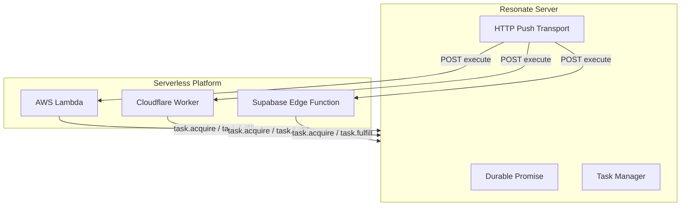
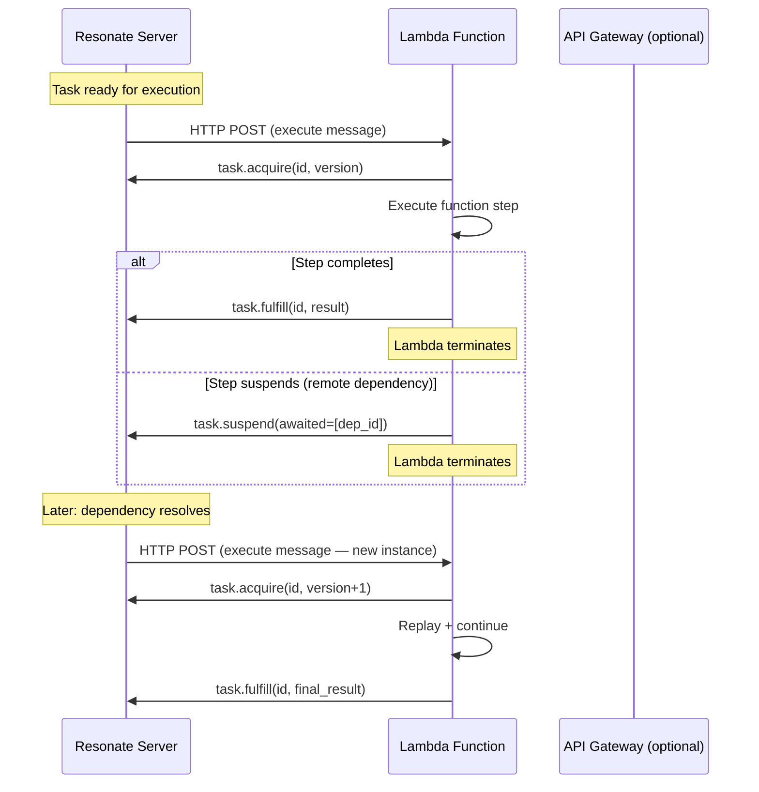

# Resonate -- FaaS & Serverless Integrations

## Overview

Resonate works naturally with serverless platforms because of its fundamental design: workers are stateless, execution state lives in the server, and suspension releases all local resources. A Lambda function or Cloudflare Worker executes one step, settles it, and terminates. When the next step is ready, the server invokes a new instance.



## Why Serverless Works with Resonate

Traditional serverless challenges and how Resonate solves them:

| Challenge | Traditional Approach | Resonate Approach |
|-----------|---------------------|-------------------|
| Long-running workflows | Step Functions / Temporal | Durable promises + suspension |
| State between invocations | DynamoDB / Redis | Server-managed promise state |
| Crash recovery | Build retry logic | Automatic (at-least-once) |
| Coordination across functions | SQS + DLQ + custom logic | Callbacks + settlement chains |
| Cold start impact | Warm pools, provisioned concurrency | Stateless workers, no warmup needed |

The key insight: **serverless functions are inherently stateless — and so are Resonate workers**. There's no tension to resolve.

## AWS Lambda Integration

**Package:** `@resonatehq/aws` (resonate-faas-aws-ts)

### Architecture



### Setup

```typescript
// lambda/handler.ts
import { Resonate, type Context } from "@resonatehq/sdk";
import { createHandler } from "@resonatehq/aws";

const resonate = new Resonate({
    url: process.env.RESONATE_URL,
    token: process.env.RESONATE_TOKEN,
});

function* processOrder(ctx: Context, order: Order): Generator<any, Receipt, any> {
    const payment = yield* ctx.run(chargeCard, order.payment);
    const shipment = yield* ctx.run(shipItems, order.items);
    return { payment, shipment };
}

resonate.register(processOrder);
resonate.register(chargeCard);
resonate.register(shipItems);

// Export Lambda handler
export const handler = createHandler(resonate);
```

### Server Configuration

Point the server's HTTP push transport at the Lambda function URL:

```toml
[transports.http_push]
enabled = true
request_timeout = "5m"  # Lambda max execution time

[transports.http_push.auth]
mode = "bearer"
token = "shared-secret-for-lambda"
```

Or use GCP-style auth for AWS:

```bash
resonate invoke order.123 --func processOrder \
    --address "https://abc123.lambda-url.us-east-1.on.aws/"
```

### Cold Start Mitigation

Resonate's lease timeout mechanism handles cold starts gracefully:
- If a Lambda takes too long to start, the lease expires
- Server re-dispatches to another instance
- No special configuration needed

## Cloudflare Workers Integration

**Package:** `resonate-faas-cloudflare-ts`

### Architecture

Cloudflare Workers have a 30-second CPU time limit (unbounded wall-clock with `waitUntil`). Resonate suspension ensures long workflows never hit the limit — each invocation does one step and terminates.

```typescript
// src/worker.ts
import { Resonate, type Context } from "@resonatehq/sdk";

const resonate = new Resonate({
    url: "https://resonate.myserver.com",
});

function* workflow(ctx: Context, data: Data): Generator<any, Result, any> {
    const step1 = yield* ctx.run(processStep1, data);
    const step2 = yield* ctx.run(processStep2, step1);
    return step2;
}

resonate.register(workflow);
resonate.register(processStep1);
resonate.register(processStep2);

export default {
    async fetch(request: Request): Promise<Response> {
        const body = await request.json();
        
        if (body.kind === "execute") {
            // Handle execute message from Resonate server
            const { task } = body.data;
            await resonate.core.onMessage(task.id, task.version);
            return new Response("ok");
        }
        
        return new Response("not found", { status: 404 });
    }
};
```

### Worker-to-Server Communication

```
Resonate Server (hosted on VPS/Cloud Run)
    │
    │ HTTP Push (execute messages)
    ▼
Cloudflare Worker (edge, 200+ locations)
    │
    │ HTTP requests (acquire, fulfill, suspend)
    ▼
Resonate Server
```

### Benefits for Cloudflare

| Benefit | How |
|---------|-----|
| No 30s timeout issues | Each step is short; suspension releases worker |
| Global edge execution | Workers run close to users |
| Zero cold start | Workers start in ~0ms |
| Pay-per-request | No idle costs |
| Built-in retries | Resonate handles via task lease timeout |

## Supabase Edge Functions Integration

**Package:** `resonate-faas-supabase-ts`

### Architecture

Supabase Edge Functions run on Deno Deploy. The integration pattern is identical to Lambda/Cloudflare:

```typescript
// supabase/functions/resonate-worker/index.ts
import { serve } from "https://deno.land/std/http/server.ts";
import { Resonate, type Context } from "@resonatehq/sdk";

const resonate = new Resonate({
    url: Deno.env.get("RESONATE_URL")!,
});

function* myWorkflow(ctx: Context, input: Input): Generator<any, Output, any> {
    const result = yield* ctx.run(compute, input);
    return result;
}

resonate.register(myWorkflow);
resonate.register(compute);

serve(async (req) => {
    const body = await req.json();
    if (body.kind === "execute") {
        await resonate.core.onMessage(body.data.task.id, body.data.task.version);
        return new Response("ok");
    }
    return new Response("not found", { status: 404 });
});
```

## Server Deployment for FaaS

When using FaaS, the Resonate server itself needs to be always-on (it pushes messages to functions). Common deployments:

### Google Cloud Run

```dockerfile
FROM rust:1.77 as builder
WORKDIR /app
COPY . .
RUN cargo build --release

FROM debian:bookworm-slim
COPY --from=builder /app/target/release/resonate /usr/local/bin/
ENV RESONATE_SERVER__PORT=8080
ENV RESONATE_STORAGE__TYPE=postgres
CMD ["resonate", "serve"]
```

With GCP auth for Cloud Functions:

```toml
[transports.http_push.auth]
mode = "gcp"
# Automatic: uses Cloud Run's service account to generate OIDC tokens
```

### VPS (Minimal)

```bash
# Single binary, SQLite, systemd
[Unit]
Description=Resonate Server
After=network.target

[Service]
ExecStart=/usr/local/bin/resonate serve
Environment=RESONATE_SERVER__URL=https://resonate.myserver.com
Environment=RESONATE_STORAGE__SQLITE__PATH=/var/lib/resonate/resonate.db
Restart=always

[Install]
WantedBy=multi-user.target
```

## FaaS vs Long-Running Workers

| Aspect | FaaS Workers | Long-Running Workers |
|--------|-------------|---------------------|
| Transport | HTTP Push (server → function) | HTTP Poll/SSE (worker → server) |
| Lifecycle | Create → execute → terminate | Start → poll → execute → poll → ... |
| Cost model | Pay per invocation | Pay for uptime |
| Scaling | Platform-managed (instant) | Manual or autoscaler |
| Best for | Bursty, event-driven | Steady-state, high-throughput |
| Cold start | Yes (mitigated by short steps) | No |
| Concurrency | Platform limit | Worker count × parallelism |

## Combining FaaS and Long-Running

You can mix both in the same deployment:

```
resonate invoke order.123 --func processOrder \
    --address "poll://any@order-workers"  # Long-running workers

resonate invoke notification.456 --func sendEmail \
    --address "https://abc.lambda-url.us-east-1.on.aws/"  # Lambda
```

The `resonate:target` tag in the promise determines routing. Different function registrations can use different transport addresses.

## Source Paths

| Integration | Path |
|-------------|------|
| AWS Lambda | `resonate-faas-aws-ts/` |
| Cloudflare Workers | `resonate-faas-cloudflare-ts/` |
| Supabase Edge Functions | `resonate-faas-supabase-ts/` |
| Server Cloud Run deployment | `resonate-skills/resonate-server-deployment-cloud-run/` |
| Server VPS deployment | `resonate-skills/resonate-server-deployment/SKILL.md` |
| GCP integration skill | `resonate-skills/resonate-gcp-deployments-typescript/SKILL.md` |
