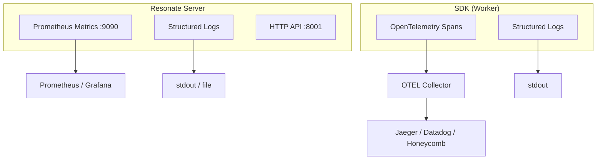
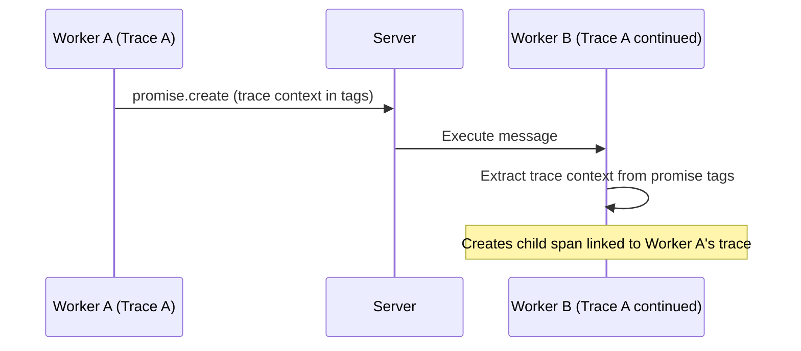

# Resonate -- Observability

## Overview

Resonate provides observability at three levels: server-side metrics (Prometheus), distributed tracing (OpenTelemetry), and structured logging (tracing crate). Together these give full visibility into workflow execution, task lifecycle, and transport delivery.

## Architecture



## Server Metrics (Prometheus)

The server exposes Prometheus metrics on a dedicated port (default: 9090).

### Available Metrics

| Metric | Type | Labels | Description |
|--------|------|--------|-------------|
| `resonate_request_total` | Counter | `kind`, `status` | Total API requests by operation and HTTP status |
| `resonate_request_duration_seconds` | Histogram | `kind` | Request latency distribution |
| `resonate_messages_total` | Counter | `kind` | Messages delivered (execute, unblock) |
| `resonate_deliveries_total` | Counter | `status` | Transport delivery outcomes (success/failure) |
| `resonate_schedule_promises_total` | Counter | — | Promises created by cron schedules |

### Metric Labels

**`kind`** values (operations):
- `promise.get`, `promise.create`, `promise.settle`
- `promise.register_callback`, `promise.register_listener`, `promise.search`
- `task.get`, `task.create`, `task.acquire`, `task.release`
- `task.fulfill`, `task.suspend`, `task.fence`, `task.heartbeat`
- `task.halt`, `task.continue`, `task.search`
- `schedule.get`, `schedule.create`, `schedule.delete`, `schedule.search`

**`status`** values: HTTP status codes (200, 201, 400, 401, 403, 404, 409, 500)

### Configuration

```toml
[observability]
metrics_port = 9090          # Prometheus scrape endpoint
# otlp_endpoint = "http://localhost:4317"  # Future: OTLP export
```

### Prometheus Scrape Config

```yaml
# prometheus.yml
scrape_configs:
  - job_name: 'resonate'
    static_configs:
      - targets: ['resonate-server:9090']
    scrape_interval: 15s
```

### Key Dashboards

**Request Rate & Latency:**
```promql
# Requests per second by operation
rate(resonate_request_total[5m])

# P99 latency by operation
histogram_quantile(0.99, rate(resonate_request_duration_seconds_bucket[5m]))

# Error rate
sum(rate(resonate_request_total{status=~"5.."}[5m])) /
sum(rate(resonate_request_total[5m]))
```

**Task Lifecycle:**
```promql
# Task acquisition rate
rate(resonate_request_total{kind="task.acquire"}[5m])

# Suspension rate (indicates remote dependencies)
rate(resonate_request_total{kind="task.suspend"}[5m])

# Fulfillment rate (completed work)
rate(resonate_request_total{kind="task.fulfill"}[5m])
```

**Transport Health:**
```promql
# Message delivery rate
rate(resonate_messages_total[5m])

# Delivery failures
rate(resonate_deliveries_total{status="failure"}[5m])
```

## OpenTelemetry Integration (SDK)

**Package:** `@resonatehq/opentelemetry` (TypeScript)

### Setup

```typescript
import { Resonate, type Context } from "@resonatehq/sdk";
import { OpenTelemetryTracer } from "@resonatehq/opentelemetry";
import { NodeTracerProvider } from "@opentelemetry/sdk-trace-node";
import { OTLPTraceExporter } from "@opentelemetry/exporter-trace-otlp-http";

// Configure OTEL provider
const provider = new NodeTracerProvider();
provider.addSpanProcessor(
    new BatchSpanProcessor(new OTLPTraceExporter({
        url: "http://localhost:4318/v1/traces",
    }))
);
provider.register();

// Wire into Resonate
const resonate = new Resonate({
    url: "http://localhost:8001",
    tracer: new OpenTelemetryTracer(),
});
```

### Span Structure

Each durable operation creates a span:

```
[Span: processOrder (root)]
├── [Span: chargeCard (ctx.run)]
│   └── [Span: HTTP POST /payments (internal)]
├── [Span: shipItems (ctx.run)]
│   ├── [Span: checkInventory (ctx.run)]
│   └── [Span: createShipment (ctx.run)]
└── [Span: sendConfirmation (ctx.run)]
```

### Distributed Trace Context

When a workflow spans multiple workers (via `ctx.rpc()`), trace context propagates through the durable promise:



The SDK stores W3C trace context (`traceparent`, `tracestate`) in promise tags, enabling cross-worker trace correlation.

## Structured Logging (Server)

The server uses the `tracing` crate with `tracing-subscriber`:

### Log Levels

| Level | Content |
|-------|---------|
| ERROR | Unrecoverable failures (DB connection lost, invalid config) |
| WARN | Degraded conditions (transport disabled, delivery failed) |
| INFO | Startup, shutdown, configuration summary |
| DEBUG | Individual operations, state transitions |
| TRACE | Wire-level protocol details |

### Configuration

```bash
# Via environment variable
RUST_LOG=resonate=info,tower_http=debug

# Structured JSON output (for log aggregation)
RESONATE_LOG_FORMAT=json
```

### Example Log Output

```
2026-04-02T05:05:32.480Z INFO  resonate: Server listening on 0.0.0.0:8001
2026-04-02T05:05:32.481Z INFO  resonate: Using SQLite backend: resonate.db
2026-04-02T05:05:32.492Z INFO  resonate: Metrics server listening on 0.0.0.0:9090
2026-04-02T05:05:33.100Z DEBUG resonate: promise.create id="order.123" timeout=86400000
2026-04-02T05:05:33.105Z DEBUG resonate: task.create id="order.123" address="poll://any@workers"
2026-04-02T05:05:33.110Z DEBUG resonate: outgoing execute id="order.123" version=1
```

## Monitoring Patterns

### Workflow Health Dashboard

Key signals to monitor:

| Signal | Healthy | Degraded | Critical |
|--------|---------|----------|----------|
| Task acquire rate | Stable | Dropping | Zero |
| Task fulfill rate | Matches acquire rate | Lagging | Zero |
| Suspension ratio | <20% of acquires | 20-50% | >50% (dependency bottleneck) |
| Error rate (5xx) | <0.1% | 0.1-1% | >1% |
| Delivery failures | 0 | Intermittent | Sustained |
| Promise timeout rate | <1% | 1-5% | >5% (work not completing) |

### Alerting Rules

```yaml
# Prometheus alerting rules
groups:
  - name: resonate
    rules:
      - alert: HighErrorRate
        expr: sum(rate(resonate_request_total{status=~"5.."}[5m])) / sum(rate(resonate_request_total[5m])) > 0.01
        for: 5m

      - alert: DeliveryFailures
        expr: rate(resonate_deliveries_total{status="failure"}[5m]) > 0
        for: 2m

      - alert: TaskStarvation
        expr: rate(resonate_request_total{kind="task.acquire"}[5m]) == 0
        for: 10m
        labels:
          severity: warning
```

## CLI Observability

The `resonate tree` command provides point-in-time workflow visibility:

```bash
$ resonate tree order.123
order.123 ✅ resolved (2.3s)
├── order.123.0 (charge_card) ✅ resolved (0.8s)
├── order.123.1 (ship_items) ✅ resolved (1.2s)
│   ├── order.123.1.0 (check_inventory) ✅ resolved (0.2s)
│   └── order.123.1.1 (create_shipment) ✅ resolved (0.9s)
└── order.123.2 (send_confirmation) ✅ resolved (0.3s)
```

```bash
$ resonate promises search --id "order.*" --state pending
ID                STATE    CREATED_AT           TIMEOUT_AT
order.456         pending  2026-04-02 10:30:00  2026-04-03 10:30:00
order.789         pending  2026-04-02 10:31:00  2026-04-03 10:31:00
order.789.1       pending  2026-04-02 10:31:05  2026-04-03 10:31:05
```

## Telemetry Package

**Source:** `resonate-telemetry/`

A Rust library for collecting and forwarding telemetry data from the server to external systems. Designed for future OTLP export of server-side spans.

## Source Paths

| Component | Path |
|-----------|------|
| Server metrics | `resonate/src/metrics.rs` |
| Server logging | Uses `tracing` crate throughout |
| OpenTelemetry SDK | `resonate-opentelemetry-ts/` |
| Telemetry library | `resonate-telemetry/` |
| Server deployment metrics | `resonate-skills/resonate-server-deployment/SKILL.md` |
