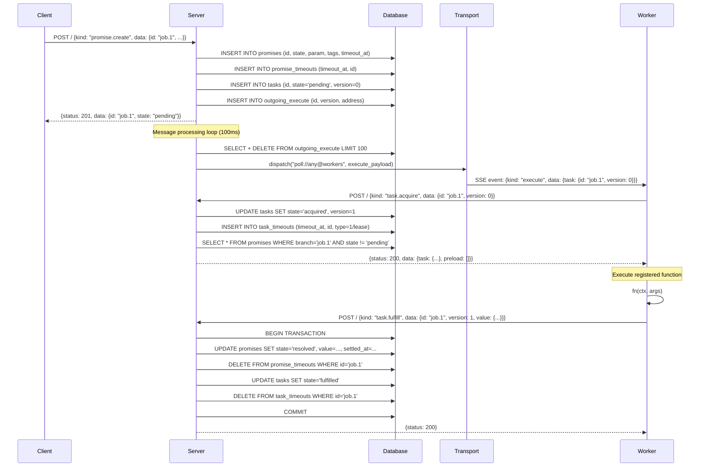
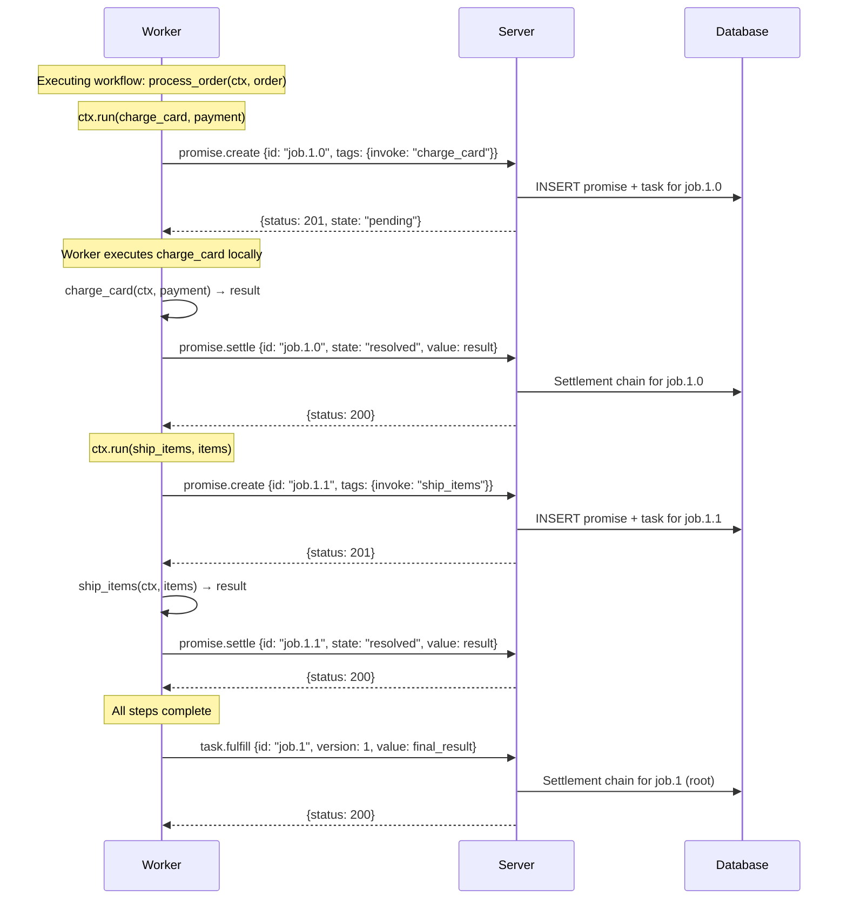
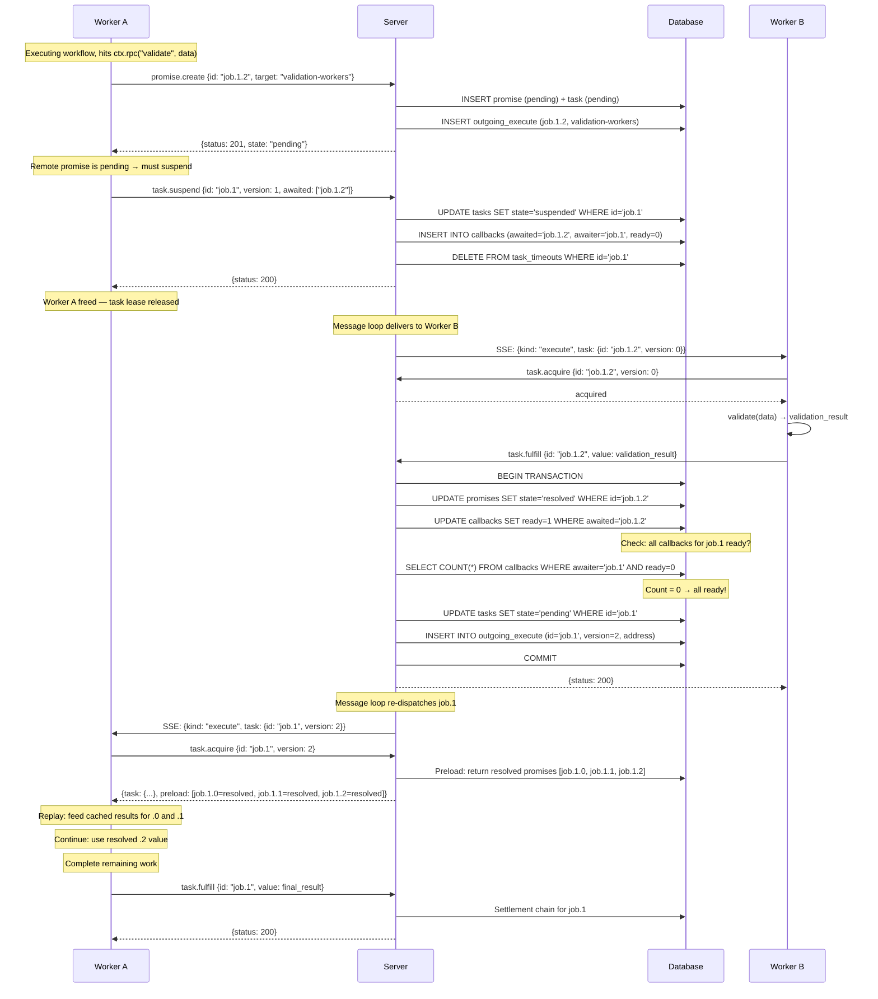
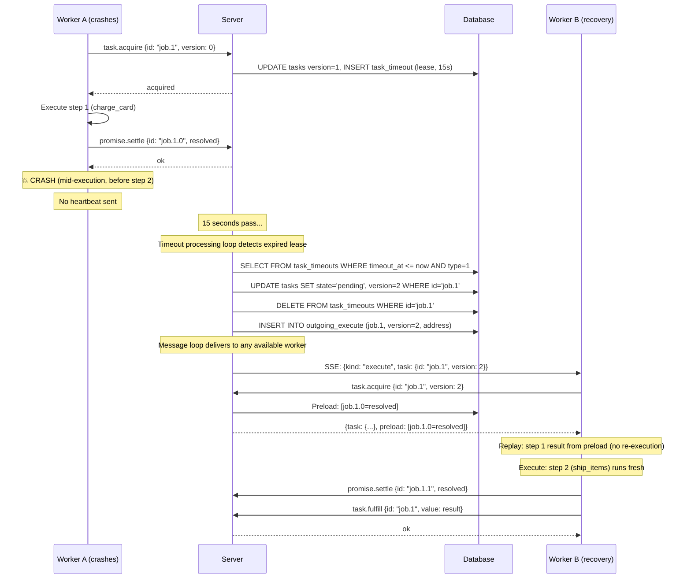
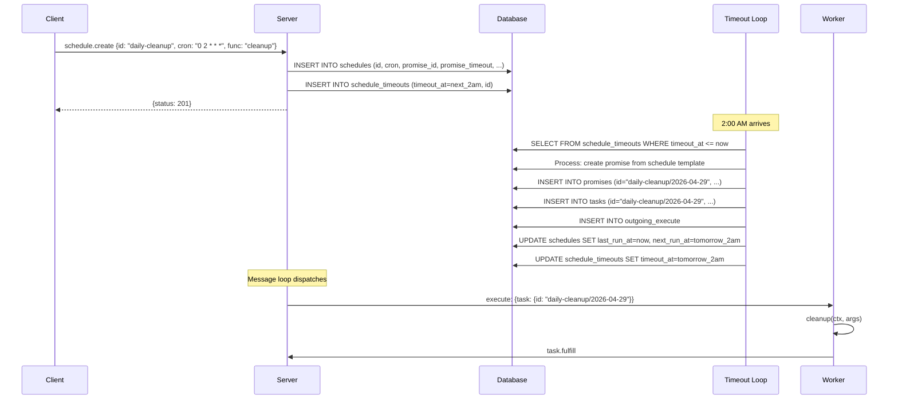
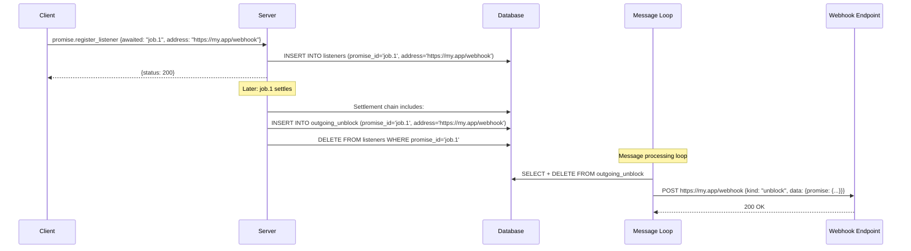
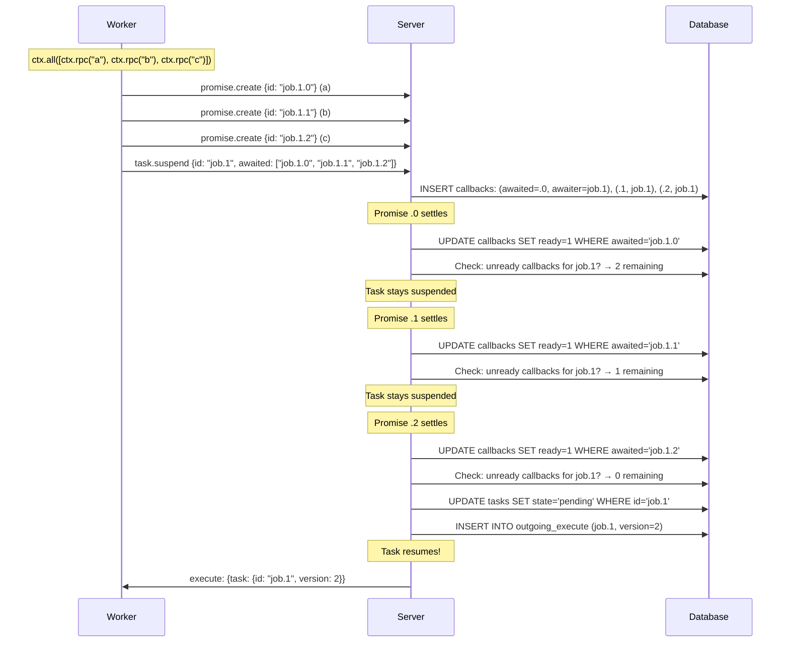

# Resonate -- Data Flow

## Overview

This document traces data through the system during the key operations: function invocation, suspension and resumption, settlement chains, and crash recovery. Each flow shows the exact sequence of protocol messages, database operations, and transport deliveries.

## Flow 1: Simple Invocation (No Suspension)

A client invokes a function that completes in a single execution pass.



## Flow 2: Invocation with Child Tasks

A workflow function creates child promises for sub-tasks.



## Flow 3: Suspension and Resumption

A workflow suspends when it encounters an unresolved remote dependency.



## Flow 4: Crash Recovery

A worker crashes mid-execution. The server's lease timeout triggers re-dispatch.



### Key Insight: No Double Execution

Step 1 (charge_card) was already settled before the crash. On recovery:
1. Worker B acquires with version=2
2. Server preloads all resolved promises in the branch
3. When Worker B replays step 1, the SDK returns the cached result from preload
4. Step 2 (ship_items) executes normally — it was never settled

## Flow 5: Scheduled Execution

A cron schedule creates promises on a recurring basis.



## Flow 6: Listener Notification

An external client registers a listener and receives a webhook when the promise settles.



## Flow 7: Multiple Awaited Promises (Multi-Callback)

A task suspends on multiple dependencies. It resumes only when ALL settle.



## Data Flow Summary

```
┌──────────────────────────────────────────────────────────────────┐
│                      HAPPY PATH                                    │
│                                                                    │
│  Client → promise.create → task.create → outgoing_execute         │
│       → transport dispatch → worker SSE                            │
│       → task.acquire (preload) → execute function                  │
│       → promise.settle (children) → task.fulfill                   │
│       → settlement chain → promise resolved                        │
│                                                                    │
├──────────────────────────────────────────────────────────────────┤
│                    SUSPENSION PATH                                 │
│                                                                    │
│  Worker → promise.create (remote) → task.suspend                   │
│       → callbacks registered → worker freed                        │
│       → remote settles → callbacks marked ready                    │
│       → all ready → task resumed → outgoing_execute                │
│       → worker acquires (preload) → replay + continue              │
│                                                                    │
├──────────────────────────────────────────────────────────────────┤
│                    RECOVERY PATH                                   │
│                                                                    │
│  Worker crashes → heartbeat stops → lease expires                  │
│       → timeout loop detects → task released (pending)             │
│       → outgoing_execute → new worker acquires (preload)           │
│       → replay completed steps from cache → continue               │
│                                                                    │
└──────────────────────────────────────────────────────────────────┘
```

## Source Paths

| Flow | Key Files |
|------|-----------|
| Request handling | `resonate/src/server.rs` |
| Settlement chain | `resonate/src/persistence/persistence_sqlite.rs` |
| Timeout processing | `resonate/src/processing/processing_timeouts.rs` |
| Message delivery | `resonate/src/processing/processing_messages.rs` |
| Transport dispatch | `resonate/src/transport/mod.rs` |
| SDK execution | `resonate-sdk-rs/resonate/src/core.rs` |
| SDK replay/preload | `resonate-sdk-rs/resonate/src/effects.rs` |
