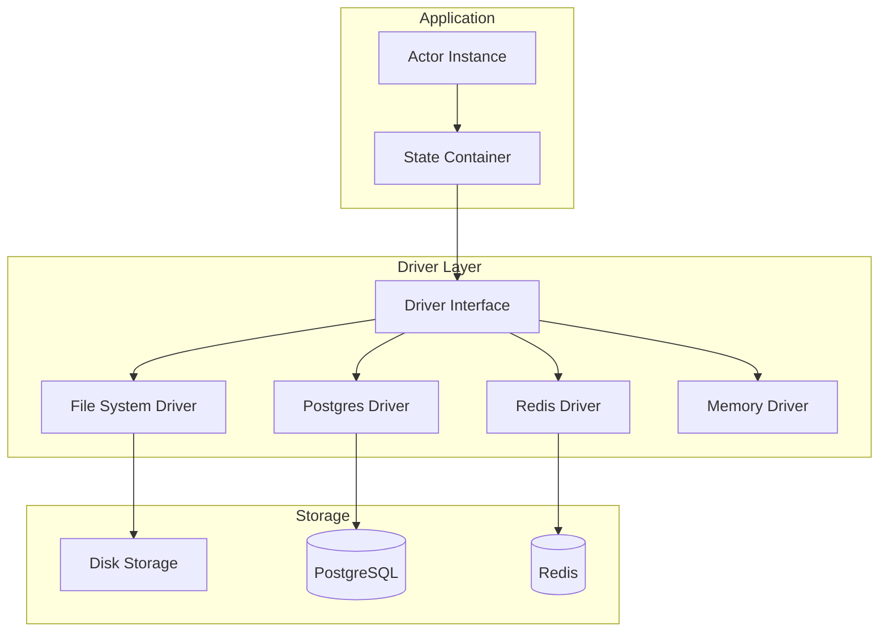

# Deep Dive: Storage Drivers and Persistence

## Overview

This deep dive examines RivetKit's storage driver system - how state is persisted, driver architecture, serialization strategies, connection pooling, and replication for distributed deployments.

## Architecture



## Driver Architecture

### Driver Interface

```typescript
// packages/core/src/drivers/driver.ts

/**
 * Core driver interface that all storage backends must implement
 */
export interface Driver {
  /**
   * Load actor state from storage
   * @param type - Actor type (e.g., "counter", "chat")
   * @param key - Actor unique identifier
   * @returns State object or null if not found
   */
  load<T>(type: string, key: string): Promise<T | null>;

  /**
   * Save actor state to storage
   * @param type - Actor type
   * @param key - Actor key
   * @param state - State to persist
   * @param meta - Actor metadata (version, timestamps)
   */
  save<T>(
    type: string,
    key: string,
    state: T,
    meta: ActorMeta
  ): Promise<void>;

  /**
   * Delete actor from storage
   */
  delete(type: string, key: string): Promise<void>;

  /**
   * Check if actor exists in storage
   */
  exists(type: string, key: string): Promise<boolean>;

  /**
   * List all actor keys of a given type
   */
  list(type: string): Promise<string[]>;

  /**
   * Batch operations for efficiency
   */
  batch?<T>(operations: BatchOperation<T>[]): Promise<void>;

  /**
   * Close connections and cleanup
   */
  close?(): Promise<void>;
}

export interface ActorMeta {
  version: number;
  createdAt: Date;
  updatedAt: Date;
  checksum?: string; // For integrity verification
}

export interface BatchOperation<T> {
  type: "save" | "delete";
  actorType: string;
  key: string;
  state?: T;
  meta?: ActorMeta;
}
```

### Base Driver Implementation

```typescript
// packages/core/src/drivers/base.ts

import { Driver, ActorMeta, BatchOperation } from "./driver";
import { serializeState, deserializeState } from "../serialization";

/**
 * Base driver with common functionality
 */
export abstract class BaseDriver implements Driver {
  protected serializer: (state: any) => string;
  protected deserializer: (data: string) => any;

  constructor(options?: DriverOptions) {
    this.serializer = options?.serialize || serializeState;
    this.deserializer = options?.deserialize || deserializeState;
  }

  abstract load<T>(type: string, key: string): Promise<T | null>;
  abstract save<T>(type: string, key: string, state: T, meta: ActorMeta): Promise<void>;
  abstract delete(type: string, key: string): Promise<void>;
  abstract exists(type: string, key: string): Promise<boolean>;
  abstract list(type: string): Promise<string[]>;

  /**
   * Serialize state with metadata
   */
  protected serializeWithMeta<T>(state: T, meta: ActorMeta): string {
    return this.serializer({
      state,
      meta: {
        ...meta,
        createdAt: meta.createdAt.toISOString(),
        updatedAt: meta.updatedAt.toISOString(),
      },
    });
  }

  /**
   * Deserialize state with metadata
   */
  protected deserializeWithMeta<T>(data: string): { state: T; meta: ActorMeta } {
    const parsed = this.deserializer(data);
    return {
      state: parsed.state,
      meta: {
        ...parsed.meta,
        createdAt: new Date(parsed.meta.createdAt),
        updatedAt: new Date(parsed.meta.updatedAt),
      },
    };
  }

  /**
   * Retry wrapper for operations
   */
  protected async withRetry<T>(
    operation: () => Promise<T>,
    options?: RetryOptions
  ): Promise<T> {
    const maxAttempts = options?.maxAttempts || 3;
    const delay = options?.delay || 100;
    const backoff = options?.backoff || 2;

    let lastError: Error;

    for (let attempt = 1; attempt <= maxAttempts; attempt++) {
      try {
        return await operation();
      } catch (error) {
        lastError = error as Error;

        if (attempt < maxAttempts) {
          const waitTime = delay * Math.pow(backoff, attempt - 1);
          await this.sleep(waitTime);
        }
      }
    }

    throw lastError;
  }

  private sleep(ms: number): Promise<void> {
    return new Promise((resolve) => setTimeout(resolve, ms));
  }
}

export interface DriverOptions {
  serialize?: (state: any) => string;
  deserialize?: (data: string) => any;
  retry?: RetryOptions;
}

export interface RetryOptions {
  maxAttempts: number;
  delay: number;
  backoff: number;
}
```

## File System Driver

### Implementation

```typescript
// packages/core/src/drivers/file-system.ts

import { BaseDriver, DriverOptions } from "./base";
import { ActorMeta } from "./driver";
import * as fs from "fs/promises";
import * as path from "path";

export interface FileSystemDriverOptions extends DriverOptions {
  storagePath: string;
  fileExtension?: string;
  atomicWrites?: boolean;
  compression?: boolean;
}

export class FileSystemDriver extends BaseDriver {
  private storagePath: string;
  private fileExtension: string;
  private atomicWrites: boolean;
  private compression: boolean;

  constructor(options: FileSystemDriverOptions) {
    super(options);
    this.storagePath = options.storagePath;
    this.fileExtension = options.fileExtension || ".json";
    this.atomicWrites = options.atomicWrites ?? true;
    this.compression = options.compression ?? false;
  }

  private getFilePath(type: string, key: string): string {
    // Sanitize to prevent path traversal attacks
    const sanitizedType = type.replace(/[^a-zA-Z0-9_-]/g, "_");
    const sanitizedKey = key.replace(/[^a-zA-Z0-9_-]/g, "_");
    return path.join(this.storagePath, `${sanitizedType}_${sanitizedKey}${this.fileExtension}`);
  }

  async load<T>(type: string, key: string): Promise<T | null> {
    const filePath = this.getFilePath(type, key);

    try {
      let content = await fs.readFile(filePath, "utf-8");

      if (this.compression) {
        content = await this.decompress(content);
      }

      const { state } = this.deserializeWithMeta<T>(content);
      return state;
    } catch (error: any) {
      if (error.code === "ENOENT") {
        return null;
      }
      throw error;
    }
  }

  async save<T>(type: string, key: string, state: T, meta: ActorMeta): Promise<void> {
    const filePath = this.getFilePath(type, key);

    // Ensure directory exists
    await fs.mkdir(path.dirname(filePath), { recursive: true });

    const serialized = this.serializeWithMeta(state, meta);
    const content = this.compression ? await this.compress(serialized) : serialized;

    if (this.atomicWrites) {
      // Write to temp file, then rename (atomic on POSIX)
      const tempPath = `${filePath}.tmp.${process.pid}`;
      await fs.writeFile(tempPath, content, "utf-8");
      await fs.rename(tempPath, filePath);
    } else {
      await fs.writeFile(filePath, content, "utf-8");
    }
  }

  async delete(type: string, key: string): Promise<void> {
    const filePath = this.getFilePath(type, key);
    await fs.unlink(filePath).catch(() => {}); // Ignore if doesn't exist
  }

  async exists(type: string, key: string): Promise<boolean> {
    const filePath = this.getFilePath(type, key);
    try {
      await fs.access(filePath);
      return true;
    } catch {
      return false;
    }
  }

  async list(type: string): Promise<string[]> {
    const files = await fs.readdir(this.storagePath);
    const prefix = `${type}_`;

    return files
      .filter((f) => f.startsWith(prefix) && f.endsWith(this.fileExtension))
      .map((f) => f.slice(prefix.length, -this.fileExtension.length));
  }

  private async compress(data: string): Promise<string> {
    const zlib = await import("zlib");
    return zlib.gzipSync(data).toString("base64");
  }

  private async decompress(data: string): Promise<string> {
    const zlib = await import("zlib");
    return zlib.gunzipSync(Buffer.from(data, "base64")).toString("utf-8");
  }
}
```

### Usage

```typescript
// Development setup
import { FileSystemDriver } from "rivetkit/drivers/file-system";

const driver = new FileSystemDriver({
  storagePath: "./.rivet-data",
  atomicWrites: true,
  compression: false,
});

const { client, serve } = registry.createServer({ driver });
```

## Postgres Driver

### Implementation

```typescript
// packages/core/src/drivers/postgres.ts

import { BaseDriver, DriverOptions } from "./base";
import { ActorMeta } from "./driver";
import { Pool, PoolConfig } from "pg";

export interface PostgresDriverOptions extends DriverOptions {
  connectionString: string;
  tableName?: string;
  poolSize?: number;
  idleTimeout?: number;
  schema?: string;
  readReplicas?: string[];
}

export class PostgresDriver extends BaseDriver {
  private pool: Pool;
  private tableName: string;
  private schema: string;
  private readPool?: Pool;
  private initialized: Promise<void>;

  constructor(options: PostgresDriverOptions) {
    super(options);

    const poolConfig: PoolConfig = {
      connectionString: options.connectionString,
      max: options.poolSize || 20,
      idleTimeoutMillis: options.idleTimeout || 30000,
    };

    this.pool = new Pool(poolConfig);
    this.tableName = options.tableName || "rivet_actors";
    this.schema = options.schema || "public";

    // Setup read replicas
    if (options.readReplicas && options.readReplicas.length > 0) {
      this.readPool = new Pool({
        connectionString: options.readReplicas[0],
        max: options.poolSize || 20,
      });
    }

    this.initialized = this.initialize();
  }

  private async initialize(): Promise<void> {
    await this.pool.query(`
      CREATE TABLE IF NOT EXISTS ${this.schema}.${this.tableName} (
        actor_type TEXT NOT NULL,
        actor_key TEXT NOT NULL,
        state JSONB NOT NULL,
        meta JSONB NOT NULL,
        created_at TIMESTAMPTZ DEFAULT NOW(),
        updated_at TIMESTAMPTZ DEFAULT NOW(),
        PRIMARY KEY (actor_type, actor_key)
      );

      CREATE INDEX IF NOT EXISTS idx_${this.tableName}_type 
      ON ${this.schema}.${this.tableName} (actor_type);

      CREATE INDEX IF NOT EXISTS idx_${this.tableName}_updated 
      ON ${this.schema}.${this.tableName} (updated_at DESC);

      CREATE INDEX IF NOT EXISTS idx_${this.tableName}_created 
      ON ${this.schema}.${this.tableName} (created_at DESC);
    `);
  }

  private getReadPool(): Pool {
    return this.readPool || this.pool;
  }

  async load<T>(type: string, key: string): Promise<T | null> {
    await this.initialized;

    const result = await this.getReadPool().query(
      `SELECT state FROM ${this.schema}.${this.tableName} 
       WHERE actor_type = $1 AND actor_key = $2`,
      [type, key]
    );

    if (result.rows.length === 0) {
      return null;
    }

    return result.rows[0].state as T;
  }

  async save<T>(type: string, key: string, state: T, meta: ActorMeta): Promise<void> {
    await this.initialized;

    const serializedState = this.serializeWithMeta(state, meta);

    await this.pool.query(
      `INSERT INTO ${this.schema}.${this.tableName} 
        (actor_type, actor_key, state, meta, created_at, updated_at)
       VALUES ($1, $2, $3, $4, NOW(), NOW())
       ON CONFLICT (actor_type, actor_key) 
       DO UPDATE SET 
         state = $3, 
         meta = $4, 
         updated_at = NOW()`,
      [type, key, serializedState, serializedState]
    );
  }

  async delete(type: string, key: string): Promise<void> {
    await this.initialized;

    await this.pool.query(
      `DELETE FROM ${this.schema}.${this.tableName} 
       WHERE actor_type = $1 AND actor_key = $2`,
      [type, key]
    );
  }

  async exists(type: string, key: string): Promise<boolean> {
    await this.initialized;

    const result = await this.getReadPool().query(
      `SELECT 1 FROM ${this.schema}.${this.tableName} 
       WHERE actor_type = $1 AND actor_key = $2 
       LIMIT 1`,
      [type, key]
    );

    return result.rows.length > 0;
  }

  async list(type: string): Promise<string[]> {
    await this.initialized;

    const result = await this.getReadPool().query(
      `SELECT actor_key FROM ${this.schema}.${this.tableName} 
       WHERE actor_type = $1 
       ORDER BY updated_at DESC`,
      [type]
    );

    return result.rows.map((r) => r.actor_key);
  }

  async batch<T>(operations: BatchOperation<T>[]): Promise<void> {
    await this.initialized;

    const client = await this.pool.connect();

    try {
      await client.query("BEGIN");

      for (const op of operations) {
        if (op.type === "save" && op.state) {
          const serialized = this.serializeWithMeta(op.state, op.meta!);
          await client.query(
            `INSERT INTO ${this.schema}.${this.tableName} 
             (actor_type, actor_key, state, meta, created_at, updated_at)
             VALUES ($1, $2, $3, $4, NOW(), NOW())
             ON CONFLICT (actor_type, actor_key) 
             DO UPDATE SET state = $3, meta = $4, updated_at = NOW()`,
            [op.actorType, op.key, serialized, serialized]
          );
        } else if (op.type === "delete") {
          await client.query(
            `DELETE FROM ${this.schema}.${this.tableName} 
             WHERE actor_type = $1 AND actor_key = $2`,
            [op.actorType, op.key]
          );
        }
      }

      await client.query("COMMIT");
    } catch (error) {
      await client.query("ROLLBACK");
      throw error;
    } finally {
      client.release();
    }
  }

  async close(): Promise<void> {
    await this.pool.end();
    if (this.readPool) {
      await this.readPool.end();
    }
  }
}
```

### Usage

```typescript
import { PostgresDriver } from "rivetkit/drivers/postgres";

const driver = new PostgresDriver({
  connectionString: process.env.DATABASE_URL!,
  tableName: "rivet_actors",
  poolSize: 20,
  readReplicas: [
    process.env.DATABASE_READ_REPLICA_1,
    process.env.DATABASE_READ_REPLICA_2,
  ],
});
```

## Redis Driver

### Implementation

```typescript
// packages/core/src/drivers/redis.ts

import { BaseDriver, DriverOptions } from "./base";
import { ActorMeta } from "./driver";
import { createClient, RedisClientType } from "redis";

export interface RedisDriverOptions extends DriverOptions {
  url: string;
  keyPrefix?: string;
  ttl?: number; // Time-to-live in seconds
  connectionOptions?: any;
}

export class RedisDriver extends BaseDriver {
  private client: RedisClientType;
  private keyPrefix: string;
  private ttl?: number;

  constructor(options: RedisDriverOptions) {
    super(options);
    this.keyPrefix = options.keyPrefix || "rivet:";
    this.ttl = options.ttl;

    this.client = createClient({
      url: options.url,
      ...options.connectionOptions,
    });

    this.connect();
  }

  private async connect(): Promise<void> {
    await this.client.connect();
  }

  private getKey(type: string, key: string): string {
    return `${this.keyPrefix}${type}:${key}`;
  }

  async load<T>(type: string, key: string): Promise<T | null> {
    const data = await this.client.get(this.getKey(type, key));

    if (!data) {
      return null;
    }

    const { state } = this.deserializeWithMeta<T>(data);
    return state;
  }

  async save<T>(type: string, key: string, state: T, meta: ActorMeta): Promise<void> {
    const serialized = this.serializeWithMeta(state, meta);
    const redisKey = this.getKey(type, key);

    if (this.ttl) {
      await this.client.set(redisKey, serialized, { EX: this.ttl });
    } else {
      await this.client.set(redisKey, serialized);
    }
  }

  async delete(type: string, key: string): Promise<void> {
    await this.client.del(this.getKey(type, key));
  }

  async exists(type: string, key: string): Promise<boolean> {
    const result = await this.client.exists(this.getKey(type, key));
    return result === 1;
  }

  async list(type: string): Promise<string[]> {
    const pattern = this.getKey(type, "*");
    const keys = await this.client.keys(pattern);

    return keys.map((k) => k.replace(this.getKey(type, ""), ""));
  }

  async close(): Promise<void> {
    await this.client.quit();
  }
}
```

## Connection Pooling

### Pool Configuration

```typescript
// packages/core/src/drivers/pool.ts

import { Pool } from "pg";

export interface PoolOptions {
  /**
   * Maximum number of clients in the pool
   */
  max: number;

  /**
   * Minimum number of clients in the pool
   */
  min: number;

  /**
   * Connection timeout in milliseconds
   */
  connectionTimeoutMillis: number;

  /**
   * Idle timeout in milliseconds
   */
  idleTimeoutMillis: number;

  /**
   * Maximum time a client can borrow a connection
   */
  acquireTimeoutMillis: number;

  /**
   * How often to check for idle connections
   */
  reapIntervalMillis: number;
}

export function createOptimizedPool(
  connectionString: string,
  options?: Partial<PoolOptions>
): Pool {
  const config: PoolOptions = {
    max: 20,
    min: 5,
    connectionTimeoutMillis: 5000,
    idleTimeoutMillis: 30000,
    acquireTimeoutMillis: 5000,
    reapIntervalMillis: 1000,
    ...options,
  };

  return new Pool({
    connectionString,
    max: config.max,
    min: config.min,
    connectionTimeoutMillis: config.connectionTimeoutMillis,
    idleTimeoutMillis: config.idleTimeoutMillis,
    acquireTimeoutMillis: config.acquireTimeoutMillis,
  });
}

// Usage with monitoring
const pool = createOptimizedPool(process.env.DATABASE_URL!);

// Monitor pool health
setInterval(() => {
  console.log("Pool stats:", {
    total: pool.totalCount,
    idle: pool.idleCount,
    waiting: pool.waitingCount,
  });
}, 10000);
```

## Serialization Strategies

### SuperJSON for Complex Types

```typescript
// packages/core/src/serialization/superjson.ts

import superjson from "superjson";

/**
 * Serialize state handling complex JavaScript types
 */
export function superjsonSerialize(state: any): string {
  return superjson.stringify(state);
}

export function superjsonDeserialize<T>(data: string): T {
  return superjson.parse(data);
}

// Handles: Date, Map, Set, RegExp, BigInt, ArrayBuffer, etc.
```

### Custom Serialization

```typescript
// packages/core/src/serialization/custom.ts

export interface Serializable {
  toJSON(): any;
}

export function createCustomSerializer<T extends Serializable>(
  type: new () => T
) {
  return {
    serialize: (state: T): string => {
      return JSON.stringify({
        __type: type.name,
        data: state.toJSON(),
      });
    },
    deserialize: (data: string): T => {
      const parsed = JSON.parse(data);
      const instance = new type();
      Object.assign(instance, parsed.data);
      return instance;
    },
  };
}

// Example: Yjs CRDT serialization
import * as Y from "yjs";

export const yjsSerializer = {
  serialize: (doc: Y.Doc): string => {
    const update = Y.encodeStateAsUpdate(doc);
    return Buffer.from(update).toString("base64");
  },
  deserialize: (data: string): Y.Doc => {
    const update = Buffer.from(data, "base64");
    const doc = new Y.Doc();
    Y.applyUpdate(doc, update);
    return doc;
  },
};
```

## Conclusion

RivetKit's storage driver system provides:

1. **Multiple Backends**: File system, Postgres, Redis, Memory
2. **Connection Pooling**: Optimized database connections
3. **Read Replicas**: Scale read operations
4. **Serialization**: Handle complex types with SuperJSON
5. **Atomic Writes**: Prevent data corruption
6. **Compression**: Reduce storage footprint
7. **Batch Operations**: Efficient bulk updates
