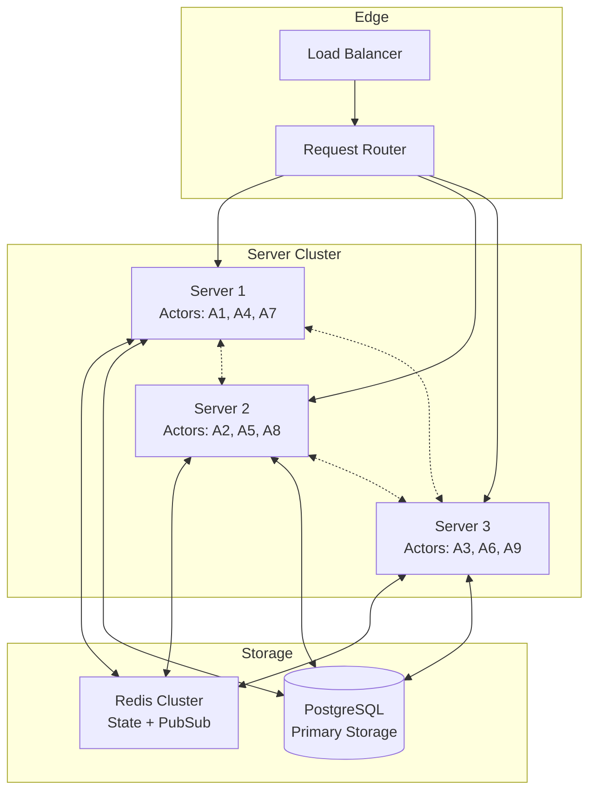

# Deep Dive: Distribution and Horizontal Scaling

## Overview

This deep dive examines how to scale RivetKit horizontally across multiple servers - distributed actor placement, consistent hashing for routing, leader election for single-instance actors, and cross-region replication strategies.

## Architecture



## Consistent Hashing

### Hash Ring Implementation

```typescript
// packages/core/src/distribution/hash-ring.ts

import { createHash } from "crypto";

export interface Node {
  id: string;
  address: string;
  port: number;
  weight?: number;
}

export class HashRing {
  private ring: Map<number, string> = new Map();
  private sortedKeys: number[] = [];
  private replicas: number;
  private nodes: Map<string, Node> = new Map();

  constructor(replicas: number = 150) {
    this.replicas = replicas;
  }

  /**
   * Add a node to the ring
   */
  addNode(node: Node): void {
    this.nodes.set(node.id, node);

    // Add virtual nodes (replicas)
    const weight = node.weight || 1;
    for (let i = 0; i < this.replicas * weight; i++) {
      const key = this.hash(`${node.id}:${i}`);
      this.ring.set(key, node.id);
      this.sortedKeys.push(key);
    }

    // Sort keys for binary search
    this.sortedKeys.sort((a, b) => a - b);
  }

  /**
   * Remove a node from the ring
   */
  removeNode(nodeId: string): void {
    this.nodes.delete(nodeId);

    // Remove all virtual nodes
    for (let i = 0; i < this.replicas; i++) {
      const key = this.hash(`${nodeId}:${i}`);
      this.ring.delete(key);
      this.sortedKeys = this.sortedKeys.filter((k) => k !== key);
    }
  }

  /**
   * Get the node responsible for a key
   */
  getNode(key: string): Node | null {
    if (this.sortedKeys.length === 0) {
      return null;
    }

    const hash = this.hash(key);
    const index = this.findClosestKey(hash);
    const nodeId = this.ring.get(this.sortedKeys[index])!;

    return this.nodes.get(nodeId) || null;
  }

  /**
   * Get multiple nodes for replication
   */
  getNodes(key: string, count: number): Node[] {
    if (this.sortedKeys.length === 0) {
      return [];
    }

    const hash = this.hash(key);
    const index = this.findClosestKey(hash);
    const nodes: Node[] = [];
    const seenNodeIds = new Set<string>();

    for (let i = 0; i < this.sortedKeys.length && nodes.length < count; i++) {
      const ringIndex = (index + i) % this.sortedKeys.length;
      const nodeId = this.ring.get(this.sortedKeys[ringIndex])!;

      if (!seenNodeIds.has(nodeId)) {
        seenNodeIds.add(nodeId);
        const node = this.nodes.get(nodeId);
        if (node) {
          nodes.push(node);
        }
      }
    }

    return nodes;
  }

  /**
   * Find the closest key using binary search
   */
  private findClosestKey(hash: number): number {
    let low = 0;
    let high = this.sortedKeys.length - 1;

    while (low < high) {
      const mid = Math.floor((low + high) / 2);
      if (this.sortedKeys[mid] < hash) {
        low = mid + 1;
      } else {
        high = mid;
      }
    }

    // Wrap around if hash is greater than all keys
    return low % this.sortedKeys.length;
  }

  /**
   * Generate hash for a key
   */
  private hash(key: string): number {
    return parseInt(
      createHash("md5").update(key).digest("hex").substring(0, 8),
      16
    );
  }

  /**
   * Get all nodes
   */
  getAllNodes(): Node[] {
    return Array.from(this.nodes.values());
  }

  /**
   * Get ring status
   */
  getStatus(): {
    nodeCount: number;
    totalVirtualNodes: number;
  } {
    return {
      nodeCount: this.nodes.size,
      totalVirtualNodes: this.sortedKeys.length,
    };
  }
}
```

### Actor Router

```typescript
// packages/core/src/distribution/router.ts

import { HashRing, Node } from "./hash-ring";
import { Registry } from "../registry";

export interface RouterOptions {
  nodeId: string;
  nodeAddress: string;
  nodePort: number;
  discoveryNodes?: Node[];
  replicationFactor?: number;
}

export class DistributedRouter {
  private ring: HashRing;
  private registry: Registry;
  private nodeId: string;
  private replicationFactor: number;
  private remoteClients: Map<string, any> = new Map();

  constructor(registry: Registry, options: RouterOptions) {
    this.registry = registry;
    this.nodeId = options.nodeId;
    this.replicationFactor = options.replicationFactor || 2;

    this.ring = new HashRing();

    // Add local node
    this.ring.addNode({
      id: options.nodeId,
      address: options.nodeAddress,
      port: options.nodePort,
    });

    // Add discovery nodes
    if (options.discoveryNodes) {
      for (const node of options.discoveryNodes) {
        this.ring.addNode(node);
      }
    }
  }

  /**
   * Get or create actor, routing to correct node
   */
  getOrCreate<T>(type: string, key: string): T {
    const actorId = `${type}:${key}`;
    const responsibleNode = this.ring.getNode(actorId);

    if (!responsibleNode) {
      // No nodes available, use local
      return this.registry.getOrCreate(type, key);
    }

    if (responsibleNode.id === this.nodeId) {
      // Local responsibility
      return this.registry.getOrCreate(type, key);
    } else {
      // Remote responsibility - proxy to remote node
      return this.createRemoteProxy(type, key, responsibleNode);
    }
  }

  /**
   * Create proxy for remote actor
   */
  private createRemoteProxy(
    type: string,
    key: string,
    node: Node
  ): any {
    const url = `http://${node.address}:${node.port}`;

    return new Proxy({}, {
      get: (target, prop: string) => {
        if (prop === "getState") {
          return async () => this.remoteCall(url, type, key, "getState");
        }
        return async (...args: any[]) =>
          this.remoteCall(url, type, key, prop, args);
      },
    });
  }

  /**
   * Make remote HTTP call
   */
  private async remoteCall(
    url: string,
    type: string,
    key: string,
    action: string,
    args?: any[]
  ): Promise<any> {
    const response = await fetch(`${url}/actor/${type}/${key}/${action}`, {
      method: "POST",
      headers: { "Content-Type": "application/json" },
      body: JSON.stringify({ args }),
    });

    if (!response.ok) {
      throw new Error(`Remote call failed: ${response.statusText}`);
    }

    return response.json();
  }

  /**
   * Add node to cluster
   */
  addNode(node: Node): void {
    this.ring.addNode(node);
    this.rebalance();
  }

  /**
   * Remove node from cluster
   */
  removeNode(nodeId: string): void {
    this.ring.removeNode(nodeId);
    this.rebalance();
  }

  /**
   * Rebalance actors across nodes
   */
  private rebalance(): void {
    // In a full implementation, this would:
    // 1. Identify actors that now belong to other nodes
    // 2. Transfer state to new responsible nodes
    // 3. Update routing tables
    console.log("Rebalancing cluster...");
  }

  /**
   * Get cluster status
   */
  getStatus(): any {
    return {
      nodeId: this.nodeId,
      ring: this.ring.getStatus(),
      nodes: this.ring.getAllNodes(),
    };
  }
}
```

## Leader Election

### Single-Instance Actors

```typescript
// packages/core/src/distribution/leader-election.ts

import { createClient, RedisClientType } from "redis";

export interface LeaderElectionOptions {
  nodeId: string;
  redisUrl: string;
  lockKey: string;
  lockTTL: number; // milliseconds
  renewalInterval?: number;
}

export class LeaderElection {
  private client: RedisClientType;
  private nodeId: string;
  private lockKey: string;
  private lockTTL: number;
  private renewalInterval: number;
  private isLeader: boolean = false;
  private renewalTimer?: NodeJS.Timeout;

  constructor(options: LeaderElectionOptions) {
    this.nodeId = options.nodeId;
    this.lockKey = options.lockKey;
    this.lockTTL = options.lockTTL;
    this.renewalInterval = options.renewalInterval || lockTTL / 2;

    this.client = createClient({ url: options.redisUrl });
  }

  /**
   * Attempt to become leader
   */
  async acquire(): Promise<boolean> {
    await this.client.connect();

    const acquired = await this.client.set(
      this.lockKey,
      this.nodeId,
      {
        NX: true, // Only set if not exists
        PX: this.lockTTL,
      }
    );

    if (acquired) {
      this.isLeader = true;
      this.startRenewal();
      console.log(`Node ${this.nodeId} is now leader`);
    }

    return this.isLeader;
  }

  /**
   * Check if this node is leader
   */
  async isLeaderNode(): Promise<boolean> {
    const currentLeader = await this.client.get(this.lockKey);
    this.isLeader = currentLeader === this.nodeId;
    return this.isLeader;
  }

  /**
   * Release leadership
   */
  async release(): Promise<void> {
    if (this.isLeader) {
      const currentLeader = await this.client.get(this.lockKey);
      if (currentLeader === this.nodeId) {
        await this.client.del(this.lockKey);
      }
      this.stopRenewal();
      this.isLeader = false;
      console.log(`Node ${this.nodeId} released leadership`);
    }
  }

  /**
   * Start lock renewal
   */
  private startRenewal(): void {
    const renew = async () => {
      try {
        const currentLeader = await this.client.get(this.lockKey);

        if (currentLeader !== this.nodeId) {
          // Lost leadership
          this.isLeader = false;
          this.stopRenewal();
          console.log(`Node ${this.nodeId} lost leadership`);
          return;
        }

        // Renew lock
        await this.client.expire(this.lockKey, this.lockTTL / 1000);
        this.renewalTimer = setTimeout(renew, this.renewalInterval);
      } catch (error) {
        console.error("Error renewing lock:", error);
      }
    };

    this.renewalTimer = setTimeout(renew, this.renewalInterval);
  }

  /**
   * Stop lock renewal
   */
  private stopRenewal(): void {
    if (this.renewalTimer) {
      clearTimeout(this.renewalTimer);
      this.renewalTimer = undefined;
    }
  }

  /**
   * Get current leader
   */
  async getCurrentLeader(): Promise<string | null> {
    return await this.client.get(this.lockKey);
  }

  /**
   * Cleanup
   */
  async close(): Promise<void> {
    await this.release();
    await this.client.quit();
  }
}

// Usage: Single-instance actor
const schedulerActor = actor({
  state: { jobs: [] },

  async onInit(ctx) {
    const election = new LeaderElection({
      nodeId: process.env.NODE_ID!,
      redisUrl: process.env.REDIS_URL!,
      lockKey: "scheduler:leader",
      lockTTL: 30000,
    });

    await election.acquire();

    if (await election.isLeaderNode()) {
      // Only leader runs the scheduler
      startScheduler(ctx);
    }
  },
});
```

## Cross-Region Replication

### Replication Manager

```typescript
// packages/core/src/distribution/replication.ts

import { Driver } from "../drivers";

export interface ReplicationConfig {
  region: string;
  replicas: RegionReplica[];
  strategy: "async" | "sync" | "quorum";
  readPreference?: "primary" | "nearest" | "region";
}

export interface RegionReplica {
  region: string;
  driver: Driver;
  priority: number; // Lower = higher priority
}

export class ReplicationManager {
  private primary: Driver;
  private replicas: RegionReplica[];
  private strategy: "async" | "sync" | "quorum";
  private region: string;

  constructor(primary: Driver, config: ReplicationConfig) {
    this.primary = primary;
    this.replicas = config.replicas.sort((a, b) => a.priority - b.priority);
    this.strategy = config.strategy;
    this.region = config.region;
  }

  /**
   * Load state with region awareness
   */
  async load<T>(type: string, key: string): Promise<T | null> {
    // Try local replica first
    const localReplica = this.replicas.find(
      (r) => r.region === this.region
    );

    if (localReplica) {
      try {
        const state = await localReplica.driver.load<T>(type, key);
        if (state !== null) {
          return state;
        }
      } catch (error) {
        console.error("Local replica load failed:", error);
      }
    }

    // Fall back to primary
    return await this.primary.load<T>(type, key);
  }

  /**
   * Save with replication strategy
   */
  async save<T>(
    type: string,
    key: string,
    state: T,
    meta: any
  ): Promise<void> {
    if (this.strategy === "sync") {
      // Wait for all replicas
      await Promise.all([
        this.primary.save(type, key, state, meta),
        ...this.replicas.map((r) => r.driver.save(type, key, state, meta)),
      ]);
    } else if (this.strategy === "quorum") {
      // Wait for majority
      const writePromises = [
        this.primary.save(type, key, state, meta),
        ...this.replicas.map((r) => r.driver.save(type, key, state, meta)),
      ];

      const quorum = Math.floor(writePromises.length / 2) + 1;
      await Promise.anyN(writePromises, quorum);
    } else {
      // Async - primary only, replicas in background
      await this.primary.save(type, key, state, meta);

      // Replicate asynchronously
      for (const replica of this.replicas) {
        replica.driver.save(type, key, state, meta).catch(console.error);
      }
    }
  }

  /**
   * Get replication lag
   */
  async getReplicationLag(type: string, key: string): Promise<number[]> {
    const primaryMeta = await this.primary.load(type, key);
    const lags: number[] = [];

    for (const replica of this.replicas) {
      try {
        const replicaState = await replica.driver.load(type, key);
        // Calculate lag based on version or timestamp
        lags.push(calculateLag(primaryMeta, replicaState));
      } catch {
        lags.push(Infinity);
      }
    }

    return lags;
  }
}

function calculateLag(primary: any, replica: any): number {
  if (!replica) return Infinity;
  return primary.meta.version - replica.meta.version;
}
```

## Node Discovery

### Kubernetes Discovery

```typescript
// packages/core/src/distribution/k8s-discovery.ts

import * as k8s from "@kubernetes/client-node";

export interface K8sDiscoveryOptions {
  namespace: string;
  serviceName: string;
  labelSelector?: string;
  pollInterval?: number;
}

export class K8sDiscovery {
  private kc: k8s.KubeConfig;
  private k8sApi: k8s.CoreV1Api;
  private namespace: string;
  private serviceName: string;
  private labelSelector: string;
  private pollInterval: number;
  private nodes: Map<string, Node> = new Map();
  private onUpdate: (nodes: Node[]) => void;

  constructor(options: K8sDiscoveryOptions, onUpdate: (nodes: Node[]) => void) {
    this.kc = new k8s.KubeConfig();
    this.kc.loadFromDefault();
    this.k8sApi = this.kc.makeApiClient(k8s.CoreV1Api);

    this.namespace = options.namespace;
    this.serviceName = options.serviceName;
    this.labelSelector = options.labelSelector || "app=rivetkit";
    this.pollInterval = options.pollInterval || 5000;
    this.onUpdate = onUpdate;

    this.startDiscovery();
  }

  private async startDiscovery(): Promise<void> {
    const poll = async () => {
      try {
        const pods = await this.k8sApi.listNamespacedPod(
          this.namespace,
          undefined,
          undefined,
          undefined,
          undefined,
          this.labelSelector
        );

        const newNodes = new Map<string, Node>();

        for (const pod of pods.body.items) {
          if (pod.status?.phase === "Running" && pod.status.podIP) {
            const nodeId = pod.metadata!.name;
            newNodes.set(nodeId, {
              id: nodeId,
              address: pod.status.podIP,
              port: 3000,
              weight: 1,
            });
          }
        }

        // Check for changes
        if (!this.mapsEqual(this.nodes, newNodes)) {
          this.nodes = newNodes;
          this.onUpdate(Array.from(newNodes.values()));
        }
      } catch (error) {
        console.error("K8s discovery error:", error);
      }
    };

    await poll();
    setInterval(poll, this.pollInterval);
  }

  private mapsEqual(a: Map<any, any>, b: Map<any, any>): boolean {
    if (a.size !== b.size) return false;
    for (const [key, value] of a.entries()) {
      if (!b.has(key) || JSON.stringify(b.get(key)) !== JSON.stringify(value)) {
        return false;
      }
    }
    return true;
  }
}

// Usage
const discovery = new K8sDiscovery(
  {
    namespace: "default",
    serviceName: "rivetkit",
    pollInterval: 5000,
  },
  (nodes) => {
    router.updateNodes(nodes);
  }
);
```

## Conclusion

Horizontal scaling in RivetKit requires:

1. **Consistent Hashing**: Deterministic actor-to-node mapping
2. **Leader Election**: Single-instance actors with Redis locks
3. **Cross-Region Replication**: Multi-region state replication
4. **Node Discovery**: Kubernetes-based automatic discovery
5. **Request Routing**: Smart routing based on hash ring
6. **Rebalancing**: Handle node joins/leaves gracefully
