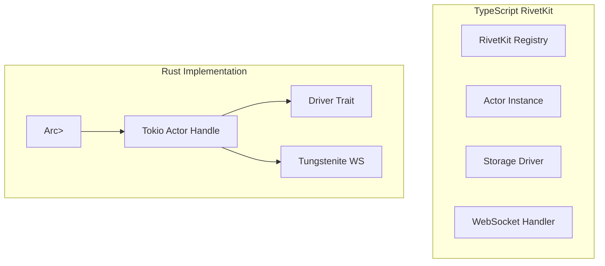

# Rust Revision: Building Actor Systems in Rust

## Overview

This document demonstrates how to replicate RivetKit's actor patterns in Rust using `tokio` for async runtime, actor frameworks like `bastion` or `riker`, and custom implementations for state management and persistence.

## Architecture Comparison



## Project Setup

```toml
# Cargo.toml
[package]
name = "rivetkit-rust"
version = "0.1.0"
edition = "2021"

[dependencies]
# Async runtime
tokio = { version = "1.35", features = ["full"] }
tokio-util = { version = "0.7", features = ["codec"] }

# Actor frameworks (choose one)
bastion = "0.4"
# or
riker = "0.4"

# Or build custom actors with tokio channels

# Web framework
axum = { version = "0.7", features = ["ws", "macros"] }
tower = "0.4"
tower-http = { version = "0.5", features = ["trace"] }

# WebSocket
tokio-tungstenite = "0.21"
futures = "0.3"

# Serialization
serde = { version = "1.0", features = ["derive"] }
serde_json = "1.0"

# State management
dashmap = "5.5"
arc-swap = "1.6"

# Database
sqlx = { version = "0.7", features = ["runtime-tokio-rustls", "postgres", "json"] }
redis = { version = "0.24", features = ["tokio-comp"] }

# Observability
tracing = "0.1"
tracing-subscriber = { version = "0.3", features = ["env-filter"] }

# Error handling
thiserror = "1.0"
anyhow = "1.0"

# Utilities
uuid = { version = "1.6", features = ["v4"] }
chrono = { version = "0.4", features = ["serde"] }
```

## Core Actor System

### Actor Trait and Types

```rust
// src/actor/mod.rs

use async_trait::async_trait;
use serde::{Deserialize, Serialize};
use std::any::Any;
use std::fmt::Debug;

/// Actor definition trait
#[async_trait]
pub trait Actor: Send + Sync + 'static {
    /// Actor state type
    type State: Clone + Serialize + for<'de> Deserialize<'de> + Send + Sync;
    
    /// Action message type
    type Action: Debug + Send + Sync;
    
    /// Response type
    type Response: Send + Sync;
    
    /// Initialize actor state
    async fn init(&self) -> Result<Self::State, ActorError>;
    
    /// Handle an action
    async fn handle(
        &self,
        state: &mut Self::State,
        action: Self::Action,
        ctx: ActorContext,
    ) -> Result<Self::Response, ActorError>;
    
    /// Called before state is persisted
    async fn before_save(&self, state: &Self::State) -> Result<(), ActorError> {
        Ok(())
    }
    
    /// Called after state is persisted
    async fn after_save(&self, state: &Self::State) -> Result<(), ActorError> {
        Ok(())
    }
    
    /// Called when actor is terminated
    async fn terminate(&self, state: &Self::State) -> Result<(), ActorError> {
        Ok(())
    }
}

/// Actor context with broadcast capability
pub struct ActorContext {
    pub key: String,
    pub actor_type: String,
    pub broadcaster: Broadcaster,
    pub meta: ActorMeta,
}

impl ActorContext {
    pub fn new(
        key: String,
        actor_type: String,
        broadcaster: Broadcaster,
    ) -> Self {
        Self {
            key,
            actor_type,
            broadcaster,
            meta: ActorMeta {
                version: 0,
                created_at: chrono::Utc::now(),
                updated_at: chrono::Utc::now(),
            },
        }
    }
    
    /// Broadcast event to subscribers
    pub fn broadcast(&self, event: &str, data: serde_json::Value) {
        self.broadcaster.broadcast(
            &self.actor_type,
            &self.key,
            event,
            data,
        );
    }
}

/// Actor metadata
#[derive(Debug, Clone, Serialize, Deserialize)]
pub struct ActorMeta {
    pub version: u64,
    pub created_at: chrono::DateTime<chrono::Utc>,
    pub updated_at: chrono::DateTime<chrono::Utc>,
}

/// Actor error types
#[derive(Debug, thiserror::Error)]
pub enum ActorError {
    #[error("Actor not found: {0}")]
    NotFound(String),
    
    #[error("Action not found: {0}")]
    ActionNotFound(String),
    
    #[error("Serialization error: {0}")]
    Serialization(#[from] serde_json::Error),
    
    #[error("Storage error: {0}")]
    Storage(#[from] Box<dyn std::error::Error + Send + Sync>),
    
    #[error("Internal error: {0}")]
    Internal(String),
}

/// Result type
pub type ActorResult<T> = Result<T, ActorError>;
```

### State Container

```rust
// src/actor/state.rs

use std::sync::Arc;
use tokio::sync::RwLock;
use serde::{Deserialize, Serialize};

/// State container with change tracking
pub struct StateContainer<T> {
    state: Arc<RwLock<T>>,
    changes: Arc<RwLock<Vec<String>>>,
}

impl<T> StateContainer<T>
where
    T: Clone + Serialize + for<'de> Deserialize<'de> + Send + Sync,
{
    pub fn new(initial: T) -> Self {
        Self {
            state: Arc::new(RwLock::new(initial)),
            changes: Arc::new(RwLock::new(Vec::new())),
        }
    }
    
    /// Get a read lock on state
    pub async fn read(&self) -> tokio::sync::RwLockReadGuard<T> {
        self.state.read().await
    }
    
    /// Get a write lock on state
    pub async fn write(&self) -> tokio::sync::RwLockWriteGuard<T> {
        self.state.write().await
    }
    
    /// Mark a field as changed
    pub async fn mark_changed(&self, field: &str) {
        let mut changes = self.changes.write().await;
        if !changes.contains(&field.to_string()) {
            changes.push(field.to_string());
        }
    }
    
    /// Get changed fields
    pub async fn get_changes(&self) -> Vec<String> {
        self.changes.read().await.clone()
    }
    
    /// Clear changes
    pub async fn clear_changes(&self) {
        self.changes.write().await.clear();
    }
    
    /// Serialize state
    pub async fn to_json(&self) -> Result<String, serde_json::Error> {
        let state = self.state.read().await;
        serde_json::to_string(&*state)
    }
    
    /// Deserialize state
    pub async fn from_json(data: &str) -> Result<T, serde_json::Error> {
        serde_json::from_str(data)
    }
}

/// State with automatic persistence tracking
pub struct PersistentState<T> {
    container: StateContainer<T>,
    last_saved: Arc<RwLock<chrono::DateTime<chrono::Utc>>>,
}

impl<T> PersistentState<T>
where
    T: Clone + Serialize + for<'de> Deserialize<'de> + Send + Sync,
{
    pub fn new(initial: T) -> Self {
        Self {
            container: StateContainer::new(initial),
            last_saved: Arc::new(RwLock::new(chrono::Utc::now())),
        }
    }
    
    pub fn inner(&self) -> &StateContainer<T> {
        &self.container
    }
    
    pub async fn mark_saved(&self) {
        *self.last_saved.write().await = chrono::Utc::now();
        self.container.clear_changes().await;
    }
    
    pub async fn needs_persistence(&self, interval: chrono::Duration) -> bool {
        let last_saved = *self.last_saved.read().await;
        let changes = self.container.get_changes().await;
        
        chrono::Utc::now() - last_saved > interval || !changes.is_empty()
    }
}
```

### Actor Registry

```rust
// src/registry.rs

use crate::actor::{Actor, ActorError, ActorResult};
use crate::driver::Driver;
use crate::broadcaster::Broadcaster;
use dashmap::DashMap;
use std::sync::Arc;
use tokio::sync::Mutex;

/// Actor instance wrapper
pub struct ActorInstance<A: Actor> {
    pub actor: Arc<A>,
    pub state: A::State,
    pub context: ActorContext,
    pub driver: Arc<dyn Driver>,
}

/// Registry for managing actors
pub struct Registry {
    actors: DashMap<String, Arc<Mutex<dyn ActorHandle>>>,
    driver: Arc<dyn Driver>,
    broadcaster: Broadcaster,
}

impl Registry {
    pub fn new(driver: Arc<dyn Driver>, broadcaster: Broadcaster) -> Self {
        Self {
            actors: DashMap::new(),
            driver,
            broadcaster,
        }
    }
    
    /// Get or create an actor instance
    pub async fn get_or_create<A>(
        &self,
        actor_type: &str,
        key: &str,
        actor: Arc<A>,
    ) -> ActorResult<Arc<Mutex<ActorInstance<A>>>>
    where
        A: Actor + 'static,
    {
        let actor_id = format!("{}:{}", actor_type, key);
        
        // Check if already in memory
        if let Some(existing) = self.actors.get(&actor_id) {
            return Ok(existing.clone());
        }
        
        // Load or create state
        let state = match self.driver.load::<A::State>(actor_type, key).await? {
            Some(s) => s,
            None => actor.init().await?,
        };
        
        // Create context
        let context = ActorContext::new(
            key.to_string(),
            actor_type.to_string(),
            self.broadcaster.clone(),
        );
        
        // Create instance
        let instance = Arc::new(Mutex::new(ActorInstance {
            actor,
            state,
            context,
            driver: self.driver.clone(),
        }));
        
        self.actors.insert(actor_id.clone(), instance.clone());
        
        Ok(instance)
    }
    
    /// Remove actor from registry
    pub async fn remove(&self, actor_type: &str, key: &str) {
        let actor_id = format!("{}:{}", actor_type, key);
        self.actors.remove(&actor_id);
    }
    
    /// Get actor count
    pub fn actor_count(&self) -> usize {
        self.actors.len()
    }
}

/// Trait for type-erased actor handles
#[async_trait]
pub trait ActorHandle: Send + Sync {
    async fn persist(&self) -> ActorResult<()>;
    async fn terminate(&self) -> ActorResult<()>;
}

impl<A> ActorHandle for ActorInstance<A>
where
    A: Actor + 'static,
{
    async fn persist(&self) -> ActorResult<()> {
        self.actor.before_save(&self.state).await?;
        self.driver.save(
            &self.context.actor_type,
            &self.context.key,
            &self.state,
            &self.context.meta,
        ).await?;
        self.actor.after_save(&self.state).await?;
        Ok(())
    }
    
    async fn terminate(&self) -> ActorResult<()> {
        self.actor.terminate(&self.state).await?;
        Ok(())
    }
}
```

## Storage Drivers

### Driver Trait

```rust
// src/driver/mod.rs

use async_trait::async_trait;
use serde::{Deserialize, Serialize};
use crate::actor::ActorMeta;

#[async_trait]
pub trait Driver: Send + Sync + 'static {
    /// Load actor state
    async fn load<T>(&self, actor_type: &str, key: &str) -> Result<Option<T>, DriverError>
    where
        T: for<'de> Deserialize<'de> + Send + Sync;
    
    /// Save actor state
    async fn save<T>(
        &self,
        actor_type: &str,
        key: &str,
        state: &T,
        meta: &ActorMeta,
    ) -> Result<(), DriverError>
    where
        T: Serialize + Send + Sync;
    
    /// Delete actor
    async fn delete(&self, actor_type: &str, key: &str) -> Result<(), DriverError>;
    
    /// Check if actor exists
    async fn exists(&self, actor_type: &str, key: &str) -> Result<bool, DriverError>;
    
    /// List actors of a type
    async fn list(&self, actor_type: &str) -> Result<Vec<String>, DriverError>;
}

#[derive(Debug, thiserror::Error)]
pub enum DriverError {
    #[error("IO error: {0}")]
    Io(#[from] std::io::Error),
    
    #[error("Database error: {0}")]
    Database(#[from] sqlx::Error),
    
    #[error("Redis error: {0}")]
    Redis(#[from] redis::RedisError),
    
    #[error("Serialization error: {0}")]
    Serialization(#[from] serde_json::Error),
}
```

### Postgres Driver

```rust
// src/driver/postgres.rs

use super::{Driver, DriverError};
use crate::actor::ActorMeta;
use sqlx::{PgPool, Row};
use serde::{Serialize, Deserialize};

pub struct PostgresDriver {
    pool: PgPool,
    table_name: String,
}

impl PostgresDriver {
    pub fn new(pool: PgPool, table_name: Option<String>) -> Self {
        Self {
            pool,
            table_name: table_name.unwrap_or_else(|| "rivet_actors".to_string()),
        }
    }
    
    pub async fn initialize(&self) -> Result<(), sqlx::Error> {
        sqlx::query(&format!(
            r#"
            CREATE TABLE IF NOT EXISTS {} (
                actor_type TEXT NOT NULL,
                actor_key TEXT NOT NULL,
                state JSONB NOT NULL,
                meta JSONB NOT NULL,
                created_at TIMESTAMPTZ DEFAULT NOW(),
                updated_at TIMESTAMPTZ DEFAULT NOW(),
                PRIMARY KEY (actor_type, actor_key)
            )
            "#,
            self.table_name
        ))
        .execute(&self.pool)
        .await?;
        
        sqlx::query(&format!(
            "CREATE INDEX IF NOT EXISTS idx_actor_type ON {} (actor_type)",
            self.table_name
        ))
        .execute(&self.pool)
        .await?;
        
        Ok(())
    }
}

#[async_trait::async_trait]
impl Driver for PostgresDriver {
    async fn load<T>(&self, actor_type: &str, key: &str) -> Result<Option<T>, DriverError>
    where
        T: for<'de> Deserialize<'de> + Send + Sync,
    {
        let result = sqlx::query(
            &format!(
                "SELECT state FROM {} WHERE actor_type = $1 AND actor_key = $2",
                self.table_name
            )
        )
        .bind(actor_type)
        .bind(key)
        .fetch_optional(&self.pool)
        .await?;
        
        match result {
            Some(row) => {
                let state: serde_json::Value = row.get("state");
                Ok(Some(serde_json::from_value(state)?))
            }
            None => Ok(None),
        }
    }
    
    async fn save<T>(
        &self,
        actor_type: &str,
        key: &str,
        state: &T,
        meta: &ActorMeta,
    ) -> Result<(), DriverError>
    where
        T: Serialize + Send + Sync,
    {
        let state_json = serde_json::to_value(state)?;
        let meta_json = serde_json::to_value(meta)?;
        
        sqlx::query(
            &format!(
                r#"
                INSERT INTO {} (actor_type, actor_key, state, meta, created_at, updated_at)
                VALUES ($1, $2, $3, $4, NOW(), NOW())
                ON CONFLICT (actor_type, actor_key)
                DO UPDATE SET state = $3, meta = $4, updated_at = NOW()
                "#,
                self.table_name
            )
        )
        .bind(actor_type)
        .bind(key)
        .bind(state_json)
        .bind(meta_json)
        .execute(&self.pool)
        .await?;
        
        Ok(())
    }
    
    async fn delete(&self, actor_type: &str, key: &str) -> Result<(), DriverError> {
        sqlx::query(
            &format!(
                "DELETE FROM {} WHERE actor_type = $1 AND actor_key = $2",
                self.table_name
            )
        )
        .bind(actor_type)
        .bind(key)
        .execute(&self.pool)
        .await?;
        
        Ok(())
    }
    
    async fn exists(&self, actor_type: &str, key: &str) -> Result<bool, DriverError> {
        let result = sqlx::query(
            &format!(
                "SELECT 1 FROM {} WHERE actor_type = $1 AND actor_key = $2 LIMIT 1",
                self.table_name
            )
        )
        .bind(actor_type)
        .bind(key)
        .fetch_optional(&self.pool)
        .await?;
        
        Ok(result.is_some())
    }
    
    async fn list(&self, actor_type: &str) -> Result<Vec<String>, DriverError> {
        let results = sqlx::query(
            &format!(
                "SELECT actor_key FROM {} WHERE actor_type = $1 ORDER BY updated_at DESC",
                self.table_name
            )
        )
        .bind(actor_type)
        .fetch_all(&self.pool)
        .await?;
        
        Ok(results.into_iter().map(|r| r.get("actor_key")).collect())
    }
}
```

### File System Driver

```rust
// src/driver/fs.rs

use super::{Driver, DriverError};
use crate::actor::ActorMeta;
use serde::{Serialize, Deserialize};
use std::path::{Path, PathBuf};
use tokio::fs;
use tokio::io::AsyncWriteExt;

pub struct FileSystemDriver {
    storage_path: PathBuf,
}

impl FileSystemDriver {
    pub fn new(storage_path: PathBuf) -> Self {
        Self { storage_path }
    }
    
    fn get_file_path(&self, actor_type: &str, key: &str) -> PathBuf {
        let sanitized_type = actor_type.replace(|c: char| !c.is_alphanumeric() && c != '-' && c != '_', "_");
        let sanitized_key = key.replace(|c: char| !c.is_alphanumeric() && c != '-' && c != '_', "_");
        self.storage_path.join(format!("{}_{}.json", sanitized_type, sanitized_key))
    }
}

#[async_trait::async_trait]
impl Driver for FileSystemDriver {
    async fn load<T>(&self, actor_type: &str, key: &str) -> Result<Option<T>, DriverError>
    where
        T: for<'de> Deserialize<'de> + Send + Sync,
    {
        let file_path = self.get_file_path(actor_type, key);
        
        match fs::read_to_string(&file_path).await {
            Ok(content) => {
                let data: T = serde_json::from_str(&content)?;
                Ok(Some(data))
            }
            Err(e) if e.kind() == std::io::ErrorKind::NotFound => Ok(None),
            Err(e) => Err(DriverError::Io(e)),
        }
    }
    
    async fn save<T>(
        &self,
        actor_type: &str,
        key: &str,
        state: &T,
        _meta: &ActorMeta,
    ) -> Result<(), DriverError>
    where
        T: Serialize + Send + Sync,
    {
        let file_path = self.get_file_path(actor_type, key);
        
        // Ensure directory exists
        if let Some(parent) = file_path.parent() {
            fs::create_dir_all(parent).await?;
        }
        
        // Atomic write: write to temp file, then rename
        let temp_path = file_path.with_extension("json.tmp");
        let content = serde_json::to_string_pretty(state)?;
        
        let mut file = fs::File::create(&temp_path).await?;
        file.write_all(content.as_bytes()).await?;
        file.sync_all().await?;
        
        fs::rename(&temp_path, &file_path).await?;
        
        Ok(())
    }
    
    async fn delete(&self, actor_type: &str, key: &str) -> Result<(), DriverError> {
        let file_path = self.get_file_path(actor_type, key);
        fs::remove_file(file_path).await.or_else(|e| {
            if e.kind() == std::io::ErrorKind::NotFound {
                Ok(())
            } else {
                Err(DriverError::Io(e))
            }
        })
    }
    
    async fn exists(&self, actor_type: &str, key: &str) -> Result<bool, DriverError> {
        let file_path = self.get_file_path(actor_type, key);
        Ok(fs::try_exists(file_path).await.unwrap_or(false))
    }
    
    async fn list(&self, actor_type: &str) -> Result<Vec<String>, DriverError> {
        let mut actors = Vec::new();
        let prefix = format!("{}_", actor_type.replace(|c: char| !c.is_alphanumeric() && c != '-' && c != '_', "_"));
        
        let mut entries = fs::read_dir(&self.storage_path).await?;
        
        while let Some(entry) = entries.next_entry().await? {
            let file_name = entry.file_name();
            let name = file_name.to_string_lossy();
            
            if name.starts_with(&prefix) && name.ends_with(".json") {
                let key = name
                    .strip_prefix(&prefix)
                    .and_then(|s| s.strip_suffix(".json"))
                    .map(|s| s.to_string())
                    .unwrap_or_default();
                actors.push(key);
            }
        }
        
        Ok(actors)
    }
}
```

## Example Actor Implementation

### Counter Actor

```rust
// src/actors/counter.rs

use crate::actor::{Actor, ActorContext, ActorError, ActorResult};
use async_trait::async_trait;
use serde::{Deserialize, Serialize};

#[derive(Debug, Clone, Serialize, Deserialize)]
pub struct CounterState {
    pub count: i64,
    pub last_updated: chrono::DateTime<chrono::Utc>,
}

#[derive(Debug, Clone, Serialize, Deserialize)]
pub enum CounterAction {
    Increment(i64),
    Decrement(i64),
    Get,
    Reset,
}

pub struct CounterActor;

#[async_trait]
impl Actor for CounterActor {
    type State = CounterState;
    type Action = CounterAction;
    type Response = CounterResponse;
    
    async fn init(&self) -> Result<Self::State, ActorError> {
        Ok(CounterState {
            count: 0,
            last_updated: chrono::Utc::now(),
        })
    }
    
    async fn handle(
        &self,
        state: &mut Self::State,
        action: Self::Action,
        ctx: ActorContext,
    ) -> Result<Self::Response, ActorError> {
        match action {
            CounterAction::Increment(amount) => {
                state.count += amount;
                state.last_updated = chrono::Utc::now();
                
                ctx.broadcast("count_changed", serde_json::json!({
                    "count": state.count,
                }));
                
                Ok(CounterResponse::Count(state.count))
            }
            
            CounterAction::Decrement(amount) => {
                state.count -= amount;
                state.last_updated = chrono::Utc::now();
                
                ctx.broadcast("count_changed", serde_json::json!({
                    "count": state.count,
                }));
                
                Ok(CounterResponse::Count(state.count))
            }
            
            CounterAction::Get => {
                Ok(CounterResponse::Count(state.count))
            }
            
            CounterAction::Reset => {
                state.count = 0;
                state.last_updated = chrono::Utc::now();
                
                ctx.broadcast("count_reset", serde_json::json!({}));
                
                Ok(CounterResponse::Ok)
            }
        }
    }
}

#[derive(Debug, Clone, Serialize, Deserialize)]
pub enum CounterResponse {
    Count(i64),
    Ok,
}
```

## WebSocket Broadcasting

```rust
// src/broadcaster.rs

use dashmap::DashMap;
use serde_json::Value;
use std::sync::Arc;
use tokio::sync::broadcast;

#[derive(Clone)]
pub struct Broadcaster {
    senders: Arc<DashMap<String, broadcast::Sender<BroadcastEvent>>>,
}

impl Broadcaster {
    pub fn new() -> Self {
        Self {
            senders: Arc::new(DashMap::new()),
        }
    }
    
    /// Subscribe to actor events
    pub fn subscribe(
        &self,
        actor_type: &str,
        key: &str,
    ) -> broadcast::Receiver<BroadcastEvent> {
        let topic = format!("{}:{}", actor_type, key);
        
        let sender = self.senders.entry(topic.clone()).or_insert_with(|| {
            broadcast::channel(1000).0
        }).clone();
        
        sender.subscribe()
    }
    
    /// Broadcast event to subscribers
    pub fn broadcast(
        &self,
        actor_type: &str,
        key: &str,
        event: &str,
        data: Value,
    ) {
        let topic = format!("{}:{}", actor_type, key);
        
        if let Some(sender) = self.senders.get(&topic) {
            let event = BroadcastEvent {
                event: event.to_string(),
                data,
                timestamp: chrono::Utc::now(),
            };
            
            let _ = sender.send(event);
        }
    }
}

#[derive(Debug, Clone, Serialize, Deserialize)]
pub struct BroadcastEvent {
    pub event: String,
    pub data: Value,
    pub timestamp: chrono::DateTime<chrono::Utc>,
}
```

## HTTP API with Axum

```rust
// src/server.rs

use axum::{
    extract::{
        ws::{WebSocket, WebSocketUpgrade},
        Path, State,
    },
    routing::get,
    Json, Router,
};
use std::sync::Arc;
use tokio::sync::Mutex;

use crate::registry::{Registry, ActorInstance};
use crate::actor::{Actor, CounterActor, CounterAction};

pub struct AppState {
    pub registry: Registry,
}

pub fn create_router(state: Arc<AppState>) -> Router {
    Router::new()
        .route("/actor/:type/:key/:action", get(handle_action))
        .route("/ws", get(ws_handler))
        .with_state(state)
}

async fn handle_action(
    State(state): State<Arc<AppState>>,
    Path((actor_type, key, action)): Path<(String, String, String)>,
) -> Json<serde_json::Value> {
    // Get or create actor
    let actor = Arc::new(CounterActor);
    
    match state.registry.get_or_create(&actor_type, &key, actor).await {
        Ok(instance) => {
            let mut locked = instance.lock().await;
            
            // Parse action
            let action = match action.as_str() {
                "increment" => CounterAction::Increment(1),
                "decrement" => CounterAction::Decrement(1),
                "get" => CounterAction::Get,
                "reset" => CounterAction::Reset,
                _ => return Json(serde_json::json!({"error": "Unknown action"})),
            };
            
            // Handle action
            match locked.actor.handle(&mut locked.state, action, locked.context.clone()).await {
                Ok(response) => Json(serde_json::to_value(response).unwrap()),
                Err(e) => Json(serde_json::json!({"error": e.to_string()})),
            }
        }
        Err(e) => Json(serde_json::json!({"error": e.to_string()})),
    }
}

async fn ws_handler(
    ws: WebSocketUpgrade,
    State(state): State<Arc<AppState>>,
) -> impl axum::response::IntoResponse {
    ws.on_upgrade(|socket| handle_socket(socket, state))
}

async fn handle_socket(socket: WebSocket, state: Arc<AppState>) {
    // WebSocket handling logic
    // See rust-revision.md for pheonixLiveView for WS implementation
}
```

## Conclusion

Building RivetKit-like actor systems in Rust requires:

1. **Actor Trait**: Define actor behavior with type-safe state and actions
2. **Registry**: Manage actor lifecycle with `DashMap` for concurrent access
3. **Drivers**: Implement storage backends as trait implementations
4. **Broadcasting**: Use `tokio::sync::broadcast` for event distribution
5. **Persistence**: Auto-save state with change tracking
6. **HTTP API**: Axum for REST + WebSocket endpoints
