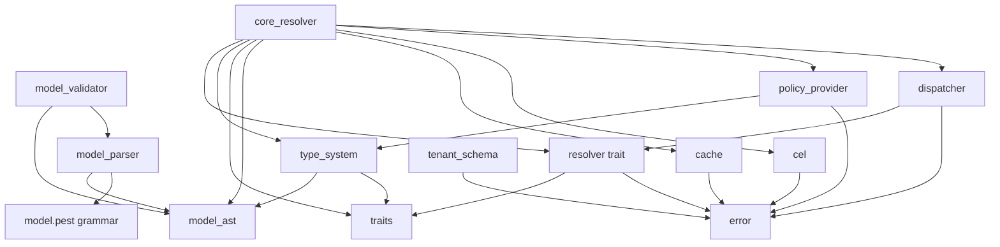
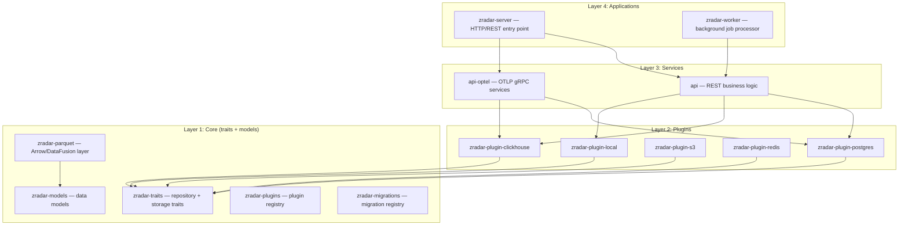

# Architecture — Full Dependency Graph

This document maps the dependency graph, layer structure, and module organization across all four projects.

## Layer Diagram

```mermaid
flowchart TD
    subgraph "authz-core (14 modules, zero dependencies)"
        A1[model_parser + model_ast + model.pest]
        A2[model_validator]
        A3[type_system]
        A4[traits — TupleReader, TupleWriter, PolicyReader/Writer]
        A5[core_resolver — CheckResolver impl]
        A6[resolver — CheckResolver trait]
        A7[cel — CEL condition evaluation]
        A8[cache — AuthzCache trait]
        A9[dispatcher — Dispatcher trait]
        A10[error — AuthzError]
        A11[tenant_schema — ChangelogReader]
        A12[policy_provider — PolicyProvider trait]
    end

    subgraph "pgauthz (pgrx extension)"
        B1[authz-datastore-pgx — SPI-based TupleReader/Writer]
        B2[pgauthz crate — SQL functions]
    end

    subgraph "dbrest (REST API server)"
        C1[dbrest-core — app, auth, config, plan, query, routing]
        C2[dbrest-postgres — PgBackend, PgDialect]
        C3[dbrest-sqlite — SqliteBackend, SqliteDialect]
    end

    subgraph "zradar (telemetry platform)"
        D1[zradar-models + zradar-traits + zradar-parquet]
        D2[plugins: postgres, clickhouse, s3, redis, local]
        D3[services: api, api-optel]
        D4[apps: zradar-server, zradar-worker]
    end

    B1 --> A4
    B2 --> A5
    B2 --> B1
    C1 --> A4
    C2 --> C1
    C3 --> C1
    D1 --> D2
    D2 --> D3
    D3 --> D4
```



## authz-core Module Dependency Graph



The resolver (`core_resolver.rs`) is the central hub — it depends on nearly every other module. The parser, validator, and type system form the "model layer" that produces a validated `TypeSystem`. The resolver, cache, CEL, dispatcher, and policy provider form the "evaluation layer" that uses the TypeSystem to answer checks.

## dbrest Crate Structure

```
dbrest/
├── src/main.rs              # Binary entry point — CLI, config, server start
├── src/lib.rs               # Re-exports from all sub-crates
├── crates/
│   ├── dbrest-core/         # Database-agnostic core
│   │   ├── api_request/     # Request parsing (payload, params, range)
│   │   ├── app/             # Server builder, handlers, router, streaming
│   │   ├── auth/            # JWT authentication middleware
│   │   ├── backend/         # DatabaseBackend + SqlDialect traits
│   │   ├── config/          # Config file parsing, env overrides
│   │   ├── error/           # Error types, HTTP status codes
│   │   ├── notifier/        # PostgreSQL LISTEN/NOTIFY support
│   │   ├── openapi/         # OpenAPI spec generation (utoipa)
│   │   ├── plan/            # Query action planning
│   │   ├── query/           # SQL query generation
│   │   ├── routing/         # URL routing, namespace support
│   │   ├── schema_cache/    # Database schema introspection cache
│   │   └── types/           # QualifiedIdentifier, MediaType, etc.
│   ├── dbrest-postgres/     # PostgreSQL backend
│   │   ├── dialect.rs       # PostgreSQL SQL dialect
│   │   ├── executor.rs      # PgBackend: sqlx::PgPool
│   │   ├── introspector.rs  # SqlxIntrospector: schema discovery
│   │   └── notifier.rs      # PostgreSQL LISTEN/NOTIFY
│   └── dbrest-sqlite/       # SQLite backend
│       ├── dialect.rs       # SQLite SQL dialect
│       ├── executor.rs      # SqliteBackend: sqlx::SqlitePool
│       └── introspector.rs  # SQLite schema discovery
```

## zradar Layered Architecture



**Aha:** zradar plugins are built as both `rlib` (for static linking) and `cdylib` (for dynamic loading). See `zradar/crates/plugins/zradar-plugin-postgres/Cargo.toml`:
```toml
[lib]
crate-type = ["rlib", "cdylib"]
```
This means plugins can be linked at compile time OR loaded at runtime from `.so` files — the architecture supports both deployment modes.

## pgauthz Crate Structure

```
pgauthz/
├── Cargo.toml               # Workspace: authz-datastore-pgx + pgauthz
├── crates/
│   ├── authz-datastore-pgx/  # SPI-based TupleReader/Writer impls
│   │   └── src/lib.rs        # PostgresDatastore via pgrx::spi
│   └── pgauthz/              # PostgreSQL extension
│       ├── src/lib.rs        # Extension entry, SQL functions
│       ├── src/cache.rs      # TypeSystem caching
│       ├── src/check_functions.rs   # pgauthz_check, pgauthz_check_with_context
│       ├── src/list_functions.rs    # list_objects, list_subjects
│       ├── src/guc.rs        # PostgreSQL GUC configuration variables
│       ├── src/metrics.rs    # Prometheus-style metrics
│       ├── src/telemetry.rs  # OpenTelemetry initialization
│       ├── src/tracing_bridge.rs    # tracing → pgrx logging bridge
│       ├── src/validation.rs # Input validation helpers
│       ├── src/matrix_runner.rs     # YAML matrix test runner
│       └── src/matrix_tests.rs      # Generated test cases
```

## Key Cross-Cutting Dependencies

| Dependency | Used By | Purpose |
|------------|---------|---------|
| `async-trait` | authz-core, pgauthz, dbrest, zradar | Async trait methods |
| `tokio` | All four | Async runtime |
| `tracing` | All four | Structured logging |
| `thiserror` | authz-core, dbrest, zradar | Error derive macros |
| `serde` / `serde_json` | All four | Serialization |
| `axum` | dbrest, zradar | HTTP server framework |
| `sqlx` | dbrest, zradar | Compile-time checked SQL |
| `pgrx` | pgauthz | PostgreSQL extension framework |
| `pest` / `pest_derive` | authz-core | Parser generator for model DSL |
| `cel` | authz-core | CEL condition evaluation |

## Aha: authz-core Has Zero Feature Flags

Source: `authz-core/src/lib.rs:91` — "This crate has no optional feature flags. All components are always compiled in." This is a deliberate choice: the core engine is small enough that conditional compilation would add complexity without meaningful binary size reduction. Every downstream consumer gets the full engine — parser, validator, resolver, CEL, cache — with no compile-time decisions about what to include.

## What to Read Next

Continue with [02-authz-core-model.md](02-authz-core-model.md) for the model DSL, AST, parser, and validator.
