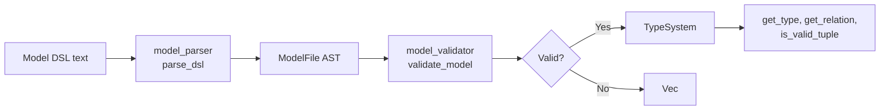

# authz-core Model Layer

The model layer transforms a text-based authorization policy into a validated, queryable type system. This is the foundation that the resolver uses to answer permission checks.

## The Pipeline



Source: `authz-core/src/lib.rs:12-16` — the main workflow is parse → build type system → implement TupleReader → construct CoreResolver.

## The Model DSL Grammar

The DSL is defined in `authz-core/src/model.pest` using the pest parser generator. It is inspired by OpenFGA syntax but has its own precedence rules and extensions.

### Grammar Structure

Source: `authz-core/src/model.pest` — 73 lines defining the complete grammar.

```
// Token-level rules
WHITESPACE = _{ " " | "\t" | "\r" | "\n" }
COMMENT    = _{ "//" ~ (!"\n" ~ ANY)* | "/*" ~ (!"*/" ~ ANY)* ~ "*/" }
identifier = @{ (ASCII_ALPHA | "_") ~ ((ASCII_ALPHANUMERIC | "_") | ("-" ~ (ASCII_ALPHANUMERIC | "_")))* }

// Top-level
file = { SOI ~ WHITESPACE* ~ (COMMENT ~ WHITESPACE*)* ~ (type_def | condition_def)* ~ WHITESPACE* ~ (COMMENT ~ WHITESPACE*)* ~ EOI }
```

The file rule allows zero or more `type_def` and `condition_def` blocks in any order. An empty file or comment-only file is valid — it produces an empty `ModelFile`.

### Type Definitions

```
type_def = { "type" ~ identifier ~ "{" ~ relations_block? ~ permissions_block? ~ "}" }
relations_block = { "relations" ~ relation_def+ }
permissions_block = { "permissions" ~ permission_def+ }
```

Types use different syntax for relations vs permissions:

```
relation_def = { "define" ~ identifier ~ ":" ~ relation_expr }
permission_def = { "define" ~ identifier ~ "=" ~ relation_expr }
```

**Aha:** Relations use colon syntax (`define viewer: [user]`) while permissions use equals (`define can_view = viewer + owner`). This is not cosmetic — the colon syntax indicates a **directly assignable** relation (tuples can be written for it), while the equals syntax indicates a **computed** relation (derived from other relations). The resolver only accepts tuple writes for colon-defined relations.

Source: `authz-core/src/model_ast.rs:13` — permissions are stored in a separate `Vec<RelationDef>` from relations on the same `TypeDef`.

### Expression Precedence

```
relation_expr  = { exclusion_expr }
exclusion_expr = { intersection_expr ~ ("-" ~ intersection_expr)? }
intersection_expr = { union_expr ~ ("&" ~ union_expr)* }
union_expr     = { primary_expr ~ ("+" ~ primary_expr)* }
```

The precedence (lowest to highest binding):

| Operator | Precedence | Example | Parses As |
|----------|-----------|---------|-----------|
| `-` (exclusion) | Lowest | `a & b - c` | `(a & b) - c` |
| `&` (intersection) | Middle | `a + b & c` | `a + (b & c)` |
| `+` (union) | Highest | `a + b + c` | `Union([a, b, c])` |

Source: `authz-core/src/model_parser.rs:570-608` — the test `test_parse_mixed_precedence_first_and_second_plus_third` confirms `first & second + third` parses as `Intersection([first, Union([second, third])])`.

### Primary Expressions

```
primary_expr = { direct_assignment | tuple_to_userset | computed_userset }
computed_userset = { identifier }
tuple_to_userset = { identifier ~ "->" ~ identifier }
direct_assignment = { "[" ~ (assignable_target ~ ("|" ~ assignable_target)*)? ~ "]" }
assignable_target = { type_spec ~ "#" ~ identifier | type_spec ~ ":*" | type_spec ~ "with" ~ identifier | type_spec }
```

Five expression types map to five AST variants:

| DSL Syntax | AST Variant | Meaning |
|------------|-------------|---------|
| `[user]` | `DirectAssignment([Type("user")])` | Direct type assignment |
| `[user \| group#member]` | `DirectAssignment([Type("user"), Userset{group, member}])` | Mixed types and usersets |
| `[user:*]` | `DirectAssignment([Wildcard("user")])` | Wildcard — all users of type |
| `[user with ip_check]` | `DirectAssignment([Conditional{Type("user"), "ip_check"}])` | Conditional assignment |
| `viewer` | `ComputedUserset("viewer")` | Rewrite to another relation |
| `parent->viewer` | `TupleToUserset{tupleset: "parent", computed_userset: "viewer"}` | Traverse a tuple |
| `a + b` | `Union([a, b])` | Union (OR) |
| `a & b` | `Intersection([a, b])` | Intersection (AND) |
| `a - b` | `Exclusion{base: a, subtract: b}` | Exclusion (NOT) |

### Condition Definitions

```
condition_def = { "condition" ~ identifier ~ "(" ~ (condition_param ~ ("," ~ condition_param)*)? ~ ")" ~ "{" ~ condition_expr ~ "}" }
condition_param = { identifier ~ ":" ~ param_type }
param_type = { "string" | "int" | "bool" | "list<string>" | "list<int>" | "list<bool>" | "map<string, string>" }
condition_expr = { (!"}" ~ ANY)+ }
```

Source: `authz-core/src/model.pest:66-72`. The condition expression is stored as a raw string — it is compiled to CEL at write-time (pgauthz) or evaluation-time (authz-core).

## The Parser

Source: `authz-core/src/model_parser.rs` — 214 lines of parser logic.

The `parse_dsl` function is the entry point:

```rust
// authz-core/src/model_parser.rs:15
pub fn parse_dsl(dsl: &str) -> Result<ModelFile, pest::error::Error<Rule>> {
    let mut pairs = ModelParser::parse(Rule::file, dsl)?;
    let file = pairs.next().expect("parser should return file root");
    // ... walk pairs, build AST nodes
    Ok(ModelFile { type_defs, condition_defs })
}
```

The parser uses pest's generated `ModelParser` (derived from `model.pest`) to tokenize the input, then walks the parse tree recursively:

```
parse_dsl → build_type_def → build_relations_block → build_relation_def → build_relation_expr
                                                                        → build_union_expr
                                                                        → build_intersection_expr
                                                                        → build_exclusion_expr
                                                                        → build_primary_expr
                                                                        → build_assignable_target
           → build_condition_def → build_condition_param
```

### Parser Edge Cases

- **Whitespace-only input**: returns empty `ModelFile` (no types, no conditions). Source: `model_parser.rs:320-339`.
- **Comment-only input**: returns empty `ModelFile`. Source: `model_parser.rs:341-361`.
- **Invalid syntax**: returns `pest::error::Error<Rule>`. Source: `model_parser.rs:364-368`.
- **Identifier with hyphens**: `my-type` is valid (hyphens allowed after first char). Source: `model.pest:10`.

## The AST

Source: `authz-core/src/model_ast.rs` — 64 lines of serde-serializable types.

```rust
// authz-core/src/model_ast.rs:4-7
pub struct ModelFile {
    pub type_defs: Vec<TypeDef>,
    pub condition_defs: Vec<ConditionDef>,
}

pub struct TypeDef {
    pub name: String,
    pub relations: Vec<RelationDef>,
    pub permissions: Vec<RelationDef>,
}

pub struct RelationDef {
    pub name: String,
    pub expression: RelationExpr,
}
```

### RelationExpr Enum

```rust
// authz-core/src/model_ast.rs:23-36
pub enum RelationExpr {
    Union(Vec<RelationExpr>),
    Intersection(Vec<RelationExpr>),
    Exclusion { base: Box<RelationExpr>, subtract: Box<RelationExpr> },
    ComputedUserset(String),
    TupleToUserset { computed_userset: String, tupleset: String },
    DirectAssignment(Vec<AssignableTarget>),
}
```

### AssignableTarget Enum

```rust
// authz-core/src/model_ast.rs:39-50
pub enum AssignableTarget {
    Type(String),
    Userset { type_name: String, relation: String },
    Wildcard(String),
    Conditional { target: Box<AssignableTarget>, condition: String },
}
```

### ConditionDef

```rust
// authz-core/src/model_ast.rs:53-63
pub struct ConditionDef {
    pub name: String,
    pub params: Vec<ConditionParam>,
    pub expression: String,
}

pub struct ConditionParam {
    pub name: String,
    pub param_type: String,
}
```

## The Validator

Source: `authz-core/src/model_validator.rs` — 679 lines of semantic validation.

The parser checks syntax; the validator checks semantics. A model can be syntactically valid but semantically broken.

```rust
// authz-core/src/model_validator.rs:133
pub fn validate_model(model: &ModelFile) -> Result<(), Vec<ValidationError>>
```

### Validation Checks

| Check | Category | Example Error |
|-------|----------|---------------|
| Duplicate type names | `DuplicateType` | `type user {} type user {}` |
| Duplicate relation names | `DuplicateRelation` | Two `define viewer:` in same type |
| Undefined relations in computed usersets | `UndefinedRelation` | `define viewer: editors` where `editors` not defined |
| Undefined relations in TTU tupleset | `UndefinedRelation` | `define viewer: parents->viewer` where `parents` not defined |
| Undefined types in direct assignments | `UndefinedType` | `define viewer: [nonexistent]` |
| Undefined condition references | `UndefinedCondition` | `define viewer: [user with unknown_cond]` |
| Cycles in computed usersets | `CycleDetected` | `define viewer: viewer` (self-cycle) |

### Cycle Detection

Source: `authz-core/src/model_validator.rs:29-45`. The validator builds a directed graph of computed userset dependencies per type, then runs DFS with three-color marking (Unvisited/Visiting/Visited).

```rust
// authz-core/src/model_validator.rs:76-119
fn detect_cycle_dfs(...) {
    state.insert(relation.to_string(), VisitState::Visiting);
    stack.push(relation.to_string());
    // ... walk neighbors
    // If we find a Visiting node, we have a cycle
    stack.pop();
    state.insert(relation.to_string(), VisitState::Visited);
}
```

The cycle path is reported: `document#viewer -> document#editor -> document#viewer`. Source: `model_validator.rs:99-103`.

### What the Validator Does NOT Check

- **TTU computed_userset targets**: The validator can't verify that `parent->viewer`'s `viewer` exists on the target type, because the target type is determined at runtime from tuple data. Source: `model_validator.rs:249-250`.
- **Cross-type relation references**: If `folder#viewer` references `folder#viewer` in a TTU, the validator doesn't check that the target type actually has that relation.

## The Type System

Source: `authz-core/src/type_system.rs` — 347 lines wrapping a `ModelFile` with query methods.

```rust
// authz-core/src/type_system.rs:11-13
pub struct TypeSystem {
    model: ModelFile,
}
```

### Query Methods

| Method | Purpose | Returns |
|--------|---------|---------|
| `get_all_types()` | List all type definitions | `&[TypeDef]` |
| `get_type(name)` | Find a type by name | `Option<&TypeDef>` |
| `get_relation(type_name, relation)` | Find a relation on a type (searches relations + permissions) | `Option<&RelationDef>` |
| `is_permission(type_name, relation)` | Check if a relation is a permission (not a relation) | `bool` |
| `get_condition(name)` | Find a condition by name | `Option<&ConditionDef>` |
| `get_directly_related_types(type_name, relation)` | Extract all `AssignableTarget`s from a relation's expression | `Vec<AssignableTarget>` |
| `is_valid_tuple(&Tuple)` | Validate a tuple against the model schema | `Result<(), String>` |

### Tuple Validation

Source: `authz-core/src/type_system.rs:77-143`. The `is_valid_tuple` method:

1. Checks the `object_type` exists in the model
2. Checks the `relation` exists in the type's relations (not permissions — only colon-syntax relations accept tuples)
3. Extracts assignable targets from the relation's expression
4. If no direct assignments exist (computed userset or TTU), any subject is allowed
5. Otherwise, checks that `subject_type` matches one of the allowed targets

```rust
// authz-core/src/type_system.rs:107-115
let subject_allowed = allowed_targets.iter().any(|target| match target {
    AssignableTarget::Type(type_name) => type_name == &tuple.subject_type,
    AssignableTarget::Userset { type_name, .. } => type_name == &tuple.subject_type,
    AssignableTarget::Wildcard(type_name) => type_name == &tuple.subject_type,
    AssignableTarget::Conditional { target, .. } => match target.as_ref() {
        AssignableTarget::Type(type_name) => type_name == &tuple.subject_type,
        _ => false,
    },
});
```

**Aha:** `is_valid_tuple` only checks relations (colon syntax), not permissions (equals syntax). This enforces the semantic distinction: permissions are derived, so you can't write tuples directly to them. A tuple `document:1#can_view@user:alice` is invalid even if `can_view` exists as a permission, because permissions aren't stored — they're computed.

## Real-World Model Example

```
type user {}

type organization {
    relations
        define member: [user]
        define admin: [user]
}

type folder {
    relations
        define parent: [folder]
        define owner: [user]
        define editor: [user | organization#member]
        define viewer: [user | organization#member]
    permissions
        define can_view = viewer + editor + owner
        define can_edit = editor + owner
        define can_delete = owner
}

type document {
    relations
        define parent: [folder]
        define owner: [user]
        define editor: [user | group#member | team#member]
        define viewer: [user | group#member]
    permissions
        define can_view = viewer + editor + owner + parent->can_view
        define can_edit = editor + owner + parent->can_edit
        define can_delete = owner
        define can_comment = can_view
}

condition ip_check(ip: string) {
    ip == "127.0.0.1"
}
```

Source: `authz-core/src/model_parser.rs:509-543` — this is the `test_parse_complex_real_world` test case. It produces 4 types with a total of 20 relations and 1 condition.

## What to Read Next

Continue with [03-authz-core-resolver.md](03-authz-core-resolver.md) for the check resolution engine that uses the TypeSystem to answer permission queries.
