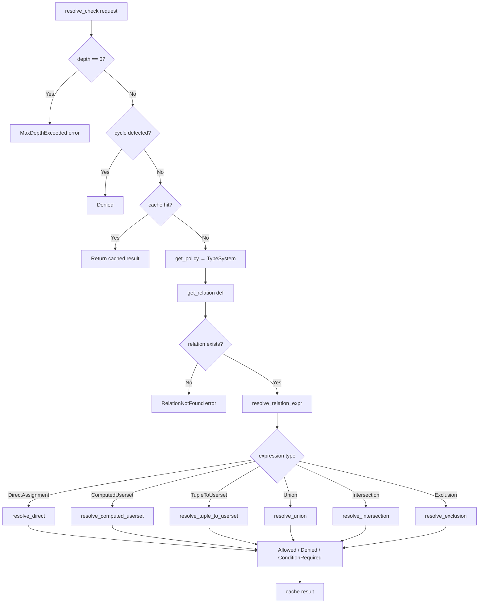

# authz-core — Check Resolution

The resolver is the engine that answers "can subject X do relation Y on object Z?" by walking the authorization model graph. This is the most complex module in authz-core.

## The Check Resolution Pipeline



Source: `authz-core/src/core_resolver.rs:667-753` — the `CheckResolver` impl for `CoreResolver`.

## ResolveCheckRequest

Source: `authz-core/src/resolver.rs:134-154`. Every check carries this payload:

```rust
pub struct ResolveCheckRequest {
    pub object_type: String,          // "document"
    pub object_id: String,            // "doc-42"
    pub relation: String,             // "can_view"
    pub subject_type: String,         // "user"
    pub subject_id: String,           // "alice"
    pub contextual_tuples: Vec<Tuple>,// Request-scoped tuples
    pub depth_remaining: u32,         // Default 25
    pub consistency: Consistency,     // FullyConsistent / AtLeastAsFresh / MinimizeLatency
    pub metadata: ResolverMetadata,   // Shared atomic counters
    pub recursion_config: RecursionConfig,
    pub visited: Vec<(String, String, String)>, // Cycle detection
    pub context: HashMap<String, serde_json::Value>, // CEL condition params
    pub at_revision: String,          // Revision for cache key
}
```

### Recursive Request Creation

Source: `authz-core/src/resolver.rs:212-235`. Child requests are created via `child_request()`:

```rust
pub fn child_request(&self, object_type, object_id, relation, subject_type, subject_id) -> Self
```

The child inherits `contextual_tuples`, `consistency`, `metadata` (shared atomic counters), `recursion_config`, `visited`, `context`, and `at_revision` from the parent. The key difference: `depth_remaining` is decremented by 1.

## ResolverMetadata

Source: `authz-core/src/resolver.rs:92-107`. Shared counters across all recursive dispatches:

```rust
pub struct ResolverMetadata {
    pub dispatch_count: Arc<AtomicU32>,       // Total dispatches across the check
    pub datastore_queries: Arc<AtomicU32>,    // Total datastore reads
    pub cache_hits: Arc<AtomicU32>,           // Total cache hits
    pub max_depth_reached: Arc<AtomicU32>,    // Deepest recursion level
}
```

**Aha:** Using `Arc<AtomicU32>` means every child request created via `child_request()` shares the same counters. Increments in deeply nested recursive calls are visible to the top-level caller. This enables performance reporting (e.g., "this check required 47 dispatches and 12 datastore queries") without threading a separate counter through the call stack.

## Recursion Strategies

Source: `authz-core/src/resolver.rs:20-76`.

| Strategy | Default Max Depth | Use Case |
|----------|-------------------|----------|
| `DepthFirst` | 25 | Fast, memory-efficient, good for shallow hierarchies |
| `BreadthFirst` | 50 | Optimal paths, memory-intensive, good for deep hierarchies |

```rust
pub struct RecursionConfig {
    pub strategy: RecursionStrategy,
    pub max_depth: u32,
    pub enable_cycle_detection: bool,
}
```

Builder pattern: `RecursionConfig::depth_first().max_depth(10).cycle_detection(true)`.

### Cycle Detection

Source: `authz-core/src/core_resolver.rs:680-690`. When enabled, the resolver tracks visited `(object_type, object_id, relation)` tuples:

```rust
if request.recursion_config.enable_cycle_detection {
    let current_key = (request.object_type.clone(), request.object_id.clone(), request.relation.clone());
    if request.visited.contains(&current_key) {
        return Ok(CheckResult::Denied); // Cycle detected
    }
    request.visited.push(current_key);
}
```

A cycle produces `Denied`, not an error. This matches Zanzibar semantics: a cyclic permission reference is treated as "no path found."

### Depth Limit

Source: `authz-core/src/core_resolver.rs:693-695`. When `depth_remaining == 0`, the resolver returns `AuthzError::MaxDepthExceeded` (an error, not a denial). This distinguishes "we ran out of depth" from "the user genuinely doesn't have this permission."

## Resolution Algorithms

### DirectAssignment

Source: `authz-core/src/core_resolver.rs:200-365`. The most common expression type.

**Algorithm:**
1. Read tuples for `(object_type, object_id, relation)` from the datastore (merging contextual tuples)
2. For each tuple, check if it matches any `AssignableTarget`:
   - `Type("user")` → match if `tuple.subject_type == "user" && tuple.subject_id == request.subject_id`
   - `Userset{type_name, relation}` → dispatch child check for the userset
   - `Wildcard("user")` → match if `tuple.subject_type == "user" && tuple.subject_id == "*" && request.subject_type == "user"`
   - `Conditional{target, condition}` → match base target, then evaluate CEL condition

**Aha:** For userset targets like `group#member`, the resolver strips any `#relation` suffix from the tuple's `subject_id` before the child dispatch. Source: `core_resolver.rs:246-251`. A tuple `document:1#viewer@group:eng#member` becomes a child check for `group:eng#member@user:alice`. The `split('#')` on `subject_id` handles the case where the subject itself is a userset reference.

### ComputedUserset

Source: `authz-core/src/core_resolver.rs:368-393`. Rewrites the check to the same object with a different relation.

```
document:1#can_view@user:alice  →  document:1#viewer@user:alice
```

Single recursive dispatch with the same object and subject but the target relation.

### TupleToUserset (TTU)

Source: `authz-core/src/core_resolver.rs:396-450`. The "parent pointer" pattern.

**Algorithm:**
1. Read tuples for `(object_type, object_id, tupleset_relation)` — e.g., `document:1#parent` → `[folder:root]`
2. For each parent tuple, dispatch: `(parent_type, parent_id, computed_relation, subject_type, subject_id)` — e.g., `folder:root#viewer@user:alice`
3. Return `Allowed` on first success

**Example:** `define can_view = parent->can_view` means "check if the parent folder grants can_view." The `parent` tupleset relation finds the parent object, then the `can_view` computed relation is checked on that parent.

### Union

Source: `authz-core/src/core_resolver.rs:453-550`. Returns `Allowed` if any branch succeeds.

Two strategies:

| Strategy | Behavior |
|----------|----------|
| `Batch` (default) | Evaluates DirectAssignment branches first, then falls back to sequential for others |
| `Parallel` | Spawns concurrent futures for all branches, returns on first success via `select_ok` |

**Aha:** The batch strategy doesn't actually batch database queries — it evaluates DirectAssignment branches individually first, then other expressions sequentially. The name is misleading. True batching (combining multiple datastore reads into one query) would require changes to the `TupleReader` trait.

### Intersection

Source: `authz-core/src/core_resolver.rs:553-571`. Returns `Allowed` only if ALL branches succeed.

Sequential evaluation with short-circuit: if any branch returns `Denied`, the whole intersection is denied immediately.

### Exclusion

Source: `authz-core/src/core_resolver.rs:574-595`. Boolean semantics: `Allowed` only if `base=Allowed AND subtract=Denied`.

**Aha:** The code uses boolean logic semantics, not set difference semantics. Source: `core_resolver.rs:579`: "Some systems use set difference semantics where A - B means elements in A NOT in B." This project explicitly chose boolean semantics because it matches the mental model of "user has the base permission AND is not excluded."

## Caching

Source: `authz-core/src/core_resolver.rs:54-60`. CoreResolver uses two cache layers:

| Layer | Caches | Key | Disabled When |
|-------|--------|-----|---------------|
| L2 | Check results | `{revision}:{object_type}:{object_id}:{relation}:{subject_type}:{subject_id}` | Contextual tuples present |
| L3 | Tuple reads | `{revision}:{object_type}:{object_id}:{relation}` | Contextual tuples present |

Both caches use the `AuthzCache<V>` trait. Default is `NoopCache` (disabled).

Source: `authz-core/src/cache.rs:33-48`. The trait:

```rust
pub trait AuthzCache<V: Clone + Send + Sync>: Send + Sync {
    fn get(&self, key: &str) -> Option<V>;
    fn insert(&self, key: &str, value: V);
    fn invalidate(&self, key: &str);
    fn invalidate_all(&self);
    fn metrics(&self) -> Box<dyn CacheMetrics>;
}
```

### Revision-Based Cache Keys

Source: `authz-core/src/core_resolver.rs:118-153`. Cache keys include `at_revision` as a prefix. When `at_revision` is empty (tests/legacy), the key omits it.

**Aha:** The revision prefix ensures that stale entries from older revisions are never served. When a write operation creates a new revision, the old cache entries (keyed by the old revision) are naturally orphaned — no explicit invalidation needed. This is quantized in pgauthz via `cache::quantize_revision()`.

### Contextual Tuple Bypass

Both L2 and L3 caches are bypassed when `contextual_tuples` is non-empty. Source: `core_resolver.rs:699-700` and `core_resolver.rs:609-610`. Contextual tuples are request-scoped and must not pollute the shared cache.

## Read Concurrency Control

Source: `authz-core/src/core_resolver.rs:626-628`. A semaphore limits concurrent datastore reads:

```rust
let _permit = self.read_semaphore.acquire().await.map_err(|e| {
    AuthzError::Internal(format!("Failed to acquire read semaphore: {}", e))
})?;
```

Default: 50 concurrent reads. Configurable via `with_max_concurrent()`.

## Check Strategy

Source: `authz-core/src/core_resolver.rs:43-49`.

```rust
pub enum CheckStrategy {
    Batch,    // Default — best for most cases
    Parallel, // Useful for high-latency datastores
}
```

Set via `resolver.with_strategy(CheckStrategy::Parallel)`.

## Error Handling

Source: `authz-core/src/error.rs:7-49`. The resolver can return these errors:

| Error | When |
|-------|------|
| `RelationNotFound { object_type, relation }` | Request references a relation that doesn't exist on the type |
| `MaxDepthExceeded` | Recursion depth limit reached |
| `Datastore(String)` | Datastore read/write failure |
| `CachePoisoned` | Internal cache lock failure |

`CheckResult::ConditionRequired` is NOT an error — it's a normal result indicating CEL condition parameters are needed.

## Performance Tracking

Source: `authz-core/src/core_resolver.rs:706-720`. The resolver tracks:
- Dispatch count (incremented on each `resolve_check` entry)
- Datastore queries (incremented on each `read_tuples` call)
- Max depth reached (tracked via `max_depth - depth_remaining`)

These are read via `request.metadata.get_dispatch_count()`, etc., after the check completes.

## What to Read Next

Continue with [04-authz-core-conditions.md](04-authz-core-conditions.md) for CEL condition evaluation, then [05-pgauthz.md](05-pgauthz.md) for the PostgreSQL extension.
