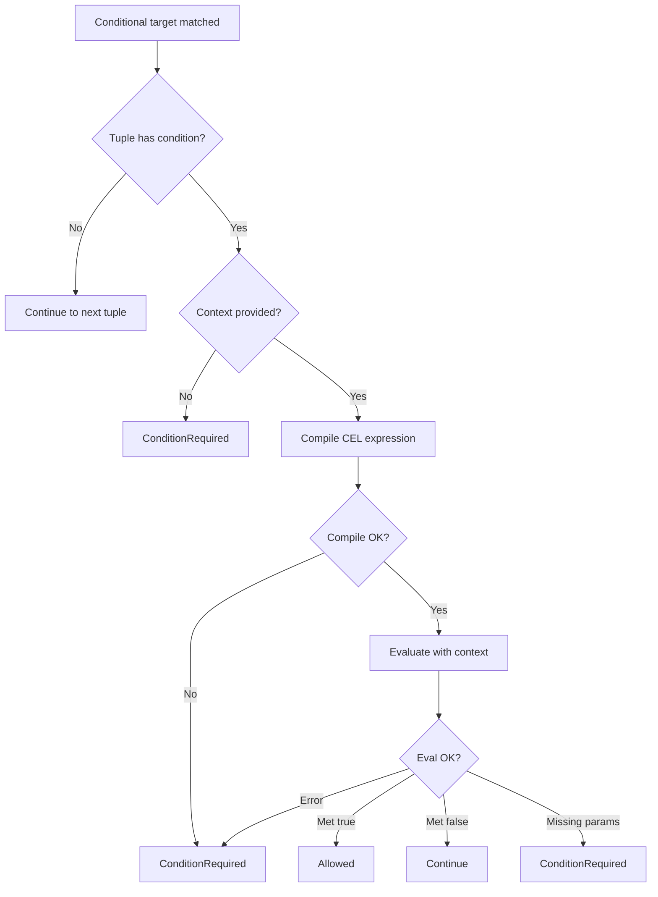

# authz-core — CEL Conditions

CEL (Common Expression Language) conditions enable attribute-based access control (ABAC) on top of the relationship-based model. Without conditions, authz-core supports RBAC and ReBAC (relationship-based access control). With conditions, it supports ABAC — permissions that depend on request attributes like IP address, time of day, or resource tags.

## Where Conditions Appear

Conditions integrate at two points in the authorization model:

### 1. Conditional Type Assignments

```
type document {
    relations
        define viewer: [user with ip_check]
}

condition ip_check(allowed_cidrs: list<string>, request_ip: string) {
    request_ip in allowed_cidrs
}
```

Source: `authz-core/src/model.pest:58` — `assignable_target` supports `type_spec ~ "with" ~ identifier`.

When a tuple is written with this relation, it must carry the condition name:
```
document:1#viewer@user:alice  ← condition: "ip_check"
```

### 2. Condition Evaluation During Resolution

Source: `authz-core/src/core_resolver.rs:298-358`. When the resolver encounters a `Conditional` target:



## CEL Module

Source: `authz-core/src/cel.rs` — 222 lines wrapping the `cel` crate (v0.12.0).

### Types

```rust
// authz-core/src/cel.rs:30-35
pub enum Value {
    Bool(bool),
    Int(i64),
    String(String),
    List(Vec<Value>),
}
```

The `Value` type maps JSON values to CEL values. Notably, `Map` is not supported — the condition parameters are flat key-value pairs.

```rust
// authz-core/src/cel.rs:24-27
pub enum CelResult {
    Met(bool),               // Evaluation succeeded — true or false
    MissingParameters(Vec<String>), // Required context variables not provided
}
```

### Compile and Evaluate

```rust
// authz-core/src/cel.rs:38
pub fn compile(expr: &str) -> Result<Program, CelError>

// authz-core/src/cel.rs:45
pub fn evaluate(program: &Program, context: &HashMap<String, Value>) -> Result<CelResult, CelError>
```

**Aha:** CEL expressions are compiled on every evaluation, not cached. Source: `core_resolver.rs:314` — `crate::cel::compile(&cond_def.expression)` is called inside the resolution loop. For production workloads with repeated condition checks, this means the same CEL expression is re-compiled on every check. A program-level CEL cache would reduce this overhead.

### Context Value Conversion

Source: `authz-core/src/core_resolver.rs:16-39`. The resolver converts `HashMap<String, serde_json::Value>` to `HashMap<String, cel::Value>`:

```rust
fn json_context_to_cel(context: &HashMap<String, serde_json::Value>) -> HashMap<String, crate::cel::Value> {
    // Bool → Bool, Number → Int (via as_i64), String → String, Array → List
    // Null and Object are silently dropped (return None)
}
```

### Missing Parameter Detection

Source: `authz-core/src/cel.rs:84-95`. When a CEL evaluation fails with "undeclared" or "not found" in the error message, the module extracts the missing variable name:

```rust
if err_lower.contains("undeclared") || err_lower.contains("not found") {
    let missing = extract_missing_variable(&err_msg);
    Ok(CelResult::MissingParameters(vec![missing]))
}
```

The `extract_missing_variable` function parses error messages like `"undeclared reference to 'x'"` to extract the variable name `x`.

## Condition Parameter Types

Source: `authz-core/src/model.pest:70`. The DSL supports these parameter types:

| Type | CEL Type | Example |
|------|----------|---------|
| `string` | `string` | `"127.0.0.1"` |
| `int` | `int` | `42` |
| `bool` | `bool` | `true` |
| `list<string>` | `list` | `["10.0.0.0/8", "172.16.0.0/12"]` |
| `list<int>` | `list` | `[1, 2, 3]` |
| `list<bool>` | `list` | `[true, false]` |
| `map<string, string>` | Not fully supported | — |

## Condition Validation

Source: `authz-core/src/model_validator.rs:367-464`. The validator checks that condition references in `AssignableTarget::Conditional` point to defined conditions:

```rust
fn check_undefined_conditions(model: &ModelFile, errors: &mut Vec<ValidationError>) {
    let condition_names: HashSet<&str> = model.condition_defs.iter().map(|c| c.name.as_str()).collect();
    // Walk all relation expressions, check Conditional targets reference known conditions
}
```

## Condition Compilation at Write Time

Source: `authz-datastore-pgx/src/lib.rs:290-298`. pgauthz compiles all conditions when writing a policy:

```rust
for condition in &parsed_model.condition_defs {
    authz_core::cel::compile(&condition.expression).map_err(|e| {
        AuthzError::ModelValidation(format!("Invalid condition '{}': {}", condition.name, e))
    })?;
}
```

This rejects invalid CEL syntax at policy write time, rather than deferring the error to check evaluation time.

## Real-World Condition Examples

### IP Address Check

```
condition ip_check(allowed_cidrs: list<string>, request_ip: string) {
    request_ip in allowed_cidrs
}
```

Context: `{"allowed_cidrs": ["10.0.0.0/8"], "request_ip": "10.1.2.3"}`

### Time-Based Access

```
condition business_hours(start_hour: int, end_hour: int, current_hour: int) {
    current_hour >= start_hour && current_hour < end_hour
}
```

Context: `{"start_hour": 9, "end_hour": 17, "current_hour": 14}`

### Ownership Check

```
condition is_owner(owner_id: string, user_id: string) {
    owner_id == user_id
}
```

Context: `{"owner_id": "alice", "user_id": "alice"}`

## ConditionRequired Semantics

When a check requires condition parameters, the resolver returns `CheckResult::ConditionRequired(Vec<String>)` with the missing condition names. The caller must then:

1. Provide the context values
2. Re-issue the check with the `context` field populated

Source: `authz-core/src/resolver.rs:12-16`:
```rust
pub enum CheckResult {
    Allowed,
    Denied,
    ConditionRequired(Vec<String>), // Names of conditions that need context
}
```

**Aha:** The resolver returns the *condition name*, not the individual parameter names. If the condition is `ip_check`, the caller gets `ConditionRequired(["ip_check"])`, not `ConditionRequired(["allowed_cidrs", "request_ip"])`. The caller must look up the condition definition to know what parameters to provide.

## What to Read Next

Continue with [05-pgauthz.md](05-pgauthz.md) for how all of this integrates into PostgreSQL as a pgrx extension.
