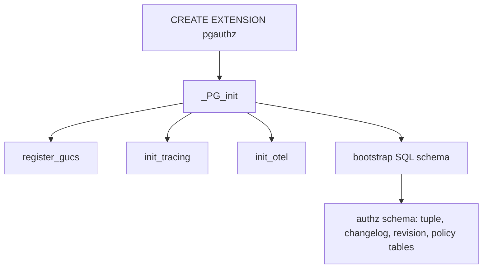
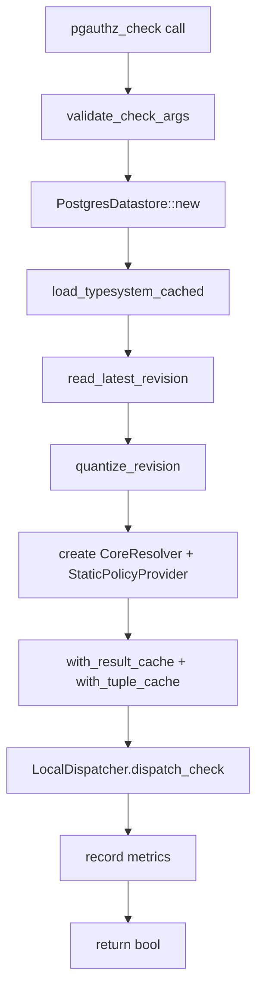

# pgauthz — PostgreSQL Extension

pgauthz embeds authz-core into PostgreSQL as a native extension, exposing authorization functions directly in SQL. It uses pgrx (Postgres extension framework in Rust) and the SPI (Server Programming Interface) to read/write tuples and policies from PostgreSQL tables.

## Extension Lifecycle



Source: `pgauthz/crates/pgauthz/src/lib.rs:33-41`.

## PostgreSQL Schema

The extension bootstraps its schema via `sql/init.sql`. The key tables are:

| Table | Purpose |
|-------|---------|
| `authz.tuple` | Relationship tuples: `(object_type, object_id, relation, subject_type, subject_id, condition)` |
| `authz.changelog` | Change log for Watch API: adds `operation` and `ulid` columns |
| `authz.revision` | Revision tracking: `(revision_id, created_at)` |
| `authz.authorization_policy` | Model definitions: `(id, definition, created_at)` |

## SQL Functions

### Policy Management

#### `pgauthz_define_policy(definition TEXT) RETURNS TEXT`

Source: `pgauthz/crates/pgauthz/src/lib.rs:45-58`. Parses the model DSL, validates it (parser + validator + CEL compilation), and stores it in `authz.authorization_policy` with a ULID.

```sql
SELECT pgauthz_define_policy($$
    type user {}
    type document {
        relations define viewer: [user]
    }
$$);
```

**Aha:** pgauthz validates the policy at write time using three layers: parsing (`model_parser::parse_dsl`), semantic validation (`model_validator::validate_model`), and CEL compilation (`authz_core::cel::compile`). This means a bad model is rejected immediately, not when the first check fails. Source: `authz-datastore-pgx/src/lib.rs:260-298`.

#### `pgauthz_read_latest_policy() RETURNS TABLE(id TEXT, definition TEXT)`

Returns the most recently written policy.

#### `pgauthz_read_policy(policy_id TEXT) RETURNS TABLE(id TEXT, definition TEXT)`

Returns a specific policy by ID.

#### `pgauthz_list_policies(page_size INT, continuation_token TEXT) RETURNS TABLE(id TEXT, definition TEXT)`

Paginated policy listing. Default page size: 100.

#### `pgauthz_read_latest_policy_computed() RETURNS TABLE(...)`

Returns the parsed model structure with relations, permissions, and conditions expanded. Source: `pgauthz/crates/pgauthz/src/lib.rs:221-304`.

Output columns:
- `policy_id`, `type_name`, `relation_name`, `relation_type` ("relation"/"permission"/"condition")
- `expression_json` — the AST as JSON
- `condition_name`, `condition_params_json`, `condition_expression`

**Aha:** This function parses the raw DSL string into the full AST and emits one row per relation/permission/condition. It's designed for introspection — a client can reconstruct the entire authorization model structure without parsing the DSL themselves.

### Relationship Management

#### `pgauthz_add_relation(object_type, object_id, relation, subject_type, subject_id, condition) RETURNS TEXT`

Source: `pgauthz/crates/pgauthz/src/lib.rs:110-127`. Simplified wrapper around `pgauthz_write_relationships`. Returns the revision ULID.

#### `pgauthz_write_relationships(writes PgRelationship[], deletes PgRelationship[]) RETURNS TEXT`

Source: `pgauthz/crates/pgauthz/src/lib.rs:85-106`. Batch write/delete with changelog tracking.

```sql
SELECT pgauthz_write_relationships(
    ARRAY[
        ROW('document', 'doc1', 'viewer', 'user', 'alice', NULL)::pgauthz.PgRelationship,
        ROW('document', 'doc1', 'editor', 'user', 'bob', NULL)::pgauthz.PgRelationship
    ],
    ARRAY[]::pgauthz.PgRelationship[]
);
```

#### `pgauthz_read_relationships(object_type, object_id, relation, subject_type, subject_id) RETURNS TABLE(...)`

Filtered tuple read. All parameters are optional — omit to wildcard.

### Check Functions

#### `pgauthz_check(object_type, object_id, relation, subject_type, subject_id) RETURNS BOOLEAN`

Source: `pgauthz/crates/pgauthz/src/check_functions.rs:147-162`. The main check function.

```sql
SELECT pgauthz_check('document', 'doc1', 'viewer', 'user', 'alice');
-- Returns: true or false
```

#### `pgauthz_check_with_context(object_type, object_id, relation, subject_type, subject_id, context_json TEXT) RETURNS BOOLEAN`

Source: `pgauthz/crates/pgauthz/src/check_functions.rs:165-186`. Same as `pgauthz_check` but with CEL condition context as JSON.

```sql
SELECT pgauthz_check_with_context(
    'document', 'doc1', 'viewer', 'user', 'alice',
    '{"request_ip": "10.1.2.3", "allowed_cidrs": ["10.0.0.0/8"]}'
);
```

#### `pgauthz_expand(object_type, object_id, relation) RETURNS TEXT`

Source: `pgauthz/crates/pgauthz/src/check_functions.rs:190-224`. Returns the relation's expression as JSON for debugging. Not a full tree expansion — just the AST node.

### Watch API

#### `pgauthz_read_changes(object_type TEXT, after_ulid TEXT, page_size INT) RETURNS TABLE(...)`

Source: `pgauthz/crates/pgauthz/src/lib.rs:308-354`. Returns changelog entries for a given object type, paginated by ULID cursor.

Output: `(object_type, object_id, relation, subject_type, subject_id, operation, ulid)`.

## Check Function Internals

Source: `pgauthz/crates/pgauthz/src/check_functions.rs:17-143`. The `do_check` function:



Key steps:

1. **Argument validation** — rejects empty/null parameters
2. **TypeSystem loading** — cached from the latest policy via `cache::load_typesystem_cached`
3. **Revision quantization** — raw ULID is quantized to a time bucket for cache keys
4. **Resolver construction** — `CoreResolver` with `StaticPolicyProvider` (single-tenant: one global policy), injected caches, and GUC-configured check strategy
5. **Dispatch** — `LocalDispatcher` calls the resolver
6. **Metrics** — records check duration, result, depth, dispatch count, and datastore queries

## GUC Configuration Variables

Source: `pgauthz/crates/pgauthz/src/guc.rs`. PostgreSQL GUC (Grand Unified Configuration) variables:

| GUC | Purpose | Default |
|-----|---------|---------|
| Check strategy | Batch vs Parallel resolution | Batch |
| Revision quantization seconds | Time bucket for revision cache keys | Configurable |

GUCs are registered in `_PG_init` and read via `guc::get_check_strategy()`, `guc::get_revision_quantization_secs()`.

## Caching

Source: `pgauthz/crates/pgauthz/src/cache.rs`. pgauthz caches two things:

1. **TypeSystem cache** — the parsed and validated authorization model. Loaded once, shared across all checks. Invalidated when a new policy is written.

2. **Result and tuple caches** — the same `AuthzCache` trait from authz-core, with a concrete implementation (likely moka or similar) injected at resolver construction time.

### Revision Quantization

Source: `pgauthz/crates/pgauthz/src/cache.rs`. The `quantize_revision` function converts a raw ULID/timestamp into a time-bucketed value:

```rust
fn quantize_revision(raw_revision: &str, quantum_secs: u64) -> String
```

This ensures that cache keys are stable within a time window (e.g., 60 seconds), reducing cache churn for near-simultaneous checks.

## Metrics

Source: `pgauthz/crates/pgauthz/src/metrics.rs`. pgauthz tracks:

| Metric | Recorded When |
|--------|---------------|
| Check duration | Every check completion |
| Check result (allowed/denied) | Every check completion |
| Tuple write count | Every `write_tuples` call |
| Tuple read count | Every `read_tuples` call |
| Resolution depth | After each check |
| Dispatch count | After each check |
| Datastore queries | After each check |

## Tracing and OpenTelemetry

### Tracing Bridge

Source: `pgauthz/crates/pgauthz/src/tracing_bridge.rs`. Bridges Rust `tracing` spans to PostgreSQL's `ereport()` logging system. Since pgrx extensions run inside the PostgreSQL backend process, they can't use standard stdout/stderr — logging must go through PostgreSQL's error reporting system.

### OpenTelemetry

Source: `pgauthz/crates/pgauthz/src/telemetry.rs`. Initializes OpenTelemetry tracing if enabled. Traces from pgauthz can be correlated with traces from other services via W3C TraceContext headers.

## The PostgresDatastore

Source: `authz-datastore-pgx/src/lib.rs`. Implements all authz-core traits using PostgreSQL SPI:

| Trait | Implementation |
|-------|---------------|
| `TupleReader` | `SELECT ... FROM authz.tuple WHERE ...` via SPI |
| `TupleWriter` | `INSERT/DELETE FROM authz.tuple` + changelog entries + revision insert |
| `PolicyReader` | `SELECT ... FROM authz.authorization_policy WHERE ...` |
| `PolicyWriter` | `INSERT INTO authz.authorization_policy ... ON CONFLICT DO UPDATE` |
| `ChangelogReader` | `SELECT ... FROM authz.changelog WHERE object_type = ... ORDER BY ulid` |
| `RevisionReader` | `SELECT revision_id FROM authz.revision ORDER BY created_at DESC LIMIT 1` |

### Feature Flag: pgx vs Stub

Source: `authz-datastore-pgx/src/lib.rs:25-137`. When built without the `pgx` feature, all trait implementations return stub errors. This allows the crate to compile in CI environments without pgrx installed.

### Tuple Validation on Write

Source: `authz-datastore-pgx/src/lib.rs:557-608`. When writing tuples, the datastore validates them against the current authorization model:

1. Parse the latest policy
2. Find the object type in the AST
3. Find the relation in the type's relations
4. Extract allowed types from the relation expression
5. Reject if the subject type isn't in the allowed list

This catches errors like writing `photo:1#viewer@user:alice` when the model only defines `document` type, not `photo`.

## Matrix Testing Framework

Source: `pgauthz/crates/pgauthz/src/matrix_runner.rs` and `matrix_tests.rs`. pgauthz includes a YAML-based test matrix runner:

```yaml
name: "basic_check"
model: |
  type user {}
  type document {
    relations define viewer: [user]
  }
tests:
  - name: "allow_viewer"
    setup:
      tuples:
        - object: "document:doc1"
          relation: "viewer"
          subject: "user:alice"
    assertions:
      - type: "Check"
        object: "document:doc1"
        relation: "viewer"
        subject: "user:alice"
        allowed: true
```

Source: `pgauthz/crates/pgauthz/src/lib.rs:758-788`. Tests can be inline YAML or loaded from files in `tests/matrix/`. The test matrix covers:

- Basic checks
- Direct assignments
- Tuple operations (write/delete)
- Model operations
- Grammar tests
- Set operations (union, intersection, exclusion)
- Wildcard semantics
- Nested groups and exclusions
- Identifier edge cases
- Expand semantics
- List objects/subjects semantics
- Conditions and context
- Expiration semantics

## PgRelationship Type

Source: `pgauthz/crates/pgauthz/src/lib.rs:60-81`. A PostgreSQL-compatible struct that maps to authz-core's `Tuple`:

```rust
#[derive(PostgresType, Serialize, Deserialize, Debug, Clone)]
pub struct PgRelationship {
    pub object_type: String,
    pub object_id: String,
    pub relation: String,
    pub subject_type: String,
    pub subject_id: String,
    pub condition: Option<String>,
}
```

This type is registered with PostgreSQL via `#[derive(PostgresType)]` and can be used in SQL as `pgauthz.PgRelationship`.

## What to Read Next

Continue with [06-dbrest.md](06-dbrest.md) for the REST API layer, or [08-data-flow.md](08-data-flow.md) for end-to-end flow diagrams.
