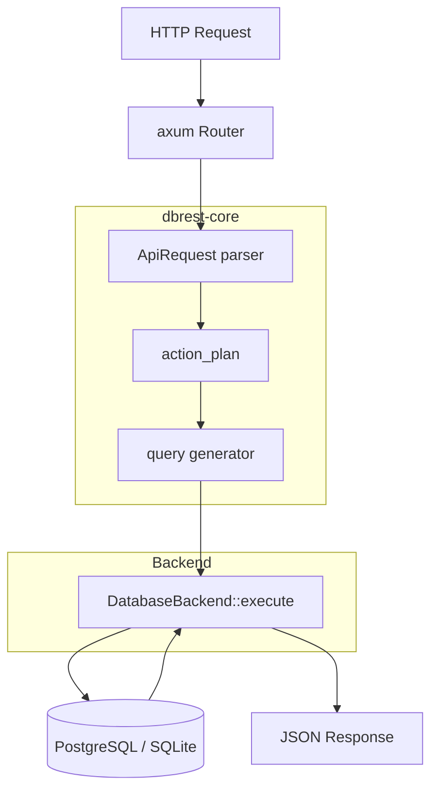
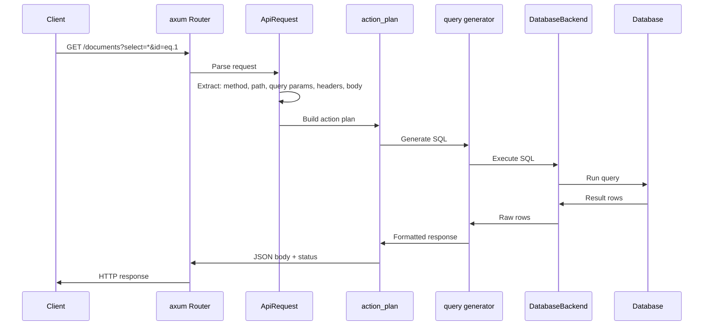

# dbrest — REST API for Databases

dbrest auto-generates a REST API from a database's schema. Connect it to a PostgreSQL or SQLite database, and it introspects the tables, columns, types, and relationships to produce CRUD endpoints — no manual route definitions needed.

## Architecture



## Crate Structure

```
dbrest/
├── src/main.rs           # Binary: CLI args → config → detect backend → start
├── src/lib.rs            # Re-exports all sub-crates
├── crates/
│   ├── dbrest-core/      # Database-agnostic: routing, query generation, auth
│   ├── dbrest-postgres/  # PostgreSQL: PgBackend, PgDialect, SqlxIntrospector
│   └── dbrest-sqlite/    # SQLite: SqliteBackend, SqliteDialect, SqliteIntrospector
```

Source: `dbrest/src/main.rs:1-78`.

## Server Startup

Source: `dbrest/src/main.rs:40-78`. The binary entry point:

1. Parse CLI args (`--config`, `--db-uri`, `--port`)
2. Load config (file + env overrides + CLI overrides)
3. Initialize tracing (fmt + optional OTLP)
4. Initialize metrics (optional OTLP)
5. Detect backend from URI (`sqlite:` prefix or `.sqlite`/`.db` suffix)
6. Create backend pool
7. Start axum server

### CLI Arguments

```
dbrest [OPTIONS]

Options:
  -c, --config <CONFIG>    Path to config file [env: DBREST_CONFIG]
      --db-uri <DB_URI>    Database connection URI [env: DBREST_DB_URI]
  -p, --port <PORT>        Server bind port [env: DBREST_SERVER_PORT]
```

### Backend Detection

Source: `dbrest/src/main.rs:186-188`:

```rust
fn is_sqlite_uri(uri: &str) -> bool {
    uri.starts_with("sqlite:") || uri.ends_with(".sqlite") || uri.ends_with(".db")
}
```

## The Pluggable Backend Pattern

### DatabaseBackend Trait

Source: `dbrest-core/src/backend/mod.rs`. The core abstraction:

| Method | Purpose |
|--------|---------|
| `connect(uri, pool_size, ...)` | Create a connection pool |
| `version()` | Return database version string |
| `min_version()` | Return minimum supported version |
| `execute(query, params)` | Execute a SQL query |
| `introspect()` | Discover schema (tables, columns, types) |

### SqlDialect Trait

Source: `dbrest-core/src/backend/mod.rs`. Handles SQL syntax differences:

| Method | Purpose |
|--------|---------|
| `quote_identifier(name)` | Quote table/column names (PG: `"name"`, SQLite: `"name"`) |
| `pagination_sql(...)` | Generate LIMIT/OFFSET syntax |
| `type_mapping(...)` | Map database types to JSON types |

### Concrete Backends

| Backend | Source | Connection |
|---------|--------|------------|
| `PgBackend` | `dbrest-postgres/src/executor.rs` | `sqlx::PgPool` |
| `SqliteBackend` | `dbrest-sqlite/src/executor.rs` | `sqlx::SqlitePool` |

Each backend implements:
- `DatabaseBackend` — connection management, execution
- `SqlDialect` — SQL syntax generation
- `Introspector` — schema discovery

## Request Processing Pipeline



### ApiRequest Parsing

Source: `dbrest-core/src/api_request/`. Parses HTTP requests into a structured query specification:

| Component | Source File | Purpose |
|-----------|-------------|---------|
| `mod.rs` | `api_request/mod.rs` | Main ApiRequest struct |
| `query_params.rs` | `api_request/query_params.rs` | `?select=`, `?id=eq.1`, `?order=` |
| `range.rs` | `api_request/range.rs` | Range headers, pagination |
| `payload.rs` | `api_request/payload.rs` | Request body parsing |
| `preferences.rs` | `api_request/preferences.rs` | Content negotiation, preferences |
| `types.rs` | `api_request/types.rs` | Filter operators, sort direction |

#### Filter Syntax

```
?id=eq.1          → WHERE id = 1
?name=ilike.alex  → WHERE name ILIKE '%alex%'
?age=gt.18        → WHERE age > 18
?status=in.(active,pending) → WHERE status IN ('active', 'pending')
```

#### Select Syntax

```
?select=*           → SELECT *
?select=id,name     → SELECT id, name
?select=*,count(*)  → SELECT *, COUNT(*) OVER ()
```

### Action Planning

Source: `dbrest-core/src/plan/`. The `action_plan` function converts an `ApiRequest` into a sequence of database actions:

| Action | When |
|--------|------|
| SELECT | GET request |
| INSERT | POST request |
| UPDATE | PATCH request |
| DELETE | DELETE request |

The planner considers:
- HTTP method
- Query parameters (filters, select, order, range)
- Request body (for mutations)
- Schema cache (to resolve column types)

### Query Generation

Source: `dbrest-core/src/query/`. Generates SQL from the action plan, using the `SqlDialect` for database-specific syntax.

## Schema Introspection

Source: `dbrest-core/src/schema_cache.rs`. On startup, dbrest queries the database's information schema to discover:

- Tables and views
- Columns (name, type, nullable, default)
- Primary keys
- Foreign keys (for relationship endpoints)

This is cached in `SchemaCache` and `SchemaCacheHolder` for fast lookup during request processing.

### PgBackend Introspector

Source: `dbrest-postgres/src/introspector.rs`. Queries PostgreSQL's `information_schema` and `pg_catalog`:

```sql
SELECT table_name, column_name, data_type, is_nullable
FROM information_schema.columns
WHERE table_schema = 'public'
```

### SqliteBackend Introspector

Source: `dbrest-sqlite/src/introspector.rs`. Uses SQLite's `PRAGMA table_info()`:

```sql
PRAGMA table_info(table_name)
```

## Authentication

Source: `dbrest-core/src/auth/`. JWT-based authentication with caching.

| Component | Source | Purpose |
|-----------|--------|---------|
| `jwt.rs` | `auth/jwt.rs` | JWT token parsing and validation |
| `middleware.rs` | `auth/middleware.rs` | axum middleware for auth |
| `cache.rs` | `auth/cache.rs` | JWT validation cache (`JwtCache`) |
| `types.rs` | `auth/types.rs` | `AuthState`, `AuthResult` |
| `error.rs` | `auth/error.rs` | Auth-specific errors |

JWT configuration includes:
- Secret/key for signature verification
- Algorithm (HS256, RS256, etc.)
- Expiration validation

Source: `dbrest-core/src/config/jwt.rs`.

## Configuration

Source: `dbrest-core/src/config/`. Config can come from:

1. TOML config file (`--config` flag)
2. Environment variables (`DBREST_*`)
3. CLI arguments (override everything)

Key settings:
- `db_uri` — database connection string
- `server_port` — HTTP bind port
- `db_pool_size` — connection pool size
- `db_pool_acquisition_timeout` — pool wait timeout
- `db_pool_max_lifetime` — max connection lifetime
- `db_pool_max_idletime` — max idle time
- `db_busy_timeout_ms` — SQLite busy timeout
- `tracing_enabled` — enable OTLP tracing
- `metrics_enabled` — enable OTLP metrics
- `metrics_otlp_endpoint` — OTLP collector endpoint
- `metrics_service_name` — service name for OTLP
- `metrics_export_interval_secs` — metrics push interval

## OpenTelemetry Integration

Source: `dbrest/src/main.rs:84-183`. Two separate OTLP exporters:

### Tracing (Spans)

```rust
let tracer_provider = opentelemetry_sdk::trace::SdkTracerProvider::builder()
    .with_batch_exporter(exporter)
    .with_sampler(Sampler::TraceIdRatioBased(config.tracing_sampling_ratio))
    .with_resource(opentelemetry_sdk::Resource::builder().with_service_name(service_name).build())
    .build();
```

Uses W3C TraceContext propagator for traceparent header extraction. Sampling is ratio-based.

### Metrics

```rust
let reader = opentelemetry_sdk::metrics::PeriodicReader::builder(exporter)
    .with_interval(Duration::from_secs(config.metrics_export_interval_secs))
    .build();
```

Push-based metrics on a configurable interval.

### Pool Metrics Reporter

Source: `dbrest-core/src/app/metrics.rs`. Reports connection pool statistics (active, idle, total connections) when metrics are enabled.

## OpenAPI Generation

Source: `dbrest-core/src/openapi/`. Auto-generates OpenAPI 3.0 spec from the schema cache. Uses `utoipa` with `axum_extras` feature for automatic endpoint documentation.

Available at `/swagger-ui` when `utoipa-swagger-ui` is enabled.

## Routing

Source: `dbrest-core/src/routing.rs`. URL-based routing with namespace support:

| Pattern | Endpoint |
|---------|----------|
| `/{table}` | CRUD on table |
| `/{table}/{id}` | Single row operations |
| `/{table}?select=...` | Filtered queries |
| `/rpc/{function}` | Stored procedure calls |

Namespaces (`NamespaceId`) allow multiple database schemas to be exposed under different URL prefixes.

## Error Handling

Source: `dbrest-core/src/error/`. The `Error` enum covers:

| Error | HTTP Status |
|-------|-------------|
| `UnsupportedPgVersion` | 500 |
| `ConfigError` | 500 |
| `AuthError` | 401 |
| `QueryError` | 400 |
| `NotFoundError` | 404 |
| `ValidationError` | 400 |

Error responses include structured JSON with `code`, `message`, and `details` fields.

## Streaming

Source: `dbrest-core/src/app/streaming.rs`. Supports streaming responses for large result sets using axum's `SSE` (Server-Sent Events) or chunked transfer encoding.

## Connection Pool Configuration

Both PostgreSQL and SQLite backends share the same pool parameters:

| Parameter | Default | Purpose |
|-----------|---------|---------|
| `db_pool_size` | Configurable | Max connections in pool |
| `db_pool_acquisition_timeout` | Configurable | Max wait for connection |
| `db_pool_max_lifetime` | Configurable | Max connection age |
| `db_pool_max_idletime` | Configurable | Max idle time before recycling |
| `db_busy_timeout_ms` | Configurable | SQLite busy wait timeout |

Source: `dbrest/src/main.rs:193-200` (PostgreSQL) and `dbrest/src/main.rs:228-235` (SQLite).

## Performance Profile

Source: `dbrest/Cargo.toml` — release profile:

```toml
[profile.release]
opt-level = 3
lto = true
codegen-units = 1
strip = true
```

Full LTO with single codegen unit for maximum optimization. Binary stripping for smaller deployment size.

## Benchmarks

Source: `dbrest/Cargo.toml` — 4 benchmark targets:

| Benchmark | Purpose |
|-----------|---------|
| `micro_benchmarks` | Individual component performance |
| `integration_benchmarks` | End-to-end request latency |
| `load_tester` | Concurrent request throughput |
| `bench_metrics` | Metrics overhead measurement |

## What to Read Next

Continue with [07-zradar.md](07-zradar.md) for the telemetry platform, or [08-data-flow.md](08-data-flow.md) for end-to-end flow diagrams across all projects.
