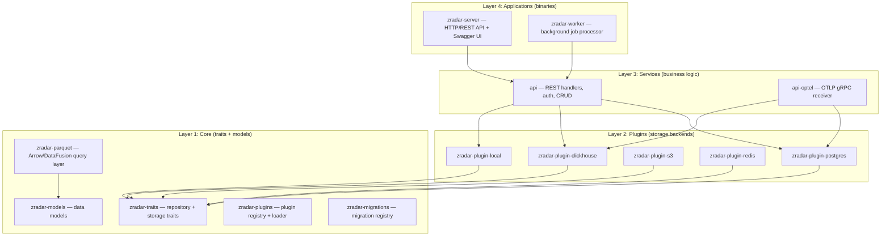
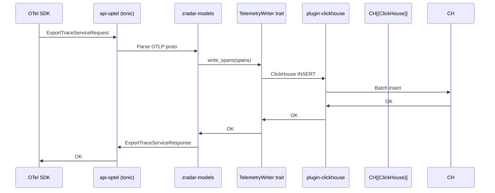

# zradar — Telemetry Platform

zradar is a telemetry ingestion and storage platform built with a four-layer plugin architecture. It ingests OpenTelemetry Protocol (OTLP) traces, metrics, and logs, then stores them in pluggable backends (PostgreSQL, ClickHouse, S3, Redis, local filesystem).

## Four-Layer Architecture



Source: `zradar/Cargo.toml` — 15 workspace members across 4 layers.

**Aha:** Each plugin crate is built as both `rlib` (static linking) and `cdylib` (dynamic loading). Source: `zradar/crates/plugins/zradar-plugin-postgres/Cargo.toml`:
```toml
[lib]
crate-type = ["rlib", "cdylib"]
```
This dual build enables two deployment modes: plugins linked into the server binary at compile time, OR loaded from `.so` files at runtime. The `zradar-plugins` crate (`crates/core/zradar-plugins`) manages the plugin registry and dynamic loading.

## Layer 1: Core Crate Details

### zradar-models

Source: `zradar/crates/core/zradar-models/`. Data models for telemetry ingestion. Defines the structs for:

- Traces (spans, trace IDs, parent-child relationships)
- Metrics (gauges, counters, histograms)
- Logs (severity, timestamps, attributes)
- Business entities (users, organizations, projects, API keys, roles)

### zradar-traits

Source: `zradar/crates/core/zradar-traits/src/lib.rs`. The central trait definitions:

```rust
// Re-exported traits
pub use repositories::{
    AnalyticsReader, ApiKeyRepository, AuditLogger, FileListRepository,
    OrganizationRepository, ProjectRepository, RoleRepository,
    ScoreRepository, TelemetryReader, TelemetryWriter, UserRepository,
};
pub use block_storage::BlockStorage;
pub use job_queue::{Job, JobQueue, JobStatus, JobType, QueueStats};
```

| Trait | Purpose |
|-------|---------|
| `TelemetryReader` | Query traces, metrics, logs |
| `TelemetryWriter` | Ingest OTLP data |
| `AnalyticsReader` | Aggregated analytics queries |
| `ApiKeyRepository` | API key CRUD |
| `UserRepository` | User CRUD |
| `OrganizationRepository` | Organization CRUD |
| `ProjectRepository` | Project CRUD |
| `RoleRepository` | Role/permission management |
| `AuditLogger` | Audit event logging |
| `ScoreRepository` | Scoring/ranking data |
| `FileListRepository` | File listing (S3/local) |
| `BlockStorage` | Binary blob storage |
| `JobQueue` | Background job queue |

Features:
- `sqlx` — SQLx-based implementations (default)
- `openapi` — utoipa derives for OpenAPI docs

Source: `zradar/crates/core/zradar-traits/Cargo.toml`.

### zradar-plugins

Source: `zradar/crates/core/zradar-plugins/`. Plugin system with dynamic loading and registry. Supports loading plugins from:
- Static linking (default)
- Dynamic `.so`/`.dll` files at runtime

### zradar-parquet

Source: `zradar/crates/core/zradar-parquet/`. Parquet storage layer using Arrow and DataFusion for analytical queries on telemetry data.

Dependencies: `arrow 53`, `parquet 53`, `datafusion 44`.

**Aha:** DataFusion 44 uses Arrow/Parquet 53 internally. The workspace pins to matching major versions to avoid duplicate crate compilation. Source: `zradar/Cargo.toml`.

### zradar-migrations

Source: `zradar/crates/core/zradar-migrations/`. Centralized migration registry for all plugins. Ensures database schema changes are applied in the correct order across plugin boundaries.

## Layer 2: Plugin Details

### zradar-plugin-postgres

- **Purpose:** Default implementation for all repository traits
- **Storage:** PostgreSQL via SQLx
- **Build:** `rlib` + `cdylib`
- **Implements:** All repository traits, job queue, block storage

### zradar-plugin-clickhouse

- **Purpose:** Telemetry storage and analytics
- **Storage:** ClickHouse (column-optimized for time-series)
- **Build:** `rlib` + `cdylib`
- **Implements:** `TelemetryReader`, `TelemetryWriter`, `AnalyticsReader`
- **Dependencies:** `clickhouse 0.11`, `clickhouse-derive 0.1`

**Aha:** ClickHouse is used for telemetry (traces/metrics/logs) because its columnar storage is optimized for time-range queries and aggregations. PostgreSQL handles business entities (users, orgs, projects) because it provides ACID transactions and complex relations. This split is a deliberate storage tiering decision.

### zradar-plugin-s3

- **Purpose:** Object storage for blobs and file lists
- **Storage:** AWS S3
- **Build:** `rlib` + `cdylib`
- **Implements:** `BlockStorage`, `FileListRepository`
- **Dependencies:** `aws-sdk-s3 1.9`, `aws-config 1.0`

### zradar-plugin-redis

- **Purpose:** Queue and cache
- **Storage:** Redis
- **Build:** `rlib` + `cdylib`
- **Implements:** `JobQueue` (hybrid queue with Redis-backed persistence)
- **Dependencies:** `redis 0.24` with `tokio-comp` and `connection-manager`

### zradar-plugin-local

- **Purpose:** Local filesystem storage for development
- **Storage:** Local filesystem
- **Build:** `rlib` + `cdylib`
- **Implements:** All repository traits using local files

## Layer 3: Services

### api

Source: `zradar/crates/services/api/`. REST API business logic and HTTP handlers.

Dependencies: `axum 0.7`, `tower 0.4`, `tower-http 0.5`, `utoipa 4.2`, `utoipa-swagger-ui 6.0`.

Handles:
- User/organization/project CRUD
- API key management
- Role/permission management
- Audit logging
- Analytics queries

### api-optel

Source: `zradar/crates/services/api-optel/`. OpenTelemetry Protocol gRPC services.

Dependencies: `tonic 0.9`, `prost 0.11`, `opentelemetry-proto 0.4`.

Implements the OTLP receiver that accepts:
- `ExportTraceServiceRequest` — spans
- `ExportMetricsServiceRequest` — metrics points
- `ExportLogsServiceRequest` — log records

**Aha:** The OTLP dependency version (`opentelemetry-proto 0.4`) dictates the `tonic` version (`0.9`) because the proto types are generated for a specific tonic version. The workspace comments call this "THE CONTRACT." Source: `zradar/Cargo.toml`.

## Layer 4: Applications

### zradar-server

Source: `zradar/crates/applications/zradar-server/`. HTTP/REST entry point. Combines:
- `api` service (REST endpoints)
- `api-optel` service (OTLP gRPC endpoints)
- Plugin loading and initialization
- Swagger UI at `/swagger-ui`

### zradar-worker

Source: `zradar/crates/applications/zradar-worker/`. Background job processor. Handles:
- Job queue consumption
- Scheduled tasks
- Data processing pipelines

## Workspace Dependencies

Source: `zradar/Cargo.toml`. Key shared versions:

| Dependency | Version | Purpose |
|------------|---------|---------|
| `tokio` | 1.35 (full) | Async runtime |
| `tonic` | 0.9 (gzip) | gRPC server/client |
| `axum` | 0.7 | HTTP server |
| `sqlx` | 0.8 (postgres) | Compile-time SQL |
| `clickhouse` | 0.11 (lz4) | ClickHouse client |
| `redis` | 0.24 | Redis client |
| `arrow` | 53 | Arrow data format |
| `parquet` | 53 | Parquet encoding |
| `datafusion` | 44 | SQL-on-Arrow engine |
| `utoipa` | 4.2 | OpenAPI generation |
| `jsonwebtoken` | 9.2 | JWT auth |
| `bcrypt` | 0.15 | Password hashing |
| `chrono` | 0.4 | Date/time |
| `uuid` | 1.6 | UUIDs |
| `tracing` | 0.1 | Structured logging |
| `thiserror` | 1.0 | Error derives |

## Data Flow: OTLP Ingestion



## Sharding

Source: `zradar/crates/core/zradar-traits/src/job_queue.rs`. The `generate_sharded_path` function creates directory paths with sharding for scalable file/blob storage:

```rust
pub fn generate_sharded_path(...) -> String
```

This prevents directory explosions when storing millions of telemetry files in a single directory.

## Authentication

zradar uses JWT for REST API authentication and bcrypt for password hashing. Source: `zradar/Cargo.toml`:
- `jsonwebtoken = "9.2"`
- `bcrypt = "0.15"`

## Release Profile

Source: `zradar/Cargo.toml`:

```toml
[profile.release]
opt-level = 3
lto = true
codegen-units = 1
strip = true
```

Same profile as dbrest — full LTO, single codegen unit, stripped binary.

## What to Read Next

Continue with [08-data-flow.md](08-data-flow.md) for end-to-end flow diagrams that cross project boundaries, then [09-cross-cutting.md](09-cross-cutting.md) for observability, error handling, and testing patterns shared across all four projects.
