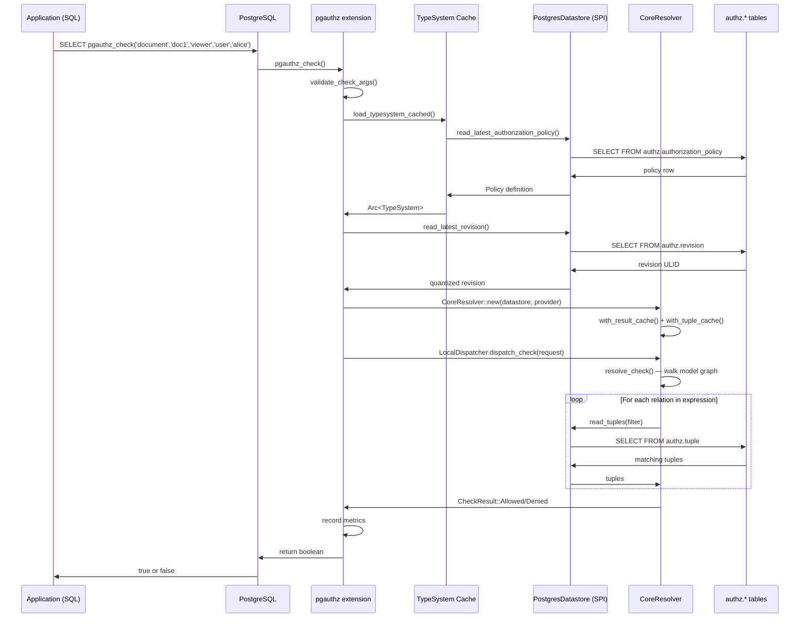
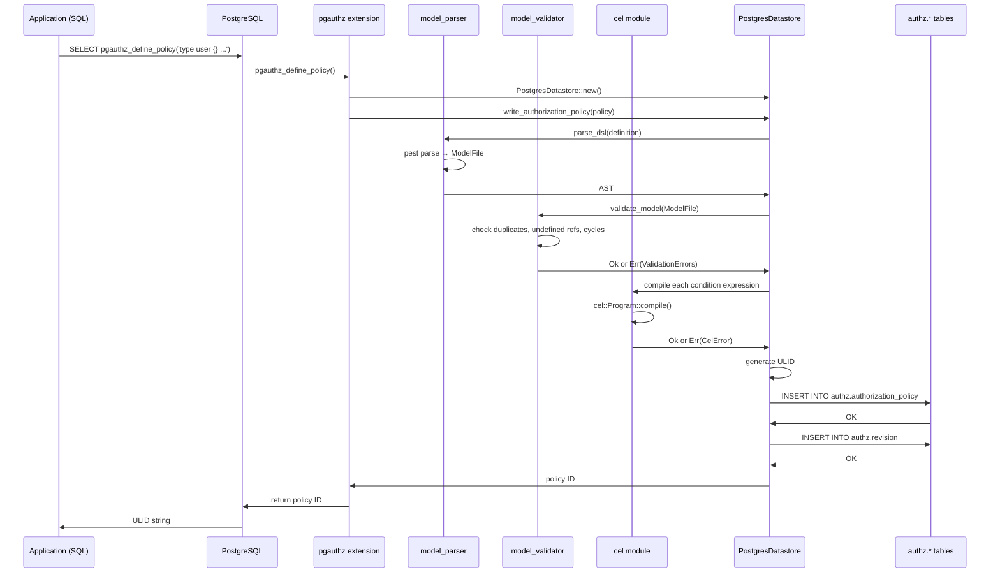
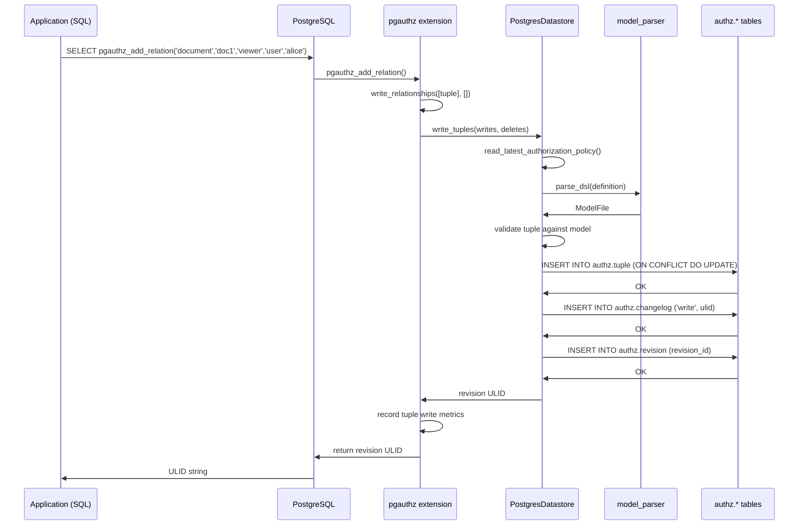
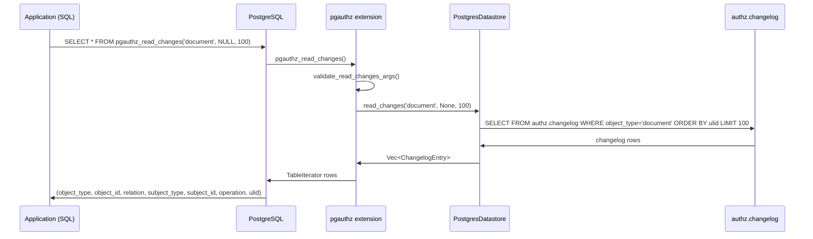
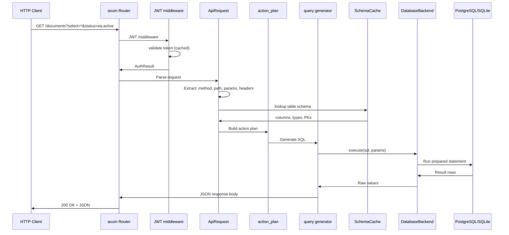
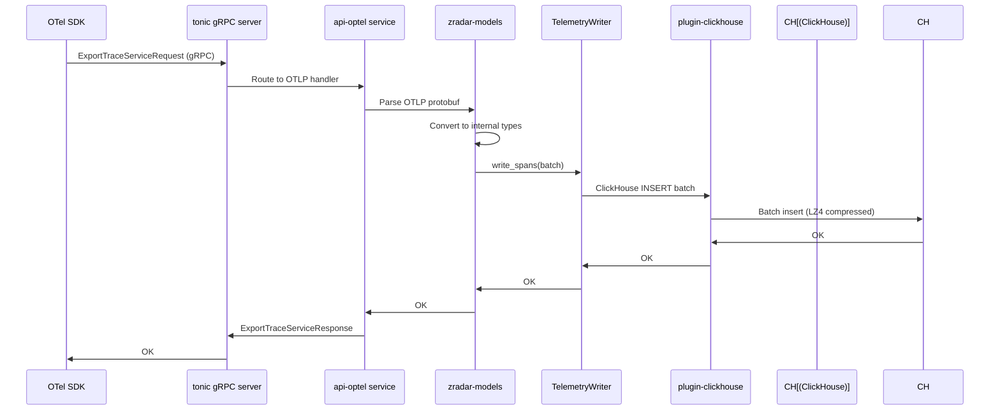
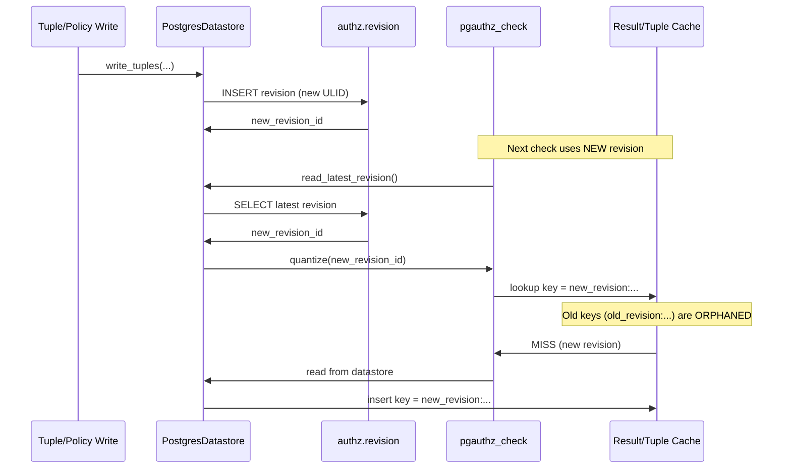
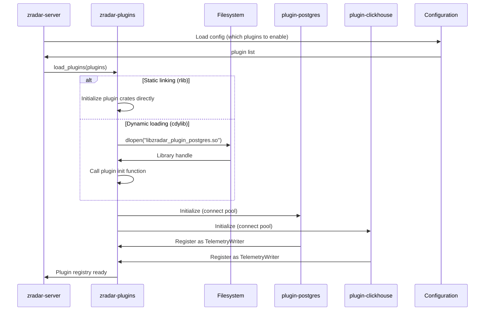

# Data Flow — End-to-End Flows

This document traces the complete execution paths for the four major workflows across the projects.

## Flow 1: Authorization Check via pgauthz

Source: `pgauthz/crates/pgauthz/src/check_functions.rs:17-143` (`do_check`).

## Flow 2: Policy Definition and Validation

Source: `authz-datastore-pgx/src/lib.rs:254-313` (PolicyWriter impl).

**Aha:** Policy writing is a three-stage validation gate: parse → validate → CEL compile. If any stage fails, the policy is rejected and nothing is written to the database. This prevents a partially-valid policy from becoming the "latest" and breaking all subsequent checks.

## Flow 3: Relationship Write with Validation

Source: `authz-datastore-pgx/src/lib.rs:557-669` (TupleWriter impl).

## Flow 4: Watch API — Reading Changes

Source: `pgauthz/crates/pgauthz/src/lib.rs:308-354` and `authz-datastore-pgx/src/lib.rs:674-725`.

The Watch API enables clients to poll for changes since a known ULID cursor, implementing a simplified version of Zanzibar's consistency model.

## Flow 5: dbrest REST Query

Source: `dbrest/src/main.rs` (server startup), `dbrest-core/src/api_request/` (request parsing), `dbrest-core/src/plan/` (action planning).

## Flow 6: OTLP Telemetry Ingestion

Source: `zradar/crates/services/api-optel/` (OTLP service), `zradar/crates/plugins/zradar-plugin-clickhouse/` (ClickHouse writer).

## Flow 7: Revision-Based Cache Invalidation

**Aha:** Cache invalidation is achieved without explicit invalidation. Each write creates a new revision. Each check reads the latest revision and includes it in the cache key. Old cache entries (keyed by previous revisions) are never looked up again — they naturally expire. This is simpler than invalidation and immune to race conditions.

## Flow 8: zradar Plugin Loading

## What to Read Next

Continue with [09-cross-cutting.md](09-cross-cutting.md) for error handling, observability, and testing patterns shared across all four projects.
