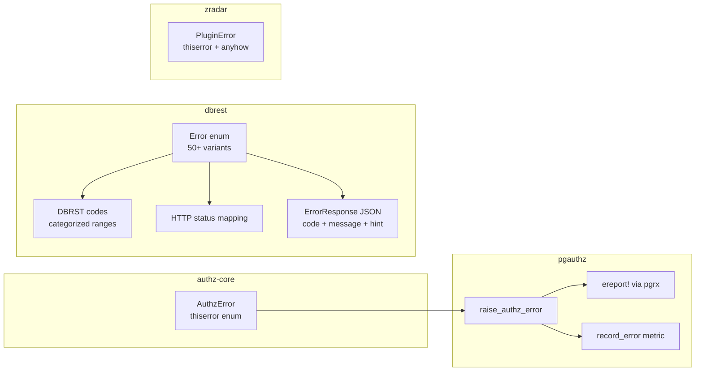
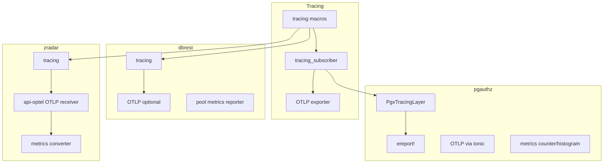

# Cross-Cutting Patterns

This document covers patterns shared across all four projects: error handling strategies, observability setup, testing approaches, release profiles, and deployment considerations.

## Error Handling Architecture

All four projects use structured error types with `thiserror` derives, but each maps errors to its hosting environment differently.

### authz-core: Domain Errors

Source: `authz-core/src/error.rs`. The `AuthzError` enum covers the authorization domain:

| Variant | Meaning |
|---------|---------|
| `Validation { field, message }` | Input validation failure |
| `ModelParse(String)` | DSL grammar parse failure |
| `ModelValidation(String)` | Semantic model validation failure |
| `ModelNotFound` | No policy exists |
| `RelationshipValidation(String)` | Tuple doesn't match model |
| `RelationNotFound { object_type, relation }` | Relation undefined on type |
| `MaxDepthExceeded` | Recursion limit hit |
| `ResolutionError(String)` | Graph walk failure |
| `Datastore(String)` | Database/infrastructure failure |
| `CachePoisoned` | Mutex/lock failure |
| `Internal(String)` | Catch-all |

Source: `authz-core/src/error.rs:6-49`.

authz-core has no HTTP status codes or PostgreSQL SQLSTATE mappings — it is a pure library that reports domain errors, leaving the consumer to decide how to surface them.

### pgauthz: PostgreSQL SQLSTATE Mapping

Source: `pgauthz/crates/pgauthz/src/errors.rs`. pgauthz maps `AuthzError` to PostgreSQL SQLSTATE codes via `ereport!`:

| AuthzError | PgSqlErrorCode | SQLSTATE |
|------------|---------------|----------|
| `Validation` | `ERRCODE_INVALID_PARAMETER_VALUE` | 22023 |
| `ModelParse` | `ERRCODE_DATA_EXCEPTION` | 22000 |
| `ModelValidation` | `ERRCODE_CHECK_VIOLATION` | 23514 |
| `ModelNotFound` | `ERRCODE_NO_DATA_FOUND` | 02000 |
| `RelationshipValidation` | `ERRCODE_CHECK_VIOLATION` | 23514 |
| `RelationNotFound` | `ERRCODE_UNDEFINED_OBJECT` | 42704 |
| `MaxDepthExceeded` | `ERRCODE_PROGRAM_LIMIT_EXCEEDED` | 54000 |
| `Datastore` | `ERRCODE_EXTERNAL_ROUTINE_EXCEPTION` | 38000 |
| `ResolutionError`, `CachePoisoned`, `Internal` | `ERRCODE_INTERNAL_ERROR` | XX000 |

Source: `pgauthz/crates/pgauthz/src/errors.rs:7-60`.

**Aha:** The `raise_authz_error` function records the error metric via `crate::metrics::record_error(error_type, "authz_operation")` before calling `ereport!`. This means errors are tracked in OpenTelemetry even when they terminate the PostgreSQL transaction.

### dbrest: HTTP Status Codes + DBRST Error Codes

Source: `dbrest/crates/dbrest-core/src/error/mod.rs`. dbrest has the most elaborate error system — a large `Error` enum with over 50 variants, each mapped to:

1. **DBRST error code** — a project-specific code string (e.g., `DBRST205` for TableNotFound). Source: `dbrest/crates/dbrest-core/src/error/codes.rs`. Codes are organized in ranges: 000-099 (config), 100-199 (request), 200-299 (schema), 300-399 (auth), 400-499 (action), 500-599 (database), 999 (internal).

2. **HTTP status code** — via `Error::status()`:

| Error Category | HTTP Status |
|---------------|-------------|
| Config (DbConnection, UnsupportedPgVersion) | 503 |
| Request parsing (invalid params, body, filters) | 400 |
| Not found (TableNotFound, ColumnNotFound) | 404 |
| Ambiguous (multiple relationships) | 300 |
| Auth (JWT errors) | 401 |
| Permission denied | 403 |
| Not insertable/updatable/deletable | 405 |
| Unique/foreign key/check violations | 409 |
| Single object expected | 406 |
| Internal/Database | 500 |

Source: `dbrest/crates/dbrest-core/src/error/mod.rs:351-443`.

3. **JSON response** — with `code`, `message`, `details`, and `hint` fields. Source: `dbrest/crates/dbrest-core/src/error/response.rs:27-41`.

dbrest also provides `ResultExt` trait for error context chaining and `bail!` / `ensure!` macros for early returns:

```rust
// dbrest/crates/dbrest-core/src/error/response.rs:131-178
#[macro_export]
macro_rules! bail {
    ($err:expr) => { return Err($err.into()); };
}

#[macro_export]
macro_rules! ensure! {
    ($cond:expr, $err:expr) => {
        if !$cond { return Err($err.into()); }
    };
}
```

### zradar: Plugin Errors

Source: `zradar/crates/core/zradar-plugins/src/error.rs`. Uses `thiserror` with `anyhow::Error` as a catch-all:

| Variant | Meaning |
|---------|---------|
| `NotFound(String)` | Plugin not found by name |
| `AlreadyRegistered(String)` | Duplicate plugin name |
| `InvalidConfig(String)` | Bad plugin configuration |
| `InitializationFailed(String)` | Plugin init returned error |
| `LoadFailed(String)` | dlopen or static load failure |
| `VersionMismatch` | Plugin API version mismatch |
| `TypeMismatch` | Expected vs actual plugin type |
| `DependencyMissing` | Required plugin dependency not loaded |
| `OperationFailed` | Generic operation failure |
| `MigrationFailed` | Database migration failure |
| `MigrationChecksumMismatch` | Migration integrity check failed |
| `Other(anyhow::Error)` | Transparent catch-all |

Source: `zradar/crates/core/zradar-plugins/src/error.rs:6-43`.



## Observability Patterns

### Tracing

All four projects use `tracing` for structured logging, but configure it differently based on their hosting environment.

| Project | Tracing Target | Configuration |
|---------|---------------|---------------|
| authz-core | Standard tracing subscriber | Enabled by consumers |
| pgauthz | Custom `PgxTracingLayer` → `ereport!` | GUC-controlled level |
| dbrest | `tracing` + optional OTLP exporter | Config file + env |
| zradar | Standard tracing subscriber | Config file |

**pgauthz tracing bridge:** Source: `pgauthz/crates/pgauthz/src/tracing_bridge.rs`. The `PgxTracingLayer` implements `tracing_subscriber::Layer` and forwards events to pgrx log levels:

| tracing Level | pgrx Level |
|--------------|------------|
| ERROR | `pgrx::error!` (aborts transaction) |
| WARN | `pgrx::warning!` |
| INFO | `pgrx::info!` |
| DEBUG | `pgrx::notice!` |
| TRACE | `pgrx::notice!` |

Source: `pgauthz/crates/pgauthz/src/tracing_bridge.rs:111-117`.

**Aha:** The tracing bridge also extracts `cache_level` fields from events to record cache hit metrics. When a `cache_hit` event is recorded, the `PgxTracingLayer` calls `crate::metrics::record_cache_hit(level)`. This means cache metrics are piggybacked on structured log events rather than instrumented inline at every cache call site. Source: `pgauthz/crates/pgauthz/src/tracing_bridge.rs:93-97`.

### OpenTelemetry

| Project | OTLP Traces | OTLP Metrics | Notes |
|---------|------------|--------------|-------|
| pgauthz | Yes (tonic exporter) | Yes | GUC-controlled, ratio-based sampling |
| dbrest | Yes (optional) | Yes (periodic reader) | Config file, pool metrics reporter |
| zradar | Yes | Yes | api-optel converts OTLP → internal types |
| authz-core | No | No | Pure library, no OTLP dependency |

**pgauthz OTLP:** Source: `pgauthz/crates/pgauthz/src/telemetry.rs`. Initializes a global `SdkTracerProvider` with:
- Endpoint from GUC
- Service name from GUC
- Sampling ratio (TraceIdRatioBased) from GUC

Source: `pgauthz/crates/pgauthz/src/telemetry.rs:27-72`.

**dbrest OTLP:** Source: `dbrest/src/main.rs:84-183`. Two separate exporters:
- Tracing: `SdkTracerProvider` with `PeriodicReader` + W3C TraceContext propagator
- Metrics: `PeriodicReader` with configurable interval

### Metrics

**pgauthz metrics:** Source: `pgauthz/crates/pgauthz/src/metrics.rs`. 12 named metrics:

| Metric Name | Type | Description |
|------------|------|-------------|
| `pgauthz.check.duration` | Histogram | Authorization check duration (seconds) |
| `pgauthz.check.total` | Counter | Total check count (with result, object_type, relation labels) |
| `pgauthz.write_tuples.total` | Counter | Tuple write/delete count |
| `pgauthz.read_tuples.total` | Counter | Tuple read count |
| `pgauthz.errors.total` | Counter | Error count (with error_type, operation labels) |
| `pgauthz.cache.hits.total` | Counter | Cache hit count (with cache_level label) |
| `pgauthz.cache.misses.total` | Counter | Cache miss count |
| `pgauthz.resolution.depth` | Histogram | Permission tree traversal depth |
| `pgauthz.resolution.dispatch_count` | Histogram | Sub-dispatches per check |
| `pgauthz.resolution.datastore_queries` | Histogram | Datastore queries per check |
| `pgauthz.tuples.read_count` | Histogram | Tuples read per operation |
| `pgauthz.model.load_duration` | Histogram | Model loading duration |

**dbrest metrics:** Source: `dbrest/crates/dbrest-core/src/app/metrics.rs`. Reports connection pool gauges every 15 seconds:
- `db.pool.connections.active`
- `db.pool.connections.idle`
- `db.pool.connections.max`

Uses the `metrics` crate facade (`metrics::gauge!`).

**zradar metrics:** Source: `zradar/crates/services/api-optel/src/metrics_converter.rs`. Converts OTLP metric data points to internal types for storage. Also has functional test scenarios in `zradar/test_functional/scenarios/test_metrics.rs`.



## Testing Approaches

Each project uses a different testing strategy appropriate to its deployment context.

### authz-core: Unit Tests In-Tree

authz-core tests are inline `#[cfg(test)]` modules within each source file. Tests cover:
- Model parser: valid/invalid DSL parsing
- Model validator: duplicate types, undefined references, cycle detection
- Core resolver: check results, recursion depth, cycle detection
- CEL conditions: compile/evaluate flow, missing parameters

This is possible because authz-core has no external dependencies on PostgreSQL or HTTP — it's a pure library.

### pgauthz: Matrix Testing Framework + Integration Tests

Source: `pgauthz/crates/pgauthz/src/matrix_runner.rs` and `pgauthz/tests/`. pgauthz has a YAML-based test matrix:

```yaml
name: "basic_check"
model: |
  type user {}
  type document {
    relations define viewer: [user]
  }
tests:
  - name: "allow_viewer"
    setup:
      tuples:
        - object: "document:doc1"
          relation: "viewer"
          subject: "user:alice"
    assertions:
      - type: "Check"
        object: "document:doc1"
          relation: "viewer"
          subject: "user:alice"
          allowed: true
```

Source: `pgauthz/crates/pgauthz/src/lib.rs:758-788`. Test matrix covers:

- Basic checks
- Direct assignments
- Tuple operations (write/delete)
- Model operations
- Set operations (union, intersection, exclusion)
- Wildcard semantics
- Nested groups and exclusions
- Identifier edge cases
- Expand semantics
- List objects/subjects
- Conditions and context
- Expiration semantics

Integration tests:
- `tests/integration_e2e.rs` — end-to-end tests through SQL functions
- `tests/integration_pgauthz.rs` — pgauthz-specific function tests
- `tests/test_tracing.sql` — SQL-level tracing verification

### dbrest: Integration Tests + Benchmarks

**Integration tests:** Source: `dbrest/tests/`. 8 test files:

| File | Coverage |
|------|----------|
| `api_request_integration.rs` | HTTP request parsing |
| `auth_integration.rs` | JWT authentication |
| `e2e_app.rs` | Full app end-to-end |
| `e2e_sqlite.rs` | SQLite-specific e2e |
| `plan_integration.rs` | Action planning |
| `query_integration.rs` | SQL query generation |
| `schema_cache_integration.rs` | Schema introspection |
| `sse_integration.rs` | Server-Sent Events |
| `sse_sqlite.rs` | SSE on SQLite |
| `common/mod.rs` | Shared test fixtures |

**Benchmarks:** Source: `dbrest/Cargo.toml`. 4 benchmark targets (`harness = false`):

| Benchmark | Purpose |
|-----------|---------|
| `micro_benchmarks` | Individual component performance |
| `integration_benchmarks` | End-to-end request latency |
| `load_tester` | Concurrent request throughput |
| `bench_metrics` | Metrics overhead measurement |

Source: `dbrest/benches/bench_metrics.rs`. Benchmarks output JSON for comparison against PostgREST (the reference implementation). Docker compose files exist for benchmarking:
- `docker-compose.bench.yml` — dbrest benchmark instance
- `docker-compose.bench-postgrest.yml` — PostgREST comparison instance

### zradar: Functional Test Scenarios

Source: `zradar/test_functional/`. Black-box API tests through public HTTP and gRPC endpoints only (no direct database access):

| Scenario File | Coverage |
|---------------|----------|
| `test_health.rs` | Health check endpoints |
| `test_auth.rs` | Authentication |
| `test_organizations.rs` | Organization CRUD |
| `test_projects.rs` | Project CRUD |
| `test_api_keys.rs` | API key management |
| `test_tracing.rs` | Trace ingestion |
| `test_e2e.rs` | End-to-end flows |
| `test_scores.rs` | Scoring endpoints |
| `test_query_api.rs` | Query API |
| `test_telemetry_storage.rs` | Telemetry storage |
| `test_span_types.rs` | Span type handling |
| `test_analytics.rs` | Analytics queries |
| `test_metrics.rs` | Metrics ingestion |
| `test_logs.rs` | Log ingestion |

Test helpers:
- `helpers/api_client.rs` — HTTP client wrapper
- `helpers/grpc_client.rs` — gRPC client for OTLP
- `helpers/db_client.rs` — Database client
- `helpers/fixtures.rs` — Test data fixtures
- `helpers/test_helpers.rs` — Shared setup/teardown

Run with: `cargo test --test functional_tests -- --ignored`

```mermaid
flowchart LR
    subgraph "authz-core"
        U[#[cfg(test)]<br/>inline unit tests]
    end

    subgraph "pgauthz"
        M[matrix YAML tests<br/>25+ scenarios]
        I[integration tests<br/>e2e via SQL]
    end

    subgraph "dbrest"
        IT[integration tests<br/>8 test files]
        B[benchmarks<br/>4 targets]
    end

    subgraph "zradar"
        F[functional tests<br/>14 scenario modules]
        H[helpers<br/>api/grpc/db clients]
    end

    U -->|pure library| U
    M -->|pgrx-based| I
    IT -->|SQLite/PG| B
    F -->|HTTP/gRPC| H
```

## Release Profiles

### dbrest and zradar

Both projects share the same aggressive release profile:

```toml
[profile.release]
opt-level = 3
lto = true
codegen-units = 1
strip = true
```

Source: `dbrest/Cargo.toml:128-131` and `zradar/Cargo.toml:113-117`.

| Setting | Effect |
|---------|--------|
| `opt-level = 3` | Maximum optimization |
| `lto = true` | Link-time optimization across all crates |
| `codegen-units = 1` | Single compilation unit (enables cross-crate inlining) |
| `strip = true` | Remove debug symbols from binary (smaller deploy size) |

**Aha:** dbrest does not include `strip = true` in its profile (unlike zradar). Source: `dbrest/Cargo.toml:128-131`. This means dbrest's release binary retains debug symbols, which may be intentional for production debugging.

### authz-core and pgauthz

Neither authz-core nor pgauthz defines a custom `[profile.release]`. They inherit the default Cargo release profile (opt-level 3, no LTO). This is appropriate because:
- authz-core is a library, compiled as part of pgauthz's build
- pgauthz uses pgrx's build system which manages its own release settings

## Deployment Considerations

### Container Images

| Project | Dockerfile | docker-compose |
|---------|-----------|----------------|
| pgauthz | `pgauthz/Dockerfile` | None |
| dbrest | `dbrest/Dockerfile` | `docker-compose.bench.yml` |
| zradar | `zradar/Dockerfile` | `docker-compose.yml`, `docker-compose.test.yml` |

Source: Filesystem at `pgauthz/Dockerfile`, `dbrest/Dockerfile`, `zradar/Dockerfile`.

### pgauthz: PostgreSQL Extension

Deployed as a `.so` extension file into PostgreSQL's `lib/` directory and `shared_extension/` directory. Requires:
- PostgreSQL 14+ (pgrx compatibility)
- `CREATE EXTENSION pgauthz` to bootstrap schema
- GUC configuration for OTLP/check strategy

### dbrest: Standalone Binary

Deployed as a single binary. Supports:
- SQLite: No external dependencies, single `.db` file
- PostgreSQL: Requires running PostgreSQL instance

Configuration via CLI args, TOML file, or environment variables (`DBREST_*`).

### zradar: Multi-Service Deployment

Deployed as two binaries:
- `zradar-server` — HTTP/REST + OTLP gRPC endpoints
- `zradar-worker` — Background job processor

Requires:
- PostgreSQL (business entities)
- ClickHouse (telemetry storage)
- Optional: Redis (job queue), S3 (object storage)

Configuration via TOML files with plugin enable/disable flags.

## What to Read Next

Continue with the [README](README.md) for the documentation index and navigation guide.
