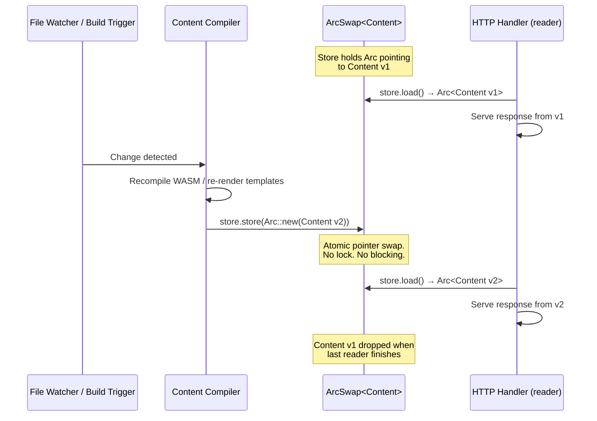
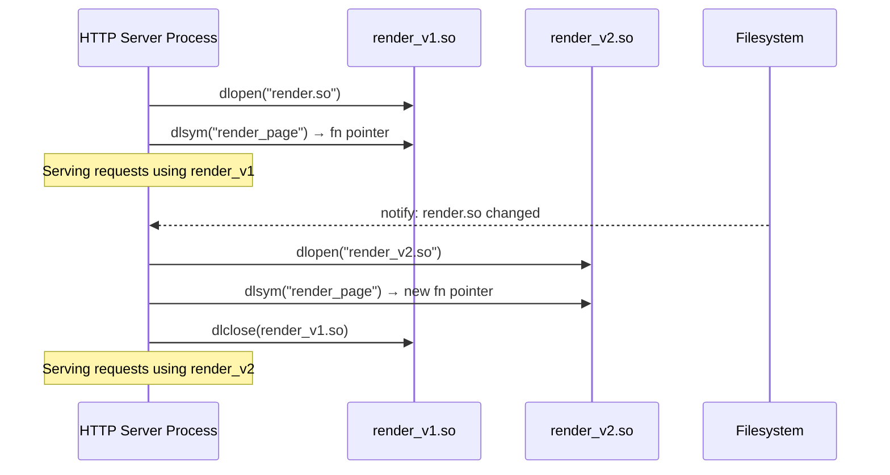
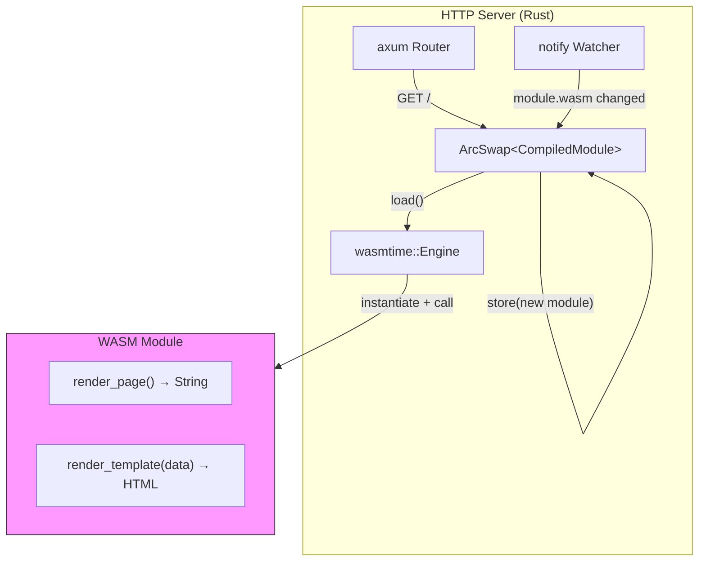
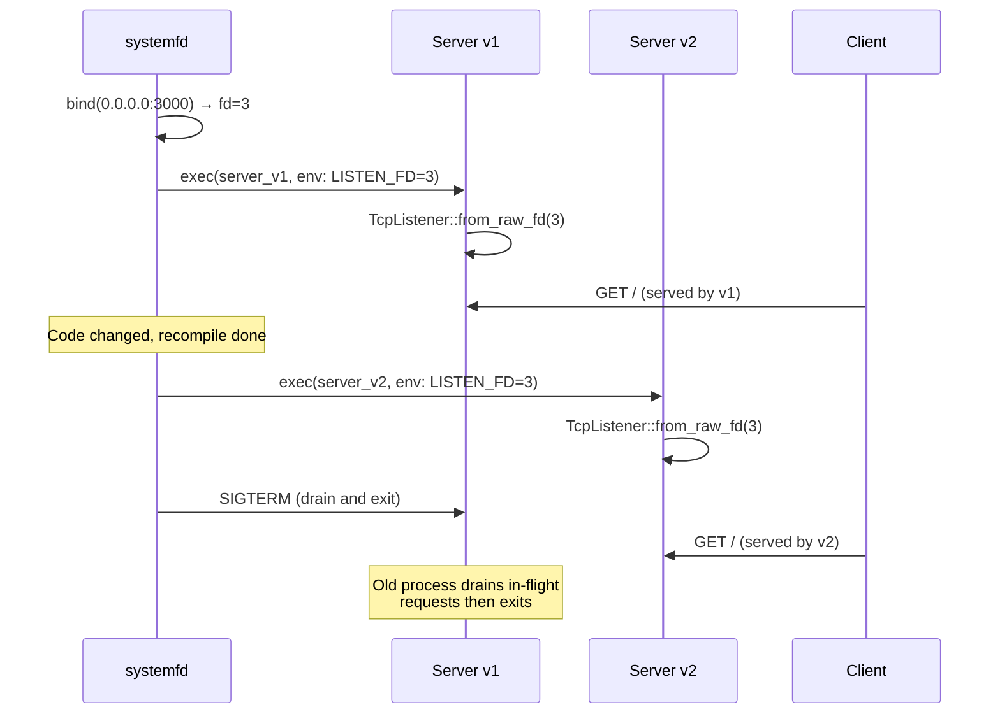
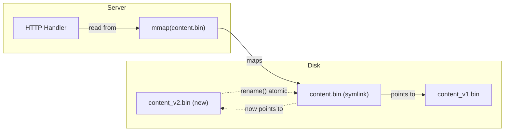
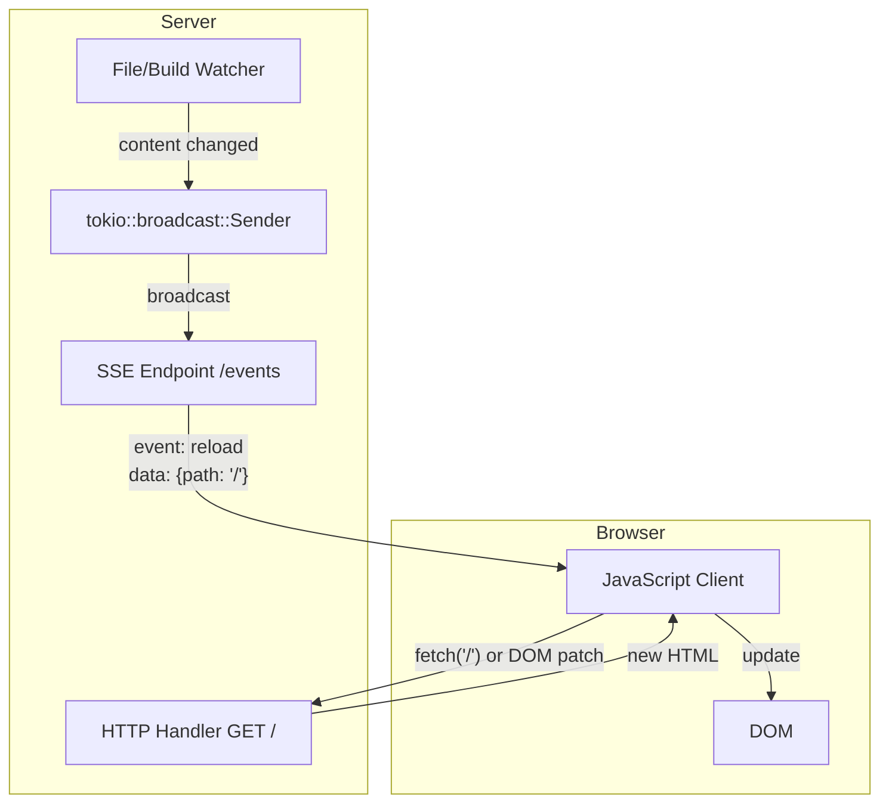
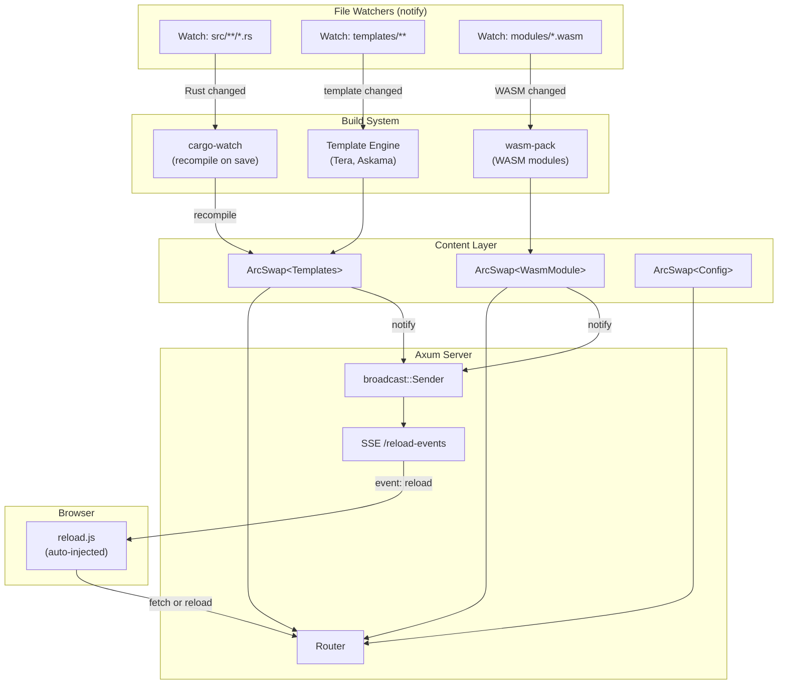

# Hot Reloading in Rust HTTP Servers for Non-File Content

## Overview

Hot reloading in Rust for HTTP servers serving **non-file-based content** (WASM modules, compiled-into-binary assets, dynamically generated HTML, template engines) is a fundamentally different problem from file-serving hot-reload. File-based hot-reload is trivial — watch the filesystem, re-read on change. But when your content is compiled into the binary, generated at build time, or produced by a WASM module, the reload strategy must address:

1. **How does new content enter the running process?** (dylib swap, WASM reload, IPC, mmap)
2. **How do in-flight requests see the old version while new requests see the new?** (atomic swap)
3. **How does the server stay alive across reloads?** (socket preservation, zero-downtime)

This exploration covers the six main strategies, their trade-offs, and when to use each.

## Strategy Comparison

```
                    Zero         Content     Supports
Strategy            Downtime?    Latency     WASM?       Complexity
─────────────────────────────────────────────────────────────────
Arc-Swap            Yes          ~ns         Yes*        Low
Dylib Hot-Swap      Yes          ~ms         No          Medium
WASM Runtime Reload Yes          ~ms         Yes         Medium
Socket-Passing      Brief gap    ~s          Yes         Low
mmap Atomic Swap    Yes          ~us         No          Low
Channel-Based Reload Yes         ~us         Yes*        Medium
```

*\* Via the hosting strategy, not directly*

## Strategy 1: Arc-Swap (Lock-Free Pointer Swap)

**The recommended default for most use cases.**

### Concept

Store your content behind an `Arc<T>` and use `arc-swap` for atomic, lock-free replacement. Readers (HTTP handlers) get a snapshot reference; writers swap in a new `Arc<T>` without blocking any reader.

### How It Works



### Key Crate: `arc-swap`

- **Crate:** [`arc-swap`](https://crates.io/crates/arc-swap) (v1.7+, actively maintained, 38M+ downloads)
- **Core type:** `ArcSwap<T>` — atomic swap of `Arc<T>` with zero-cost reads via `load()`
- **Read cost:** Single atomic load (cheaper than `RwLock`)
- **Write cost:** Single atomic store + old value's refcount decrement
- **Guarantee:** Readers never block. Writers never block readers. Old content lives until all readers drop it.

### Architecture with Axum

```
┌────────────────────────────────────────────────────────┐
│  Application                                            │
│                                                         │
│  ┌──────────────┐    ┌──────────────────────────────┐  │
│  │ notify::      │    │ Content Compiler              │  │
│  │ Watcher       │───▶│ (WASM compile, template       │  │
│  │ (filesystem)  │    │  render, asset pipeline)      │  │
│  └──────────────┘    └──────────┬───────────────────┘  │
│                                  │                       │
│                                  ▼                       │
│                      ┌──────────────────────┐           │
│                      │ ArcSwap<ContentStore> │           │
│                      └──────────┬───────────┘           │
│                                  │                       │
│               ┌─────────────────┼─────────────────┐     │
│               ▼                 ▼                 ▼     │
│          ┌─────────┐     ┌─────────┐       ┌─────────┐ │
│          │ Handler  │     │ Handler │       │ Handler │ │
│          │ GET /    │     │ GET /api│       │ GET /ws │ │
│          └─────────┘     └─────────┘       └─────────┘ │
│                                                         │
│  ┌──────────────────────────────────────────────────┐  │
│  │ Axum Router (immutable after startup)             │  │
│  └──────────────────────────────────────────────────┘  │
└────────────────────────────────────────────────────────┘
```

### When to Use

- Serving pre-rendered HTML/templates that change during development
- WASM module output (compile externally, swap the result)
- Configuration-driven content (feature flags, A/B test variants)
- Any content that can be represented as a Rust struct

### Trade-offs

| Pro | Con |
|-----|-----|
| Zero-copy reads (single atomic load) | Content must fit in memory (both old + new briefly) |
| No locks, no contention | Requires a watcher/trigger to know when to rebuild |
| Works with any async runtime | Old content lingers until last reader drops |
| Trivial to integrate with axum/actix | Not suitable for very large content (multi-GB) |

### Deep Dive

See [`examples/arc-swap-axum.md`](./examples/arc-swap-axum.md) for a complete implementation.

---

## Strategy 2: Dynamic Library Hot-Swap (dylib)

**For swapping compiled Rust logic (route handlers, renderers) without restarting.**

### Concept

Compile your content-producing logic into a shared library (`.so` / `.dylib`). The server loads it via `dlopen`, calls exported functions to produce content, and when the library changes, unloads the old one and loads the new one.

### How It Works



### Key Crates

| Crate | Version | Status | Role |
|-------|---------|--------|------|
| `libloading` | 0.8+ | Actively maintained | Safe `dlopen`/`dlsym` wrappers |
| `hot-lib-reloader` | 0.7+ | Maintained | Higher-level: watches, reloads, and re-links dylibs automatically |
| `notify` | 7.0+ | Actively maintained | Filesystem watching (paired with either) |

### Architecture

```
┌──────────────────────────────────────────────────────┐
│  Server Process (long-lived)                          │
│                                                       │
│  ┌────────────────────┐                               │
│  │ axum Router         │                               │
│  │ GET / → handler()   │──┐                            │
│  └────────────────────┘  │                            │
│                           ▼                            │
│  ┌──────────────────────────────────┐                 │
│  │ DylibManager                     │                 │
│  │                                  │                 │
│  │  current: Library (dlopen'd)     │                 │
│  │  render_fn: Symbol<fn() -> Html> │                 │
│  │                                  │                 │
│  │  reload():                       │                 │
│  │    1. dlopen(new .so)            │                 │
│  │    2. dlsym("render_page")       │                 │
│  │    3. swap current               │                 │
│  │    4. dlclose(old .so)           │                 │
│  └──────────────────────────────────┘                 │
│                                                       │
│  ┌────────────────────┐                               │
│  │ Watcher Thread      │                               │
│  │ notify: target/     │                               │
│  │ on change → reload()│                               │
│  └────────────────────┘                               │
└──────────────────────────────────────────────────────┘

┌──────────────────────────────────────────────────────┐
│  Content Library (separate crate, cdylib)             │
│                                                       │
│  #[no_mangle]                                        │
│  pub extern "C" fn render_page() -> *mut c_char      │
│                                                       │
│  Compiled to: target/debug/librender.so              │
└──────────────────────────────────────────────────────┘
```

### The `hot-lib-reloader` Pattern

`hot-lib-reloader` automates most of the boilerplate:

```rust
// In your server crate:
#[hot_lib_reloader::hot_module(dylib = "render")]
mod render {
    // These function signatures must match the dylib's exports
    hot_functions_from_file!("render/src/lib.rs");
}

// Now render::render_page() automatically uses the latest dylib
```

The crate:
1. Watches the target directory for `.so`/`.dylib` changes
2. Blocks new calls briefly during swap
3. Loads the new library and resolves symbols
4. Drops the old library when safe

### Safety Considerations

| Risk | Mitigation |
|------|------------|
| ABI mismatch after recompile | Use `extern "C"` + `#[repr(C)]` for all shared types. Or serialize across the boundary (JSON, MessagePack). |
| Dangling pointers to old lib's memory | Never return pointers into the dylib's static data. Return owned data (Vec, String). |
| Thread safety during swap | `hot-lib-reloader` serializes reloads. Or use `ArcSwap<Library>`. |
| Rust version mismatch | Same `rustc` version for server and dylib (Rust ABI is unstable). |
| Memory leaks from dlclose | Some platforms don't truly unload. Accept this in dev; don't use in prod. |

### When to Use

- **Development-time** hot reload of rendering logic
- When you want to change _how_ content is produced, not just _what_ content is
- Plugin architectures where plugins are Rust crates
- NOT recommended for production (ABI fragility, dlclose leaks)

### Trade-offs

| Pro | Con |
|-----|-----|
| Reload compiled Rust logic without restart | `unsafe` at the boundary |
| Sub-millisecond reload | ABI compatibility is fragile |
| Works for any content type | Platform-specific (.so vs .dylib vs .dll) |
| `hot-lib-reloader` makes it ergonomic | dlclose doesn't always truly unload |

---

## Strategy 3: WASM Runtime Hot-Reload

**For sandboxed, portable content modules that can be swapped at runtime.**

### Concept

Compile your content-producing logic to WASM. The HTTP server embeds a WASM runtime (`wasmtime` or `wasmer`) and loads/executes WASM modules. When the module changes, instantiate a new one and swap it in.

### How It Works



### Key Crates

| Crate | Version | Status | Notes |
|-------|---------|--------|-------|
| `wasmtime` | 29+ | Very active (Bytecode Alliance) | Production-grade, supports Component Model |
| `wasmer` | 5+ | Active | Singlepass/Cranelift/LLVM backends |
| `extism` | 1.7+ | Active | High-level plugin SDK over wasmtime, simplifies host-guest interface |
| `wasm-bridge` | 0.5+ | Maintained | Unified API for wasmtime + browser |

### Architecture

```
┌────────────────────────────────────────────────────────────┐
│  HTTP Server                                                │
│                                                             │
│  ┌────────────┐    ┌──────────────────────────────────┐    │
│  │ Watcher    │    │ WASM Module Manager               │    │
│  │ (notify)   │───▶│                                   │    │
│  └────────────┘    │  engine: wasmtime::Engine          │    │
│                     │  linker: wasmtime::Linker          │    │
│                     │  current: ArcSwap<Module>          │    │
│                     │                                    │    │
│                     │  reload():                         │    │
│                     │    1. Read .wasm bytes              │    │
│                     │    2. Module::new(engine, bytes)    │    │
│                     │    3. ArcSwap::store(new_module)    │    │
│                     └──────────────┬─────────────────────┘    │
│                                    │                          │
│  ┌─────────────────────────────────┼───────────────────────┐ │
│  │ Request Handler                  ▼                       │ │
│  │                                                          │ │
│  │  1. module = store.load()                                │ │
│  │  2. instance = linker.instantiate(module)                │ │
│  │  3. render = instance.get_typed_func("render")           │ │
│  │  4. html = render.call(&mut store, params)               │ │
│  │  5. Response::new(html)                                  │ │
│  └──────────────────────────────────────────────────────────┘ │
└────────────────────────────────────────────────────────────────┘
```

### Pre-compilation for Fast Instantiation

The key performance trick: **pre-compile** the WASM module when loading, not per-request:

```
Load Phase (on change):
  .wasm bytes → Module::new() → compiled native code (cached)
  Store in ArcSwap<Module>
  Time: 10-100ms (one-time cost)

Request Phase (per request):
  Module → Instance::new() → call function
  Time: ~50-200us (instantiation is fast, no recompilation)
```

### Extism: The Ergonomic Path

`extism` wraps wasmtime with a plugin-oriented API:

```rust
// Define what the plugin exports
let manifest = Manifest::new([Wasm::file("render.wasm")]);
let mut plugin = Plugin::new(&manifest, [], true)?;

// Call the plugin
let output: String = plugin.call("render_page", input_data)?;

// Reload: just create a new plugin from new .wasm
let new_manifest = Manifest::new([Wasm::file("render.wasm")]);
let new_plugin = Plugin::new(&new_manifest, [], true)?;
// Swap via ArcSwap or mutex
```

### Fermyon Spin Model

Spin (Fermyon's WASM microservice framework) uses a **per-request instantiation** model:
- Each HTTP request gets a fresh WASM instance
- The `Module` (compiled code) is cached and shared
- Hot-reload = swap the cached Module
- Instance creation is ~50us with wasmtime
- This is the same model used in Cloudflare Workers

### When to Use

- Content produced by untrusted or sandboxed code
- Plugin architectures where plugins are written in any language (Rust, Go, JS → WASM)
- When you want true isolation between content modules
- When portability matters (same .wasm runs everywhere)

### Trade-offs

| Pro | Con |
|-----|-----|
| True sandboxing (memory, CPU, syscalls) | WASM compilation overhead (~100ms per reload) |
| Any language can produce .wasm | Host-guest boundary has serialization cost |
| Pre-compiled modules = fast instantiation | Limited to what WASI provides (no raw sockets, etc.) |
| Fermyon Spin proves production viability | Debugging WASM modules is harder |
| No ABI fragility (WASM spec is stable) | Larger binary size (embedding wasmtime) |

---

## Strategy 4: Socket-Passing Restart (systemfd + listenfd)

**For full binary recompilation with zero-downtime restarts.**

### Concept

Instead of keeping the process alive, **restart the entire binary** but pass the listening socket's file descriptor to the new process. The new process picks up the socket and starts serving immediately — no port binding delay, no connection drops (in-flight connections on the old process can drain).

### How It Works



### Key Crates

| Crate | Version | Status | Role |
|-------|---------|--------|------|
| `systemfd` | 0.4+ | Maintained | CLI tool: binds socket, passes fd, restarts on signal |
| `listenfd` | 1.0+ | Maintained | Library: receives passed fd in the new process |
| `cargo-watch` | 8+ | Maintained | Watches source files, triggers recompile |

### The Command

```bash
# Terminal: watch, recompile, restart with socket preservation
systemfd --no-pid -s http::3000 -- cargo watch -x run
```

This does:
1. `systemfd` binds port 3000 and holds the fd
2. `cargo watch` watches `src/` for changes
3. On change: recompile → `systemfd` kills old process → starts new process with same fd
4. New process uses `listenfd` to receive the socket

### Server-Side Integration

```rust
// In your server's main():
use listenfd::ListenFd;

let mut listenfd = ListenFd::from_env();
let listener = match listenfd.take_tcp_listener(0)? {
    Some(listener) => {
        // Got a socket from systemfd — use it
        listener.set_nonblocking(true)?;
        TcpListener::from_std(listener)?
    }
    None => {
        // No passed socket — bind normally (production mode)
        TcpListener::bind("0.0.0.0:3000").await?
    }
};

axum::serve(listener, app).await?;
```

### When to Use

- **Development workflow** where you want the full recompile cycle but don't want to manually restart
- When content is compiled into the binary (`include_str!`, `include_bytes!`)
- When using template engines that compile templates at build time
- Simple to set up; works with any Rust HTTP framework

### Trade-offs

| Pro | Con |
|-----|-----|
| Full binary replacement — any change works | Recompile takes seconds (Rust compilation) |
| Zero framework integration needed | Brief gap during process swap |
| Works for ALL content types | In-flight requests on old process may be lost |
| Production-safe pattern (used by systemd, nginx) | Not truly "hot" — there's a cold start |

---

## Strategy 5: Memory-Mapped Atomic Swap

**For large content blobs that shouldn't live in heap memory.**

### Concept

Serve content via `mmap`. When content changes, write the new version to a separate file, then atomically rename it. The next `mmap` will pick up the new file. Existing readers continue to see the old content until they unmap.

### How It Works



The key trick: `rename()` is atomic on POSIX. After rename, new `open()` + `mmap()` calls see the new file. Existing mmaps continue to see the old content (the kernel keeps the old inode alive until all mappings are dropped).

### Key Crate: `memmap2`

- **Crate:** [`memmap2`](https://crates.io/crates/memmap2) (v0.9+, actively maintained)
- Fork of `memmap` with continued maintenance
- Provides `Mmap` (read-only) and `MmapMut` (writable) types

### Architecture

```
Writer (build system / compiler):
  1. Write new content to content.tmp
  2. fsync(content.tmp)
  3. rename(content.tmp, content.bin)  ← atomic

Server:
  ┌─────────────────────────────────────────┐
  │ ContentServer                            │
  │                                          │
  │ current: ArcSwap<Mmap>                   │
  │                                          │
  │ reload():                                │
  │   1. file = File::open("content.bin")    │
  │   2. mmap = Mmap::map(&file)             │
  │   3. current.store(Arc::new(mmap))       │
  │                                          │
  │ serve():                                 │
  │   1. mmap = current.load()               │
  │   2. Response::new(&mmap[..])            │
  └─────────────────────────────────────────┘
```

### When to Use

- Serving large pre-compiled assets (multi-MB WASM bundles, large HTML, binary data)
- When heap allocation for content is too expensive
- When the build system produces files but you want zero-copy serving
- Combined with `arc-swap` for the mmap handle swap

### Trade-offs

| Pro | Con |
|-----|-----|
| Zero-copy serving (kernel pages directly to socket) | Content must be on filesystem (not purely in-memory) |
| Handles multi-GB content efficiently | Platform-specific behavior nuances |
| Atomic swap via rename() | Requires careful fsync ordering |
| Old readers naturally drain | Signal mechanism still needed to trigger re-mmap |

---

## Strategy 6: Channel-Based Content Push

**For real-time content delivery with WebSocket or SSE.**

### Concept

Instead of the client polling for new content, the server **pushes** updates via WebSocket or Server-Sent Events. The server watches for content changes and broadcasts them to all connected clients. The client-side JavaScript patches the DOM.

This is what tools like Vite, webpack-dev-server, and LiveReload do — but implemented server-side in Rust.

### How It Works



### Key Crates

| Crate | Role |
|-------|------|
| `tokio::sync::broadcast` | Multi-consumer channel for pushing events |
| `axum::response::Sse` | Server-Sent Events support in axum |
| `notify` | Filesystem watching |

### Two Modes

**Full page reload:** Send a `reload` event, client does `location.reload()`.
Simple, works for any content type.

**Partial/HMR:** Send the new content as a diff or full replacement, client patches the DOM.
Requires client-side JavaScript, but provides instant feedback without losing page state.

### When to Use

- Development tooling (live preview)
- Dashboards that display generated content
- Combined with any of the above strategies (Arc-Swap + SSE notification)

### Trade-offs

| Pro | Con |
|-----|-----|
| Instant client-side updates | Requires JavaScript on client |
| Can do partial updates (HMR-like) | More complex than just serving new content |
| Works with any content source | WebSocket/SSE adds complexity |

---

## Combining Strategies: The Recommended Architecture

For a production-grade development server, combine multiple strategies:



### Decision Tree

```
Is the content produced by Rust code that you're actively changing?
├── YES: Is it rendering logic or data?
│   ├── Rendering logic: Use dylib hot-swap (dev) or WASM (prod)
│   └── Data/config: Use Arc-Swap
├── NO: Is it a WASM module from another language?
│   └── YES: Use WASM Runtime Reload (wasmtime + ArcSwap<Module>)
└── Is the content compiled into the binary?
    ├── YES (include_bytes!, build.rs): Use socket-passing restart
    └── NO (generated at runtime): Use Arc-Swap + notify watcher

Do you also want instant browser refresh?
└── YES: Add SSE channel (Strategy 6) on top of whichever above
```

## Crate Reference

| Crate | Version | Downloads | Description |
|-------|---------|-----------|-------------|
| `arc-swap` | 1.7+ | 38M+ | Lock-free `Arc` swap |
| `notify` | 7.0+ | 25M+ | Cross-platform filesystem watcher |
| `libloading` | 0.8+ | 41M+ | Safe `dlopen`/`dlsym` |
| `hot-lib-reloader` | 0.7+ | ~10K | Auto-reloading dylib manager |
| `wasmtime` | 29+ | 5M+ | Production WASM runtime |
| `wasmer` | 5+ | 3M+ | Alternative WASM runtime |
| `extism` | 1.7+ | ~100K | High-level WASM plugin SDK |
| `memmap2` | 0.9+ | 20M+ | Memory-mapped file I/O |
| `systemfd` | 0.4+ | ~50K | Socket-passing launcher |
| `listenfd` | 1.0+ | ~500K | Receive passed socket fds |
| `cargo-watch` | 8+ | ~2M | Watch and rerun on change |
| `tower-livereload` | 0.9+ | ~50K | Auto-inject LiveReload JS into HTML responses |

## Key Insights

1. **Arc-Swap is the universal primitive.** Nearly every strategy benefits from `ArcSwap<T>` for the final atomic content swap. Even WASM and mmap strategies store their handle in an `ArcSwap`.

2. **WASM hot-reload is the most production-viable "true" hot-reload.** Unlike dylib swapping (which has ABI fragility), WASM has a stable binary interface. Pre-compiled modules instantiate in microseconds.

3. **Socket-passing is the simplest for compiled-in content.** If your content is baked in via `include_str!` or `build.rs`, don't fight it — just recompile and use `systemfd` to preserve the socket.

4. **The "content that doesn't come from a file" problem is really a "how do I get new content into the process" problem.** The answer is almost always: produce it externally, load it via a stable interface (WASM, dylib, mmap, or just re-read from a temp file), and swap it in via `ArcSwap`.

5. **Browser-side notification is orthogonal.** SSE/WebSocket reload notification works with ALL strategies. Add `tower-livereload` for zero-effort LiveReload injection.

6. **Don't use dylib hot-swap in production.** It's fantastic for development iteration speed, but the `unsafe` boundary, ABI instability, and dlclose leaks make it unsuitable for production.

## Open Questions

1. How does HTTP/2 server push interact with hot-reload strategies? Can you push new content proactively?
2. Could `io_uring` provide even lower-latency content swapping than mmap?
3. What's the overhead of wasmtime's `Module::deserialize_file()` for pre-compiled AOT modules vs `Module::new()` from WASM bytes?
4. Is there a path to stable Rust ABI (like Swift's) that would make dylib hot-swap production-safe?
5. How do Deno Deploy and Cloudflare Workers handle WASM module hot-swap at scale?

## Related Deep Dives

- [`examples/arc-swap-axum.md`](./examples/arc-swap-axum.md) — Complete Arc-Swap + Axum implementation
- [`examples/wasm-hot-reload.md`](./examples/wasm-hot-reload.md) — WASM module hot-reload with wasmtime
- [`examples/dylib-hot-swap.md`](./examples/dylib-hot-swap.md) — Dynamic library hot-swap with hot-lib-reloader
