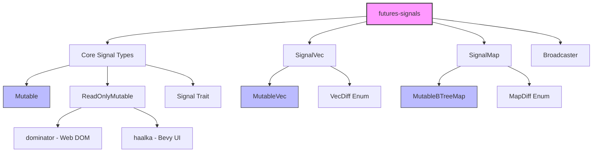

# RustSignals Project Exploration

## Overview

RustSignals is a collection of crates centered around **zero-cost Functional Reactive Programming (FRP) signals** built on top of Rust's futures crate. The core library `futures-signals` provides efficient signal primitives that enable automatic, declarative reactivity for state management.

### Key Projects

| Project | Purpose | Status |
|---------|---------|--------|
| **rust-signals** | Core FRP signals library (futures-signals crate) | Production-ready |
| **rust-dominator** | Zero-cost DOM library using FRP signals for web/WASM | Production-ready |
| **haalka** | Bevy UI library powered by futures-signals | Active development |
| **futures-rs** | Rust's async/await futures library (upstream dependency) | Upstream |
| **tab-organizer** | Web extension demo application using dominator | Demo/Example |

## Architecture



## Core Abstractions

### 1. Signal Trait

The foundational abstraction is the `Signal` trait:

```rust
pub trait Signal {
    type Item;
    fn poll_change(self: Pin<&mut Self>, cx: &mut Context) -> Poll<Option<Self::Item>>;
}
```

**Signal Contract:**
- First poll must return `Poll::Ready(Some(value))` - signals always have a current value
- After first poll, can return `Poll::Ready(None)` to indicate signal has ended
- Or `Poll::Pending` if value hasn't changed (waker will be called when it does)

### 2. Mutable - The Reactive State Container

`Mutable<T>` is the primary way to create mutable reactive state:

```rust
let my_state = Mutable::new(5);

// Get a lock to read/write
let mut lock = my_state.lock_mut();
*lock = 10; // Notifies all signals automatically

// Create signals from Mutable
let signal = my_state.signal();      // For Copy types
let cloned = my_state.signal_cloned(); // For Clone types
let custom = my_state.signal_ref(|x| *x + 10); // Transform
```

**Implementation Details:**
- Uses `Arc<RwLock<MutableLockState<A>>>` for thread-safe reference-counted state
- Maintains a `Vec<Weak<ChangedWaker>>` to track signal subscribers
- Uses atomic operations for change detection
- Automatic notification on `Drop` of mutable lock if mutated

### 3. SignalVec - Efficient Collection Updates

`SignalVec` provides diff-based notifications for collections:

```rust
let my_vec: MutableVec<u32> = MutableVec::new();
let mut lock = my_vec.lock_mut();
lock.push(1);
lock.insert(0, 2);

// SignalVec receives VecDiff, not full Vec
my_vec.signal_vec().for_each(|diff| {
    match diff {
        VecDiff::Push { value } => { /* handle push */ }
        VecDiff::InsertAt { index, value } => { /* handle insert */ }
        VecDiff::RemoveAt { index } => { /* handle remove */ }
        VecDiff::Move { old_index, new_index } => { /* handle move */ }
        // ... more variants
    }
    async {}
});
```

**VecDiff Variants:**
- `Replace { values: Vec<A> }` - Initial/full replacement
- `InsertAt { index, value }` - Single insertion
- `UpdateAt { index, value }` - Value update at position
- `RemoveAt { index }` - Removal at position
- `Move { old_index, new_index }` - Reordering
- `Push { value }` / `Pop {}` - Stack operations
- `Clear {}` - Clear all

### 4. SignalMap - Key-Value Reactive Collections

Similar to SignalVec but for key-value pairs:

```rust
let map = MutableBTreeMap::new();
map.lock_mut().insert("foo", 5);

map.signal_map().for_each(|diff| {
    match diff {
        MapDiff::Insert { key, value } => { }
        MapDiff::Update { key, value } => { }
        MapDiff::Remove { key } => { }
        MapDiff::Clear {} => { }
        MapDiff::Replace { entries } => { }
    }
});
```

### 5. Broadcaster - Signal Multiplexing

Splits a single Signal into multiple output Signals:

```rust
let broadcaster = Broadcaster::new(input_signal);
let signal1 = broadcaster.signal();
let signal2 = broadcaster.signal_cloned();
let signal3 = broadcaster.signal_ref(|x| x * 2);
```

**Use case:** When you need multiple consumers of the same signal but the signal doesn't implement Clone.

## Signal Transformers (SignalExt)

The library provides extensive transformation methods:

| Method | Purpose | Complexity |
|--------|---------|------------|
| `map` | Transform values | O(1) |
| `dedupe` | Skip duplicate values | O(1) + PartialEq |
| `filter` | Filter values | O(n) internal |
| `filter_map` | Filter + transform | O(n) internal |
| `map_future` | Async transformation | Future overhead |
| `throttle` | Rate limit updates | Timer overhead |
| `flatten` | Flatten nested signals | O(1) |
| `switch` | Switch inner signal | O(1) |
| `switch_signal_vec` | Switch to SignalVec | Complex |
| `sample_stream_cloned` | Sample on stream events | O(1) |

### SignalVecExt Methods

| Method | Purpose |
|--------|---------|
| `map` | Transform items |
| `filter` | Filter items |
| `chain` | Chain two SignalVecs |
| `flatten` | Flatten SignalVec<SignalVec> |
| `sort` | Sorted output |
| `to_signal_cloned` | Convert to Signal<Vec> |

## Key Design Decisions

### 1. Signals Are Lossy (By Design)

```rust
my_state.set(2);
my_state.set(3);
// Signal only sees 3, not 2
```

This is **intentional** - signals only guarantee the most recent value, not intermediate states. This provides:
- Better performance (no queue needed)
- Stack allocation (no heap for signal state)
- Simpler mental model

For lossy behavior, use `Stream` instead.

### 2. SignalVec Is Lossless

Unlike Signal, SignalVec guarantees:
- All changes are delivered
- Changes are in correct order
- No changes are skipped

This requires an internal queue but is necessary for correctness when dealing with collections.

### 3. Zero-Cost Abstractions

The library achieves zero-cost through:
- **Stack allocation**: Signals are fully stack allocated when possible
- **No virtual dispatch**: Everything is monomorphized
- **Inlining**: Small methods are inlined
- **Pin projection**: Uses `pin_project` for efficient self-referential structs

## File Structure

```
rust-signals/
├── src/
│   ├── lib.rs           # Module exports, tutorial docs
│   ├── atomic.rs        # AtomicOption for lock-free state
│   ├── future.rs        # CancelableFuture implementation
│   ├── internal.rs      # map_ref macro internals
│   ├── signal/
│   │   ├── mod.rs
│   │   ├── mutable.rs   # Mutable, ReadOnlyMutable
│   │   ├── signal.rs    # Signal trait, SignalExt impls
│   │   ├── broadcaster.rs
│   │   ├── channel.rs   # Sender/Receiver channel
│   │   └── macros.rs    # map_ref! macro
│   ├── signal_vec.rs    # SignalVec trait, MutableVec
│   └── signal_map.rs    # SignalMap trait, MutableBTreeMap
├── tests/
│   ├── signal/          # Signal tests
│   ├── signal_vec.rs
│   ├── signal_map.rs
│   └── broadcaster.rs
└── benches/
    └── channel.rs
```

## Usage Patterns

### Basic State Management

```rust
let count = Mutable::new(0);

// React to changes
count.signal().for_each(|value| {
    println!("Count changed to: {}", value);
    async {}
});

// Update
*count.lock_mut() += 1;
```

### Combining Multiple Signals

```rust
let a = Mutable::new(1);
let b = Mutable::new(2);

let sum = map_ref! {
    let a_val = a.signal(),
    let b_val = b.signal() =>
    *a_val + *b_val
};
```

### Collection Reactivity

```rust
let items = MutableVec::new_with_values(vec![1, 2, 3]);

items.signal_vec()
    .filter(|x| *x > 1)
    .map(|x| x * 2)
    .for_each(|diff| {
        // Handle filtered, mapped diff
        async {}
    });
```

## Dependencies

```toml
[dependencies]
futures-core = "0.3.0"
futures-channel = "0.3.0"
futures-util = "0.3.0"
pin-project = "1.0.2"
discard = "1.0.3"
gensym = "0.1.0"
log = { version = "0.4.14", optional = true }
serde = { version = "1.0.140", optional = true, features = ["derive"] }
```

## Integration with WASM

The library is designed for WASM usage:
- No std dependencies beyond core
- Works with `wasm-bindgen-futures`
- `dominator` provides WASM-optimized DOM bindings
- `haalka` brings signals to Bevy WASM games

## Performance Characteristics

| Operation | Time Complexity | Heap Allocation |
|-----------|-----------------|-----------------|
| Signal creation | O(1) | None |
| map() | O(1) | None |
| Mutable::set() | O(n) where n = subscribers | None |
| MutableVec::push() | O(1) amortized | Queue if needed |
| SignalVec::filter | O(n) for n items | Indexes vec |
| Broadcaster::signal() | O(1) | None |

## Related Projects

### dominator
- Zero-cost DOM library using signals
- No VDOM - direct DOM manipulation
- Faster than Inferno in benchmarks
- Updates are O(1) regardless of tree depth

### haalka
- Bevy UI library using futures-signals
- Provides React-like declarative API for Bevy
- Features: alignment, pointer events, scroll handling
- Eventually consistent reactivity (async commands)
