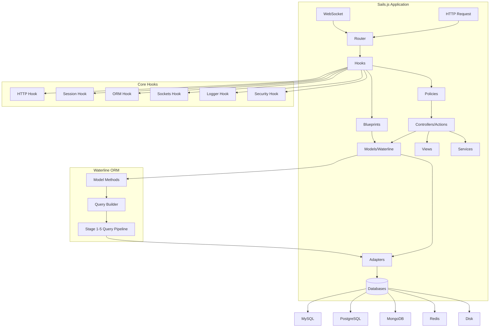
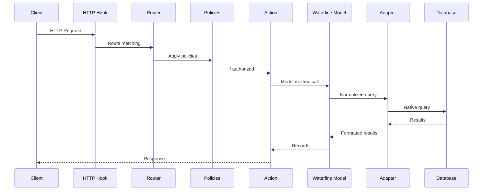
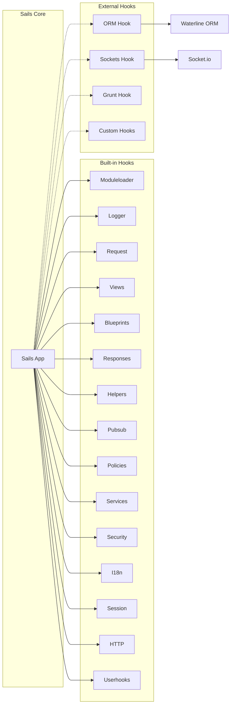
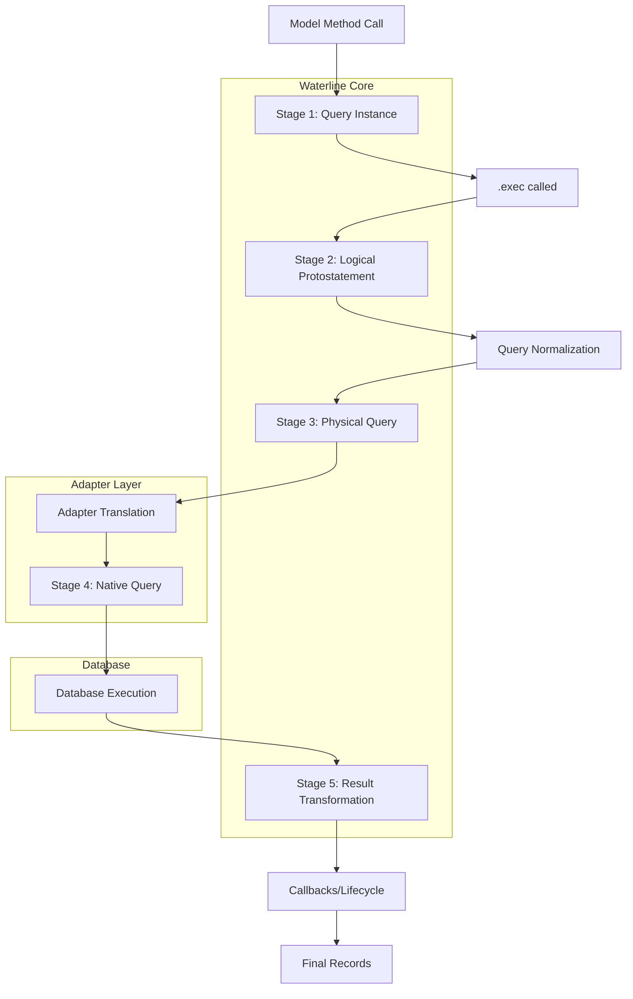
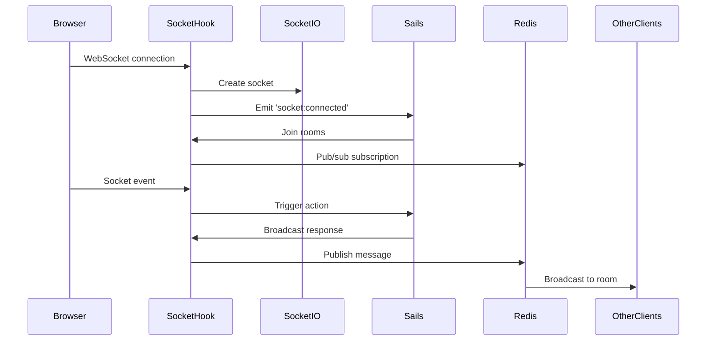
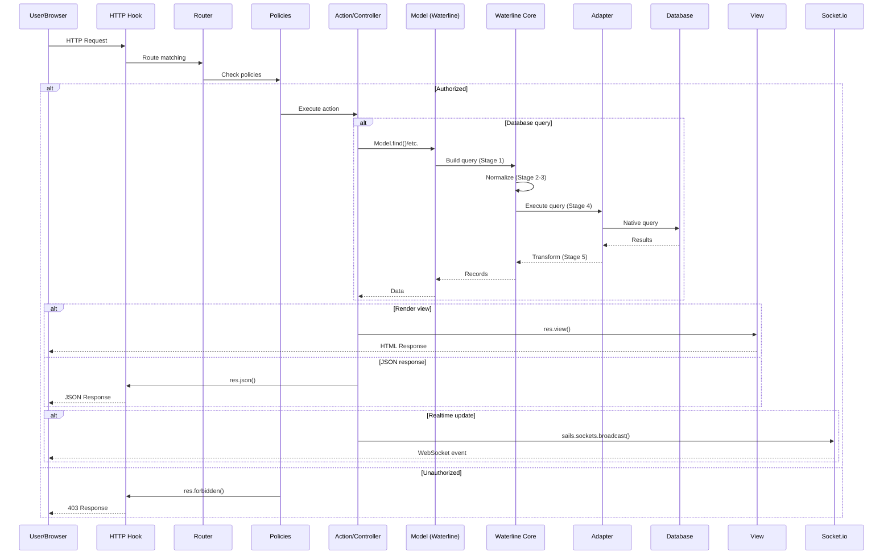

# Project Exploration: Sails.js Ecosystem

## Overview

This directory contains 24 projects from the Sails.js ecosystem - a comprehensive collection of the Node.js MVC web framework and its associated modules. Sails.js is designed to resemble the MVC architecture from frameworks like Ruby on Rails, but with support for modern, data-oriented web app and API development. It is particularly well-suited for building realtime features like chat applications.

The collection spans the entire Sails.js ecosystem including:
- **Core Framework**: The main Sails.js MVC framework
- **ORM (Waterline)**: Database abstraction layer supporting multiple databases
- **Hooks**: Internal plugins that extend framework functionality
- **Adapters**: Database and storage adapters (MongoDB, S3, disk)
- **Generators**: Scaffolding system for creating new projects
- **Applications**: Example apps and full-stack templates
- **Utilities**: Logging, payments, caching, and other supporting modules

Sails.js follows a **convention-over-configuration** approach, providing sensible defaults while remaining flexible. Its architecture is built around a modular hook system that allows for extensive customization and extension.

## Repository

- **Location:** `/home/darkvoid/Boxxed/@formulas/Others/src.sailsjs`
- **Remote:** N/A - not a git repository (appears to be a mirror or snapshot)
- **Primary Language:** JavaScript (Node.js)
- **License:** MIT (all projects)

## Directory Structure

```
/home/darkvoid/Boxxed/@formulas/Others/src.sailsjs/
├── Core Framework
│   ├── sails/                          # Main Sails.js v1.5.2 MVC framework
│   │   ├── bin/                        # CLI commands (sails lift, generate, etc.)
│   │   ├── lib/
│   │   │   ├── app/                    # Core Sails application logic
│   │   │   │   ├── Sails.js            # Main Sails constructor
│   │   │   │   ├── lift.js             # App startup/initialization
│   │   │   │   ├── load.js             # Hook and configuration loading
│   │   │   │   └── private/            # Internal utilities
│   │   │   └── hooks/                  # Built-in core hooks
│   │   │       ├── blueprints/         # Auto-generated CRUD routes
│   │   │       ├── http/               # HTTP server handling
│   │   │       ├── logger/             # Logging (captains-log)
│   │   │       ├── moduleloader/       # File/module loading
│   │   │       ├── policies/           # Access control policies
│   │   │       ├── pubsub/             # Pub/sub for real-time
│   │   │       ├── request/            # Request enhancements
│   │   │       ├── responses/          # Response methods
│   │   │       ├── security/           # Security middleware
│   │   │       ├── session/            # Session management
│   │   │       └── views/              # View rendering
│   │   └── docs/                       # Documentation and anatomy examples
│   │
│   ├── sailsjs/                        # Sails.js v1.5.10 (newer version)
│   │   └── lib/                        # Same structure as sails/
│   │
│   └── captains-log/                   # Logging system used by Sails
│       └── README.md                   # Supports winston integration
│
├── ORM Layer
│   ├── waterline/                      # ORM/database abstraction (v0.14.0)
│   │   ├── lib/waterline/
│   │   │   ├── methods/                # Query methods (find, create, update, etc.)
│   │   │   └── utils/
│   │   │       ├── ontology/           # Model/collection management
│   │   │       ├── query/              # Query building and normalization
│   │   │       └── system/             # Collection/datastore builders
│   │   ├── MetaModel.js                # Base model constructor
│   │   ├── ARCHITECTURE.md             # Query stages 1-5 documentation
│   │   └── test/                       # Unit and integration tests
│   │
│   └── sails-hook-orm/                 # ORM integration hook (v4.0.3)
│       └── lib/                        # Datastore and model loading
│
├── Hooks (Internal Plugins)
│   ├── sails-hook-sockets/             # WebSocket/Socket.io integration (v3.0.0)
│   │   └── lib/
│   │       ├── sails.sockets/          # Socket management methods
│   │       └── initialize.js           # Socket.io server setup
│   │
│   ├── sails-hook-mail/                # Email sending hook
│   │   └── README.md
│   │
│   └── sails-hook-wish/                # Internal/experimental hook
│
├── Storage (Skipper - File Uploads)
│   ├── skipper-disk/                   # Local disk storage adapter
│   │   └── standalone/
│   │       └── build-disk-receiver-stream.js
│   │
│   └── skipper-s3/                     # Amazon S3 storage adapter
│
├── Database Adapters
│   └── sails-mongo/                    # MongoDB adapter (v2.0.0)
│       ├── lib/
│       │   └── private/
│       │       ├── machines/           # Machine pack operations
│       │       └── normalize-datastore-config/
│       └── test/
│           └── connectable/            # Connection management tests
│
├── Scaffolding/Generators
│   └── sails-generate/                 # Generator system (v2.x)
│       └── lib/
│           ├── builtins/               # Core generators (copy, file, folder)
│           └── core-generators/        # Framework generators
│               ├── new/                # New Sails project generator
│               ├── action/             # Action generator
│               ├── model/              # Model generator
│               └── controller/         # Controller generator
│
├── Applications & Examples
│   ├── boring-stack/                   # Full-stack template (Inertia.js)
│   │   ├── create-sails/               # CLI for project creation
│   │   ├── inertia-sails/              # Inertia.js Sails integration
│   │   └── templates/
│   │       ├── mellow-vue/             # Vue 3 template
│   │       ├── mellow-react/           # React template
│   │       └── mellow-svelte/          # Svelte template
│   │
│   ├── pingcrm/                        # CRM demo application
│   │   └── README.md                   # Vue 3 + Tailwind + Webpack
│   │
│   └── sailboat/                       # Example project template
│
├── Machine Packs (Reusable Functions)
│   ├── machinepack-paystack/           # Paystack payment integration
│   └── preset-sails/                   # Preset configurations
│
├── Payment Systems
│   └── sails-pay/                      # Payment processing system
│       ├── packages/
│       │   ├── sails-pay/              # Core payment module
│       │   └── sails-lemonsqueezy/     # Lemon Squeezy integration
│       └── playground/                 # Testing environment
│
├── Other Utilities
│   ├── docs.sailscasts.com/            # Documentation site
│   ├── sails-content/                  # Content management system
│   │   └── packages/
│   │       └── sails-hook-content/     # Content hook
│   │
│   ├── sails-flash/                    # Flash message support
│   ├── sails-stash/                    # Caching hook (Redis, Memcached)
│   └── wistia_player/                  # Video player integration
│
└── captain-vane/                       # Internal tooling
```

## Architecture

### High-Level Architecture Diagram



### Sails.js Request Lifecycle



### Hook System Architecture



### Waterline ORM Query Flow



### WebSocket Integration



## Component Breakdown

### Sails.js Core Framework

**Location:** `sails/`, `sailsjs/`

**Purpose:** Main MVC web framework providing routing, controllers, models, views, policies, and real-time features.

**Key Components:**
- **Router**: Express-compatible routing with support for REST and custom routes
- **Hooks**: Plugin system for extending functionality
- **Blueprints**: Auto-generated CRUD routes for models
- **Policies**: Access control middleware
- **Services**: Singleton business logic containers

**Dependencies:**
- Express.js (HTTP server)
- Socket.io (WebSocket support)
- Connect (middleware framework)
- EJS (templating)
- captains-log (logging)

### Waterline ORM

**Location:** `waterline/`

**Purpose:** Database abstraction layer providing a uniform API for multiple databases (MySQL, PostgreSQL, MongoDB, Redis, etc.).

**Key Concepts:**
- **Stage 1-5 Query Pipeline**: Queries pass through 5 transformation stages
- **MetaModel**: Base constructor for all models
- **Datastores**: Named database connections
- **Adapters**: Database-specific query translators

**Model Methods:**
- DQL (Data Query Language): `find()`, `findOne()`, `count()`, `sum()`, `avg()`
- DML (Data Manipulation Language): `create()`, `update()`, `destroy()`, `archive()`
- Associations: `addToCollection()`, `removeFromCollection()`, `replaceCollection()`

**Query Stages:**
1. **Stage 1**: Query instance (deferred object) - chainable API
2. **Stage 2**: Logical protostatement - expanded dictionary
3. **Stage 3**: Physical query - with actual table/column names
4. **Stage 4**: Adapter-specific format
5. **Stage 5**: Transformed results

### Blueprints Hook

**Location:** `sails/lib/hooks/blueprints/`

**Purpose:** Automatic RESTful route generation for models.

**Route Types:**
- **REST routes**: `GET /user`, `POST /user`, `PUT /user/:id`, `DELETE /user/:id`
- **Shortcut routes**: `GET /user/find`, `GET /user/create/:id`
- **Action routes**: Direct action binding

**Configuration:**
```javascript
blueprints: {
  actions: false,    // Auto-bind actions
  shortcuts: true,   // Legacy shortcut routes
  rest: true,        // RESTful routes
  prefix: '',        // Route prefix
  restPrefix: '',    // REST-specific prefix
  pluralize: false,  // Pluralize route names
  autoWatch: true    // Auto-join rooms for realtime
}
```

### ORM Hook

**Location:** `sails-hook-orm/`

**Purpose:** Integrates Waterline ORM with Sails, handling model loading, datastore configuration, and migrations.

**Key Responsibilities:**
- Load model definitions from `api/models/`
- Load and register adapters
- Initialize Waterline with datastore configurations
- Run auto-migrations
- Expose models as `sails.models`

### Sockets Hook

**Location:** `sails-hook-sockets/`

**Purpose:** Provides WebSocket support via Socket.io with session integration.

**Features:**
- Automatic session sharing between HTTP and WebSocket
- Room-based broadcasting
- Redis adapter for horizontal scaling
- sails.sockets.* methods for programmatic control

### Skipper (File Upload)

**Location:** `skipper-disk/`, `skipper-s3/`

**Purpose:** Streaming multipart file upload handler.

**Adapters:**
- **skipper-disk**: Local filesystem storage
- **skipper-s3**: Amazon S3 storage

**Usage:**
```javascript
req.file('avatar').upload({
  dirname: '/path/to/uploads'
}, function(err, uploadedFiles) {});
```

### Sails-Generate

**Location:** `sails-generate/`

**Purpose:** Scaffolding system for generating Sails projects and components.

**Core Generators:**
- `new`: New Sails project
- `action`: New action/controller
- `model`: New Waterline model
- `helper`: New helper function
- `page`: New view page

## Entry Points

### CLI Entry Point

**File:** `sails/bin/sails.js`

**Description:** Main CLI entry point for the `sails` command.

**Flow:**
1. Parse command-line arguments
2. Determine command (lift, generate, new, etc.)
3. Execute appropriate command module

### Application Lift

**File:** `sails/lib/app/lift.js`

**Description:** Starts the Sails application.

**Flow:**
```
sails.lift(configOverride)
  -> sails.load(configOverride)     // Load hooks and configuration
  -> sails.initialize()             // Initialize hooks
  -> Emit 'ready' event
  -> HTTP hook starts listening
  -> Emit 'lifted' event
```

### Hook Loading

**File:** `sails/lib/app/load.js`

**Description:** Loads and initializes all hooks.

**Default Hooks (in order):**
1. moduleloader - Load files from disk
2. logger - Setup logging
3. request - Request enhancements
4. views - View rendering
5. blueprints - Auto-generated routes
6. responses - Response methods
7. helpers - Helper functions
8. pubsub - Pub/sub for realtime
9. policies - Access control
10. services - Service loading
11. security - Security middleware
12. i18n - Internationalization
13. userconfig - User configuration
14. session - Session management
15. http - HTTP server
16. userhooks - Custom hooks

## Data Flow

### Complete Request-to-Response Flow



## External Dependencies

| Dependency | Version | Purpose |
|------------|---------|---------|
| express | 4.17.x-4.19.x | HTTP web framework |
| socket.io | 4.7.2 | WebSocket server |
| connect | 3.6.5 | Middleware framework |
| ejs | 2.5.7-3.1.7 | Templating engine |
| captains-log | ^2.0.0 | Logging system |
| waterline | ^0.14.0-^0.15.0 | ORM |
| async | 2.5.0-2.6.4 | Async utilities |
| lodash (@sailshq) | ^3.10.x | Utility library |
| commander | 2.11.0 | CLI parsing |
| chalk | 2.3.0 | Terminal colors |
| flaverr | ^1.10.0 | Error handling |
| machine | ^15.2.2 | Machine pack runtime |
| parley | ^3.3.x | Callback/Promise wrapper |
| rttc | ^10.0.0 | Runtime type checking |
| skipper | ^0.9.x | File upload handler |
| router | 1.3.2 | Express router |
| cookie-parser | 1.4.4 | Cookie handling |
| express-session | 1.17.0 | Session middleware |
| compression | 1.7.1 | Response compression |
| csurf | 1.10.0 | CSRF protection |
| i18n-2 | 0.7.3 | Internationalization |

## Configuration

### Sails Configuration Structure

```
config/
├── app.js              # App name, port, environment
├── routes.js           # Custom routes
├── models.js           # Model defaults (datastore, migrations)
├── datastores.js       # Database connections
├── policies.js         # Policy mappings
├── security.js         # CORS, CSRF, SSL settings
├── session.js          # Session configuration
├── views.js            # View engine settings
├── http.js             # HTTP server options
├── log.js              # Logging configuration
├── blueprints.js       # Blueprint settings
├── locales/            # i18n translations
└── env/
    ├── production.js   # Production overrides
    └── development.js  # Development overrides
```

### Key Configuration Options

**Models (`config/models.js`):**
```javascript
module.exports.models = {
  datastore: 'default',      // Default database connection
  migrate: 'alter',          // Migration strategy (alter/drop/safe)
  attributes: {              // Global default attributes
    createdAt: { type: 'number', autoCreatedAt: true },
    updatedAt: { type: 'number', autoUpdatedAt: true },
    id: { type: 'number', autoIncrement: true }
  }
};
```

**Datastores (`config/datastores.js`):**
```javascript
module.exports.datastores = {
  default: {
    adapter: 'sails-mongo',
    url: 'mongodb://localhost:27017/mydb'
  },
  mysql: {
    adapter: 'sails-mysql',
    host: 'localhost',
    user: 'root',
    password: '',
    database: 'mydb'
  }
};
```

**Routes (`config/routes.js`):**
```javascript
module.exports.routes = {
  'GET /': { view: 'pages/homepage' },
  'POST /api/users': 'UserController.create',
  'GET /api/users/:id': 'UserController.findOne'
};
```

**Policies (`config/policies.js`):**
```javascript
module.exports.policies = {
  '*': 'isLoggedIn',
  'UserController': {
    '*': 'isLoggedIn',
    'find': true,
    'findOne': true
  }
};
```

## Testing

### Test Framework

Sails.js and Waterline use **Mocha** as the testing framework with **assert/should/expect** for assertions.

### Running Tests

```bash
# Sails core
cd sails
npm test

# Waterline ORM
cd waterline
npm test

# Individual hooks
cd sails-hook-orm
npm test
```

### Test Structure

- **Unit tests**: Individual component testing
- **Integration tests**: Hook and framework integration
- **Adapter tests**: Database adapter compliance (waterline-adapter-tests)

### Testing Sails Applications

```javascript
// test/integration/User.test.js
const { assert } = require('chai');
const { Model } = require('sails').models;

describe('User Model', () => {
  before(async () => {
    await sails.load({ environment: 'test' });
  });

  it('should create a user', async () => {
    const user = await User.create({ name: 'Test' }).fetch();
    assert.ok(user.id);
  });
});
```

## Key Insights

1. **Convention Over Configuration**: Sails.js provides sensible defaults for routes, models, and associations. By following naming conventions (e.g., `UserController` for `User` model), developers get CRUD endpoints automatically via blueprints.

2. **Hook-Based Architecture**: Everything in Sails is a hook - from HTTP handling to ORM to WebSocket support. This modular design allows for easy extension and customization.

3. **Waterline Query Pipeline**: Waterline transforms queries through 5 stages, from chainable API to native database queries. This enables database-agnostic code but adds complexity.

4. **Real-time by Default**: The pubsub hook and Socket.io integration enable real-time features automatically. Model changes can trigger WebSocket events to subscribed clients.

5. **Blueprints API**: Automatic REST routes save development time but should be disabled for production APIs in favor of explicit controllers.

6. **Model Datastores**: Models can use different datastores, enabling multi-database applications. The adapter pattern abstracts database-specific queries.

7. **Lifecyle Callbacks**: Waterline supports before/after callbacks (`beforeCreate`, `afterUpdate`, etc.) for business logic, but these can impact performance.

8. **Machine Pack System**: Sails uses the machine-pack specification for reusable functions, providing consistent error handling and input validation.

9. **Auto-Migrations**: Waterline can auto-generate database schemas during development (`migrate: 'alter'`), but should use `'safe'` in production.

10. **Skipper for Uploads**: The Skipper streaming upload handler supports multiple storage adapters and handles large files efficiently.

## Open Questions

1. **Waterline Version Gap**: The collection has waterline v0.14.0 while sails-hook-orm depends on v0.15.0. What compatibility considerations exist between these versions?

2. **sails vs sailsjs**: Two versions of the main framework exist (v1.5.2 and v1.5.10). What are the differences and which should be used?

3. **Machine Pack Usage**: The codebase references machine packs extensively, but the current state of this pattern in the Node.js ecosystem is unclear.

4. **Archive Model**: Waterline has an `.archive()` method with a special Archive model. How is this intended to be used in practice?

5. **Through Associations**: The architecture mentions "through" associations for junction models. What is the exact configuration syntax?

6. **sails-stash**: The caching hook appears minimal. Is this production-ready or experimental?

7. **sails-pay**: The payment system appears to be a newer addition. What payment providers are supported beyond Lemon Squeezy?

8. **Inertia Integration**: The boring-stack uses Inertia.js with Sails. How does this integrate with the traditional Sails view/response system?

9. **Grunt Hook Removal**: References to a deprecated Grunt hook exist. What replaced it for asset pipeline management?

10. **Adapter Migration**: The adapter specification has evolved. What is required for adapters to be compatible with Waterline 0.14+?
