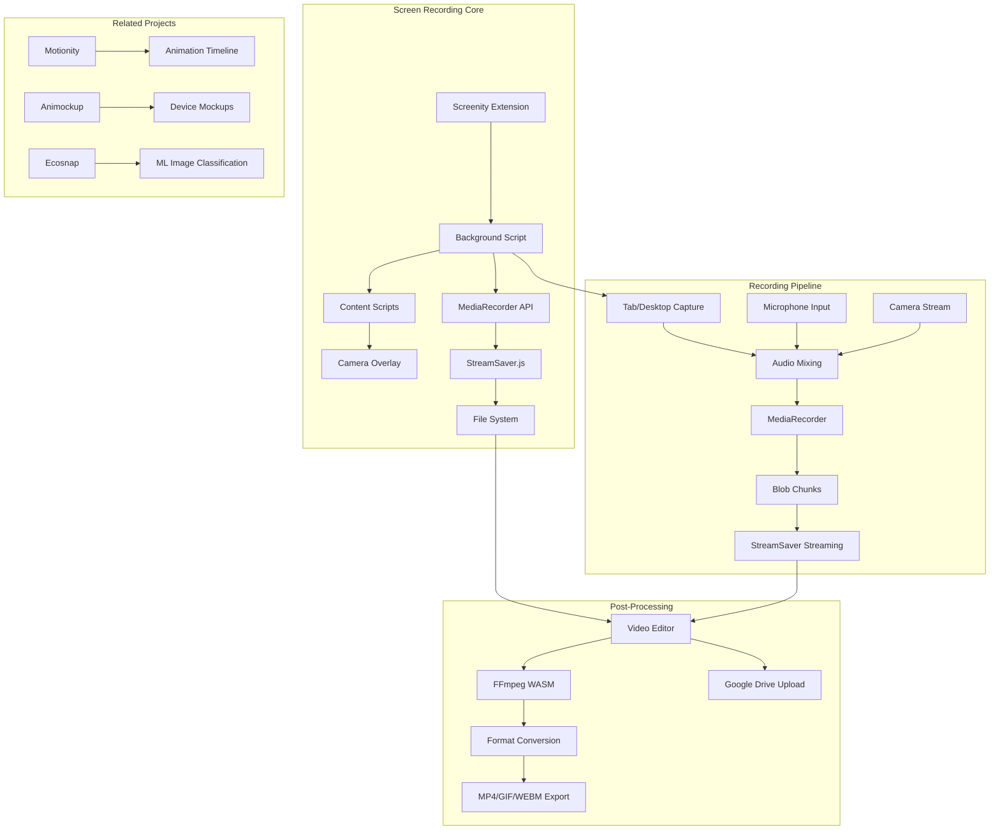
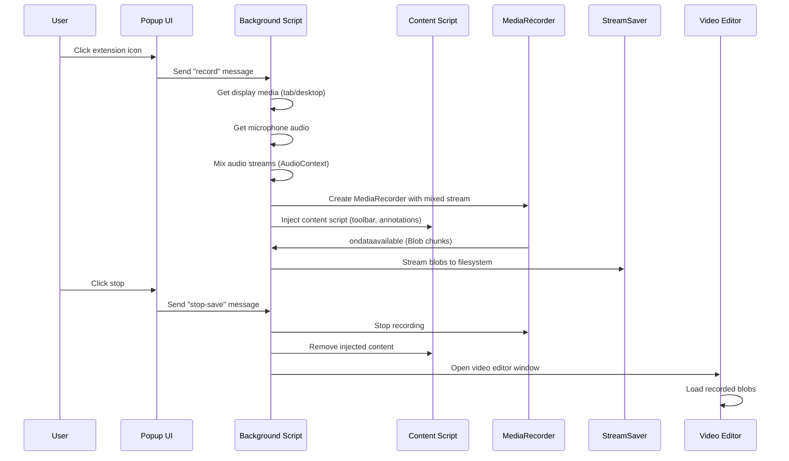
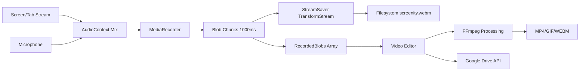
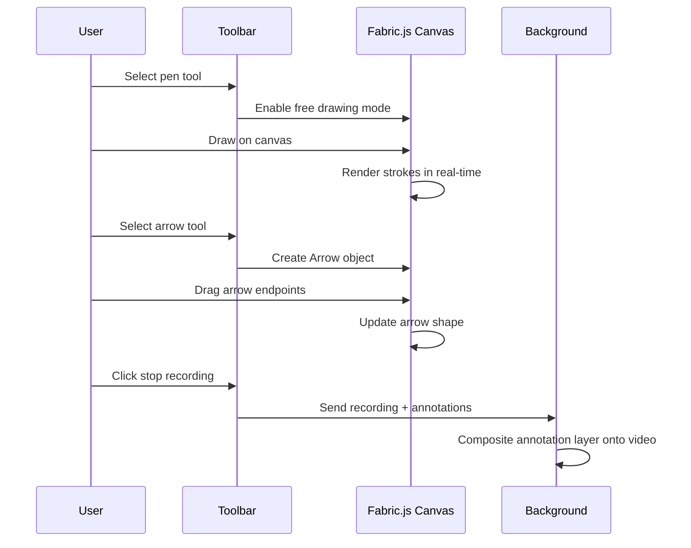

# Project Exploration: Screen Recorders & Productivity Apps

## Overview

This directory contains 15 projects forming a comprehensive ecosystem of screen recording, demo creation, and productivity tools. The collection is primarily authored by Alyssa X (alyssaxuu) and represents a portfolio of Chrome extensions, web applications, and native apps focused on content creation and workflow enhancement.

The flagship project, **Screenity**, is a full-featured screen recorder for Chrome with annotation capabilities, competing with tools like Loom. The ecosystem extends beyond recording to include motion graphics editing (Motionity), animated mockups (Animockup), digital business cards (Carden), collaborative mind mapping (Mapus), and various workflow enhancement tools.

All projects share common design principles: free to use, no sign-in required, privacy-focused local processing, and integration with Google services (Drive, Slides) for export and sharing.

## Repository

- **Location:** `/home/darkvoid/Boxxed/@formulas/Others/src.screen_recorders`
- **Remote:** N/A - Not a git repository (code archive)
- **Primary Language:** JavaScript/TypeScript
- **License:** MIT (most projects)

## Directory Structure

```
src.screen_recorders/
├── screenity/                          # Main screen recording Chrome extension
│   ├── assets/
│   │   ├── extension-icons/            # Logo icons (16px, 32px, 48px, 128px)
│   │   └── images/                     # UI icons for toolbar, popup, editor
│   │       ├── countdown/              # 1-10 countdown overlay images
│   │       ├── editor/                 # Video editor action icons
│   │       ├── popup/                  # Recording type selection icons
│   │       └── *.svg                   # Tool icons (pen, eraser, camera, mic, etc.)
│   ├── css/
│   │   ├── libraries/                  # Third-party CSS (noUiSlider, Pickr, Plyr)
│   │   ├── cameracontent.css           # Camera overlay styles
│   │   ├── content.css                 # Main recording toolbar styles
│   │   ├── popup.css                   # Popup UI styles
│   │   ├── settings.css                # Settings panel styles
│   │   └── videoeditor.css             # Video editor panel styles
│   ├── html/
│   │   ├── audiosources.html           # Audio source selection dialog
│   │   ├── camera.html                 # Camera-only recording view
│   │   ├── popup.html                  # Extension popup UI
│   │   ├── settings.html               # Recording settings panel
│   │   ├── sources.html                # Screen/tab source selection
│   │   └── videoeditor.html            # Post-recording editor
│   ├── js/
│   │   ├── libraries/
│   │   │   ├── fabric.min.js           # Canvas manipulation for annotations
│   │   │   ├── ffmpeg.js               # Video encoding/conversion
│   │   │   ├── fixwebm.js              # WEBM duration fix utility
│   │   │   ├── jquery-3.5.1.min.js     # DOM manipulation
│   │   │   ├── jquery.nice-select.min.js # Styled dropdowns
│   │   │   ├── nouislider.min.js       # Range sliders for trimming
│   │   │   ├── pickr.min.js            # Color picker for annotations
│   │   │   ├── plyr.min.js             # Video player UI
│   │   │   ├── ponyfill.min.js         # Cross-browser feature support
│   │   │   └── StreamSaver.min.js      # Direct file streaming to disk
│   │   ├── audiosources.js             # Audio device enumeration
│   │   ├── background.js               # Chrome background service worker
│   │   ├── camera.js                   # Camera-only recording logic
│   │   ├── cameracontent.js            # Camera overlay content script
│   │   ├── content.js                  # Main recording toolbar injection
│   │   ├── convert.js                  # Format conversion (GIF, MP4, WEBM)
│   │   ├── detect.js                   # Tab compatibility detection
│   │   ├── popup.js                    # Popup UI controller
│   │   ├── settings.js                 # Settings panel logic
│   │   ├── sources.js                  # Screen source selection
│   │   └── videoeditor.js              # Post-recording editor logic
│   ├── _locales/                       # i18n translations (15 languages)
│   │   ├── en/messages.json            # English (source)
│   │   ├── ca/messages.json            # Catalan
│   │   ├── de/messages.json            # German
│   │   ├── es/messages.json            # Spanish
│   │   ├── fr/messages.json            # French
│   │   ├── hi/messages.json            # Hindi
│   │   ├── id/messages.json            # Indonesian
│   │   ├── it/messages.json            # Italian
│   │   ├── ko/messages.json            # Korean
│   │   ├── pl/messages.json            # Polish
│   │   ├── pt_BR/messages.json         # Portuguese (Brazil)
│   │   ├── pt_PT/messages.json         # Portuguese (Portugal)
│   │   ├── ru/messages.json            # Russian
│   │   ├── ta/messages.json            # Tamil
│   │   ├── tr/messages.json            # Turkish
│   │   └── zh_CN/messages.json         # Chinese (Simplified)
│   ├── firebase/                       # Firebase configuration (optional)
│   ├── ml/                             # Machine learning components (future?)
│   ├── manifest.json                   # Chrome extension manifest (v2)
│   ├── next.config.js                  # Next.js config (unused?)
│   ├── package.json                    # Node.js dependencies
│   ├── webpack.config.js               # Build configuration
│   ├── .env                            # Environment variables
│   └── README.md                       # Project documentation
│
├── ecosnap/                            # Ecosystem snapshot / plastic identification tool
│   ├── components/                     # React components
│   │   ├── Dashboard.js                # Main dashboard UI
│   │   ├── Desktop.js                  # Desktop capture view
│   │   ├── Firebase.js                 # Firebase integration
│   │   ├── HowTo.js                    # Tutorial component
│   │   ├── ML.js                       # Machine learning interface
│   │   ├── Onboarding.js               # First-time user flow
│   │   ├── Overlay.js                  # Camera overlay
│   │   ├── PlasticInfo.js              # Plastic type information
│   │   ├── RegionSelect.js             # Region selection UI
│   │   ├── Settings.js                 # User settings
│   │   ├── Splash.js                   # Loading screen
│   │   ├── Viewer.js                   # Image/video viewer
│   │   └── Worker.js                   # Web Worker for ML processing
│   ├── firebase/
│   │   └── firebaseConfig.js           # Firebase initialization
│   ├── ml/
│   │   ├── models/efficient_net/       # EfficientNet model files
│   │   ├── seven_plastics/             # Training data for 7 plastic types
│   │   └── test/                       # Test images
│   ├── pages/                          # Next.js pages
│   │   ├── _app.js                     # App wrapper
│   │   ├── _document.js                # Document template
│   │   └── index.js                    # Home page
│   ├── public/                         # Static assets
│   │   ├── sw*.js                      # Service worker variants
│   │   └── workbox-*.js                # Workbox PWA caching
│   ├── styles/                         # CSS modules
│   └── package.json                    # Dependencies (React, Next.js, TensorFlow.js)
│
├── motionity/                          # Motion graphics editor (After Effects alternative)
│   ├── src/
│   │   ├── assets/
│   │   │   ├── audio/                  # Royalty-free music tracks
│   │   │   ├── shapes/                 # SVG shape templates
│   │   │   ├── twemojis/               # Emoji graphics library
│   │   │   └── *.svg                   # UI icons
│   │   ├── js/
│   │   │   ├── libraries/
│   │   │   │   ├── anime.min.js        # Animation library
│   │   │   │   ├── fabric.min.js       # Canvas manipulation
│   │   │   │   ├── ffmpeg.min.js       # Video encoding
│   │   │   │   └── *.js                # UI libraries
│   │   │   ├── align.js                # Object alignment tools
│   │   │   ├── converter.js            # Format conversion
│   │   │   ├── database.js             # Local storage (LocalBase)
│   │   │   ├── encode-worker.js        # Web Worker for encoding
│   │   │   ├── events.js               # Event handling
│   │   │   ├── functions.js            # Utility functions
│   │   │   ├── init.js                 # Application initialization
│   │   │   ├── lottie.js               # Lottie animation support
│   │   │   ├── recorder.js             # Recording functionality
│   │   │   ├── text.js                 # Text editing tools
│   │   │   ├── ui.js                   # UI management
│   │   │   └── webm-writer2.js         # WEBM encoding library
│   │   └── index.html                  # Main application
│   └── README.md
│
├── animockup/                          # Animated mockup creator
│   ├── src/
│   │   ├── assets/
│   │   │   └── mockups/                # Device mockup templates (iPhone, MacBook, etc.)
│   │   ├── js/
│   │   │   ├── libraries/
│   │   │   │   ├── anime.min.js        # Animation engine
│   │   │   │   ├── fabric.min.js       # Canvas library
│   │   │   │   └── fixwebm.js          # WEBM duration fix
│   │   │   ├── align.js                # Alignment tools
│   │   │   ├── init.js                 # Initialization
│   │   │   └── main.js                 # Main application logic
│   │   ├── index.html                  # Application UI
│   │   └── api.php                     # Backend API (optional)
│   └── README.md
│
├── carden/                             # Digital business cards Chrome extension
│   ├── chrome-extension/
│   │   ├── assets/
│   │   ├── css/
│   │   ├── html/
│   │   ├── js/
│   │   │   ├── ExtPay.js               # Payment processing
│   │   │   ├── background.js           # Background script
│   │   │   ├── content.js              # Content injection
│   │   │   ├── popup.js                # Popup UI
│   │   │   └── edit.js / editdeck.js   # Card editing
│   │   └── manifest.json
│   └── server/                         # Backend API
│
├── flowy/                              # Flowchart / workflow diagram tool
│   ├── demo/                           # Demo files
│   ├── engine/
│   │   ├── flowy.js                    # Core flowchart engine
│   │   └── flowy.css                   # Styling
│   ├── flowy.min.js                    # Minified distribution
│   └── flowy.min.css
│
├── mapus/                              # Collaborative mind mapping with maps
│   ├── src/
│   │   ├── assets/                     # Map markers and icons
│   │   ├── leaflet.min.js              # Map library
│   │   ├── main.js                     # Application logic
│   │   └── index.html
│   └── README.md
│
├── slashy/                             # Slash command interface (MV2 + MV3)
│   ├── mv2/                            # Manifest V2 version
│   │   ├── background.js
│   │   ├── content.js / content.html
│   │   ├── content.css
│   │   ├── force.js                    # Focus mode
│   │   ├── manifest.json
│   │   └── assets/
│   ├── mv3/                            # Manifest V3 version
│   │   ├── background.js
│   │   ├── content.js / content.html
│   │   ├── manifest.json
│   │   └── assets/
│   └── README.md
│
├── jumpskip/                           # Video navigation / chapter skipping
│   ├── src/
│   │   ├── assets/
│   │   ├── background.js
│   │   ├── content.js / inject.js      # Video platform integration
│   │   ├── popup.js / popup.html
│   │   └── manifest.json
│   └── README.md
│
├── omni/                               # All-in-one productivity omnibus
│   ├── src/                            # Chrome version
│   │   ├── background.js
│   │   ├── content.js / content.html
│   │   ├── focus.js                    # Focus mode
│   │   ├── newtab.html                 # New tab replacement
│   │   └── manifest.json
│   ├── firefox/                        # Firefox version
│   │   ├── background.js
│   │   ├── content.js
│   │   ├── focus.js
│   │   └── manifest.json
│   └── README.md
│
├── figma-to-google-slides/             # Figma to Slides importer
│   ├── Chrome Extension/
│   │   ├── background.js
│   │   ├── oauth.js                    # Google OAuth handling
│   │   ├── popup.js
│   │   └── manifest.json
│   └── Minified Version/
│
├── producthunt-preview/                # Product Hunt preview tool
│   ├── src/
│   │   ├── components/
│   │   │   ├── Column.js
│   │   │   ├── Live.js
│   │   │   ├── PHCard.js
│   │   │   └── Upload.js
│   │   └── App.js
│   └── public/
│
├── later/                              # macOS native app (Swift)
│   └── xcode/
│       ├── Test/
│       │   ├── ViewController.swift
│       │   ├── EventMonitor.swift
│       │   └── Assets.xcassets/
│       └── Later.xcodeproj/
│
└── README.md (this file)
```

## Architecture

### High-Level System Diagram



### Screen Capture Pipeline



### Chrome Extension Architecture

```mermaid
graph LR
    subgraph Extension Components
        A[manifest.json]
        B[background.js]
        C[popup.html/popup.js]
        D[content.js]
        E[cameracontent.js]
    end

    subgraph HTML Pages
        F[popup.html]
        G[camera.html]
        H[sources.html]
        I[settings.html]
        J[videoeditor.html]
    end

    subthird Libraries
        K[Fabric.js]
        L[FFmpeg.js]
        M[StreamSaver.js]
        N[Plyr.js]
    end

    A --> B
    A --> C
    A --> D
    A --> E
    C --> K
    J --> L
    B --> M
    J --> N
```

## Component Breakdown

### Screenity - Screen Recording Core

#### Background Script (`js/background.js`)
- **Location:** `screenity/js/background.js`
- **Purpose:** Main orchestration of recording lifecycle
- **Dependencies:** Chrome APIs (tabs, tabCapture, downloads, identity), Web Audio API
- **Dependents:** All other scripts communicate through background

**Key Functions:**
- `newRecording(stream)` - Initialize MediaRecorder with video stream
- `getTab()` / `getDesktop()` - Capture tab or entire screen
- `injectContent()` - Inject annotation toolbar into active tab
- `saveRecording()` - Open video editor with recorded blobs
- Audio mixing via `AudioContext.createMediaStreamDestination()`

#### Content Script (`js/content.js`)
- **Location:** `screenity/js/content.js`
- **Purpose:** Injects recording toolbar and handles annotations
- **Dependencies:** Fabric.js (canvas), Pickr (color picker), jQuery
- **Key Features:**
  - Floating toolbar with recording controls
  - Freehand drawing canvas (`canvas-freedraw`)
  - Interactive arrow/text tool (Fabric.js)
  - Camera overlay positioning (drag-and-drop)
  - Click highlight and cursor focus effects

#### Camera Recording (`js/camera.js`, `js/cameracontent.js`)
- **Location:** `screenity/js/camera.js`, `screenity/js/cameracontent.js`
- **Purpose:** Camera-only recording mode
- **Flow:**
  1. Open camera-only popup window
  2. Request camera via `getUserMedia()`
  3. Mix microphone audio with camera video
  4. Record using MediaRecorder
  5. Save directly to video editor

#### Video Editor (`js/videoeditor.js`)
- **Location:** `screenity/js/videoeditor.js`
- **Purpose:** Post-recording editing and export
- **Features:**
  - Video trimming (noUiSlider)
  - Remove sections from recording
  - Format conversion (WEBM, MP4, GIF)
  - Google Drive upload
  - Plyr video player UI

### Ecosnap - ML-Powered Plastic Identification

#### ML Pipeline
- **Location:** `ecosnap/ml/models/efficient_net/`
- **Framework:** TensorFlow.js
- **Model:** EfficientNet (transfer learning)
- **Classes:** 7 plastic types (PET, PE-HD, PVC, PE-LD, PP, PS, Other)

#### Components
- `Worker.js` - Web Worker for ML inference (non-blocking)
- `ML.js` - Model loading and prediction
- `Overlay.js` - Camera viewfinder with region selection

### Motionity - Motion Graphics Editor

#### Core Modules
- `recorder.js` - Canvas recording for animations
- `lottie.js` - Lottie animation import/export
- `encode-worker.js` - Web Worker for video encoding
- `database.js` - Local storage using LocalBase

#### Animation Pipeline
1. Create/modify objects on Fabric.js canvas
2. Set keyframes with easing functions
3. Preview animation timeline
4. Export as video using FFmpeg WASM

## Entry Points

### Screenity Extension Flow

1. **Extension Load** (`manifest.json`)
   - Background script loads: `js/background.js`
   - Content scripts registered for `<all_urls>`
   - Browser action popup: `html/popup.html`

2. **User Starts Recording** (`popup.js`)
   ```javascript
   $("#record").on("click", function(){
       chrome.runtime.sendMessage({type: "record"});
   });
   ```

3. **Background Initiates Capture** (`background.js`)
   ```javascript
   function record() {
       navigator.mediaDevices.getUserMedia(constraints)
           .then(function(mic) {
               // Get tab or desktop stream
               if (recording_type == "desktop") getDesktop();
               else if (recording_type == "tab-only") getTab();
           });
   }
   ```

4. **Content Script Injected** (`content.js`)
   - Toolbar appears with controls
   - Annotation tools available
   - Camera overlay draggable

5. **Recording Stops**
   - Blobs streamed to filesystem via StreamSaver
   - Video editor window opens
   - User can trim, convert, upload

## Data Flow

### Recording Data Pipeline



### Annotation Flow



## External Dependencies

| Dependency | Version | Purpose | Used In |
|------------|---------|---------|---------|
| Fabric.js | Custom | Interactive canvas for annotations | Screenity, Motionity, Animockup, Slashy |
| FFmpeg WASM | N/A | Video encoding/conversion | Screenity, Motionity |
| StreamSaver.js | Latest | Direct filesystem streaming | Screenity |
| Plyr | Latest | Video player UI | Screenity |
| noUiSlider | Latest | Range sliders for trimming | Screenity |
| Pickr | Latest | Color picker | Screenity, Motionity |
| Anime.js | Latest | Animation engine | Motionity, Animockup |
| LocalBase | Latest | Client-side database | Motionity |
| TensorFlow.js | 4.2.0 | ML inference | Ecosnap |
| Next.js | 13.0.7 | React framework | Ecosnap |
| Firebase | 9.15.0 | Backend services | Ecosnap, Carden |
| Lottie | Latest | Animation format | Motionity |
| Leaflet | Latest | Interactive maps | Mapus |
| jQuery | 3.5.1 | DOM manipulation | All Chrome extensions |

## Configuration

### Chrome Extension Permissions (Screenity)

```json
{
  "permissions": [
    "<all_urls>",
    "activeTab",
    "tabCapture",
    "tabs",
    "downloads",
    "storage",
    "identity",
    "https://www.googleapis.com/*",
    "downloads.shelf",
    "file://*"
  ],
  "oauth2": {
    "client_id": "560517327251-...apps.googleusercontent.com",
    "scopes": [
      "https://www.googleapis.com/auth/drive.appdata",
      "https://www.googleapis.com/auth/drive.file"
    ]
  }
}
```

### Key Settings Stored in `chrome.storage.sync`

| Setting | Default | Description |
|---------|---------|-------------|
| `toolbar` | true | Show persistent toolbar |
| `countdown` | true | Enable countdown timer |
| `countdown_time` | 3 | Seconds before recording starts |
| `flip` | true | Mirror camera horizontally |
| `pushtotalk` | false | Hold Alt+M to unmute |
| `camera` | 0 | Selected camera device ID |
| `mic` | 0 | Selected microphone device ID |
| `type` | "tab-only" | Recording type (tab-only, desktop, camera-only) |
| `quality` | "max" | Video quality (max/min bitrate) |
| `fps` | 60 | Frames per second (30/60) |
| `start` | 0 | Recording start timestamp |
| `total` | 0 | Total recording duration across sessions |

### Environment Variables (Ecosnap)

```
# .env
FIREBASE_API_KEY=...
FIREBASE_AUTH_DOMAIN=...
FIREBASE_PROJECT_ID=...
```

## Testing Strategies

### Manual Testing Approach
- Projects lack automated test suites
- Relies on manual QA through preview GIFs in README files
- Distribution via Chrome Web Store for beta testing

### Development Workflow
1. Load unpacked extension in Chrome (`chrome://extensions/`)
2. Enable developer mode
3. Test recording scenarios:
   - Tab-only recording
   - Desktop application recording
   - Camera-only with microphone
   - Annotation tools during recording
   - Pause/resume functionality
   - Format export (WEBM, MP4, GIF)

### Browser Compatibility
- Primary target: Chrome/Chromium browsers
- Secondary: Microsoft Edge (separate store listing)
- Firefox: Limited support (see `omni/firefox/`)

## Key Insights

### Technical Architecture
1. **Stream-Based Recording**: Uses StreamSaver.js to write directly to filesystem, avoiding memory issues with large recordings
2. **Blob Chunking**: MediaRecorder outputs 1-second blob chunks, enabling progressive saving and editing
3. **Audio Context Mixing**: Multiple audio sources (tab, mic, system) mixed via Web Audio API before encoding
4. **Content Script Injection**: Toolbar dynamically injected into tabs, with isolated canvas layers for annotations
5. **Cross-Project Code Reuse**: Fabric.js, FFmpeg, and utility libraries shared across Screenity, Motionity, Animockup

### Design Patterns
1. **Message Passing**: All Chrome extensions use `chrome.runtime.sendMessage` for background-content-popup communication
2. **Singleton Background**: Background script maintains recording state as singleton across tabs
3. **Observer Pattern**: MediaRecorder event callbacks (`ondataavailable`, `onstop`) for async recording
4. **Canvas Layering**: Separate canvas elements for freedraw, focus highlight, and Fabric.js objects

### Performance Optimizations
1. **Web Workers**: Encoding and ML inference offloaded to workers (encode-worker.js, Worker.js in Ecosnap)
2. **TransformStream**: Efficient piping from MediaRecorder to filesystem via StreamSaver
3. **Lazy Injection**: Content scripts only injected when recording starts, not on all tabs
4. **i18n Support**: Chrome i18n API for localized strings without reloading

### Privacy Considerations
1. **Local Processing**: All recording and editing happens client-side; no server upload required
2. **No Sign-In**: Optional Google Drive integration, but core features work without authentication
3. **Temporary Blobs**: Object URLs revoked after download to free memory

### Code Quality Observations
1. **Mixed Patterns**: jQuery-style event handling alongside modern ES6+ features
2. **Global State**: Heavy reliance on global variables (`recordedBlobs`, `mediaRecorder`)
3. **Minified Libraries**: Third-party libs included as minified files in repo (fabric.min.js, ffmpeg.js)
4. **Manifest V2**: Primary extension uses MV2; Slashy includes MV3 migration

## Open Questions

1. **ML Directory in Screenity**: What was the intended purpose of the `ml/` folder in Screenity? Appears unused.

2. **Next.js Config**: Why does Screenity have `next.config.js` and `webpack.config.js`? No Next.js source files present.

3. **Firebase Integration**: Screenity has a `firebase/` folder but no visible Firebase usage in code. Was cloud sync planned?

4. **Ecosnap Pivot**: Ecosnap uses plastic classification ML but shares structure with Screenity. Was this intended as a screen recorder initially?

5. **Later macOS App**: What functionality does the native Swift app provide? Only asset files visible, no full source.

6. **Version Strategy**: Slashy maintains both MV2 and MV3 versions. What's the migration plan for other extensions?

7. **FFmpeg Build**: Which FFmpeg WASM build is used? Custom compilation or standard distribution?

8. **Google OAuth**: The OAuth client ID in manifest.json is public. Is this intentional for fork/self-hosting?

9. **Audio-Only Recording**: No explicit audio-only mode exists. Was this ever considered?

10. **Collaboration Features**: Mapus suggests collaborative features. Were real-time collaboration features planned for Screenity?

---

*Exploration generated for engineering onboarding and architecture reference.*
