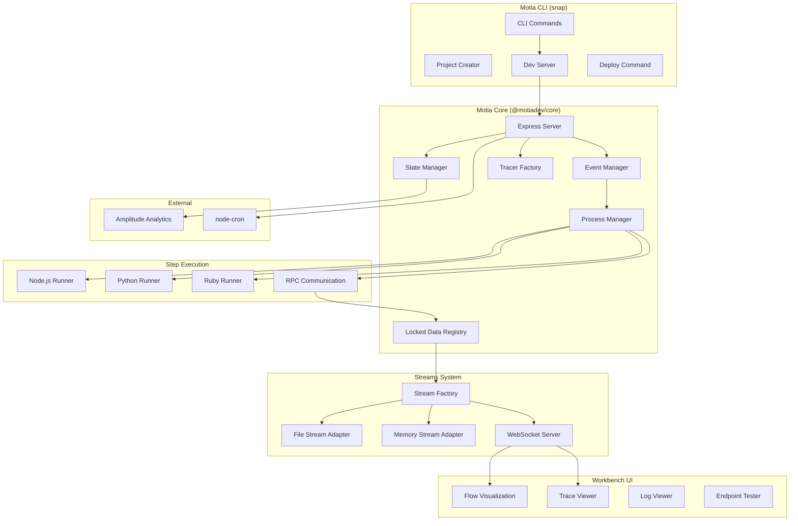
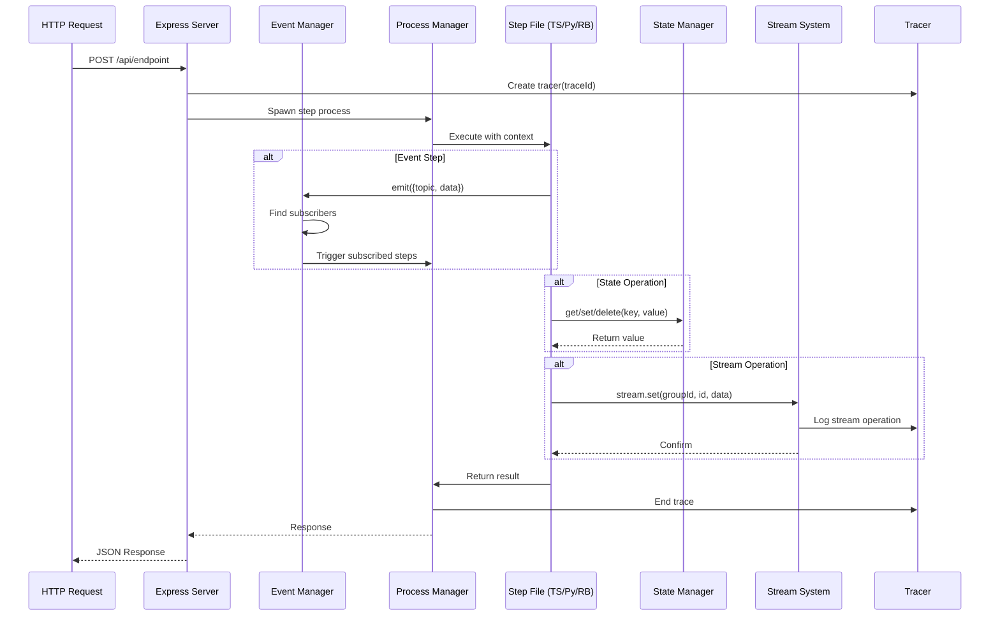
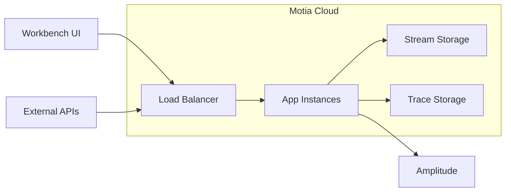

# Project Exploration: sirc.API Motia Ecosystem

## Overview

The sirc.API directory contains a comprehensive **Motia ecosystem** - a modern backend framework that unifies APIs, background jobs, workflows, and AI agents into a single coherent system. Motia positions itself as the "React for backends" where everything is a **Step**, similar to how everything is a component in React.

**Core Value Proposition:** Motia solves backend fragmentation by providing a unified system where JavaScript, TypeScript, Python, and Ruby code can coexist in the same workflow with shared observability, state management, and event-driven architecture.

The ecosystem consists of:
- **motia/** - The main monorepo containing the core framework, workbench UI, stream clients, and CLI tools
- **motia-examples/** - 20+ example implementations showcasing various use cases
- **chessarena-ai/** - A full-production chess AI platform built with Motia
- **motia-agent-content/** - Agent content generation application
- **motia-stream-example/** - Streaming API example project
- **build-your-first-app/** - Tutorial/getting started guide
- **motia-rfc/** - RFCs and design documents

## Repository

- **Location:** `/home/darkvoid/Boxxed/@formulas/sirc.API`
- **Remote:** N/A (parent directory is not a git repo; subprojects have individual remotes)
- **Primary Language:** TypeScript
- **License:** MIT (detected in subprojects)

## Directory Structure

```
/home/darkvoid/Boxxed/@formulas/sirc.API/
├── motia/                          # Main Motia monorepo
│   ├── packages/
│   │   ├── core/                   # Core framework engine (96 TS files)
│   │   │   ├── src/
│   │   │   │   ├── analytics/      # Amplitude analytics integration
│   │   │   │   ├── node/           # Node.js process runner & RPC
│   │   │   │   ├── python/         # Python runner & IPC communication
│   │   │   │   ├── ruby/           # Ruby runner & RPC
│   │   │   │   ├── observability/  # Tracing, span management
│   │   │   │   ├── process-communication/  # RPC processor interface
│   │   │   │   ├── state/          # State adapters (file/memory)
│   │   │   │   ├── streams/        # Stream implementations & adapters
│   │   │   │   ├── types/          # Type generation utilities
│   │   │   │   ├── __tests__/      # Jest test suites
│   │   │   │   ├── motia.ts        # Core Motia type definitions
│   │   │   │   ├── types.ts        # Step, Event, Flow types
│   │   │   │   ├── server.ts       # Express server creation
│   │   │   │   ├── call-step-file.ts  # Multi-language step executor
│   │   │   │   └── locked-data.ts  # Central state registry
│   │   │   └── package.json        # @motiadev/core
│   │   ├── snap/                   # CLI tooling (create, dev, deploy)
│   │   │   └── src/
│   │   │       ├── cloud/          # Cloud deployment commands
│   │   │       ├── create/         # Project templating
│   │   │       ├── create-step/    # Step scaffolding
│   │   │       ├── dev/            # Development server
│   │   │       └── docker/         # Docker integration
│   │   ├── workbench/              # React-based visual debugger & workflow builder
│   │   │   └── src/
│   │   │       ├── components/
│   │   │       │   ├── flow/       # React Flow workflow visualization
│   │   │       │   ├── endpoints/  # API endpoint testing UI
│   │   │       │   ├── observability/  # Trace viewer
│   │   │       │   └── logs/       # Log viewer
│   │   │       ├── hooks/          # React hooks
│   │   │       ├── stores/         # Zustand state management
│   │   │       └── lib/            # Utilities
│   │   ├── stream-client/          # Base stream client library
│   │   ├── stream-client-node/     # Node.js stream client
│   │   ├── stream-client-browser/  # Browser stream client
│   │   ├── stream-client-react/    # React hooks for streams
│   │   ├── ui/                     # Shared UI components
│   │   ├── test/                   # Testing utilities
│   │   ├── e2e/                    # Playwright end-to-end tests
│   │   ├── docs/                   # Documentation site (Next.js)
│   │   └── docker/                 # Docker deployment assets
│   ├── playground/                 # Development sandbox
│   │   └── steps/                  # Example step implementations
│   │       ├── basic-tutorial/     # Tutorial workflow
│   │       ├── cronExample/        # Cron job examples
│   │       ├── default-node/       # Node.js examples
│   │       ├── default_python/     # Python examples
│   │       └── parallelMergeState/ # Parallel execution demo
│   ├── contributors/
│   │   ├── architecture/           # Architecture documentation
│   │   │   └── deploy/             # Deployment flow diagrams
│   │   └── rfc/                    # Request for Comments
│   ├── assets/                     # Branding assets
│   └── .github/workflows/          # CI/CD pipelines
│
├── chessarena-ai/                  # Production chess AI platform
│   ├── api/                        # Motia API backend
│   │   ├── services/
│   │   │   ├── ai/                 # AI model integration
│   │   │   └── chess/              # Chess engine (Stockfish)
│   │   ├── steps/
│   │   │   ├── auth/               # Authentication steps
│   │   │   ├── chess/              # Chess game logic
│   │   │   │   ├── access/         # Access control
│   │   │   │   └── streams/        # Real-time game streams
│   │   │   └── middlewares/        # Express middleware
│   │   └── types/                  # Shared type definitions
│   ├── app/                        # React frontend
│   │   └── src/
│   │       ├── components/
│   │       ├── lib/
│   │       └── pages/
│   └── types/                      # TypeScript type definitions
│
├── motia-examples/                 # Example implementations
│   └── examples/
│       ├── ai-deep-research-agent/     # Web research agent
│       ├── finance-agent/              # Financial analysis
│       ├── github-integration-workflow/# PR/issue automation
│       ├── gmail-workflow/             # Email automation
│       ├── rag-docling-weaviate-agent/ # PDF RAG system
│       ├── streaming-ai-chatbot/       # Real-time AI chat
│       ├── chat-agent/                 # WebSocket chat
│       └── ... (20+ total examples)
│
├── motia-agent-content/            # Content generation app
│   ├── src/
│   ├── steps/
│   └── motia-workbench.json        # Workbench configuration
│
├── motia-stream-example/           # Streaming demonstration
│   ├── streams-api/                # Stream API server
│   └── streams-app/                # Stream consumer app
│
├── build-your-first-app/           # Interactive tutorial
│   ├── steps/
│   │   ├── javascript/
│   │   ├── typescript/
│   │   ├── python/
│   │   └── services/
│   └── .cursor/                    # Cursor IDE rules
│
└── motia-rfc/                      # Design documents
    └── *.md                        # RFC markdown files
```

## Architecture

### High-Level Architecture Diagram



### Core Data Flow



## Component Breakdown

### Core Framework (@motiadev/core)

**Location:** `/home/darkvoid/Boxxed/@formulas/sirc.API/motia/packages/core`

**Purpose:** The heart of Motia - provides the workflow engine, event system, state management, and multi-language step execution.

**Key Components:**

| Component | File | Purpose |
|-----------|------|---------|
| **Motia** | `motia.ts` | Core type defining the framework instance |
| **Event Manager** | `event-manager.ts` | Pub/sub event system for step communication |
| **Locked Data** | `locked-data.ts` | Central registry for steps, flows, streams |
| **Server** | `server.ts` | Express server with WebSocket support |
| **Call Step File** | `call-step-file.ts` | Multi-language step executor via child processes |
| **Process Manager** | `process-communication/process-manager.ts` | Spawns/manages language runner processes |
| **Stream Factory** | `streams/stream-factory.ts` | Creates stream instances with adapters |
| **Tracer Factory** | `observability/tracer.ts` | Creates distributed tracing spans |

**Dependencies:**
- `express` - HTTP server
- `ws` - WebSocket server
- `zod` - Schema validation
- `node-cron` - Cron scheduling
- `@amplitude/analytics-node` - Analytics

### CLI Tool (@motiadev/snap)

**Location:** `/home/darkvoid/Boxxed/@formulas/sirc.API/motia/packages/snap`

**Purpose:** Developer CLI for project creation, development server, deployment, and resource generation.

**Commands:**
- `motia create` - Scaffold new project
- `motia dev` - Start development server with hot reload
- `motia generate step` - Create new step file
- `motia deploy` - Deploy to Motia Cloud
- `motia docker` - Docker containerization

### Workbench UI

**Location:** `/home/darkvoid/Boxxed/@formulas/sirc.API/motia/packages/workbench`

**Purpose:** React-based visual interface for building, debugging, and monitoring Motia workflows.

**Features:**
- **Flow Visualization** - React Flow-based workflow diagrams
- **API Endpoint Tester** - Built-in API client for testing endpoints
- **Trace Viewer** - Distributed trace visualization
- **Log Viewer** - Real-time log streaming
- **State Inspector** - View and modify application state

**Dependencies:**
- `@xyflow/react` - Flow diagram library
- `zustand` - State management
- `@motiadev/stream-client-react` - Real-time stream hooks

### Stream System

**Location:** `/home/darkvoid/Boxxed/@formulas/sirc.API/motia/packages/core/src/streams`

**Purpose:** Real-time state synchronization system with WebSocket push to clients.

**Architecture:**
```
Stream Definition → Stream Factory → Adapter → Storage
                                           ↓
                                    WebSocket Push → Workbench
```

**Stream Adapters:**
- **File Stream Adapter** - JSON file-based persistence (`.motia/streams/*.stream.json`)
- **Memory Stream Adapter** - In-memory storage for testing

**Stream Operations:**
- `get(groupId, id)` - Retrieve single item
- `set(groupId, id, data)` - Create/update item
- `delete(groupId, id)` - Remove item
- `getGroup(groupId)` - List all items in group
- `send(channel, event)` - Push real-time event

### Step Types

Motia defines 4 step types:

| Type | Config | Trigger | Use Case |
|------|--------|---------|----------|
| **api** | `ApiRouteConfig` | HTTP Request | REST endpoints |
| **event** | `EventConfig` | Topic subscription | Background processing |
| **cron** | `CronConfig` | Schedule | Recurring jobs |
| **noop** | `NoopConfig` | Manual/Dev only | Development placeholders |

### Multi-Language Support

Motia executes steps in isolated processes based on file extension:

| Language | Runner | Entry Point |
|----------|--------|-------------|
| **TypeScript/JavaScript** | `node-runner.ts` | `packages/core/src/node/` |
| **Python** | `python-runner.py` | `packages/core/src/python/` |
| **Ruby** | `ruby-runner.rb` | `packages/core/src/ruby/` |

**Communication Protocol:**
- RPC over stdin/stdout
- JSON message format
- Supports state, stream, and emit operations

## Entry Points

### Development Server

**File:** `motia/packages/snap/src/dev.ts`

**Execution Flow:**
1. Load `motia-workbench.json` configuration
2. Initialize `LockedData` registry
3. Scan `steps/` directory for step files
4. Parse and validate step configurations
5. Create Express server with routes
6. Start WebSocket server for Workbench
7. Register event handlers for all steps
8. Start cron scheduler

### Step Execution

**File:** `motia/packages/core/src/call-step-file.ts`

**Execution Flow:**
1. Determine language from file extension
2. Spawn child process with language runner
3. Establish RPC communication channel
4. Inject state, stream, logger, tracer context
5. Execute step handler
6. Capture result and trace data
7. Clean up process

### API Request Handling

**File:** `motia/packages/core/src/server.ts`

**Execution Flow:**
1. Request received at Express route
2. Generate trace ID for observability
3. Create logger and tracer instances
4. Parse request body, params, headers
5. Call step file with context
6. Return response with status code
7. Track analytics event

## External Dependencies

| Dependency | Version | Purpose |
|------------|---------|---------|
| `express` | ^4.21.2 | HTTP server framework |
| `ws` | ^8.18.2 | WebSocket server |
| `zod` | ^3.24.1 | Schema validation |
| `node-cron` | ^3.0.3 | Cron job scheduling |
| `@amplitude/analytics-node` | ^1.3.8 | Usage analytics |
| `cors` | ^2.8.5 | CORS middleware |
| `body-parser` | ^1.20.3 | Request body parsing |
| `dotenv` | ^16.4.7 | Environment variables |
| `uuid` | ^11.1.0 | Unique ID generation |
| `@xyflow/react` | ^12.6.4 | Flow visualization |
| `zustand` | ^5.0.6 | React state management |
| `commander` | - | CLI argument parsing |
| `inquirer` | - | Interactive prompts |

## Configuration

### Project Configuration (motia-workbench.json)

```json
{
  "name": "project-name",
  "steps": ["./steps"],
  "services": ["./services"],
  "streams": ["./streams/*.stream.ts"]
}
```

### Environment Variables

| Variable | Purpose |
|----------|---------|
| `MOTIA_MAX_TRACE_GROUPS` | Max trace groups to retain (default: 50) |
| `LOG_LEVEL` | Logging verbosity (debug, info, warn, error) |
| `_MOTIA_TEST_MODE` | Enable test mode for development |
| `AMPLITUDE_API_KEY` | Analytics API key |

### Stream Adapter Configuration

```typescript
// In LockedData constructor
constructor(
  public readonly baseDir: string,
  public readonly streamAdapter: 'file' | 'memory' = 'file',
  private readonly printer: Printer
)
```

## Testing

### Test Structure

**Location:** `motia/packages/core/src/__tests__/`

**Test Files:**
- `call-step-file.test.ts` - Step execution tests
- `event-manager.test.ts` - Event pub/sub tests
- `server.test.ts` - HTTP endpoint tests
- `locked-data.test.ts` - State registry tests
- `middleware-management.test.ts` - Middleware composition tests

### Running Tests

```bash
# Run all tests
pnpm test

# Run E2E tests
pnpm test:e2e

# Run E2E with UI
pnpm test:e2e:ui
```

### Testing Utilities

**@motiadev/test package:**
- Mock step execution
- Test event flows
- Stream assertions
- Trace validation

## Key Insights

### Architectural Patterns

1. **Everything is a Step** - Similar to React's "everything is a component", Motia unifies all backend concerns (APIs, events, cron jobs) into a single abstraction called Steps.

2. **Process Isolation** - Each step runs in an isolated child process, enabling true multi-language support and crash isolation. A Python step failure doesn't affect Node.js steps.

3. **Event-Driven by Default** - Steps communicate exclusively through events, creating loose coupling and enabling easy workflow modifications.

4. **Streams as State** - Real-time state synchronization is a first-class citizen via the Streams API, with automatic WebSocket push to connected clients.

5. **Trace-Everything Observability** - Every request generates a trace ID that follows through all step executions, enabling complete request lifecycle visibility.

### Comparison to Similar Systems

| System | Motia Difference |
|--------|-----------------|
| **Temporal** | Motia is lighter-weight, focuses on event-driven vs durable execution |
| **Zapier/n8n** | Motia is code-first, not low-code; better for complex logic |
| **AWS Step Functions** | Motia runs locally, supports multiple languages natively |
| **Express + Bull** | Motia provides unified abstractions, built-in observability |
| **NestJS** | Motia is more event-focused, has visual workflow builder |

### Deployment Architecture



### Language Runner Architecture

```
┌─────────────────────────────────────────────────────────┐
│                    Motia Core (Node.js)                  │
│  ┌─────────────────────────────────────────────────────┐│
│  │              Process Manager                         ││
│  │  ┌─────────┐  ┌─────────┐  ┌─────────┐             ││
│  │  │  Node   │  │ Python  │  │  Ruby   │             ││
│  │  │ Runner  │  │ Runner  │  │ Runner  │             ││
│  │  │  (.ts)  │  │  (.py)  │  │  (.rb)  │             ││
│  │  └────┬────┘  └────┬────┘  └────┬────┘             ││
│  │       │            │            │                   ││
│  │       └────────────┴────────────┘                   ││
│  │                 RPC (stdin/stdout)                  ││
│  └─────────────────────────────────────────────────────┘│
└─────────────────────────────────────────────────────────┘
```

## Open Questions

1. **Stream Persistence** - File-based streams may have scalability issues. What are the recommended production storage backends?

2. **Deployment Model** - How does Motia Cloud deployment work? Is it container-based or serverless?

3. **Horizontal Scaling** - Can multiple Motia instances share state? How is distributed locking handled?

4. **Python/Ruby Type Safety** - How are TypeScript types synchronized with Python/Ruby step inputs/outputs?

5. **Memory Management** - Long-running processes accumulate state. What are the memory limits and GC strategies?

6. **WebSocket Scaling** - How does the Workbench handle many concurrent connections in production?

7. **Step Hot Reload** - How does the dev server detect and reload changed step files without restart?

8. **Error Recovery** - What happens to in-flight traces when a step crashes? Is there retry logic?

## Additional Resources

- **Main Documentation:** https://motia.dev/docs
- **Examples Repository:** https://github.com/MotiaDev/motia-examples
- **ChessArena.ai Demo:** https://chessarena.ai
- **NPM Package:** https://www.npmjs.com/package/motia
- **Discord Community:** https://discord.gg/motia
