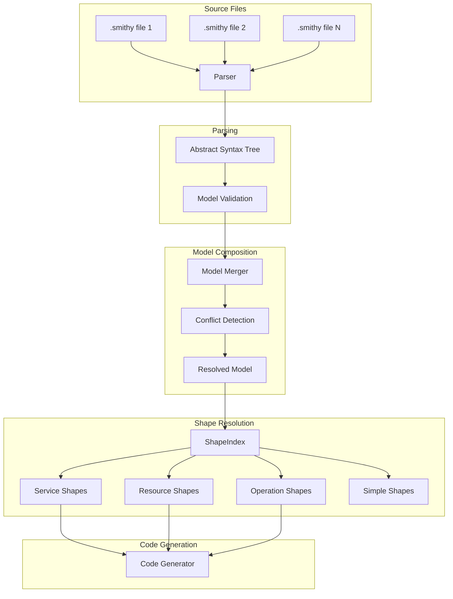

# Deep Dive: Smithy Model System and Type System

## Overview

This deep dive examines Smithy's model system - the core AST (Abstract Syntax Tree) that represents API definitions. We explore how Smithy parses `.smithy` files into shapes, resolves types, validates constraints, and enables code generation.

## Architecture



## Model Structure

### Model Container

```java
// software/amazon/smithy/model/Model.java

public final class Model {
    // All shapes in the model, keyed by their absolute ID
    private final Map<ShapeId, Shape> shapes;
    
    // Metadata key-value pairs
    private final Map<String, Node> metadata;
    
    // Map of shape IDs to their direct dependencies
    private final Map<ShapeId, Set<ShapeId>> shapeDependencies;
    
    // Reverse index: which shapes reference each shape
    private final Map<ShapeId, Set<ShapeId>> shapeReferences;
    
    // Shape index for fast lookups
    private final ShapeIndex shapeIndex;
    
    private Model(Builder builder) {
        this.shapes = Collections.unmodifiableMap(builder.shapes);
        this.metadata = Collections.unmodifiableMap(builder.metadata);
        this.shapeDependencies = computeDependencies();
        this.shapeReferences = computeReferences();
        this.shapeIndex = new ShapeIndex(this);
    }
    
    /// Get all shapes of a specific type
    public <T extends Shape> Stream<T> getShapesOfType(Class<T> type) {
        return shapes.values().stream()
            .filter(type::isInstance)
            .map(type::cast);
    }
    
    /// Get shape by ID
    public <T extends Shape> Optional<T> getShape(ShapeId id, Class<T> type) {
        Shape shape = shapes.get(id);
        if (shape != null && type.isInstance(shape)) {
            return Optional.of(type.cast(shape));
        }
        return Optional.empty();
    }
    
    /// Get service shapes
    public Stream<ServiceShape> getServiceShapes() {
        return getShapesOfType(ServiceShape.class);
    }
    
    /// Get resource shapes
    public Stream<ResourceShape> getResourceShapes() {
        return getShapesOfType(ResourceShape.class);
    }
    
    /// Get operation shapes
    public Stream<OperationShape> getOperationShapes() {
        return getShapesOfType(OperationShape.class);
    }
    
    /// Validate model integrity
    public List<ValidationEvent> validate() {
        List<ValidationEvent> events = new ArrayList<>();
        
        // Check for unconnected shapes
        events.addAll(validateUnconnectedShapes());
        
        // Check for undefined type references
        events.addAll(validateTypeReferences());
        
        // Check for trait application errors
        events.addAll(validateTraits());
        
        // Check for lifecycle conflicts
        events.addAll(validateLifecycle());
        
        return events;
    }
}
```

### Shape Hierarchy

```java
// software/amazon/smithy/model/Shape.java

public abstract class Shape {
    /// Absolute shape ID (namespace#Name)
    private final ShapeId id;
    
    /// All traits applied to this shape
    private final Map<ShapeId, Trait> traits;
    
    /// Member shapes (for structures, unions, etc.)
    private final Map<String, MemberShape> members;
    
    /// Mixin shapes this shape inherits from
    private final Set<ShapeId> mixins;
    
    protected Shape(Builder builder) {
        this.id = builder.id;
        this.traits = Collections.unmodifiableMap(builder.traits);
        this.members = Collections.unmodifiableMap(builder.members);
        this.mixins = Collections.unmodifiableSet(builder.mixins);
    }
    
    /// Get a specific trait
    public <T extends Trait> Optional<T> getTrait(Class<T> type) {
        for (Trait trait : traits.values()) {
            if (type.isInstance(trait)) {
                return Optional.of(type.cast(trait));
            }
        }
        return Optional.empty();
    }
    
    /// Check if shape has a trait
    public boolean hasTrait(Class<? extends Trait> type) {
        return getTrait(type).isPresent();
    }
    
    /// Get member by name
    public Optional<MemberShape> getMember(String name) {
        return Optional.ofNullable(members.get(name));
    }
    
    /// Shape type enum
    public ShapeType getType() {
        return switch (this) {
            case ServiceShape s -> ShapeType.SERVICE;
            case ResourceShape r -> ShapeType.RESOURCE;
            case OperationShape o -> ShapeType.OPERATION;
            case StructureShape s -> ShapeType.STRUCTURE;
            case UnionShape u -> ShapeType.UNION;
            case ListShape l -> ShapeType.LIST;
            case MapShape m -> ShapeType.MAP;
            case StringShape s -> ShapeType.STRING;
            case IntegerShape i -> ShapeType.INTEGER;
            // ... more types
        };
    }
}

/// Shape type enumeration
public enum ShapeType {
    // Service shapes
    SERVICE,
    RESOURCE,
    OPERATION,
    
    // Aggregate shapes (contain members)
    STRUCTURE,
    UNION,
    LIST,
    MAP,
    
    // Simple shapes
    STRING,
    INTEGER,
    LONG,
    SHORT,
    BYTE,
    FLOAT,
    DOUBLE,
    BIG_DECIMAL,
    BIG_INTEGER,
    BOOLEAN,
    TIMESTAMP,
    BLOB,
    DOCUMENT,
    
    // Special
    MEMBER
}
```

## Service Shape

```java
// software/amazon/smithy/model/shapes/ServiceShape.java

public final class ServiceShape extends Shape {
    /// Service version string
    private final String version;
    
    /// Top-level operations (not part of resources)
    private final Set<ShapeId> operations;
    
    /// Resources contained in this service
    private final Set<ShapeId> resources;
    
    /// Errors that can be returned by any operation
    private final Set<ShapeId> errors;
    
    /// Lifecycle events (startup, shutdown hooks)
    private final Set<ShapeId> lifecycle;
    
    private ServiceShape(Builder builder) {
        super(builder);
        this.version = builder.version;
        this.operations = Collections.unmodifiableSet(builder.operations);
        this.resources = Collections.unmodifiableSet(builder.resources);
        this.errors = Collections.unmodifiableSet(builder.errors);
        this.lifecycle = Collections.unmodifiableSet(builder.lifecycle);
    }
    
    /// Get all operations including resource operations
    public Set<ShapeId> getAllOperations() {
        Set<ShapeId> all = new HashSet<>(operations);
        
        // Add operations from resources
        for (ShapeId resourceId : resources) {
            getModel().getShape(resourceId, ResourceShape.class)
                .ifPresent(resource -> all.addAll(resource.getAllOperations()));
        }
        
        return all;
    }
    
    /// Get operation shape by name
    public Optional<OperationShape> getOperation(String name) {
        for (ShapeId opId : operations) {
            if (opId.getName().equals(name)) {
                return getModel().getShape(opId, OperationShape.class);
            }
        }
        return Optional.empty();
    }
}
```

## Resource Shape

```java
// software/amazon/smithy/model/shapes/ResourceShape.java

public final class ResourceShape extends Shape {
    /// Identifiers for this resource (e.g., cityId: CityId)
    private final Map<String, ShapeId> identifiers;
    
    /// Read operation (GET /cities/{cityId})
    private final ShapeId read;
    
    /// Create operation (POST /cities)
    private final ShapeId create;
    
    /// Update operation (PUT /cities/{cityId})
    private final ShapeId update;
    
    /// Delete operation (DELETE /cities/{cityId})
    private final ShapeId delete;
    
    /// List operation (GET /cities)
    private final ShapeId list;
    
    /// Nested resources
    private final Set<ShapeId> resources;
    
    /// Custom operations on this resource
    private final Set<ShapeId> operations;
    
    private ResourceShape(Builder builder) {
        super(builder);
        this.identifiers = Collections.unmodifiableMap(builder.identifiers);
        this.read = builder.read;
        this.create = builder.create;
        this.update = builder.update;
        this.delete = builder.delete;
        this.list = builder.list;
        this.resources = Collections.unmodifiableSet(builder.resources);
        this.operations = Collections.unmodifiableSet(builder.operations);
    }
    
    /// Get all operations including nested resource operations
    public Set<ShapeId> getAllOperations() {
        Set<ShapeId> all = new HashSet<>();
        
        // Add CRUD operations
        if (read != null) all.add(read);
        if (create != null) all.add(create);
        if (update != null) all.add(update);
        if (delete != null) all.add(delete);
        if (list != null) all.add(list);
        
        // Add custom operations
        all.addAll(operations);
        
        // Add nested resource operations
        for (ShapeId resourceId : resources) {
            getModel().getShape(resourceId, ResourceShape.class)
                .ifPresent(resource -> all.addAll(resource.getAllOperations()));
        }
        
        return all;
    }
    
    /// Get resource path from root
    public List<String> getResourcePath() {
        List<String> path = new ArrayList<>();
        path.add(getId().getName());
        
        // Build path from parent resources
        Shape parent = getParentResource();
        while (parent instanceof ResourceShape resource) {
            path.add(0, resource.getId().getName());
            parent = resource.getParentResource();
        }
        
        return path;
    }
    
    /// Check if this is a top-level resource
    public boolean isTopLevel() {
        return getParentResource() == null;
    }
}
```

## Operation Shape

```java
// software/amazon/smithy/model/shapes/OperationShape.java

public final class OperationShape extends Shape {
    /// Input structure
    private final ShapeId input;
    
    /// Output structure
    private final ShapeId output;
    
    /// Errors this operation can return
    private final Set<ShapeId> errors;
    
    /// Pagination configuration
    private final ShapeId pagination;
    
    /// Long-running operation configuration
    private final ShapeId waiter;
    
    private OperationShape(Builder builder) {
        super(builder);
        this.input = builder.input;
        this.output = builder.output;
        this.errors = Collections.unmodifiableSet(builder.errors);
        this.pagination = builder.pagination;
        this.waiter = builder.waiter;
    }
    
    /// Get input structure
    public Optional<StructureShape> getInputStructure() {
        if (input == null) {
            // Default empty input
            return Optional.empty();
        }
        return getModel().getShape(input, StructureShape.class);
    }
    
    /// Get output structure
    public Optional<StructureShape> getOutputStructure() {
        if (output == null) {
            return Optional.empty();
        }
        return getModel().getShape(output, StructureShape.class);
    }
    
    /// Get all possible error shapes
    public Set<StructureShape> getErrorShapes() {
        return errors.stream()
            .map(id -> getModel().getShape(id, StructureShape.class))
            .filter(Optional::isPresent)
            .map(Optional::get)
            .collect(Collectors.toSet());
    }
    
    /// Check if error is possible
    public boolean canError(Class<? extends Trait> errorType) {
        return getErrorShapes().stream()
            .anyMatch(shape -> shape.hasTrait(errorType));
    }
}
```

## Structure and Member Shapes

```java
// software/amazon/smithy/model/shapes/StructureShape.java

public final class StructureShape extends Shape {
    /// Members of this structure
    private final Map<String, MemberShape> members;
    
    /// Mixin structures
    private final Set<ShapeId> mixins;
    
    private StructureShape(Builder builder) {
        super(builder);
        this.members = Collections.unmodifiableMap(builder.members);
        this.mixins = Collections.unmodifiableSet(builder.mixins);
    }
    
    /// Get required members
    public List<MemberShape> getRequiredMembers() {
        return members.values().stream()
            .filter(member -> member.hasTrait(RequiredTrait.class))
            .collect(Collectors.toList());
    }
    
    /// Get optional members
    public List<MemberShape> getOptionalMembers() {
        return members.values().stream()
            .filter(member -> !member.hasTrait(RequiredTrait.class))
            .collect(Collectors.toList());
    }
    
    /// Apply mixins (inheritance)
    public StructureShape withMixins() {
        if (mixins.isEmpty()) {
            return this;
        }
        
        Map<String, MemberShape> combined = new LinkedHashMap<>();
        
        // First add mixin members
        for (ShapeId mixinId : mixins) {
            getModel().getShape(mixinId, StructureShape.class)
                .ifPresent(mixin -> combined.putAll(mixin.getMembers()));
        }
        
        // Then override with own members
        combined.putAll(members);
        
        return new StructureShape(toBuilder().members(combined).build());
    }
}

// software/amazon/smithy/model/shapes/MemberShape.java

public final class MemberShape extends Shape {
    /// Target shape ID (the type of this member)
    private final ShapeId target;
    
    /// Default value
    private final Node defaultValue;
    
    private MemberShape(Builder builder) {
        super(builder);
        this.target = builder.target;
        this.defaultValue = builder.defaultValue;
    }
    
    /// Get the target shape
    public <T extends Shape> Optional<T> getTarget(Model model, Class<T> type) {
        return model.getShape(target, type);
    }
    
    /// Check if member is required
    public boolean isRequired() {
        return hasTrait(RequiredTrait.class);
    }
    
    /// Check if member is nullable
    public boolean isNullable() {
        return hasTrait(NullableTrait.class);
    }
    
    /// Get default value if present
    public Optional<Node> getDefaultValue() {
        return Optional.ofNullable(defaultValue);
    }
}
```

## Simple Shapes

```java
// software/amazon/smithy/model/shapes/StringShape.java

public final class StringShape extends Shape {
    private StringShape(Builder builder) {
        super(builder);
    }
    
    /// Get enum values if this is an enum
    public Optional<List<EnumValue>> getEnumValues() {
        return getTrait(EnumTrait.class)
            .map(EnumTrait::getValues);
    }
    
    /// Get pattern constraint
    public Optional<PatternTrait> getPattern() {
        return getTrait(PatternTrait.class);
    }
    
    /// Get length constraint
    public Optional<LengthTrait> getLength() {
        return getTrait(LengthTrait.class);
    }
}

// software/amazon/smithy/model/shapes/IntegerShape.java

public final class IntegerShape extends Shape {
    private IntegerShape(Builder builder) {
        super(builder);
    }
    
    /// Get range constraint
    public Optional<RangeTrait> getRange() {
        return getTrait(RangeTrait.class);
    }
    
    /// Get minimum value
    public Optional<Long> getMin() {
        return getRange().map(RangeTrait::getMin);
    }
    
    /// Get maximum value
    public Optional<Long> getMax() {
        return getRange().map(RangeTrait::getMax);
    }
}

// software/amazon/smithy/model/shapes/TimestampShape.java

public final class TimestampShape extends Shape {
    private TimestampShape(Builder builder) {
        super(builder);
    }
    
    /// Get timestamp format
    public TimestampFormatTrait.Format getFormat() {
        return getTrait(TimestampFormatTrait.class)
            .map(TimestampFormatTrait::getFormat)
            .orElse(TimestampFormatTrait.Format.DATE_TIME);
    }
}
```

## Trait System

```java
// software/amazon/smithy/model/traits/Trait.java

public abstract class Trait {
    /// Trait shape ID
    private final ShapeId shapeId;
    
    /// Trait node value (for serialization)
    private final Node nodeValue;
    
    protected Trait(ShapeId shapeId, Node nodeValue) {
        this.shapeId = shapeId;
        this.nodeValue = nodeValue;
    }
    
    /// Get trait name for error messages
    public String getTraitName() {
        return shapeId.getName();
    }
}

// Built-in trait implementations

@TraitDefinition("required")
public final class RequiredTrait extends Trait {
    public RequiredTrait() {
        super(ShapeId.fromBuiltIn("required"), Node.objectNode());
    }
}

@TraitDefinition("length")
public final class LengthTrait extends Trait {
    private final Long min;
    private final Long max;
    
    public LengthTrait(Node node) {
        super(ShapeId.fromBuiltIn("length"), node);
        ObjectNode obj = node.expectObjectNode();
        this.min = obj.getNumberMember("min").map(NumberNode::getValue).orElse(null);
        this.max = obj.getNumberMember("max").map(NumberNode::getValue).orElse(null);
    }
    
    public Long getMin() { return min; }
    public Long getMax() { return max; }
}

@TraitDefinition("range")
public final class RangeTrait extends Trait {
    private final Long min;
    private final Long max;
    
    public RangeTrait(Node node) {
        super(ShapeId.fromBuiltIn("range"), node);
        ObjectNode obj = node.expectObjectNode();
        this.min = obj.getNumberMember("min").map(NumberNode::getValue).orElse(null);
        this.max = obj.getNumberMember("max").map(NumberNode::getValue).orElse(null);
    }
}

@TraitDefinition("pattern")
public final class PatternTrait extends Trait {
    private final Pattern pattern;
    private final String value;
    
    public PatternTrait(Node node) {
        super(ShapeId.fromBuiltIn("pattern"), node);
        this.value = node.expectStringNode().getValue();
        this.pattern = Pattern.compile(value);
    }
    
    public boolean matches(String value) {
        return pattern.matcher(value).matches();
    }
}

@TraitDefinition("http")
public final class HttpTrait extends Trait {
    private final String method;
    private final String uri;
    private final int code;
    private final Set<Integer> additionalSuccessCodes;
    
    public HttpTrait(Node node) {
        super(ShapeId.fromBuiltIn("http"), node);
        ObjectNode obj = node.expectObjectNode();
        this.method = obj.expectStringMember("method").getValue();
        this.uri = obj.expectStringMember("uri").getValue();
        this.code = obj.expectNumberMember("code").getValue().intValue();
        this.additionalSuccessCodes = obj.getArrayMember("additionalSuccessCodes")
            .map(array -> array.getElementsAs(StringNode.class, StringNode::getValue))
            .map(set -> set.stream().map(Integer::parseInt).collect(Collectors.toSet()))
            .orElse(Collections.emptySet());
    }
    
    public boolean isReadOperation() {
        return "GET".equalsIgnoreCase(method) || "HEAD".equalsIgnoreCase(method);
    }
}
```

## Model Validation

```java
// software/amazon/smithy/model/validation/ModelValidator.java

public class ModelValidator {
    private final List<Validator> validators;
    
    public ModelValidator() {
        this.validators = loadValidators();
    }
    
    public List<ValidationEvent> validate(Model model) {
        List<ValidationEvent> events = new ArrayList<>();
        
        for (Validator validator : validators) {
            events.addAll(validator.validate(model));
        }
        
        return events;
    }
}

// Validation event severity
public enum Severity {
    ERROR,      // Model is invalid
    WARNING,    // Model may have issues
    INFO,       // Informational
    SUPPRESSED  // Suppressed warning
}

public class ValidationEvent {
    private final Severity severity;
    private final String message;
    private final ShapeId shapeId;
    private final String eventId;
    
    // Getters...
}

// Example validator
public class UndefinedShapeValidator implements Validator {
    @Override
    public List<ValidationEvent> validate(Model model) {
        List<ValidationEvent> events = new ArrayList<>();
        
        for (Shape shape : model.toSet()) {
            // Check member targets
            for (MemberShape member : shape.getAllMembers().values()) {
                if (!model.getShape(member.getTarget()).isPresent()) {
                    events.add(ValidationEvent.builder()
                        .severity(Severity.ERROR)
                        .message(String.format(
                            "Undefined shape referenced: %s",
                            member.getTarget()
                        ))
                        .shapeId(shape.getId())
                        .eventId("UndefinedShape")
                        .build());
                }
            }
        }
        
        return events;
    }
}
```

## Shape Resolution

```java
// software/amazon/smithy/model/ShapeIndex.java

public class ShapeIndex {
    private final Model model;
    
    // Pre-computed indices for fast lookups
    private final Map<String, Set<Shape>> shapesByNamespace;
    private final Map<Class<? extends Shape>, Set<Shape>> shapesByType;
    
    public ShapeIndex(Model model) {
        this.model = model;
        this.shapesByNamespace = indexByNamespace();
        this.shapesByType = indexByType();
    }
    
    /// Get all shapes in namespace
    public Stream<Shape> getShapesInNamespace(String namespace) {
        return shapesByNamespace.getOrDefault(namespace, Collections.emptySet()).stream();
    }
    
    /// Get all shapes of type
    public <T extends Shape> Stream<T> getShapesOfType(Class<T> type) {
        Set<Shape> shapes = shapesByType.getOrDefault(type, Collections.emptySet());
        return shapes.stream().map(type::cast);
    }
    
    /// Get service shapes
    public Stream<ServiceShape> getServiceShapes() {
        return getShapesOfType(ServiceShape.class);
    }
    
    /// Get shapes with specific trait
    public <T extends Trait> Stream<Shape> getShapesWithTrait(Class<T> traitType) {
        return model.toSet().stream()
            .filter(shape -> shape.hasTrait(traitType));
    }
}
```

## Conclusion

Smithy's model system provides:

1. **Type Safety**: Strong typing with shape references
2. **Validation**: Compile-time model validation
3. **Extensibility**: Custom traits for domain rules
4. **Composition**: Model merging and mixins
5. **Fast Lookups**: Pre-computed shape indices
