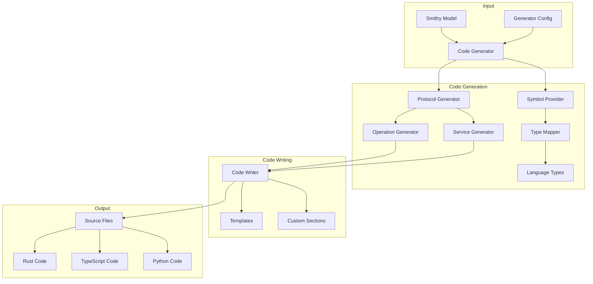

# Deep Dive: Smithy Code Generation Architecture

## Overview

This deep dive examines Smithy's code generation framework - how it transforms Smithy models into type-safe code for multiple languages. We explore the symbol provider pattern, protocol generators, code writers, and the codegen-core library that powers smithy-rs, smithy-python, and smithy-typescript.

## Architecture



## Code Generator Interface

```java
// software/amazon/smithy/codegen/core/CodegenPlugin.java

public abstract class CodegenPlugin {
    /// Plugin name identifier
    public static final String NAME;
    
    /// Default settings for this plugin
    protected SmithyBuildPluginConfiguration config;
    
    /// Execute code generation
    public abstract void execute(Context context);
    
    /// Get supported programming language
    public abstract ProgrammingLanguage getLanguage();
}

/// Code generation context
public class Context {
    private final Model model;
    private final FileOutputDirectory outputDir;
    private final Settings settings;
    private final SymbolProvider symbolProvider;
    private final ProtocolGenerator protocolGenerator;
    private final FileManifest fileManifest;
    
    public Context(
        Model model,
        FileOutputDirectory outputDir,
        Settings settings,
        SymbolProvider symbolProvider,
        ProtocolGenerator protocolGenerator,
        FileManifest fileManifest
    ) {
        this.model = model;
        this.outputDir = outputDir;
        this.settings = settings;
        this.symbolProvider = symbolProvider;
        this.protocolGenerator = protocolGenerator;
        this.fileManifest = fileManifest;
    }
    
    public Model getModel() { return model; }
    public FileOutputDirectory getOutputDir() { return outputDir; }
    public Settings getSettings() { return settings; }
    public SymbolProvider getSymbolProvider() { return symbolProvider; }
    public ProtocolGenerator getProtocolGenerator() { return protocolGenerator; }
    public FileManifest getFileManifest() { return fileManifest; }
}
```

## Symbol Provider Pattern

```java
// software/amazon/smithy/codegen/core/SymbolProvider.java

public interface SymbolProvider {
    /// Convert Smithy shape to language symbol
    Symbol toSymbol(Shape shape);
    
    /// Get member name (handles naming conflicts)
    String getMemberName(MemberShape shape);
    
    /// Get parameterized symbol (for generics)
    Symbol getParameterizedSymbol(Symbol container, List<Symbol> parameters);
}

/// Symbol represents a type in the target language
public class Symbol {
    private final String name;
    private final String namespace;
    private final String dependency;
    private final SymbolReference referenceType;
    private final Map<String, Object> properties;
    private final List<Symbol> generics;
    
    private Symbol(Builder builder) {
        this.name = builder.name;
        this.namespace = builder.namespace;
        this.dependency = builder.dependency;
        this.referenceType = builder.referenceType;
        this.properties = Collections.unmodifiableMap(builder.properties);
        this.generics = Collections.unmodifiableList(builder.generics);
    }
    
    /// Get fully qualified name
    public String getFullName() {
        if (namespace.isEmpty()) {
            return name;
        }
        return namespace + "." + name;
    }
    
    /// Check if symbol requires import
    public boolean needsImport() {
        return !namespace.isEmpty();
    }
    
    /// Builder for creating symbols
    public static class Builder {
        private String name;
        private String namespace = "";
        private String dependency;
        private SymbolReference referenceType = SymbolReference.EXPLICIT;
        private Map<String, Object> properties = new HashMap<>();
        private List<Symbol> generics = new ArrayList<>();
        
        public Builder name(String name) {
            this.name = name;
            return this;
        }
        
        public Builder namespace(String namespace) {
            this.namespace = namespace;
            return this;
        }
        
        public Builder dependency(String dependency) {
            this.dependency = dependency;
            return this;
        }
        
        public Builder addGeneric(Symbol generic) {
            this.generics.add(generic);
            return this;
        }
        
        public Symbol build() {
            return new Symbol(this);
        }
    }
}

/// Symbol reference type
public enum SymbolReference {
    EXPLICIT,    // Explicit import required
    IMPLIED,     // Import implied by context
    NONE         // No import needed (built-in)
}
```

## Rust Symbol Provider

```java
// Example Rust symbol provider implementation

public class RustSymbolProvider implements SymbolProvider {
    private final Model model;
    private final RustSettings settings;
    private final Map<ShapeType, Function<Shape, Symbol>> shapeMappers;
    
    public RustSymbolProvider(Model model, RustSettings settings) {
        this.model = model;
        this.settings = settings;
        this.shapeMappers = createShapeMappers();
    }
    
    @Override
    public Symbol toSymbol(Shape shape) {
        Function<Shape, Symbol> mapper = shapeMappers.get(shape.getType());
        if (mapper != null) {
            return mapper.apply(shape);
        }
        throw new CodegenException("Unsupported shape type: " + shape.getType());
    }
    
    private Map<ShapeType, Function<Shape, Symbol>> createShapeMappers() {
        Map<ShapeType, Function<Shape, Symbol>> mappers = new HashMap<>();
        
        // String types
        mappers.put(ShapeType.STRING, this::stringSymbol);
        mappers.put(ShapeType.ENUM, this::enumSymbol);
        
        // Numeric types
        mappers.put(ShapeType.INTEGER, this::integerSymbol);
        mappers.put(ShapeType.LONG, this::longSymbol);
        mappers.put(ShapeType.FLOAT, this::floatSymbol);
        mappers.put(ShapeType.DOUBLE, this::doubleSymbol);
        
        // Boolean
        mappers.put(ShapeType.BOOLEAN, this::booleanSymbol);
        
        // Timestamp
        mappers.put(ShapeType.TIMESTAMP, this::timestampSymbol);
        
        // Blob
        mappers.put(ShapeType.BLOB, this::blobSymbol);
        
        // Collections
        mappers.put(ShapeType.LIST, this::listSymbol);
        mappers.put(ShapeType.MAP, this::mapSymbol);
        
        // Aggregates
        mappers.put(ShapeType.STRUCTURE, this::structureSymbol);
        mappers.put(ShapeType.UNION, this::unionSymbol);
        
        // Special
        mappers.put(ShapeType.DOCUMENT, this::documentSymbol);
        
        return mappers;
    }
    
    private Symbol stringSymbol(Shape shape) {
        return Symbol.builder()
            .name("String")
            .namespace("std::string")
            .referenceType(SymbolReference.IMPLIED)
            .build();
    }
    
    private Symbol enumSymbol(Shape shape) {
        String name = shape.getId().getName() + "Enum";
        return Symbol.builder()
            .name(name)
            .namespace(settings.moduleName())
            .dependency("crate::model")
            .build();
    }
    
    private Symbol integerSymbol(Shape shape) {
        return Symbol.builder()
            .name("i32")
            .referenceType(SymbolReference.NONE)
            .build();
    }
    
    private Symbol longSymbol(Shape shape) {
        return Symbol.builder()
            .name("i64")
            .referenceType(SymbolReference.NONE)
            .build();
    }
    
    private Symbol floatSymbol(Shape shape) {
        return Symbol.builder()
            .name("f32")
            .referenceType(SymbolReference.NONE)
            .build();
    }
    
    private Symbol doubleSymbol(Shape shape) {
        return Symbol.builder()
            .name("f64")
            .referenceType(SymbolReference.NONE)
            .build();
    }
    
    private Symbol booleanSymbol(Shape shape) {
        return Symbol.builder()
            .name("bool")
            .referenceType(SymbolReference.NONE)
            .build();
    }
    
    private Symbol timestampSymbol(Shape shape) {
        return Symbol.builder()
            .name("PrimitiveDateTime")
            .namespace("time")
            .dependency("time")
            .build();
    }
    
    private Symbol blobSymbol(Shape shape) {
        return Symbol.builder()
            .name("Bytes")
            .namespace("bytes")
            .dependency("bytes")
            .build();
    }
    
    private Symbol listSymbol(Shape shape) {
        ListShape list = (ListShape) shape;
        Symbol memberSymbol = toSymbol(list.getMember().getTargetShape());
        
        return Symbol.builder()
            .name("Vec")
            .namespace("std::vec")
            .addGeneric(memberSymbol)
            .build();
    }
    
    private Symbol mapSymbol(Shape shape) {
        MapShape map = (MapShape) shape;
        Symbol keySymbol = toSymbol(map.getKey().getTargetShape());
        Symbol valueSymbol = toSymbol(map.getValue().getTargetShape());
        
        return Symbol.builder()
            .name("HashMap")
            .namespace("std::collections")
            .addGeneric(keySymbol)
            .addGeneric(valueSymbol)
            .build();
    }
    
    private Symbol structureSymbol(Shape shape) {
        return Symbol.builder()
            .name(shape.getId().getName())
            .namespace(settings.moduleName())
            .dependency("crate::model")
            .build();
    }
    
    private Symbol unionSymbol(Shape shape) {
        return Symbol.builder()
            .name(shape.getId().getName())
            .namespace(settings.moduleName())
            .dependency("crate::model")
            .build();
    }
    
    private Symbol documentSymbol(Shape shape) {
        return Symbol.builder()
            .name("Document")
            .namespace("aws_smithy_types")
            .dependency("aws-smithy-types")
            .build();
    }
    
    @Override
    public String getMemberName(MemberShape shape) {
        // Convert snake_case to PascalCase for Rust fields
        String memberName = shape.getMemberName();
        return StringUtils.toPascalCase(memberName);
    }
}
```

## Protocol Generator

```java
// software/amazon/smithy/codegen/core/ProtocolGenerator.java

public interface ProtocolGenerator {
    /// Get protocol name
    String getProtocolName();
    
    /// Generate service implementation
    void generateService(ServiceGeneratorContext context);
    
    /// Generate operation implementation
    void generateOperation(OperationGeneratorContext context);
    
    /// Generate input serializer
    void serializeInput(SerializationContext context, OperationShape operation);
    
    /// Generate output deserializer
    void deserializeOutput(DeserializationContext context, OperationShape operation);
    
    /// Generate error deserializer
    void deserializeError(DeserializationContext context, StructureShape error);
}

/// Service generator context
public class ServiceGeneratorContext {
    private final Model model;
    private final ServiceShape service;
    private final SymbolProvider symbolProvider;
    private final TypeScriptWriter writer;
    
    // Getters...
}

/// Operation generator context
public class OperationGeneratorContext {
    private final Model model;
    private final OperationShape operation;
    private final SymbolProvider symbolProvider;
    private final ProtocolGenerator protocolGenerator;
    private final TypeScriptWriter inputWriter;
    private final TypeScriptWriter outputWriter;
    
    // Getters...
}
```

## REST/JSON Protocol Generator

```java
// Example REST/JSON protocol generator

public class RestJsonProtocolGenerator implements ProtocolGenerator {
    @Override
    public String getProtocolName() {
        return "restJson1";
    }
    
    @Override
    public void generateService(ServiceGeneratorContext context) {
        TypeScriptWriter writer = context.getWriter();
        ServiceShape service = context.getService();
        
        writer.openBlock("export class $L {", "}", 
            service.getId().getName(), () -> {
            
            // Generate client config
            writer.write("private readonly config: ClientConfig;");
            writer.write("");
            
            // Generate constructor
            writer.write("constructor(config: ClientConfig) {");
            writer.write("  this.config = config;");
            writer.write("}");
            writer.write("");
            
            // Generate operation methods
            for (ShapeId opId : service.getAllOperations()) {
                context.getModel().getShape(opId, OperationShape.class)
                    .ifPresent(op -> generateMethod(context, op));
            }
        });
    }
    
    private void generateMethod(ServiceGeneratorContext context, OperationShape operation) {
        TypeScriptWriter writer = context.getWriter();
        SymbolProvider symbolProvider = context.getSymbolProvider();
        
        // Get input/output symbols
        Symbol inputSymbol = operation.getInput()
            .map(id -> symbolProvider.toSymbol(context.getModel().getShape(id).get()))
            .orElse(Symbol.builder().name("{}").build());
        
        Symbol outputSymbol = operation.getOutput()
            .map(id -> symbolProvider.toSymbol(context.getModel().getShape(id).get()))
            .orElse(Symbol.builder().name("{}").build());
        
        // Get HTTP traits
        HttpTrait httpTrait = operation.getTrait(HttpTrait.class)
            .orElseThrow(() -> new CodegenException("Operation missing @http trait"));
        
        // Generate method signature
        writer.writeDocs(operation.getDocumentation().orElse(""));
        writer.openBlock("async $L(input: $T): Promise<$T> {", "}",
            operation.getId().getName(), inputSymbol, outputSymbol, () -> {
            
            // Build request
            writer.write("const request = this.buildRequest(input);");
            
            // Send request
            writer.write("const response = await this.config.client.send(request);");
            
            // Parse response
            writer.write("return this.parseResponse(response);");
        });
        writer.write("");
    }
    
    @Override
    public void serializeInput(
        SerializationContext context,
        OperationShape operation
    ) {
        TypeScriptWriter writer = context.getWriter();
        
        writer.openBlock("private buildRequest(input: any): Request {", "}", () -> {
            HttpTrait httpTrait = operation.getTrait(HttpTrait.class).get();
            
            // Build URL
            writer.write("let path = $S;", httpTrait.getUri());
            
            // Add query parameters
            writer.write("const queryParameters: Record<string, string> = {};");
            
            // Serialize body
            writer.write("const body = JSON.stringify(input);");
            
            // Build headers
            writer.write("const headers = {");
            writer.write("  'Content-Type': 'application/json',");
            writer.write("  ...this.config.headers");
            writer.write("};");
            
            // Construct request
            writer.write("return new Request(this.config.baseUrl + path, {");
            writer.write("  method: $S,", httpTrait.getMethod());
            writer.write("  headers,");
            writer.write("  body");
            writer.write("});");
        });
    }
    
    @Override
    public void deserializeOutput(
        DeserializationContext context,
        OperationShape operation
    ) {
        TypeScriptWriter writer = context.getWriter();
        
        writer.openBlock("private parseResponse(response: Response): any {", "}", () -> {
            writer.write("if (!response.ok) {");
            writer.write("  throw this.parseError(response);");
            writer.write("}");
            writer.write("");
            writer.write("return response.json();");
        });
    }
    
    @Override
    public void deserializeError(
        DeserializationContext context,
        StructureShape error
    ) {
        TypeScriptWriter writer = context.getWriter();
        
        writer.openBlock("private parseError(response: Response): Error {", "}", () -> {
            writer.write("const data = await response.json();");
            writer.write("return new Error(data.message);");
        });
    }
}
```

## Code Writer System

```java
// software/amazon/smithy/codegen/core/CodeWriter.java

public abstract class CodeWriter {
    /// Indentation string
    private final String indentString;
    
    /// Current indentation level
    private int indentationLevel = 0;
    
    /// Output buffer
    private final StringBuilder buffer = new StringBuilder();
    
    protected CodeWriter(String indentString) {
        this.indentString = indentString;
    }
    
    /// Write with string formatting
    public CodeWriter write(String format, Object... args) {
        String formatted = format(format, args);
        writeIndented(formatted);
        return this;
    }
    
    /// Write with automatic newline
    public CodeWriter writeLine(String line) {
        writeIndented(line);
        return this;
    }
    
    /// Open a code block with brace
    public CodeWriter openBlock(
        String opening,
        String closing,
        Runnable block
    ) {
        write(opening);
        indent();
        block.run();
        dedent();
        write(closing);
        return this;
    }
    
    /// Open block with arguments
    public <T> CodeWriter openBlock(
        String opening,
        String closing,
        T arg,
        Runnable block
    ) {
        write(opening, arg);
        indent();
        block.run();
        dedent();
        write(closing);
        return this;
    }
    
    public <T, U> CodeWriter openBlock(
        String opening,
        String closing,
        T arg1,
        U arg2,
        Runnable block
    ) {
        write(opening, arg1, arg2);
        indent();
        block.run();
        dedent();
        write(closing);
        return this;
    }
    
    /// Increase indentation
    public CodeWriter indent() {
        indentationLevel++;
        return this;
    }
    
    /// Decrease indentation
    public CodeWriter dedent() {
        if (indentationLevel > 0) {
            indentationLevel--;
        }
        return this;
    }
    
    /// Write template section
    public CodeWriter writeTemplate(String templateName, Map<String, Object> context) {
        String template = loadTemplate(templateName);
        String rendered = renderTemplate(template, context);
        writeIndented(rendered);
        return this;
    }
    
    /// Push custom section for later injection
    public CodeWriter pushSection(String sectionName) {
        // Implementation for custom sections
        return this;
    }
    
    /// Pop and inject custom section
    public CodeWriter popSection() {
        // Implementation for custom sections
        return this;
    }
    
    protected abstract String format(String format, Object... args);
    
    private void writeIndented(String content) {
        String[] lines = content.split("\n");
        for (String line : lines) {
            for (int i = 0; i < indentationLevel; i++) {
                buffer.append(indentString);
            }
            buffer.append(line).append("\n");
        }
    }
    
    public String toString() {
        return buffer.toString();
    }
}
```

## TypeScript Writer

```java
// software/amazon/smithy/typescript-codegen/src/main/java/TypeScriptWriter.java

public class TypeScriptWriter extends CodeWriter {
    private final Set<String> imports = new TreeSet<>();
    private final Map<String, String> moduleMappings = new HashMap<>();
    
    public TypeScriptWriter() {
        super("  "); // 2-space indent
    }
    
    @Override
    protected String format(String format, Object... args) {
        // Handle $T for types (symbols)
        // Handle $L for literals
        // Handle $S for strings (with quoting)
        // Handle $N for names
        
        int i = 0;
        StringBuilder result = new StringBuilder(format);
        
        // Process format specifiers
        // $T -> Type (Symbol)
        // $L -> Literal
        // $S -> String (quoted)
        // $N -> Name (member name)
        
        return result.toString();
    }
    
    /// Add import statement
    public TypeScriptWriter addImport(String name, String fromModule) {
        imports.add(String.format("import { %s } from \"%s\";", name, fromModule));
        return this;
    }
    
    /// Add import for symbol
    public TypeScriptWriter addImport(Symbol symbol) {
        if (symbol.needsImport()) {
            addImport(symbol.getName(), symbol.getNamespace());
        }
        return this;
    }
    
    /// Write file header with imports
    public TypeScriptWriter writeFileHeader() {
        // Write imports sorted
        for (String import_ : imports) {
            writeLine(import_);
        }
        writeLine("");
        return this;
    }
    
    /// Write TypeScript interface
    public TypeScriptWriter writeInterface(
        String name,
        String typeParameters,
        Runnable members
    ) {
        write("export interface $L$L {", name, 
              typeParameters.isEmpty() ? "" : "<" + typeParameters + ">");
        indent();
        members.run();
        dedent();
        write("}");
        return this;
    }
    
    /// Write TypeScript type alias
    public TypeScriptWriter writeTypeAlias(String name, String type) {
        write("export type $L = $T;", name, type);
        return this;
    }
    
    /// Write enum
    public TypeScriptWriter writeEnum(String name, List<String> values) {
        write("export enum $L {", name);
        indent();
        for (String value : values) {
            write("$L,", value);
        }
        dedent();
        write("}");
        return this;
    }
}
```

## Rust Writer

```java
// Example Rust writer implementation

public class RustWriter extends CodeWriter {
    private final Set<String> uses = new TreeSet<>();
    private final String moduleName;
    
    public RustWriter(String moduleName) {
        super("    "); // 4-space indent
        this.moduleName = moduleName;
    }
    
    @Override
    protected String format(String format, Object... args) {
        // Handle $T for types
        // Handle $L for literals
        // Handle $S for strings
        // Handle $W for writers (nested)
        
        return super.format(format, args);
    }
    
    /// Add use statement
    public RustWriter addUse(String path) {
        uses.add(path);
        return this;
    }
    
    /// Add use with alias
    public RustWriter addUse(String path, String alias) {
        uses.add(path + " as " + alias);
        return this;
    }
    
    /// Write module header
    public RustWriter writeModuleHeader() {
        writeLine("// Generated by Smithy Rust Codegen");
        writeLine("");
        
        for (String use_ : uses) {
            writeLine("use " + use_ + ";");
        }
        writeLine("");
        return this;
    }
    
    /// Write struct definition
    public RustWriter writeStruct(String name, boolean derive, Runnable fields) {
        if (derive) {
            writeLine("#[derive(Debug, Clone, PartialEq)]");
        }
        write("pub struct $L {", name);
        indent();
        fields.run();
        dedent();
        write("}");
        return this;
    }
    
    /// Write enum definition
    public RustWriter writeEnum(String name, Runnable variants) {
        writeLine("#[derive(Debug, Clone, PartialEq)]");
        write("pub enum $L {", name);
        indent();
        variants.run();
        dedent();
        write("}");
        return this;
    }
    
    /// Write impl block
    public RustWriter writeImpl(String type, Runnable methods) {
        write("impl $L {", type);
        indent();
        methods.run();
        dedent();
        write("}");
        return this;
    }
    
    /// Write trait impl
    public RustWriter writeTraitImpl(String trait, String type, Runnable methods) {
        write("impl $L for $L {", trait, type);
        indent();
        methods.run();
        dedent();
        write("}");
        return this;
    }
}
```

## Conclusion

Smithy's code generation architecture provides:

1. **Symbol Providers**: Map Smithy shapes to language types
2. **Protocol Generators**: Generate protocol-specific serialization
3. **Code Writers**: Language-specific code formatting
4. **Templates**: Reusable code sections
5. **Extensibility**: Custom plugins and generators
