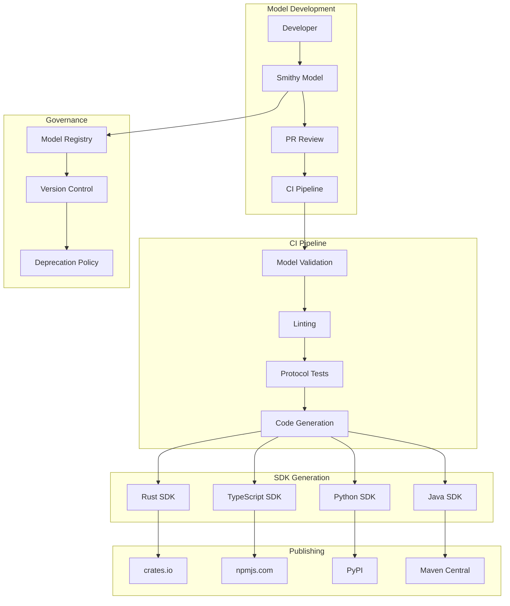

# Production-Grade Smithy Applications

## Overview

This guide covers production deployment patterns for Smithy-based API ecosystems. We cover model governance, CI/CD pipelines, SDK publishing, versioning strategies, and operational considerations.

## Architecture



## Model Governance

### Model Organization

```
models/
├── common/                     # Shared types and traits
│   ├── pagination.smithy
│   ├── errors.smithy
│   ├── metadata.smithy
│   └── traits.smithy
│
├── api/                        # API definitions
│   ├── users-api.smithy
│   ├── orders-api.smithy
│   └── products-api.smithy
│
├── protocols/                  # Protocol definitions
│   ├── rest-json.smithy
│   └── rpc.smithy
│
└── services/                   # Service compositions
    ├── production.smithy
    └── staging.smithy
```

### Model Validation Pipeline

```yaml
# .github/workflows/model-validation.yml

name: Model Validation

on:
  pull_request:
    paths:
      - 'models/**/*.smithy'

jobs:
  validate:
    runs-on: ubuntu-latest
    
    steps:
      - uses: actions/checkout@v4
      
      - name: Setup Smithy CLI
        run: |
          npm install -g @smithy/cli
      
      - name: Validate models
        run: |
          smithy validate --models models/**/*.smithy
      
      - name: Run linters
        run: |
          smithy lint --models models/**/*.smithy
      
      - name: Check backwards compatibility
        run: |
          smithy diff --old models/main --new models/
      
      - name: Run protocol tests
        run: |
          smithy build --models models/**/*.smithy
```

### Custom Validation Rules

```kotlin
// src/main/kotlin/com/example/CustomValidators.kt

class NamingConventionValidator : Validator {
    override fun validate(model: Model): List<ValidationEvent> {
        val events = mutableListOf<ValidationEvent>()
        
        for (shape in model.shapes) {
            val name = shape.id.name
            
            // Check PascalCase for shapes
            if (shape !is MemberShape && !name.matches(Regex("^[A-Z][a-zA-Z0-9]*$"))) {
                events.add(ValidationEvent.builder()
                    .severity(Severity.ERROR)
                    .message("Shape name must be PascalCase: $name")
                    .shapeId(shape.id)
                    .eventId("NamingConvention")
                    .build())
            }
            
            // Check camelCase for members
            if (shape is MemberShape && !name.matches(Regex("^[a-z][a-zA-Z0-9]*$"))) {
                events.add(ValidationEvent.builder()
                    .severity(Severity.ERROR)
                    .message("Member name must be camelCase: $name")
                    .shapeId(shape.id)
                    .eventId("NamingConvention")
                    .build())
            }
        }
        
        return events
    }
}

class DocumentationValidator : Validator {
    override fun validate(model: Model): List<ValidationEvent> {
        val events = mutableListOf<ValidationEvent>()
        
        for (shape in model.shapes) {
            if (shape !is Shape.HasDocumentation || !shape.documentation.isPresent) {
                events.add(ValidationEvent.builder()
                    .severity(Severity.WARNING)
                    .message("Shape missing documentation: ${shape.id}")
                    .shapeId(shape.id)
                    .eventId("Documentation")
                    .build())
            }
        }
        
        return events
    }
}

class DeprecationValidator : Validator {
    override fun validate(model: Model): List<ValidationEvent> {
        val events = mutableListOf<ValidationEvent>()
        
        for (shape in model.shapes) {
            val deprecated = shape.getTrait<DeprecatedTrait>()
            
            if (deprecated.isPresent) {
                val message = deprecated.get().message.orElse("No message provided")
                val since = deprecated.get().since.orElse("unknown")
                
                events.add(ValidationEvent.builder()
                    .severity(Severity.WARNING)
                    .message("Deprecated shape: ${shape.id} - $message (since $since)")
                    .shapeId(shape.id)
                    .eventId("Deprecation")
                    .build())
            }
        }
        
        return events
    }
}
```

## CI/CD Pipeline

### Build Pipeline

```yaml
# .github/workflows/sdk-generation.yml

name: SDK Generation

on:
  push:
    branches: [main]
    paths:
      - 'models/**/*.smithy'

jobs:
  generate-rust:
    runs-on: ubuntu-latest
    
    steps:
      - uses: actions/checkout@v4
      
      - name: Setup Rust
        uses: dtolnay/rust-toolchain@stable
      
      - name: Generate Rust SDK
        run: |
          ./scripts/generate-rust.sh
      
      - name: Run tests
        run: |
          cd generated/rust
          cargo test
      
      - name: Build documentation
        run: |
          cd generated/rust
          cargo doc --no-deps
      
      - name: Upload artifacts
        uses: actions/upload-artifact@v4
        with:
          name: rust-sdk
          path: generated/rust/

  generate-typescript:
    runs-on: ubuntu-latest
    
    steps:
      - uses: actions/checkout@v4
      
      - name: Setup Node.js
        uses: actions/setup-node@v4
        with:
          node-version: '20'
      
      - name: Generate TypeScript SDK
        run: |
          ./scripts/generate-typescript.sh
      
      - name: Run tests
        run: |
          cd generated/typescript
          npm install
          npm test
      
      - name: Build
        run: |
          cd generated/typescript
          npm run build
      
      - name: Upload artifacts
        uses: actions/upload-artifact@v4
        with:
          name: typescript-sdk
          path: generated/typescript/

  generate-python:
    runs-on: ubuntu-latest
    
    steps:
      - uses: actions/checkout@v4
      
      - name: Setup Python
        uses: actions/setup-python@v5
        with:
          python-version: '3.11'
      
      - name: Generate Python SDK
        run: |
          ./scripts/generate-python.sh
      
      - name: Run tests
        run: |
          cd generated/python
          pip install -e .
          pytest
      
      - name: Upload artifacts
        uses: actions/upload-artifact@v4
        with:
          name: python-sdk
          path: generated/python/
```

### Release Pipeline

```yaml
# .github/workflows/release.yml

name: Release SDKs

on:
  release:
    types: [published]

jobs:
  publish-rust:
    runs-on: ubuntu-latest
    
    steps:
      - uses: actions/checkout@v4
      
      - name: Setup Rust
        uses: dtolnay/rust-toolchain@stable
      
      - name: Generate SDK
        run: ./scripts/generate-rust.sh
      
      - name: Update version
        run: |
          cd generated/rust
          sed -i "s/^version = .*/version = \"${{ github.event.release.tag_name }}\"/" Cargo.toml
      
      - name: Publish to crates.io
        run: |
          cd generated/rust
          cargo publish
        env:
          CARGO_REGISTRY_TOKEN: ${{ secrets.CARGO_REGISTRY_TOKEN }}

  publish-typescript:
    runs-on: ubuntu-latest
    
    steps:
      - uses: actions/checkout@v4
      
      - name: Setup Node.js
        uses: actions/setup-node@v4
        with:
          node-version: '20'
          registry-url: 'https://registry.npmjs.org'
      
      - name: Generate SDK
        run: ./scripts/generate-typescript.sh
      
      - name: Update version
        run: |
          cd generated/typescript
          npm version ${{ github.event.release.tag_name }} --no-git-tag-version
      
      - name: Publish to npm
        run: |
          cd generated/typescript
          npm publish
        env:
          NODE_AUTH_TOKEN: ${{ secrets.NPM_TOKEN }}

  publish-python:
    runs-on: ubuntu-latest
    
    steps:
      - uses: actions/checkout@v4
      
      - name: Setup Python
        uses: actions/setup-python@v5
        with:
          python-version: '3.11'
      
      - name: Install build tools
        run: pip install build twine
      
      - name: Generate SDK
        run: ./scripts/generate-python.sh
      
      - name: Build package
        run: |
          cd generated/python
          python -m build
      
      - name: Publish to PyPI
        run: |
          cd generated/python
          twine upload dist/*
        env:
          TWINE_USERNAME: __token__
          TWINE_PASSWORD: ${{ secrets.PYPI_TOKEN }}
```

## Versioning Strategy

### Semantic Versioning for Models

```smithy
// models/common/metadata.smithy

namespace com.example

/// API version metadata
@trait
structure Version {
    major: Integer
    minor: Integer
    patch: Integer
    prerelease: String
}

/// Deprecation metadata
@trait
structure Deprecated {
    /// Version when deprecated
    since: String
    
    /// Removal version
    removalDate: String
    
    /// Migration message
    message: String
}

/// Change log entry
@trait
structure Changelog {
    type: ChangeType
    description: String
    issues: List<String>
}

enum ChangeType {
    ADDED
    CHANGED
    DEPRECATED
    REMOVED
    FIXED
    SECURITY
}

// Apply to service
@version(major: 1, minor: 0, patch: 0)
@changelog([
    { type: ADDED, description: "Initial release", issues: ["#1"] }
])
service MyApi {
    version: "2024-01-01"
    operations: [GetUser, CreateUser, UpdateUser, DeleteUser]
}
```

### Backwards Compatibility Rules

```kotlin
// src/main/kotlin/com/example/CompatibilityChecker.kt

class CompatibilityChecker {
    
    enum class BreakingChange {
        REMOVED_SHAPE,
        REMOVED_MEMBER,
        CHANGED_TYPE,
        REQUIRED_MEMBER_ADDED,
        CHANGED_ENUM_VALUE,
        CHANGED_HTTP_METHOD,
        CHANGED_HTTP_PATH,
    }
    
    data class CompatibilityReport(
        val breaking: List<BreakingChange>,
        val nonBreaking: List<String>,
        val isCompatible: Boolean
    )
    
    fun checkCompatibility(oldModel: Model, newModel: Model): CompatibilityReport {
        val breaking = mutableListOf<BreakingChange>()
        val nonBreaking = mutableListOf<String>()
        
        // Check for removed shapes
        for (shape in oldModel.shapes) {
            if (!newModel.getShape(shape.id).isPresent) {
                breaking.add(BreakingChange.REMOVED_SHAPE)
            }
        }
        
        // Check for removed members
        for (shape in oldModel.shapes.filterIsInstance<StructureShape>()) {
            val newShape = newModel.getShape(shape.id, StructureShape::class.java).orElse(null)
            if (newShape != null) {
                for (member in shape.members) {
                    if (!newShape.getMember(member.memberName).isPresent) {
                        breaking.add(BreakingChange.REMOVED_MEMBER)
                    }
                }
            }
        }
        
        // Check for type changes
        for (shape in oldModel.shapes) {
            val newShape = newModel.getShape(shape.id).orElse(null)
            if (newShape != null && shape.type != newShape.type) {
                breaking.add(BreakingChange.CHANGED_TYPE)
            }
        }
        
        // Check for new required members
        for (shape in newModel.shapes.filterIsInstance<StructureShape>()) {
            val oldShape = oldModel.getShape(shape.id, StructureShape::class.java).orElse(null)
            if (oldShape != null) {
                for (member in shape.members) {
                    if (member.hasTrait<RequiredTrait>()) {
                        val oldMember = oldShape.getMember(member.memberName).orElse(null)
                        if (oldMember == null) {
                            breaking.add(BreakingChange.REQUIRED_MEMBER_ADDED)
                        }
                    } else {
                        nonBreaking.add("Added optional member: ${member.memberName}")
                    }
                }
            }
        }
        
        return CompatibilityReport(
            breaking = breaking,
            nonBreaking = nonBreaking,
            isCompatible = breaking.isEmpty()
        )
    }
}
```

## SDK Documentation

### API Documentation Generation

```kotlin
// src/main/kotlin/com/example/DocumentationGenerator.kt

class DocumentationGenerator {
    
    fun generateMarkdown(model: Model, outputDir: Path) {
        val writer = outputDir.resolve("API.md").toFile().bufferedWriter()
        
        writer.write("# API Documentation\n\n")
        
        // Generate service documentation
        for (service in model.getServiceShapes()) {
            writer.write("## ${service.id.name}\n\n")
            writer.write("${service.documentation.orElse("")}\n\n")
            writer.write("Version: ${service.version}\n\n")
            
            // Generate operations
            writer.write("### Operations\n\n")
            for (opId in service.allOperations) {
                model.getShape(opId, OperationShape::class.java).ifPresent { op ->
                    generateOperationDocs(writer, op, model)
                }
            }
            
            // Generate resources
            writer.write("### Resources\n\n")
            for (resId in service.resources) {
                model.getShape(resId, ResourceShape::class.java).ifPresent { res ->
                    generateResourceDocs(writer, res, model)
                }
            }
        }
        
        // Generate type reference
        writer.write("## Type Reference\n\n")
        for (shape in model.shapes.filterIsInstance<StructureShape>()) {
            generateStructureDocs(writer, shape, model)
        }
        
        writer.close()
    }
    
    private fun generateOperationDocs(
        writer: BufferedWriter,
        operation: OperationShape,
        model: Model
    ) {
        val httpTrait = operation.getTrait<HttpTrait>().orElse(null)
        
        writer.write("#### ${operation.id.name}\n\n")
        writer.write("${operation.documentation.orElse("")}\n\n")
        
        if (httpTrait != null) {
            writer.write("```${httpTrait.method} ${httpTrait.uri}```\n\n")
        }
        
        // Request
        operation.input.ifPresent { inputId ->
            model.getShape(inputId, StructureShape::class.java).ifPresent { input ->
                writer.write("**Request:**\n\n")
                for (member in input.members) {
                    val targetType = model.getShape(member.target).orElse(null)
                    writer.write("- `${member.memberName}`: ${targetType?.type ?: "unknown"}")
                    if (member.hasTrait<RequiredTrait>()) {
                        writer.write(" (required)")
                    }
                    writer.write("\n")
                }
                writer.write("\n")
            }
        }
        
        // Response
        operation.output.ifPresent { outputId ->
            model.getShape(outputId, StructureShape::class.java).ifPresent { output ->
                writer.write("**Response:**\n\n")
                for (member in output.members) {
                    writer.write("- `${member.memberName}`\n")
                }
                writer.write("\n")
            }
        }
        
        // Errors
        if (operation.errors.isNotEmpty()) {
            writer.write("**Errors:**\n\n")
            for (errorId in operation.errors) {
                model.getShape(errorId, StructureShape::class.java).ifPresent { error ->
                    writer.write("- `${error.id.name}`\n")
                }
            }
            writer.write("\n")
        }
    }
    
    private fun generateStructureDocs(
        writer: BufferedWriter,
        shape: StructureShape,
        model: Model
    ) {
        writer.write("### ${shape.id.name}\n\n")
        writer.write("${shape.documentation.orElse("")}\n\n")
        
        writer.write("| Field | Type | Required | Description |\n")
        writer.write("|-------|------|----------|-------------|\n")
        
        for (member in shape.members) {
            val targetType = model.getShape(member.target).orElse(null)
            val required = if (member.hasTrait<RequiredTrait>()) "Yes" else "No"
            val description = member.documentation.orElse("")
            
            writer.write(
                "| ${member.memberName} | ${targetType?.type} | $required | $description |\n"
            )
        }
        
        writer.write("\n")
    }
}
```

## Production Checklist

```
Model Governance:
□ Naming conventions enforced
□ Documentation required for all shapes
□ Deprecation policy defined
□ Backwards compatibility checks in CI
□ Model registry with versioning

CI/CD:
□ Automated model validation
□ Protocol test generation
□ SDK generation for all languages
□ Integration tests for generated SDKs
□ Automated publishing on release

SDK Quality:
□ Type-safe generated code
□ Comprehensive error handling
□ Retry logic configured
□ Authentication support
□ Request/response logging

Documentation:
□ API reference generated
□ Getting started guides
□ Code examples for each operation
□ Migration guides for breaking changes
□ Changelog maintained

Operations:
□ SDK usage metrics
□ Error rate monitoring
□ Deprecation warnings tracked
□ Support channels defined
□ SLA documented
```

## Conclusion

Production Smithy deployments require:

1. **Governance**: Validation rules, naming conventions, deprecation policies
2. **CI/CD**: Automated testing, SDK generation, publishing pipelines
3. **Versioning**: Semantic versioning, backwards compatibility checks
4. **Documentation**: Generated API docs, examples, migration guides
5. **Operations**: Usage metrics, error tracking, support processes
