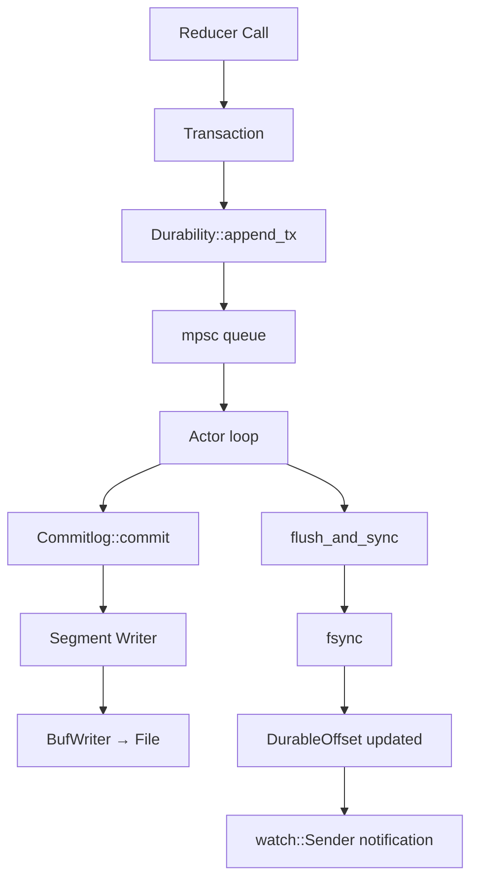
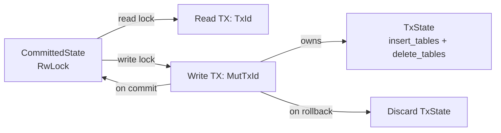
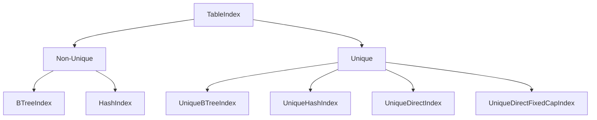
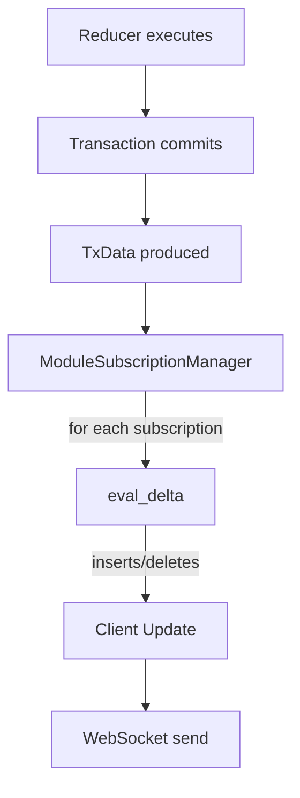

# SpacetimeDB Storage Internals Deep Dive

This document provides implementation-level detail on SpacetimeDB's storage engine, serialization formats, page management, commit log, transaction model, indexing, blob storage, and change tracking. Every section references actual source code from the SpacetimeDB repository.

---

## 1. BSATN Serialization Format

**Source:** `crates/sats/src/bsatn/`, `crates/sats/src/bsatn/ser.rs`, `crates/sats/src/bsatn/de.rs`

### 1.1 What BSATN Is

BSATN (Binary SpacetimeDB Algebraic Type Notation) is SpacetimeDB's custom binary serialization format. It encodes values of SpacetimeDB's algebraic type system (SATS) into compact byte sequences. BSATN is the wire format for client-server communication, the storage format inside commit log records, and the intermediate representation for converting between in-memory row formats.

### 1.2 Binary Encoding Rules

The encoding is straightforward and self-describing only through the type schema (not self-describing in the byte stream):

| Type | Encoding | Size |
|------|----------|------|
| `bool` | Single byte: `0x00` (false) or `0x01` (true) | 1 byte |
| `u8`/`i8` | Direct byte | 1 byte |
| `u16`/`i16` | Little-endian | 2 bytes |
| `u32`/`i32` | Little-endian | 4 bytes |
| `u64`/`i64` | Little-endian | 8 bytes |
| `u128`/`i128` | Little-endian | 16 bytes |
| `u256`/`i256` | Little-endian | 32 bytes |
| `f32` | `u32` bit pattern, little-endian | 4 bytes |
| `f64` | `u64` bit pattern, little-endian | 8 bytes |
| `String` | `u32` length prefix + UTF-8 bytes | 4 + N bytes |
| `bytes` | `u32` length prefix + raw bytes | 4 + N bytes |
| `Array<T>` | `u32` count + concatenated elements | 4 + sum(elem sizes) |
| `Product` (struct) | Concatenated fields, no tags, no padding | sum(field sizes) |
| `Sum` (enum) | `u8` variant tag + variant payload | 1 + payload size |

Key implementation from `ser.rs`:

```rust
// Serializer writes primitives directly in little-endian
fn serialize_u64(self, v: u64) -> Result<Self::Ok, Self::Error> {
    self.writer.put_u64(v);  // Little-endian via BufWriter
    Ok(())
}

// Strings/bytes use u32 length prefix
fn serialize_bytes(self, v: &[u8]) -> Result<Self::Ok, Self::Error> {
    put_len(self.writer, v.len())?;  // u32 length, errors if > u32::MAX
    self.writer.put_slice(v);
    Ok(())
}

// Sum types use u8 tag
fn serialize_variant<T: Serialize + ?Sized>(
    self, tag: u8, _name: Option<&str>, value: &T,
) -> Result<Self::Ok, Self::Error> {
    self.writer.put_u8(tag);
    value.serialize(self)
}
```

### 1.3 Design Decisions and Comparison

**Why not MessagePack/CBOR?** These are self-describing formats that embed type tags in every value. BSATN saves space by requiring the schema to be known at both ends. A `u64` is always exactly 8 bytes, not 1-9 bytes depending on magnitude.

**Why not FlatBuffers/Cap'n Proto?** These are zero-copy formats with alignment padding. BSATN is a streaming format with no alignment requirements, making it simpler to produce and consume. SpacetimeDB uses BFLATN (described below) for the in-memory aligned format.

**Why not protobuf?** Protobuf uses varint encoding and field tags. BSATN avoids both - fields are positional (like the algebraic type system), and integers are fixed-width. This makes BSATN faster to encode/decode at the cost of slightly larger encodings for small integers.

| Feature | BSATN | MessagePack | FlatBuffers | Protobuf |
|---------|-------|-------------|-------------|----------|
| Self-describing | No | Yes | No | No |
| Zero-copy reads | No | No | Yes | No |
| Fixed-width integers | Yes | No (varint) | Yes | No (varint) |
| Alignment padding | No | No | Yes | No |
| Schema required | Yes | No | Yes | Yes |
| Encode complexity | O(n) | O(n) | O(n) | O(n) |

### 1.4 Performance Characteristics

BSATN has several performance-oriented features:

1. **`ToBsatn` trait for fast paths.** For rows with a `StaticLayout` (no variable-length fields), BSATN encoding can use `BufReservedFill` to write directly into pre-allocated buffers without intermediate allocation.

2. **`serialize_bsatn` escape hatch.** When data is already in BSATN form (e.g., from a commit log record), the serializer can pass it through without re-encoding:

```rust
unsafe fn serialize_bsatn<Ty>(self, ty: &Ty, bsatn: &[u8]) -> Result<Self::Ok, Self::Error> {
    debug_assert!(crate::bsatn::decode(ty, &mut { bsatn }).is_ok());
    self.writer.put_slice(bsatn);
    Ok(())
}
```

3. **Chunk-based serialization.** Variable-length data stored in granules can be serialized without copying to a contiguous buffer first, via `serialize_bsatn_in_chunks` and `serialize_str_in_chunks`.

4. **`CountWriter` for size computation.** `to_len()` computes the encoded size without allocating, useful for pre-allocating buffers.

---

## 2. BFLATN (Binary Flat) Format

**Source:** `crates/table/src/bflatn_to.rs`, `crates/table/src/bflatn_from.rs`, `crates/table/src/var_len.rs`, `crates/sats/src/layout.rs`

### 2.1 Row Type Layout System

BFLATN is SpacetimeDB's in-memory row format. Unlike BSATN (a streaming format), BFLATN stores rows with alignment and padding so that fields can be accessed via direct pointer arithmetic without deserialization.

The layout system is defined in `crates/sats/src/layout.rs` through `RowTypeLayout`, which computes:
- Fixed size of each row (the part stored contiguously in page memory)
- Alignment requirements for each field
- Offsets of variable-length reference slots (`VarLenRef` positions)

A `RowTypeLayout` wraps a `ProductType` and annotates it with physical layout information. Each field gets an `offset` computed by walking the product fields with alignment.

### 2.2 Fixed and Variable-Length Coexistence

Each row in BFLATN consists of two parts:

1. **Fixed part:** Stored contiguously at a known offset in the page. Contains all fixed-size fields (integers, floats, booleans) and `VarLenRef` pointers for variable-length fields. The fixed part has a known, constant size per table.

2. **Variable part:** Stored as linked lists of 64-byte granules growing from the opposite end of the page. Strings and arrays are BSATN-encoded and split across granules.

```
Page Layout:
┌──────────────────────────────────────────────────────────────────────┐
│ Header (64 bytes)                                                     │
├──────────────────────────────────────────────────────────────────────┤
│ Fixed rows (growing →)                                                │
│ ┌─────────────┬─────────────┬─────────────┬─────────────────────┐    │
│ │ Row 0       │ Row 1       │ Row 2       │   ... gap ...       │    │
│ │ [u64][VLR]  │ [u64][VLR]  │ [u64][VLR]  │                     │    │
│ └─────────────┴─────────────┴─────────────┴─────────────────────┘    │
│                                                                       │
│ ┌─────────────────────┬─────────────┬─────────────┬─────────────┐    │
│ │   ... gap ...       │ Granule 2   │ Granule 1   │ Granule 0   │    │
│ │                     │ [hdr|data]  │ [hdr|data]  │ [hdr|data]  │    │
│ └─────────────────────┴─────────────┴─────────────┴─────────────┘    │
│ Variable granules (← growing)                                         │
└──────────────────────────────────────────────────────────────────────┘
```

### 2.3 VarLenRef Structure

```rust
#[repr(C)]
pub struct VarLenRef {
    pub length_in_bytes: u16,    // Total length of the var-len object
    pub first_granule: PageOffset, // Offset to first granule in the linked list
}
// Size: 4 bytes, Align: 2 bytes
```

Special values:
- **NULL:** `length_in_bytes = 0`, `first_granule = PageOffset::VAR_LEN_NULL` (0) -- represents empty strings/arrays
- **Large blob sentinel:** `length_in_bytes = u16::MAX` (65535) -- signals that the actual data is in the blob store, and the first granule contains a 32-byte BLAKE3 hash

### 2.4 VarLenGranule Structure

```rust
#[repr(C)]
#[repr(align(64))]
pub struct VarLenGranule {
    pub header: VarLenGranuleHeader,  // 2 bytes
    pub data: [u8; 62],               // 62 bytes of payload
}
// Total: 64 bytes, aligned to 64 bytes
```

The `VarLenGranuleHeader` packs two fields into a `u16`:
- **Low 6 bits:** Number of valid data bytes in this granule (0-62)
- **High 10 bits:** `PageOffset` of the next granule in the linked list

```rust
impl VarLenGranuleHeader {
    const LEN_BITS: u16 = 6;
    const LEN_BITMASK: u16 = (1 << 6) - 1;      // 0x003F
    const NEXT_BITMASK: u16 = !Self::LEN_BITMASK; // 0xFFC0
}
```

The 10-bit next pointer works because granules are 64-byte aligned, so the low 6 bits of any valid granule offset are always zero. This gives `2^10 = 1024` possible granule positions, and since a page is 64KiB - 64 bytes = 65472 bytes of data, with 64-byte granules that's 1023 possible granule slots -- fitting perfectly in 10 bits.

### 2.5 Blob Threshold

Objects exceeding `OBJECT_SIZE_BLOB_THRESHOLD = 62 * 16 = 992 bytes` are stored in the blob store instead of in granules. When this happens:
- Only 1 granule is allocated, containing the 32-byte BLAKE3 hash
- `VarLenRef.length_in_bytes` is set to `u16::MAX` as a sentinel
- The blob store handles deduplication via reference counting

### 2.6 Row Write Path (BSATN -> BFLATN)

The `write_row_to_pages` function in `bflatn_to.rs` drives the conversion:

1. Compute the number of var-len granules needed
2. Find a page with sufficient space (both fixed rows and granules)
3. Walk the `RowTypeLayout`, writing each field:
   - Fixed-size fields: write directly into the fixed row region
   - Variable-length fields: BSATN-encode the value, split into granule chunks, allocate granules, link them together, write a `VarLenRef` into the fixed row

### 2.7 Row Read Path (BFLATN -> Serializer)

The `serialize_row_from_page` function in `bflatn_from.rs` does the reverse:

1. Get the fixed row bytes from the page
2. Walk the `RowTypeLayout`, serializing each field:
   - Fixed-size fields: read bytes, interpret as the correct type
   - Variable-length fields: follow the `VarLenRef`, collect granule data, deserialize from BSATN
   - Blob references: detect the sentinel, look up in the blob store

### 2.8 VarLenMembers Visitor Pattern

The `VarLenMembers` trait provides a type-safe way to iterate over all `VarLenRef` slots in a row. This is critical for:
- Pointer fixup when copying rows between pages
- Freeing granules when deleting rows
- Cloning blob references when copying rows

The `VarLenVisitorProgram` (in `row_type_visitor.rs`) generates an optimized program that walks the type layout to find var-len references, handling nested products and sums.

---

## 3. Page Manager Internals

**Source:** `crates/table/src/page.rs`, `crates/table/src/pages.rs`, `crates/table/src/indexes.rs`, `crates/table/src/page_pool.rs`

### 3.1 Page Dimensions

```rust
const PAGE_SIZE: usize = 65536;        // 64 KiB total
const PAGE_HEADER_SIZE: usize = 64;    // 64 bytes for header
const PAGE_DATA_SIZE: usize = 65472;   // 64 KiB - 64 bytes
```

The `Page` struct is:
```rust
#[repr(C)]
#[repr(align(64))]
pub struct Page {
    header: PageHeader,            // 64 bytes
    row_data: [u8; PAGE_DATA_SIZE], // 65472 bytes
}
// Total: exactly 65536 bytes = 64 KiB
```

### 3.2 Page Header Structure

```rust
struct PageHeader {
    fixed: FixedHeader,           // 16 bytes
    var: VarHeader,               // 8 bytes
    unmodified_hash: Option<blake3::Hash>, // For snapshot dedup
}
// Padded to 64 bytes total (align(64))

struct FixedHeader {
    next_free: FreeCellRef,       // Head of fixed-row freelist
    last: PageOffset,             // High water mark (one past last allocated)
    num_rows: u16,                // Number of live rows
    present_rows: FixedBitSet,    // Bitmap: which row slots are occupied
}

struct VarHeader {
    next_free: FreeCellRef,       // Head of var-len granule freelist
    freelist_len: u16,            // Cached length of var freelist
    first: PageOffset,            // High water mark (lowest allocated granule)
    num_granules: u16,            // Number of granules in use
}
```

### 3.3 Dual High Water Mark Strategy

The page uses a meet-in-the-middle allocation strategy:

```
     Fixed HWM                           Var HWM
        ↓                                  ↓
┌──────────────────────────────────────────────────┐
│ [Fixed rows →]  [   Gap   ]  [← Var granules]    │
└──────────────────────────────────────────────────┘
0                                            PAGE_DATA_SIZE
```

- **Fixed rows** grow from offset 0 upward. `FixedHeader.last` tracks the high water mark.
- **Var-len granules** grow from `PAGE_DATA_SIZE` downward. `VarHeader.first` tracks the high water mark.
- The page is full when the gap between the two HWMs is too small for either a new row or a new granule.

### 3.4 Freelist Implementation

Both fixed rows and var-len granules use intrusive freelists. When a row/granule is freed, its memory is repurposed to store a `FreeCellRef`:

```rust
struct FreeCellRef {
    next: PageOffset,  // Points to next free cell, or PAGE_END for nil
}
```

**Allocation order:**
1. First try the freelist (reuse freed slots)
2. If freelist is empty, allocate from the gap (advance the HWM)
3. If no gap space, the page is full

**Fixed row freelist:**
```rust
unsafe fn take_freelist_head(
    self: &mut FreeCellRef,
    row_data: &Bytes,
    adjust_free: impl FnOnce(PageOffset) -> PageOffset,
) -> Option<PageOffset> {
    self.has().then(|| {
        let head = adjust_free(self.next);
        let next = unsafe { get_ref(row_data, head) };
        self.replace(*next).next
    })
}
```

**Var-len freelist:** Similar, but `VarHeader` also caches `freelist_len` to avoid traversing the linked list just to count available granules.

### 3.5 Page Pool

**Source:** `crates/table/src/page_pool.rs`

Pages are expensive to allocate (64 KiB each, zeroed). The `PagePool` provides global page recycling:
- When a page is no longer needed, it's returned to the pool
- When a new page is needed, the pool is checked first
- Pages are `Box<Page>` heap-allocated
- The pool is shared across all modules on a host

### 3.6 Pages Manager

The `Pages` struct manages a collection of pages for a single table:

```rust
pub struct Pages {
    pages: Vec<Box<Page>>,
    non_full_pages: Vec<PageIndex>,
}
```

**Finding space for a new row:**
1. Scan `non_full_pages` for a page with enough room for the fixed row AND the required granules
2. If none found, allocate a new page from the pool
3. After insertion, check if the page is still non-full; if so, add it back to `non_full_pages`

This avoids linear scans of all pages for every insertion.

### 3.7 RowPointer Bit Packing

```rust
pub struct RowPointer(pub u64);
```

A `RowPointer` packs four fields into 64 bits:

| Field | Bits | Range | Purpose |
|-------|------|-------|---------|
| Reserved bit | 1 (bit 0) | 0-1 | Used by PointerMap for collider detection |
| PageIndex | 39 (bits 1-39) | 0 to ~550 billion | Index into `Pages.pages` |
| PageOffset | 16 (bits 40-55) | 0-65535 | Byte offset within page |
| SquashedOffset | 8 (bits 56-63) | 0-255 | TX_STATE(0) or COMMITTED_STATE(1) |

```rust
const OFFSET_RB: u64 = 0;   const BITS_RB: u64 = 1;
const OFFSET_PI: u64 = 1;   const BITS_PI: u64 = 39;
const OFFSET_PO: u64 = 40;  const BITS_PO: u64 = 16;
const OFFSET_SQ: u64 = 56;  const BITS_SQ: u64 = 8;
```

The `SquashedOffset` distinguishes whether a pointer refers to the committed state table or the transaction scratchpad table. This is central to the MVCC model (Section 5).

---

## 4. Commit Log Deep Dive

**Source:** `crates/commitlog/src/`, `crates/durability/src/`

### 4.1 Architecture Overview



### 4.2 Segment Format

Each segment file begins with a header:

```
┌──────────────────────────────────────────────┐
│ Segment Header (10 bytes)                     │
│  MAGIC: "(ds)^2"  (6 bytes)                   │
│  log_format_version: u8                       │
│  checksum_algorithm: u8                       │
│  reserved: [u8; 2]                            │
├──────────────────────────────────────────────┤
│ Commit 0                                      │
│ Commit 1                                      │
│ ...                                           │
│ Commit N                                      │
└──────────────────────────────────────────────┘
```

### 4.3 Commit Format

Each commit has a header, records payload, and a CRC32c checksum:

```
┌──────────────────────────────────────────────┐
│ Commit Header (22 bytes)                      │
│  min_tx_offset: u64   (LE)                    │
│  epoch: u64           (LE)                    │
│  n: u16               (LE) -- num records     │
│  len: u32             (LE) -- records bytes   │
├──────────────────────────────────────────────┤
│ Records (len bytes)                           │
│  Serialized transaction data (BSATN)          │
├──────────────────────────────────────────────┤
│ CRC32c checksum: u32 (LE)                     │
└──────────────────────────────────────────────┘

Total framing overhead: 22 (header) + 4 (checksum) = 26 bytes per commit
```

The commit encoding uses CRC32c streaming -- the CRC is computed over both the header and records:

```rust
pub fn write<W: Write>(&self, out: W) -> io::Result<u32> {
    let mut out = Crc32cWriter::new(out);
    out.write_all(&self.min_tx_offset.to_le_bytes())?;
    out.write_all(&epoch.to_le_bytes())?;
    out.write_all(&n.to_le_bytes())?;
    out.write_all(&len.to_le_bytes())?;
    out.write_all(&self.records)?;
    let crc = out.crc32c();
    let mut out = out.into_inner();
    out.write_all(&crc.to_le_bytes())?;
    Ok(crc)
}
```

### 4.4 Commit Decode and Verification

Decoding verifies the checksum by re-computing CRC32c over the same stream:

```rust
pub fn decode<R: Read>(reader: R) -> io::Result<Option<Self>> {
    let mut reader = Crc32cReader::new(reader);
    let Some(hdr) = Header::decode_internal(&mut reader, v)? else {
        return Ok(None);  // EOF
    };
    let mut records = vec![0; hdr.len as usize];
    reader.read_exact(&mut records)?;
    let chk = reader.crc32c();
    let crc = decode_u32(reader.into_inner())?;
    if chk != crc {
        return Err(invalid_data(ChecksumMismatch));
    }
    Ok(Some(...))
}
```

### 4.5 Transaction Records

Each commit can contain up to `u16::MAX` (65535) transaction records. Records are opaque bytes from the commitlog's perspective -- the `Decoder` trait is used to interpret them:

```rust
pub trait Decoder {
    type Record;
    type Error;
    fn decode_record(&self, version: u8, offset: u64, reader: &mut impl BufReader<'_>)
        -> Result<Self::Record, Self::Error>;
    fn skip_record(&self, version: u8, offset: u64, reader: &mut impl BufReader<'_>)
        -> Result<(), Self::Error>;
}
```

For SpacetimeDB, the record type is `Txdata<ProductValue>`, which contains per-table inserts and deletes encoded in BSATN.

### 4.6 Segment Rotation

The commitlog is stored as a sequence of segment files. The `Generic` commitlog struct manages:
- `head`: The current segment being written to (a `Writer<SegmentWriter>`)
- `tail`: Previous segments (stored as a `Vec<u64>` of their starting offsets)

Segment rotation happens based on configurable `Options` (max segment size). When a segment fills up:
1. The current head is flushed and synced
2. A new segment file is created starting at the next tx offset
3. The old segment's offset is pushed onto `tail`

### 4.7 Crash Recovery

On startup (`Generic::open`):
1. List all existing segment files (sorted by offset)
2. Resume the last segment for writing:
   a. Read commits until a checksum mismatch or EOF
   b. The last valid commit determines the resume point
   c. Create a new writer starting after the last valid commit
3. If the first commit in the last segment is corrupt, refuse to start (data loss)
4. If no segments exist, start fresh from offset 0

Commits with invalid checksums are silently truncated -- the segment writer starts after the last valid commit. This means at most one commit (the one being written during crash) can be lost.

### 4.8 Offset Indexes

The commitlog supports optional offset indexes (`IndexFileMut`) that map transaction offsets to byte positions within segments. This enables O(log n) seeking to a specific transaction rather than linear scanning.

---

## 5. Transaction Model

**Source:** `crates/datastore/src/locking_tx_datastore/`, `crates/datastore/src/traits.rs`

### 5.1 Architecture: Locking Datastore

SpacetimeDB uses a `Locking` datastore with coarse-grained locking:

```rust
pub struct Locking {
    committed_state: Arc<RwLock<CommittedState>>,
    sequence_state: Arc<Mutex<SequencesState>>,
    database_identity: Identity,
}
```

**Lock acquisition order (to prevent deadlocks):**
1. `committed_state` (RwLock)
2. `sequence_state` (Mutex)

### 5.2 Two-State Transaction Model

SpacetimeDB does NOT use MVCC in the traditional sense. Instead, it uses a two-state model:



1. **CommittedState:** The canonical, committed database state. Protected by an `Arc<RwLock<_>>`.
   - Contains `IntMap<TableId, Table>` for all tables
   - Contains a shared `HashMapBlobStore`
   - Read transactions (`TxId`) hold a read lock
   - Write transactions (`MutTxId`) hold a write lock

2. **TxState:** A per-transaction scratchpad:
   ```rust
   pub struct TxState {
       pub insert_tables: BTreeMap<TableId, Table>,   // New rows
       pub delete_tables: BTreeMap<TableId, DeleteTable>, // Deleted committed rows
       pub blob_store: HashMapBlobStore,               // New blobs
       pub pending_schema_changes: ThinVec<PendingSchemaChange>,
   }
   ```

### 5.3 The SquashedOffset Mechanism

`RowPointer` includes a `SquashedOffset` (8 bits) that tags which state a pointer belongs to:

- `SquashedOffset::COMMITTED_STATE` (1): Points into `CommittedState`'s tables
- `SquashedOffset::TX_STATE` (0): Points into `TxState`'s `insert_tables`

This allows the query engine to seamlessly iterate over both committed and newly-inserted rows within the same transaction by checking the `SquashedOffset` to dispatch to the correct `Pages`.

### 5.4 Transaction Lifecycle

**Read Transaction:**
1. Acquire read lock on `committed_state`
2. Execute queries against `CommittedState` (snapshot view)
3. Release read lock

**Write Transaction:**
1. Acquire write lock on `committed_state`
2. Create a fresh `TxState`
3. Execute mutations:
   - **Insert:** Write row to `TxState.insert_tables[table_id]`
   - **Delete committed row:** Add `RowPointer` to `TxState.delete_tables[table_id]`
   - **Delete newly-inserted row:** Remove from `TxState.insert_tables[table_id]`
4. **Commit:**
   - Merge `TxState.insert_tables` into `CommittedState.tables`
   - Apply `TxState.delete_tables` deletions to `CommittedState.tables`
   - Merge `TxState.blob_store` into `CommittedState.blob_store`
   - Apply `pending_schema_changes`
   - Produce a `TxData` record for the commit log
   - Release write lock
5. **Rollback:**
   - Revert any `pending_schema_changes`
   - Discard `TxState` (its insert tables and blob store are dropped)
   - Release write lock

### 5.5 Isolation Level

The isolation model is effectively **Serializable** because write transactions hold an exclusive lock on `committed_state` for their entire duration. Only one write transaction can execute at a time. Read transactions see a consistent snapshot (the committed state at the time they acquired the read lock).

```rust
pub enum IsolationLevel {
    ReadUncommitted,
    ReadCommitted,
    RepeatableRead,
    Snapshot,
    Serializable,  // Current effective level
}
```

### 5.6 Concurrency Model

SpacetimeDB processes reducer calls sequentially per database. The `RwLock` on `committed_state` provides:
- **Multiple concurrent reads:** Read TXs share the read lock
- **Exclusive writes:** Write TXs hold the write lock, blocking both reads and writes
- **No write-write conflicts:** Only one writer at a time

This is simpler than MVCC but limits write throughput to one transaction at a time per database. SpacetimeDB compensates by making individual transactions fast (in-memory operations on pages).

---

## 6. Index Internals

**Source:** `crates/table/src/table_index/`

### 6.1 Index Type Hierarchy

SpacetimeDB supports multiple index types, specialized by key type for performance:



Each concrete index is specialized per key type: `bool`, `u8`, `u16`, `u32`, `u64`, `u128`, `u256`, `i8`, `i16`, `i32`, `i64`, `i128`, `i256`, `F32`, `F64`, `String`, `AlgebraicValue`, `ProductValue`, etc. This avoids the overhead of `AlgebraicValue::cmp` for simple integer keys.

### 6.2 BTreeIndex (Non-Unique)

```rust
pub struct BTreeIndex<K> {
    map: BTreeMap<K, SameKeyEntry>,  // Key -> set of RowPointers
    num_rows: usize,
    num_key_bytes: u64,
}
```

`SameKeyEntry` is a `SmallVec<[RowPointer; 1]>` -- inline for the common single-pointer case, heap-allocated for collisions. This is a classic multimap backed by Rust's stdlib `BTreeMap`.

**Insert:** O(log n) BTree insertion, push onto the `SameKeyEntry`.
**Delete:** O(log n) BTree lookup, linear scan of `SameKeyEntry` (usually 1 element).
**Point seek:** O(log n) BTree lookup, return iterator over `SameKeyEntry`.
**Range seek:** O(log n + k) where k is the number of results.

### 6.3 Unique BTree Index

```rust
pub struct UniqueBTreeIndex<K> {
    map: BTreeMap<K, RowPointer>,  // 1:1 mapping
    num_key_bytes: u64,
}
```

More compact than `BTreeIndex` -- no `SameKeyEntry` wrapper. Insert returns `Err(existing_ptr)` if the key already exists, enforcing uniqueness.

### 6.4 Hash Index

For equality-only lookups, hash indexes provide O(1) expected time:

```rust
pub struct HashIndex<K> {
    map: HashMap<K, SameKeyEntry>,  // Non-unique
    num_rows: usize,
    num_key_bytes: u64,
}

pub struct UniqueHashIndex<K> {
    map: HashMap<K, RowPointer>,    // Unique
    num_key_bytes: u64,
}
```

### 6.5 Direct Index (Unique, Integer Keys)

For small integer keys, `UniqueDirectIndex` and `UniqueDirectFixedCapIndex` use the key value directly as an array index:

```rust
pub struct UniqueDirectIndex<K> {
    map: Vec<Option<RowPointer>>,   // Key as usize index
    num_keys: usize,
    num_key_bytes: u64,
    _key: PhantomData<K>,
}
```

This provides O(1) insert, delete, and lookup with excellent cache behavior. Used for types where `ToFromUsize` is implemented (e.g., small integers, `bool`).

`UniqueDirectFixedCapIndex` is similar but has a fixed-capacity array, useful for very small key spaces (e.g., `bool` with 2 possible values).

### 6.6 Index Maintenance During Mutations

Indexes are maintained eagerly -- every insert or delete updates all affected indexes immediately:

1. **Insert:** For each index on the table, extract the key columns from the new row (via `ReadColumn`), insert into the index. If a unique index rejects the insert, the row insertion is rolled back.

2. **Delete:** For each index on the table, extract the key columns from the deleted row, remove from the index.

Multi-column indexes use `ProductValue` or `AlgebraicValue` as the key, constructed by reading the relevant columns from the row.

---

## 7. Blob Store

**Source:** `crates/table/src/blob_store.rs`

### 7.1 Interface

```rust
pub trait BlobStore: Sync {
    fn clone_blob(&mut self, hash: &BlobHash) -> Result<(), NoSuchBlobError>;
    fn insert_blob(&mut self, bytes: &[u8]) -> BlobHash;
    fn retrieve_blob(&self, hash: &BlobHash) -> Result<&[u8], NoSuchBlobError>;
    fn free_blob(&mut self, hash: &BlobHash) -> Result<(), NoSuchBlobError>;
    fn iter_blobs(&self) -> BlobsIter<'_>;
    fn bytes_used_by_blobs(&self) -> u64;
    fn num_blobs(&self) -> u64;
}
```

### 7.2 Content Addressing

Blobs are addressed by their BLAKE3 hash (32 bytes):

```rust
pub struct BlobHash {
    pub data: [u8; 32],  // BLAKE3 output
}

impl BlobHash {
    pub fn hash_from_bytes(bytes: &[u8]) -> Self {
        let data = blake3::hash(bytes).into();
        Self { data }
    }
}
```

### 7.3 Reference Counting

The `HashMapBlobStore` implementation uses reference counting for deduplication:

```rust
struct BlobObject {
    uses: usize,       // Reference count
    blob: Box<[u8]>,   // The actual data
}

pub struct HashMapBlobStore {
    map: HashMap<BlobHash, BlobObject>,
}
```

- **Insert:** Hash the bytes, increment refcount if already present, otherwise store new.
- **Free:** Decrement refcount; if it reaches 0, remove from the map.
- **Clone:** Increment refcount (no data copy needed).

### 7.4 Blob Lifecycle in Transactions

- `TxState` has its own `HashMapBlobStore` for blobs created during the transaction
- On commit, `TxState.blob_store` is merged into `CommittedState.blob_store`
- On rollback, `TxState.blob_store` is simply dropped (blobs are freed)
- This avoids complex cleanup during rollback

### 7.5 When Blobs Are Used

A var-len object goes to the blob store when it exceeds 992 bytes (16 granules * 62 bytes/granule). At that point:
- Only 1 granule is allocated on the page (for the 32-byte hash)
- The actual data lives in the blob store
- This prevents large objects from consuming excessive page space

---

## 8. PointerMap (Row Deduplication)

**Source:** `crates/table/src/pointer_map.rs`

### 8.1 Purpose

The `PointerMap` enforces set semantics -- no two identical rows can exist in the same table. It maps `RowHash -> [RowPointer]`.

```rust
pub struct PointerMap {
    map: IntMap<RowHash, PtrOrCollider>,
    colliders: Vec<Vec<RowPointer>>,
    emptied_collider_slots: Vec<ColliderSlotIndex>,
}
```

### 8.2 Collision Handling

`PtrOrCollider` is a tagged union packed into a `RowPointer`:
- If the reserved bit is 0: it's a direct `RowPointer` (no collision)
- If the reserved bit is 1: the `PageIndex` field stores a `ColliderSlotIndex` into the `colliders` array

For the common case (no hash collisions), lookup is a single hash map probe returning one `RowPointer`. For collisions, the `colliders` array provides a list of all pointers sharing that hash.

The analysis shows that with 64-bit hashes, approximately 500 billion entries are needed before seeing 5000 collisions on average (birthday problem), so the collision path is rarely exercised.

### 8.3 Optimization: Unique Index Replaces PointerMap

If a table has at least one unique index, the `pointer_map` field in `Table` is set to `None`. Unique indexes inherently prevent duplicate rows, making the `PointerMap` redundant:

```rust
pub struct Table {
    pointer_map: Option<PointerMap>,  // None if unique index exists
    ...
}
```

---

## 9. Data Change Tracking and Subscriptions

**Source:** `crates/core/src/subscription/`, `crates/datastore/src/locking_tx_datastore/tx_state.rs`

### 9.1 Change Tracking via TxData

After a transaction commits, the changes are captured as `TxData`:

```rust
pub struct TxDataTableEntry {
    pub table_name: TableName,
    pub inserts: Arc<[ProductValue]>,
    pub deletes: Arc<[ProductValue]>,
    pub truncated: bool,
}
```

This is produced during the merge phase by comparing `TxState.insert_tables` and `TxState.delete_tables` with the committed state.

### 9.2 Subscription System

SpacetimeDB supports SQL subscriptions where clients register queries and receive incremental updates:



### 9.3 Delta Evaluation

The `eval_delta` function (in `subscription/delta.rs`) evaluates a subscription plan against the transaction's changes:

```rust
pub fn eval_delta<'a, Tx: Datastore + DeltaStore>(
    tx: &'a Tx,
    metrics: &mut ExecutionMetrics,
    plan: &SubscriptionPlan,
) -> Result<Option<UpdatesRelValue<'a>>> {
    let mut inserts = vec![];
    let mut deletes = vec![];

    if !plan.is_join() {
        // Single-table: iterate delta directly
        plan.for_each_insert(tx, metrics, &mut |row| {
            inserts.push(maybe_project(row)?);
            Ok(())
        })?;
        plan.for_each_delete(tx, metrics, &mut |row| {
            deletes.push(maybe_project(row)?);
            Ok(())
        })?;
    } else {
        // Join queries: track counts to handle bag semantics
        // Insert-delete cancellation for duplicate rows
        ...
    }
}
```

**Key detail:** Delta evaluation uses bag semantics for joins. If a row joins with N rows in another table, the client needs to know about all N matches. Duplicate tracking ensures correctness.

### 9.4 View Read Sets

The `CommittedState` tracks read sets for views/subscriptions:

```rust
pub struct CommittedState {
    read_sets: ViewReadSets,
    ...
}
```

When a reducer modifies a table, the system checks whether any view's read set overlaps with the write set. Overlapping views are re-evaluated, and their read sets are updated.

### 9.5 Subscription Versions (v1 and v2)

The subscription system supports two wire protocols:
- **v1:** Each subscription gets full initial state, then incremental updates
- **v2:** Query-set based subscriptions with more efficient batching

Both use BSATN or JSON encoding for the actual row data sent over WebSockets.

---

## 10. Snapshot System

**Source:** `crates/snapshot/src/lib.rs`

### 10.1 Purpose

Snapshots are on-disk views of the committed state at a specific transaction offset. They optimize recovery by avoiding full commitlog replay:

```
Recovery without snapshots: Replay TX 0 → TX N (slow)
Recovery with snapshots:    Load snapshot at TX K, replay TX K+1 → TX N (fast)
```

### 10.2 Snapshot Format

```
Snapshot directory structure:
  snapshot_dir/
    MAGIC: "txyz" (4 bytes)
    VERSION: u8
    MODULE_ABI_VERSION: [u16; 2]
    pages/
      <blake3_hash>.page  -- Content-addressed page files
    blobs/
      <blake3_hash>.blob  -- Content-addressed blob files
    snapshot.bsatn        -- Table metadata, schema, page assignments
```

Pages and blobs are content-addressed by their BLAKE3 hash. This enables:
- **Deduplication:** Unchanged pages across snapshots are hardlinked
- **Integrity verification:** Hash mismatches detect corruption
- **Incremental snapshots:** Only changed pages need to be written

### 10.3 Snapshot Frequency

Currently configured as every 1,000,000 transactions:

```rust
pub const SNAPSHOT_FREQUENCY: u64 = 1_000_000;
```

---

## 11. Efficiency Analysis

### 11.1 Space Efficiency

**Page overhead per row:**
- Each row occupies `ceil(row_size / MIN_ROW_SIZE)` bytes minimum in the fixed section
- `present_rows` bitmap: ~1 bit per potential row slot
- Var-len granules: 2-byte header per 62 bytes of data (3.1% overhead)
- Blob hash: 32 bytes per large object reference (granule overhead)

**Comparison with SQLite:**
- SQLite pages are typically 4 KiB; SpacetimeDB uses 64 KiB
- SQLite uses B-tree pages for both data and indexes; SpacetimeDB separates them
- SpacetimeDB's larger pages reduce page management overhead but increase minimum allocation

### 11.2 Write Amplification

- **In-memory writes:** Effectively 1x -- rows are written directly to the page
- **Commit log writes:** 1x + 26 bytes framing per commit + CRC32c
- **Snapshot writes:** Only modified pages are written (content-addressed dedup)
- **No WAL double-write:** SpacetimeDB uses commit log as the WAL equivalent; snapshots provide the checkpoint equivalent

### 11.3 Read Path Optimization

- **Fixed-size field access:** Direct pointer arithmetic, no deserialization needed
- **StaticLayout fast path:** For rows with only fixed-size fields, BSATN encode/decode can be a `memcpy`-like operation
- **Index specialization:** Integer keys use native comparison, not `AlgebraicValue::cmp`
- **Direct indexes:** O(1) lookup for small integer unique keys

### 11.4 Memory Usage

- Tables are fully in-memory (pages, indexes, blob store)
- `MemoryUsage` trait is implemented throughout for monitoring
- Page pool enables memory reuse across modules
- `TxState` is kept small (88 bytes base) and discarded after each TX

### 11.5 Comparison Summary

| Aspect | SpacetimeDB | SQLite | PostgreSQL |
|--------|-------------|--------|------------|
| Storage model | In-memory pages + commit log | Disk-based B-tree | Disk-based heap + WAL |
| Page size | 64 KiB | 4 KiB (default) | 8 KiB (default) |
| Concurrency | Single-writer, multi-reader | Single-writer | MVCC, multi-writer |
| Row format | BFLATN (aligned) | Cell-based | HeapTuple |
| Index types | BTree, Hash, Direct | B-tree only | BTree, Hash, GIN, GiST... |
| Var-len storage | Granule linked list | Overflow pages | TOAST |
| Blob threshold | 992 bytes | ~page size | ~2 KiB |
| Recovery | Snapshot + commit log replay | WAL replay | WAL replay + checkpoints |
| Change tracking | TxState insert/delete tables | WAL records | WAL + logical replication |
