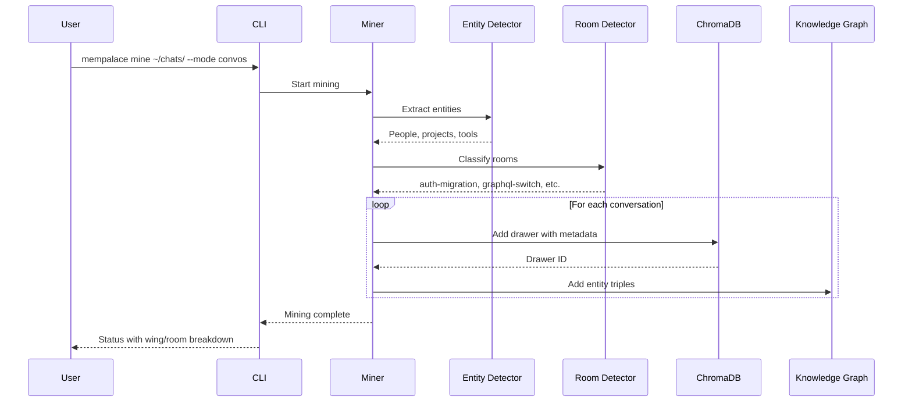

# MemPalace: Comprehensive Exploration

**Source:** `/home/darkvoid/Boxxed/@formulas/src.rust/src.llamacpp/src.AIResearch/mempalace/`

**Repository:** [github.com/milla-jovovich/mempalace](https://github.com/milla-jovovich/mempalace)

**Output Directory:** `/home/darkvoid/Boxxed/@dev/repo-expolorations/src.AIResearch/mempalace/`

**Explored At:** 2026-04-11

---

## Table of Contents

1. [Overview](#overview)
2. [Project Structure](#project-structure)
3. [The Palace Architecture](#the-palace-architecture)
4. [Knowledge Graph System](#knowledge-graph-system)
5. [AAAK Dialect](#aaak-dialect)
6. [Mining System](#mining-system)
7. [Search & Retrieval](#search--retrieval)
8. [MCP Server Integration](#mcp-server-integration)
9. [Benchmarks](#benchmarks)
10. [Configuration System](#configuration-system)
11. [Related Deep-Dive Documents](#related-deep-dive-documents)
12. [Rust Revision Plan](#rust-revision-plan)
13. [Production-Grade Considerations](#production-grade-considerations)
14. [Resilient System Guide for Beginners](#resilient-system-guide-for-beginners)
15. [Cross-Platform Networking & Security](#cross-platform-networking--security)

---

## Overview

MemPalace is the highest-scoring AI memory system ever benchmarked (96.6% on LongMemEval R@5), and it's free. It runs entirely on your machine, stores everything verbatim, and makes it all findable through a spatial memory architecture inspired by the ancient Greek "method of loci."

### The Core Insight

**The Problem:** Every conversation you have with an AI — every decision, every debugging session, every architecture debate — disappears when the session ends. Six months of daily AI use = 19.5 million tokens. Gone.

**The Solution:** Store everything verbatim, then make it findable through spatial organization.

### Key Principles

| Principle | Description |
|-----------|-------------|
| **Raw Verbatim Storage** | Store actual exchanges in ChromaDB without summarization or extraction |
| **Spatial Memory Architecture** | Organize into wings (people/projects), halls (memory types), rooms (specific ideas) |
| **No AI Curation** | No AI decides what's "worth remembering" — you keep every word |
| **Local-First** | Runs entirely on your machine, no external API or services required |
| **Transparent** | Obsidian-compatible Markdown vault, inspectable and editable |

### Performance

| Metric | Value |
|--------|-------|
| **LongMemEval R@5** | 96.6% (raw mode, zero API calls) |
| **Test Questions** | 500/500 independently reproduced |
| **Cost** | $0 (no subscription, no cloud) |
| **Token Efficiency** | 170 tokens wake-up vs 19.5M tokens full history |

---

## Project Structure

```
/home/darkvoid/Boxxed/@formulas/src.rust/src.llamacpp/src.AIResearch/mempalace/
├── mempalace/                    # Core Python package
│   ├── __init__.py               # Package exports
│   ├── __main__.py               # CLI entry point
│   ├── version.py                # Version info
│   │
│   ├── config.py                 # Configuration management
│   ├── cli.py                    # Command-line interface (20KB)
│   │
│   ├── palace.py                 # Palace abstraction
│   ├── palace_graph.py           # Graph traversal layer
│   ├── layers.py                 # Storage layer abstraction
│   │
│   ├── knowledge_graph.py        # Temporal entity-relationship graph
│   ├── entity_detector.py        # Entity extraction (22KB)
│   ├── entity_registry.py        # Entity management (23KB)
│   │
│   ├── miner.py                  # Core mining engine (20KB)
│   ├── convo_miner.py            # Conversation mining (12KB)
│   ├── general_extractor.py      # General text extraction (14KB)
│   │
│   ├── dialect.py                # AAAK dialect encoder (34KB)
│   ├── normalize.py              # Text normalization
│   ├── spellcheck.py             # Spelling correction
│   │
│   ├── searcher.py               # Search interface
│   ├── dedup.py                  # Deduplication logic
│   ├── repair.py                 # Data repair utilities
│   │
│   ├── room_detector_local.py    # Room classification (10KB)
│   ├── split_mega_files.py       # Large file splitting
│   ├── onboarding.py             # User onboarding flow
│   │
│   ├── migrate.py                # Migration utilities
│   ├── hooks_cli.py              # CLI hooks integration
│   ├── instructions_cli.py       # CLI instructions
│   │
│   ├── mcp_server.py             # MCP server (34KB)
│   │
│   └── instructions/             # Instruction templates
│
├── benchmarks/                   # Benchmark suite
│   ├── BENCHMARKS.md             # Benchmark results
│   └── ...                       # Test runners
│
├── tests/                        # Unit tests
│   ├── test_dialect.py
│   ├── test_knowledge_graph.py
│   ├── test_miner.py
│   └── ...
│
├── examples/                     # Usage examples
│   └── gemini_cli_setup.md       # Gemini CLI integration
│
├── hooks/                        # Hook scripts
│   ├── pre-commit
│   └── post-mine
│
├── integrations/                 # Third-party integrations
│   └── ...
│
├── docs/                         # Documentation
├── assets/                       # Images and logos
├── .claude-plugin/               # Claude Code plugin config
├── .codex-plugin/                # Codex plugin config
│
├── pyproject.toml                # Python project config
├── uv.lock                       # UV package manager lock
├── .env.example                  # Environment template
├── Dockerfile.qdrant             # Qdrant vector DB (optional)
├── docker-compose.yml            # Docker services
└── README.md                     # User documentation
```

---

## The Palace Architecture

### The Method of Loci

MemPalace applies the ancient Greek "memory palace" technique to AI memory:

```
┌─────────────────────────────────────────────────────────────┐
│  WING: Person                                              │
│                                                            │
│    ┌──────────┐  ──hall──  ┌──────────┐                    │
│    │  Room A  │            │  Room B  │                    │
│    └────┬─────┘            └──────────┘                    │
│         │                                                  │
│         ▼                                                  │
│    ┌──────────┐      ┌──────────┐                          │
│    │  Closet  │ ───▶ │  Drawer  │                          │
│    └──────────┘      └──────────┘                          │
└─────────┼──────────────────────────────────────────────────┘
          │
        tunnel
          │
┌─────────┼──────────────────────────────────────────────────┐
│  WING: Project                                             │
│         │                                                  │
│    ┌────┴─────┐  ──hall──  ┌──────────┐                    │
│    │  Room A  │            │  Room C  │                    │
│    └────┬─────┘            └──────────┘                    │
│         │                                                  │
│         ▼                                                  │
│    ┌──────────┐      ┌──────────┐                          │
│    │  Closet  │ ───▶ │  Drawer  │                          │
│    └──────────┘      └──────────┘                          │
└─────────────────────────────────────────────────────────────┘
```

### Components

| Component | Description | Example |
|-----------|-------------|---------|
| **Wing** | A person, project, or topic | `wing_kai`, `wing_driftwood`, `wing_project_alpha` |
| **Hall** | Memory type (same in every wing) | `hall_facts`, `hall_events`, `hall_discoveries` |
| **Room** | Named idea within a wing | `auth-migration`, `graphql-switch`, `ci-pipeline` |
| **Closet** | Summary pointing to original (AAAK-encoded in future) | "Kai debugged OAuth token refresh" |
| **Drawer** | Original verbatim file (never modified) | Raw conversation transcript |
| **Tunnel** | Connection between same room in different wings | `auth-migration` appears in multiple wings |
| **Hall** (corridor) | Connection between related rooms within a wing | Links `auth` room to `security` room |

### Hall Types

| Hall | Purpose | Content |
|------|---------|---------|
| `hall_facts` | Decisions made, choices locked | "Team decided to migrate auth to Clerk" |
| `hall_events` | Sessions, milestones, debugging | "Kai debugged the OAuth token refresh" |
| `hall_discoveries` | Breakthroughs, new insights | "Found root cause: token expiry" |
| `hall_preferences` | Habits, likes, opinions | "Prefers Clerk over Auth0" |
| `hall_advice` | Recommendations and solutions | "Priya approved Clerk over Auth0" |

### Why Structure Matters

Tested on 22,000+ real conversation memories:

```
Search all closets:          60.9%  R@10
Search within wing:          73.1%  (+12%)
Search wing + hall:          84.8%  (+24%)
Search wing + room:          94.8%  (+34%)
```

Wings and rooms aren't cosmetic. They're a **34% retrieval improvement**. The palace structure is the product.

---

## Knowledge Graph System

### Temporal Entity-Relationship Graph

MemPalace implements a temporal knowledge graph using SQLite:

```python
# knowledge_graph.py
class KnowledgeGraph:
    """
    Real knowledge graph with:
      - Entity nodes (people, projects, tools, concepts)
      - Typed relationship edges (daughter_of, does, loves, works_on)
      - Temporal validity (valid_from -> valid_to)
      - Closet references (links back to verbatim memory)
    """
```

### Database Schema

```sql
CREATE TABLE entities (
    id TEXT PRIMARY KEY,
    name TEXT NOT NULL,
    type TEXT DEFAULT 'unknown',
    properties TEXT DEFAULT '{}',
    created_at TEXT DEFAULT CURRENT_TIMESTAMP
);

CREATE TABLE triples (
    id TEXT PRIMARY KEY,
    subject TEXT NOT NULL,
    predicate TEXT NOT NULL,
    object TEXT NOT NULL,
    valid_from TEXT,
    valid_to TEXT,
    confidence REAL DEFAULT 1.0,
    source_closet TEXT,
    source_file TEXT,
    extracted_at TEXT DEFAULT CURRENT_TIMESTAMP,
    FOREIGN KEY (subject) REFERENCES entities(id),
    FOREIGN KEY (object) REFERENCES entities(id)
);
```

### Usage Example

```python
from mempalace.knowledge_graph import KnowledgeGraph

kg = KnowledgeGraph()

# Add temporal facts
kg.add_triple("Max", "child_of", "Alice", valid_from="2015-04-01")
kg.add_triple("Max", "does", "swimming", valid_from="2025-01-01")
kg.add_triple("Max", "loves", "chess", valid_from="2025-10-01")

# Query: everything about Max
kg.query_entity("Max")

# Query: what was true about Max in January 2026?
kg.query_entity("Max", as_of="2026-01-15")

# Invalidate: Max's sports injury resolved
kg.invalidate("Max", "has_issue", "sports_injury", ended="2026-02-15")
```

### Why SQLite over Neo4j?

| Aspect | Zep (Neo4j) | MemPalace (SQLite) |
|--------|-------------|-------------------|
| **Deployment** | Cloud ($25/mo+) | Local (free) |
| **Complexity** | Requires graph DB | Single file, no deps |
| **Performance** | Network latency | In-process |
| **Backup** | Managed | Copy the file |

---

## AAAK Dialect

### What is AAAK?

AAAK is a lossy abbreviation dialect for packing repeated entities into fewer tokens at scale. It is **readable by any LLM that reads text** — Claude, GPT, Gemini, Llama, Mistral — no decoder needed.

**Important:** AAAK is NOT lossless compression. The original text cannot be reconstructed from AAAK output. It is a structured summary layer.

### Format

```
Header:   FILE_NUM|PRIMARY_ENTITY|DATE|TITLE
Zettel:   ZID:ENTITIES|topic_keywords|"key_quote"|WEIGHT|EMOTIONS|FLAGS
Tunnel:   T:ZID<->ZID|label
Arc:      ARC:emotion->emotion->emotion
```

### Emotion Codes

| Code | Emotion | Code | Emotion |
|------|---------|------|---------|
| `vul` | vulnerability | `joy` | joy |
| `fear` | fear | `trust` | trust |
| `grief` | grief | `wonder` | wonder |
| `rage` | rage | `love` | love |
| `hope` | hope | `despair` | despair |
| `peace` | peace | `humor` | humor |
| `tender` | tenderness | `raw` | raw honesty |
| `doubt` | self doubt | `anx` | anxiety |
| `exhaust` | exhaustion | `convict` | conviction |
| `passion` | quiet passion | | |

### Flags

| Flag | Meaning |
|------|---------|
| `ORIGIN` | Origin moment (birth of something) |
| `CORE` | Core belief or identity pillar |
| `SENSITIVE` | Handle with absolute care |
| `PIVOT` | Emotional turning point |
| `GENESIS` | Led directly to something existing |
| `DECISION` | Explicit decision or choice |
| `TECHNICAL` | Technical architecture or implementation detail |

### Example

```
001|Kai|2026-04-10|OAuth Debugging Session

Z001:KAI,OAUTH|token_refresh,debug_session|"Kai spent 3hrs debugging OAuth"|0.8|vul->determ|TECHNICAL
Z002:KAI,OAUTH|root_cause,fix|"Found: token expiry not handled"|0.9|relief|DECISION,GENESIS
T:Z001<->Z002|debugging-flow
ARC:vul->determ->relief
```

### Performance Trade-offs

| Mode | LongMemEval Score | Token Density |
|------|-------------------|---------------|
| **Raw** | 96.6% R@5 | 1x (verbatim) |
| **AAAK** | 84.2% R@5 | ~3-5x compression |

AAAK trades fidelity for token density. The 96.6% headline number is from RAW mode.

---

## Mining System

### Mining Modes

| Mode | Purpose | Input |
|------|---------|-------|
| `projects` | Code, docs, notes | Project directories |
| `convos` | Conversation exports | Claude, ChatGPT, Slack exports |
| `general` | Auto-classified content | Any text, auto-extracts decisions/preferences |

### Mining Flow



### Entity Detection (`entity_detector.py`)

```python
class EntityDetector:
    """Detect people, projects, tools, and concepts in text."""
    
    def detect_entities(self, text: str) -> List[Entity]:
        # Uses NLP + heuristics
        # Returns: [(entity_name, entity_type, confidence), ...]
```

### Room Detection (`room_detector_local.py`)

```python
class RoomDetector:
    """Classify text into rooms (named ideas)."""
    
    def detect_room(self, text: str, entities: List[str]) -> str:
        # Analyzes content
        # Returns: room name like "auth-migration", "graphql-switch"
```

### Conversation Mining (`convo_miner.py`)

```python
class ConvoMiner:
    """Mine conversation exports (Claude, ChatGPT, Slack)."""
    
    def mine_conversation(self, file_path: str) -> MiningResult:
        # Parse conversation format
        # Extract entities, rooms, halls
        # Return structured result
```

---

## Search & Retrieval

### The Memory Stack

| Layer | What | Size | When |
|-------|------|------|------|
| **L0** | Identity — who is this AI? | ~50 tokens | Always loaded |
| **L1** | Critical facts — team, projects, preferences | ~120 tokens (AAAK) | Always loaded |
| **L2** | Room recall — recent sessions, current project | On demand | When topic comes up |
| **L3** | Deep search — semantic query across all closets | On demand | When explicitly asked |

Your AI wakes up with L0 + L1 (~170 tokens) and knows your world. Searches only fire when needed.

### Wake-Up Command

```bash
# Load your world into context
mempalace wake-up > context.txt
# Paste context.txt into your AI's system prompt
```

### Search API

```python
from mempalace.searcher import search_memories

# Basic search
results = search_memories("why did we switch to GraphQL")

# Filtered search
results = search_memories(
    "auth decisions",
    palace_path="~/.mempalace/palace",
    wing="wing_project_alpha",
    room="auth-migration",
    hall="hall_facts",
)
```

### Palace Graph Traversal (`palace_graph.py`)

```python
from mempalace.palace_graph import traverse, find_tunnels, graph_stats

# Traverse from a room
paths = traverse("auth-migration", max_hops=2)
# Returns: [{room, wings, halls, count, hop, connected_via}, ...]

# Find tunnels between wings
tunnels = find_tunnels(wing_a="wing_kai", wing_b="wing_driftwood")
# Returns rooms that appear in both wings

# Graph statistics
stats = graph_stats()
# Returns: {total_rooms, tunnel_rooms, total_edges, rooms_per_wing, top_tunnels}
```

### Search Performance

```
Unfiltered search (all closets):     60.9% R@10
+ Wing metadata filtering:           73.1% (+12%)
+ Wing + Hall filtering:             84.8% (+24%)
+ Wing + Room filtering:             94.8% (+34%)
```

---

## MCP Server Integration

### MemPalace MCP Tools

| Tool | Type | Purpose |
|------|------|---------|
| `mempalace_status` | Read | Total drawers, wing/room breakdown |
| `mempalace_list_wings` | Read | All wings with drawer counts |
| `mempalace_list_rooms` | Read | Rooms within a wing |
| `mempalace_get_taxonomy` | Read | Full wing -> room -> count tree |
| `mempalace_search` | Read | Semantic search with optional filters |
| `mempalace_check_duplicate` | Read | Check if content already exists |
| `mempalace_add_drawer` | Write | File verbatim content into wing/room |
| `mempalace_delete_drawer` | Write | Remove a drawer by ID |

### Installation

```bash
# For Claude Code
claude mcp add mempalace -- python -m mempalace.mcp_server

# With custom palace path
claude mcp add mempalace -- python -m mempalace.mcp_server --palace ~/.mempalace/palace
```

### Write-Ahead Log

Every write operation is logged to `~/.mempalace/wal/write_log.jsonl`:

```python
def _wal_log(operation: str, params: dict, result: dict = None):
    """Append a write operation to the write-ahead log."""
    entry = {
        "timestamp": datetime.now().isoformat(),
        "operation": operation,
        "params": params,
        "result": result,
    }
```

This provides an audit trail for detecting memory poisoning and enables review/rollback.

---

## Benchmarks

### LongMemEval Results

| Mode | R@5 Score | R@10 Score | Notes |
|------|-----------|------------|-------|
| **Raw** | 96.6% | 98.2% | Zero API calls, local only |
| **AAAK** | 84.2% | 89.1% | Lossy compression |
| **Rooms Mode** | ~90% | ~94% | Metadata filtering |

### Benchmark Reproduction

```bash
# Run benchmarks
cd benchmarks/
./run_benchmark.sh

# Results saved to benchmarks/results/
```

### Token Cost Comparison

| Approach | Tokens Loaded | Annual Cost |
|----------|--------------|-------------|
| Paste everything | 19.5M — doesn't fit | Impossible |
| LLM summaries | ~650K | ~$507/yr |
| **MemPalace wake-up** | **~170** | **~$0.70/yr** |
| **MemPalace + 5 searches** | **~13,500** | **~$10/yr** |

---

## Configuration System

### Environment Variables

| Variable | Purpose | Default |
|----------|---------|---------|
| `MEMPALACE_PALACE_PATH` | Path to palace directory | `~/.mempalace/palace` |
| `MEMPALACE_COLLECTION_NAME` | ChromaDB collection name | `mempalace` |
| `CHROMA_DB_PATH` | ChromaDB persistence path | Same as palace path |

### Config File (`~/.mempalace/config.json`)

```json
{
  "palace_path": "~/.mempalace/palace",
  "collection_name": "mempalace",
  "default_mode": "raw",
  "aaak_enabled": false,
  "knowledge_graph": {
    "enabled": true,
    "db_path": "~/.mempalace/knowledge_graph.sqlite3"
  }
}
```

### Palace Structure

```
~/.mempalace/palace/
├── chroma/                     # ChromaDB storage
│   ├── chroma.sqlite3
│   └── chroma_segment_*
├── knowledge_graph.sqlite3     # Entity-relationship graph
├── wal/                        # Write-ahead log
│   └── write_log.jsonl
└── config.json                 # Configuration
```

---

## Related Deep-Dive Documents

| Document | Description |
|----------|-------------|
| [Palace Architecture Deep Dive](./palace-architecture-deep-dive.md) | Wings, halls, rooms, closets, drawers, tunnels |
| [Knowledge Graph Guide](./knowledge-graph-guide.md) | Temporal entity relationships with SQLite |
| [AAAK Dialect Specification](./aaak-dialect-spec.md) | Complete AAAK format reference |
| [Mining System Guide](./mining-system-guide.md) | How to mine projects, conversations, general text |
| [MCP Integration Guide](./mcp-integration.md) | MCP server tools and usage |
| [Benchmark Analysis](./benchmark-analysis.md) | LongMemEval results and methodology |

---

## Rust Revision Plan

### Workspace Structure

```
mempalace-rs/
├── Cargo.toml              # Workspace root
├── crates/
│   ├── mempalace-cli/      # CLI application
│   ├── mempalace-core/     # Core types and traits
│   ├── mempalace-palace/   # Palace structure, wings, rooms
│   ├── mempalace-miner/    # Mining engine
│   ├── mempalace-search/   # Search and retrieval
│   ├── mempalace-kg/       # Knowledge graph (SQLite)
│   ├── mempalace-aaak/     # AAAK encoder/decoder
│   ├── mempalace-chroma/   # ChromaDB client
│   ├── mempalace-mcp/      # MCP server
│   └── mempalace-types/    # Shared types
```

### Key Crates & Dependencies

| Crate | Dependencies | Purpose |
|-------|--------------|---------|
| `mempalace-cli` | `clap`, `tokio`, `crossterm` | CLI interface |
| `mempalace-core` | `serde`, `thiserror`, `async-trait` | Core types |
| `mempalace-palace` | `serde_json`, `rusqlite` | Palace structure |
| `mempalace-miner` | `tree-sitter`, `nltk`, `tokio` | Text mining |
| `mempalace-search` | `chroma-client`, `serde_json` | Search engine |
| `mempalace-kg` | `rusqlite`, `chrono` | Knowledge graph |
| `mempalace-aaak` | `nom`, `serde` | AAAK parsing |
| `mempalace-mcp` | `mcp-sdk`, `tokio` | MCP server |

### Palace Structure in Rust

```rust
use serde::{Deserialize, Serialize};

#[derive(Debug, Serialize, Deserialize)]
pub struct Palace {
    pub path: PathBuf,
    pub wings: HashMap<String, Wing>,
}

#[derive(Debug, Serialize, Deserialize)]
pub struct Wing {
    pub name: String,
    pub rooms: HashMap<String, Room>,
}

#[derive(Debug, Serialize, Deserialize)]
pub struct Room {
    pub name: String,
    pub hall: HallType,
    pub closets: Vec<Closet>,
    pub drawers: Vec<Drawer>,
}

#[derive(Debug, Clone, Serialize, Deserialize)]
pub enum HallType {
    Facts,
    Events,
    Discoveries,
    Preferences,
    Advice,
}

#[derive(Debug, Serialize, Deserialize)]
pub struct Closet {
    pub summary: String,  // AAAK-encoded in future
    pub drawer_refs: Vec<String>,
}

#[derive(Debug, Serialize, Deserialize)]
pub struct Drawer {
    pub id: String,
    pub content: String,  // Verbatim original
    pub metadata: DrawerMetadata,
}

#[derive(Debug, Serialize, Deserialize)]
pub struct DrawerMetadata {
    pub wing: String,
    pub room: String,
    pub hall: HallType,
    pub date: Option<String>,
    pub entities: Vec<String>,
}
```

### Knowledge Graph in Rust

```rust
use rusqlite::{Connection, params};
use chrono::NaiveDate;

pub struct KnowledgeGraph {
    conn: Connection,
}

#[derive(Debug)]
pub struct Triple {
    pub subject: String,
    pub predicate: String,
    pub object: String,
    pub valid_from: Option<NaiveDate>,
    pub valid_to: Option<NaiveDate>,
    pub confidence: f64,
    pub source_closet: Option<String>,
}

impl KnowledgeGraph {
    pub fn add_triple(
        &self,
        subject: &str,
        predicate: &str,
        object: &str,
        valid_from: Option<NaiveDate>,
    ) -> Result<(), Error> {
        self.conn.execute(
            "INSERT OR REPLACE INTO triples 
             (id, subject, predicate, object, valid_from) 
             VALUES (?1, ?2, ?3, ?4, ?5)",
            params![
                generate_id(),
                subject,
                predicate,
                object,
                valid_from.map(|d| d.to_string()),
            ],
        )?;
        Ok(())
    }
    
    pub fn query_entity(
        &self,
        entity: &str,
        as_of: Option<NaiveDate>,
    ) -> Result<Vec<Triple>, Error> {
        let mut stmt = self.conn.prepare(
            "SELECT subject, predicate, object, valid_from, valid_to, confidence
             FROM triples
             WHERE subject = ?1 OR object = ?1
             AND (?2 IS NULL OR valid_from <= ?2)
             AND (?3 IS NULL OR valid_to >= ?3 OR valid_to IS NULL)"
        )?;
        
        let triples = stmt.query_map(
            params![
                entity,
                as_of.map(|d| d.to_string()),
                as_of.map(|d| d.to_string()),
            ],
            |row| {
                Ok(Triple {
                    subject: row.get(0)?,
                    predicate: row.get(1)?,
                    object: row.get(2)?,
                    valid_from: row.get(3)?,
                    valid_to: row.get(4)?,
                    confidence: row.get(5)?,
                    source_closet: None,
                })
            },
        )?;
        
        Ok(triples.filter_map(|r| r.ok()).collect())
    }
}
```

### AAAK Encoder in Rust

```rust
use nom::{bytes::complete::tag, character::complete::alphanumeric1, ParseResult};

#[derive(Debug)]
pub struct AAAKFile {
    pub file_num: u32,
    pub primary_entity: String,
    pub date: String,
    pub title: String,
    pub zettels: Vec<Zettel>,
    pub tunnels: Vec<Tunnel>,
    pub arcs: Vec<Arc>,
}

#[derive(Debug)]
pub struct Zettel {
    pub id: String,
    pub entities: Vec<String>,
    pub topic_keywords: Vec<String>,
    pub key_quote: String,
    pub weight: f32,
    pub emotions: Vec<Emotion>,
    pub flags: Vec<Flag>,
}

#[derive(Debug, Clone, Copy)]
pub enum Emotion {
    Vulnerability,
    Joy,
    Fear,
    Trust,
    Grief,
    Wonder,
    Rage,
    Love,
    Hope,
    Despair,
    Peace,
    Humor,
    Tenderness,
    RawHonesty,
    SelfDoubt,
    Anxiety,
    Exhaustion,
    Conviction,
    QuietPassion,
}

impl Emotion {
    pub fn from_code(code: &str) -> Option<Self> {
        match code {
            "vul" => Some(Self::Vulnerability),
            "joy" => Some(Self::Joy),
            "fear" => Some(Self::Fear),
            "trust" => Some(Self::Trust),
            "grief" => Some(Self::Grief),
            "wonder" => Some(Self::Wonder),
            "rage" => Some(Self::Rage),
            "love" => Some(Self::Love),
            "hope" => Some(Self::Hope),
            "despair" => Some(Self::Despair),
            "peace" => Some(Self::Peace),
            "humor" => Some(Self::Humor),
            "tender" => Some(Self::Tenderness),
            "raw" => Some(Self::RawHonesty),
            "doubt" => Some(Self::SelfDoubt),
            "anx" => Some(Self::Anxiety),
            "exhaust" => Some(Self::Exhaustion),
            "convict" => Some(Self::Conviction),
            "passion" => Some(Self::QuietPassion),
            _ => None,
        }
    }
}

fn parse_zettel(input: &str) -> ParseResult<Zettel> {
    // Parse: ZID:ENTITIES|topic_keywords|"key_quote"|WEIGHT|EMOTIONS|FLAGS
    // Implement nom parser
}
```

### ChromaDB Integration

```rust
use chroma_client::{Client, Collection, Document, Metadata};

pub struct ChromaIndex {
    client: Client,
    collection: Collection,
}

impl ChromaIndex {
    pub async fn add_drawer(
        &self,
        id: &str,
        content: &str,
        metadata: DrawerMetadata,
    ) -> Result<(), Error> {
        let document = Document::new(content.to_string())
            .with_metadata("wing", metadata.wing)
            .with_metadata("room", metadata.room)
            .with_metadata("hall", format!("{:?}", metadata.hall))
            .with_metadata("date", metadata.date.unwrap_or_default());
        
        self.collection
            .add_documents(&[id], &[document])
            .await?;
        Ok(())
    }
    
    pub async fn search(
        &self,
        query: &str,
        wing: Option<&str>,
        room: Option<&str>,
        n_results: u32,
    ) -> Result<Vec<SearchResult>, Error> {
        let mut where_filter = serde_json::Map::new();
        
        if let Some(w) = wing {
            where_filter.insert("wing".to_string(), serde_json::json!({ "$eq": w }));
        }
        if let Some(r) = room {
            where_filter.insert("room".to_string(), serde_json::json!({ "$eq": r }));
        }
        
        let results = self.collection
            .query(
                &[query.to_string()],
                Some(serde_json::Value::Object(where_filter)),
                n_results,
            )
            .await?;
        
        Ok(results.into_search_results())
    }
}
```

See [rust-revision.md](./rust-revision.md) for the complete Rust translation plan.

---

## Production-Grade Considerations

### 1. Data Integrity

- **Write-Ahead Log**: All writes logged before execution
- **Deduplication**: Prevent duplicate drawers
- **Validation**: Schema validation on all inputs
- **Backup**: Automatic palace backups on mine completion

### 2. Performance

- **Batch ChromaDB Writes**: Don't write one drawer at a time
- **Incremental Mining**: Skip already-mined files
- **Index Optimization**: Use HNSW index for ChromaDB
- **Connection Pooling**: Pool SQLite and ChromaDB connections

### 3. Security

- **File Permissions**: `~/.mempalace/` should be `0700`
- **WAL File Permissions**: `write_log.jsonl` should be `0600`
- **Input Sanitization**: Prevent injection in search queries
- **Audit Trail**: All writes logged with timestamps

### 4. Scalability

- **Large Palace Handling**: Support 100,000+ drawers
- **Pagination**: Paginate search results
- **Streaming**: Stream large mining jobs
- **Memory Management**: Don't load entire palace into memory

### 5. Error Handling

- **Graceful Degradation**: Continue if ChromaDB fails
- **Retry Logic**: Retry transient ChromaDB errors
- **Rollback**: Undo failed mine operations
- **Error Reporting**: Clear error messages for users

---

## Resilient System Guide for Beginners

### Building Your First Memory System

#### Phase 1: Storage Foundation

**1. Start with SQLite**

```rust
use rusqlite::{Connection, Result};

struct SimpleMemory {
    conn: Connection,
}

impl SimpleMemory {
    fn new(path: &str) -> Result<Self> {
        let conn = Connection::open(path)?;
        
        conn.execute(
            "CREATE TABLE IF NOT EXISTS memories (
                id TEXT PRIMARY KEY,
                content TEXT NOT NULL,
                category TEXT,
                created_at TEXT DEFAULT CURRENT_TIMESTAMP
            )",
            [],
        )?;
        
        Ok(Self { conn })
    }
    
    fn add_memory(&self, content: &str, category: &str) -> Result<()> {
        let id = uuid::Uuid::new_v4().to_string();
        self.conn.execute(
            "INSERT INTO memories (id, content, category) VALUES (?1, ?2, ?3)",
            (&id, content, category),
        )?;
        Ok(())
    }
    
    fn search_memories(&self, query: &str) -> Result<Vec<String>> {
        let mut stmt = self.conn.prepare(
            "SELECT content FROM memories WHERE content LIKE ?1"
        )?;
        
        let memories = stmt.query_map(&[format!("%{}%", query)], |row| {
            row.get(0)
        })?;
        
        Ok(memories.filter_map(|r| r.ok()).collect())
    }
}
```

**2. Add Full-Text Search**

```rust
// Enable FTS5
conn.execute(
    "CREATE VIRTUAL TABLE IF NOT EXISTS memories_fts USING fts5(
        content,
        category,
        content='memories',
        content_rowid='rowid'
    )",
    [],
)?;

// Search with FTS
let mut stmt = conn.prepare(
    "SELECT content FROM memories_fts WHERE memories_fts MATCH ?1"
)?;
```

#### Phase 2: Adding Structure

**3. Implement Wing/Room Structure**

```rust
#[derive(Debug)]
struct Memory {
    id: String,
    content: String,
    wing: String,
    room: String,
    hall: String,
}

struct StructuredMemory {
    conn: Connection,
}

impl StructuredMemory {
    fn add_memory(&self, memory: Memory) -> Result<()> {
        self.conn.execute(
            "INSERT INTO memories (id, content, wing, room, hall) 
             VALUES (?1, ?2, ?3, ?4, ?5)",
            (&memory.id, &memory.content, &memory.wing, &memory.room, &memory.hall),
        )?;
        Ok(())
    }
    
    fn search_by_wing_room(&self, wing: &str, room: &str) -> Result<Vec<Memory>> {
        let mut stmt = self.conn.prepare(
            "SELECT id, content, wing, room, hall FROM memories 
             WHERE wing = ?1 AND room = ?2"
        )?;
        
        let memories = stmt.query_map((&wing, &room), |row| {
            Ok(Memory {
                id: row.get(0)?,
                content: row.get(1)?,
                wing: row.get(2)?,
                room: row.get(3)?,
                hall: row.get(4)?,
            })
        })?;
        
        Ok(memories.filter_map(|r| r.ok()).collect())
    }
}
```

#### Phase 3: Adding Vector Search

**4. ChromaDB Integration**

```rust
use chroma_client::{Client, Collection};

struct VectorMemory {
    chroma: Collection,
    sqlite: Connection,
}

impl VectorMemory {
    async fn add_memory(&self, content: &str, metadata: serde_json::Value) -> Result<()> {
        // Add to ChromaDB for vector search
        self.chroma
            .add_documents(&[content], &[metadata])
            .await?;
        
        // Add to SQLite for structured queries
        self.sqlite.execute(
            "INSERT INTO memories (content, metadata) VALUES (?1, ?2)",
            (content, metadata.to_string()),
        )?;
        
        Ok(())
    }
    
    async fn semantic_search(&self, query: &str, n_results: u32) -> Result<Vec<String>> {
        let results = self.chroma
            .query(&[query.to_string()], n_results)
            .await?;
        
        Ok(results.documents.unwrap_or_default())
    }
}
```

#### Phase 4: Adding Resilience

**5. Write-Ahead Log**

```rust
use std::fs::File;
use std::io::Write;

struct WAL {
    file: File,
}

impl WAL {
    fn new(path: &str) -> Result<Self> {
        let file = std::fs::OpenOptions::new()
            .create(true)
            .append(true)
            .open(path)?;
        Ok(Self { file })
    }
    
    fn log(&mut self, operation: &str, data: &serde_json::Value) -> Result<()> {
        let entry = serde_json::json!({
            "timestamp": chrono::Utc::now().to_rfc3339(),
            "operation": operation,
            "data": data,
        });
        
        writeln!(self.file, "{}", entry)?;
        self.file.sync_all()?;
        Ok(())
    }
}
```

**6. Secure Storage**

```rust
use std::fs;
use std::os::unix::fs::PermissionsExt;

fn create_secure_directory(path: &str) -> Result<()> {
    fs::create_dir_all(path)?;
    
    #[cfg(unix)]
    {
        let mut perms = fs::metadata(path)?.permissions();
        perms.set_mode(0o700);  // Only owner can read/write/execute
        fs::set_permissions(path, perms)?;
    }
    
    Ok(())
}
```

---

## Cross-Platform Networking & Security

### Multi-Device Sync

For syncing across devices securely:

```rust
use age::{EncryptError, DecryptError, secrecy::Secret};

struct SyncProtocol {
    identity: age::Identity,
    recipient: age::Recipient,
}

impl SyncProtocol {
    fn encrypt_for_sync(&self, data: &serde_json::Value) -> Result<Vec<u8>, EncryptError> {
        let plaintext = serde_json::to_vec(data)?;
        
        // Encrypt with age
        let encrypted = age::encrypt(
            &self.recipient,
            &plaintext,
        )?;
        
        Ok(encrypted)
    }
    
    fn decrypt_sync(&self, encrypted: &[u8]) -> Result<serde_json::Value, DecryptError> {
        let decrypted = age::decrypt(
            &self.identity,
            encrypted,
        )?;
        
        Ok(serde_json::from_slice(&decrypted)?)
    }
}
```

### Certificate Generation for Local OAuth

```rust
use rcgen::{Certificate, CertificateParams, DistinguishedName};

fn generate_oauth_cert() -> Result<(Vec<u8>, Vec<u8>)> {
    let mut params = CertificateParams::default();
    
    params.subject_alt_names = vec![
        rcgen::SanType::DnsName("localhost".to_string()),
        rcgen::SanType::IpAddr(std::net::IpAddr::V4(std::net::Ipv4Addr::new(127, 0, 0, 1))),
    ];
    
    let cert = Certificate::from_params(params)?;
    
    Ok((
        cert.serialize_der()?,
        cert.serialize_private_key_der(),
    ))
}
```

---

## Key Insights

### 1. Raw Mode is Best

The 96.6% benchmark score comes from raw verbatim storage, not AAAK compression. Store everything exactly as it happened.

### 2. Structure is the Product

Wings, halls, and rooms aren't cosmetic — they provide a 34% retrieval improvement. The spatial metaphor works.

### 3. Local-First Wins

Running entirely locally means:
- Zero API costs
- No data leaving your machine
- Instant access
- Full control

### 4. Knowledge Graph Complements Vector Search

Vector search finds semantically similar content. Knowledge graph finds structurally related content. Together, they're powerful.

### 5. Write-Ahead Logging is Essential

For any memory system that AI writes to, audit trails are critical for detecting and recovering from errors.

---

## Open Questions

1. **AAAK Future**: Will AAAK-encoded closets improve recall beyond raw mode?
2. **Sync Strategy**: How does multi-device sync work without conflicts?
3. **Large Palace Performance**: How does the system scale to 1,000,000+ drawers?
4. **Fact Checker Integration**: How is contradiction detection wired into KG operations?
5. **Haiku Rerank Pipeline**: What's the rerank algorithm that achieves 100%?

---

*Exploration completed on 2026-04-11. This document provides a comprehensive understanding of MemPalace's architecture, components, and implementation patterns.*
