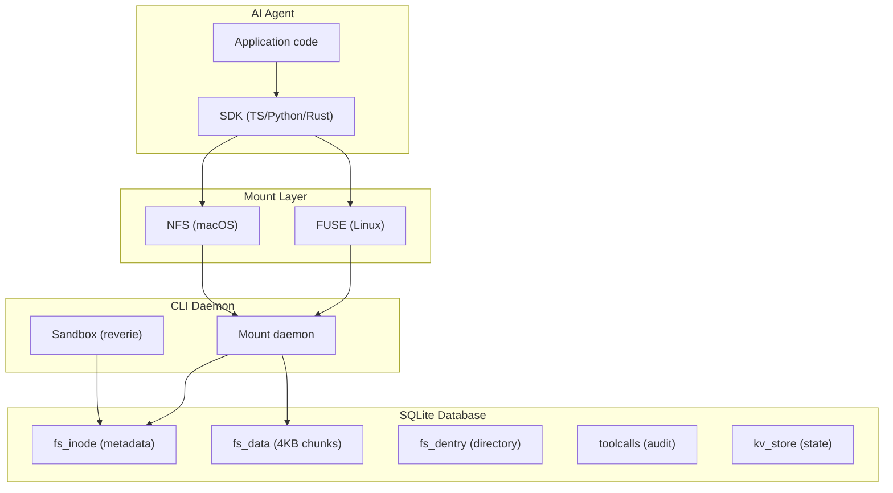
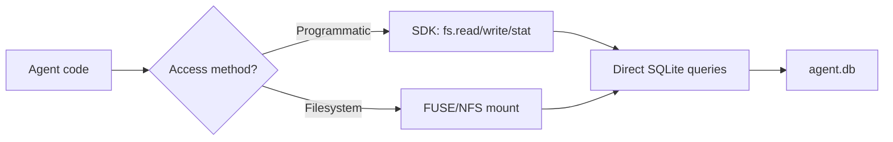

# AgentFS — SQLite-Backed Filesystem for AI Agents

**AgentFS is a SQLite-backed virtual filesystem designed for AI agent state management, providing a POSIX-like filesystem, KV store, and toolcall audit trail — all in a single SQLite database.**

## What It Does



## SDK Access Patterns



**Aha:** AgentFS has TWO access paths: (1) SDK direct access to SQLite for programmatic use, and (2) FUSE/NFS mount for filesystem-level access. Both operate on the same SQLite database.

## Crate Structure

```
agentfs/
├── sdk/
│   ├── rust/                  # Rust SDK (6,909 LOC)
│   │   ├── src/
│   │   │   ├── lib.rs         # Main SDK (633 lines)
│   │   │   ├── filesystem/    # FileSystem implementations
│   │   │   │   ├── mod.rs     # FileSystem trait (212 lines)
│   │   │   │   ├── agentfs.rs # SQLite-backed (3,173 lines)
│   │   │   │   ├── hostfs.rs  # Host passthrough (472 lines)
│   │   │   │   └── overlayfs.rs # Copy-on-write (1,795 lines)
│   │   │   ├── kvstore.rs     # Key-value store (122 lines)
│   │   │   └── toolcalls.rs   # Audit trail (502 lines)
│   ├── python/                # Python SDK
│   └── typescript/            # TypeScript SDK
├── cli/                       # CLI tool (5,315 LOC)
│   ├── src/
│   │   ├── main.rs            # CLI entry (155 lines)
│   │   ├── fuse.rs            # FUSE mount (1,230 lines)
│   │   ├── nfs.rs             # NFS mount (487 lines)
│   │   ├── daemon.rs          # Mount daemon (259 lines)
│   │   ├── sandbox/           # Sandbox with reverie
│   │   │   ├── overlay.rs     # Overlay mount (1,074 lines)
│   │   │   └── ptrace.rs      # Process tracing
│   │   └── cmd/               # CLI commands
├── sandbox/                   # Sandbox runtime (5,181 LOC)
│   └── src/
│       ├── vfs/               # Virtual filesystem
│       │   ├── mod.rs         # Vfs trait
│       │   ├── bind.rs        # Bind mount VFS
│       │   ├── fdtable.rs     # File descriptor table (766 lines)
│       │   ├── file.rs        # File operations
│       │   ├── mount.rs       # Mount table (368 lines)
│       │   └── sqlite.rs      # SQLite VFS backend (633 lines)
│       └── syscall/           # Syscall handlers
│           ├── file.rs        # openat, read, write (1,876 lines)
│           ├── stat.rs        # stat, fstat (412 lines)
│           └── process.rs     # fork, exec (122 lines)
```

## Two Access Paths

### Path 1: SDK Direct Access

```rust
use agentfs_sdk::filesystem::{AgentFS, FileSystem};

let mut fs = AgentFS::new("agent.db").await?;
fs.write("/hello.txt", b"world").await?;
let content = fs.read("/hello.txt").await?;
```

### Path 2: FUSE/NFS Mount

```bash
$ agentfs mount my-agent ./mnt
$ echo "hello" > ./mnt/hello.txt
$ cat ./mnt/hello.txt
hello
```

## Key Design Decisions

| Decision | Why |
|----------|-----|
| SQLite backend | ACID transactions, single-file backup, SQL queries |
| FUSE (Linux) + NFS (macOS) | No kernel extensions on either platform |
| Async (tokio) | Non-blocking I/O for agent concurrency |
| OverlayFS | Copy-on-write isolation for sandboxed agents |
| 4KB chunks | Matches SQLite page size, efficient storage |

## What's Next

- [01 — SQLite VFS](01-sqlite-vfs.md) — Tables, chunks, inode mapping
- [02 — Syscall Interception](02-syscall-interception.md) — How the sandbox intercepts syscalls
- [03 — OverlayFS](03-overlayfs.md) — Copy-on-write implementation
