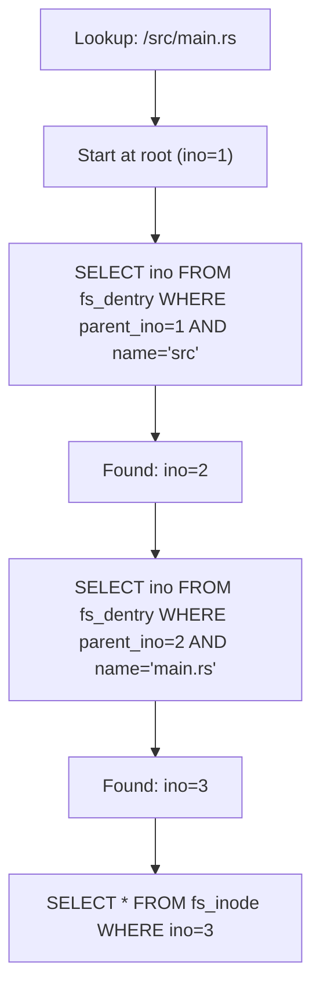

# SQLite VFS — Tables, Chunks, Inode Mapping

**AgentFS stores all filesystem data in SQLite tables — files, directories, metadata, and audit trail.**

## SQLite Schema

```mermaid
flowchart TD
    A[fs_inode table] --> B[ino (AUTOINCREMENT)]
    A --> C[mode, nlink, uid, gid]
    A --> D[size, atime, mtime, ctime]
    
    E[fs_data table] --> F[ino (FK → fs_inode)]
    E --> G[chunk_index]
    E --> H[data BLOB (4KB)]
    
    I[fs_dentry table] --> J[id (AUTOINCREMENT)]
    I --> K[name]
    I --> L[parent_ino (FK)]
    I --> M[ino (FK)]
    
    N[UNIQUE parent_ino + name] --> O[Fast path lookup]
```

Source: `sdk/rust/src/filesystem/agentfs.rs` (3,173 lines)

### fs_inode — Metadata

| Column | Type | Purpose |
|--------|------|---------|
| `ino` | INTEGER PK AUTOINCREMENT | Inode number |
| `mode` | INTEGER | File type + permissions |
| `nlink` | INTEGER | Hard link count |
| `uid` / `gid` | INTEGER | Owner |
| `size` | INTEGER | File size in bytes |
| `atime/mtime/ctime` | INTEGER | Timestamps (Unix seconds) |

### fs_data — File Content in 4KB Chunks

```sql
CREATE TABLE fs_data (
    ino INTEGER NOT NULL,
    chunk_index INTEGER NOT NULL,
    data BLOB NOT NULL,
    PRIMARY KEY (ino, chunk_index)
);
```

**Aha:** File content is split into 4KB chunks — matching SQLite's default page size. This means reading a file is essentially reading SQLite pages directly, with minimal overhead. The chunk index ensures random access reads are efficient.

### fs_dentry — Directory Entries

```sql
CREATE TABLE fs_dentry (
    id INTEGER PRIMARY KEY AUTOINCREMENT,
    name TEXT NOT NULL,
    parent_ino INTEGER NOT NULL,
    ino INTEGER NOT NULL,
    UNIQUE(parent_ino, name)
);
```

The `UNIQUE(parent_ino, name)` constraint ensures no duplicate filenames in a directory. Path lookup is a recursive CTE walking from root to target.

## Path Lookup



**Aha:** Path lookup is O(depth) SQL queries — one per directory level. For deep paths this could be slow, but typical agent filesystems are shallow (< 10 levels). The UNIQUE constraint on (parent_ino, name) makes each query a single index lookup.

## AgentFS Implementation

Source: `sdk/rust/src/filesystem/agentfs.rs`

The `AgentFS` struct wraps a Turso (SQLite-compatible) connection:

```rust
pub struct AgentFS {
    conn: Connection,
    // ...
}
```

File operations map to SQL:

| Operation | SQL |
|-----------|-----|
| `read(path)` | `SELECT data FROM fs_data WHERE ino = ? ORDER BY chunk_index` |
| `write(path, data)` | `INSERT/REPLACE INTO fs_data` |
| `stat(path)` | `SELECT * FROM fs_inode WHERE ino = ?` |
| `ls(path)` | `SELECT * FROM fs_dentry WHERE parent_ino = ?` |
| `mkdir(path)` | `INSERT INTO fs_inode` + `INSERT INTO fs_dentry` |

## What's Next

- [02 — Syscall Interception](02-syscall-interception.md) — How the sandbox intercepts syscalls
- [03 — OverlayFS](03-overlayfs.md) — Copy-on-write implementation
- [00 — Overview](00-overview.md) — Return to overview
