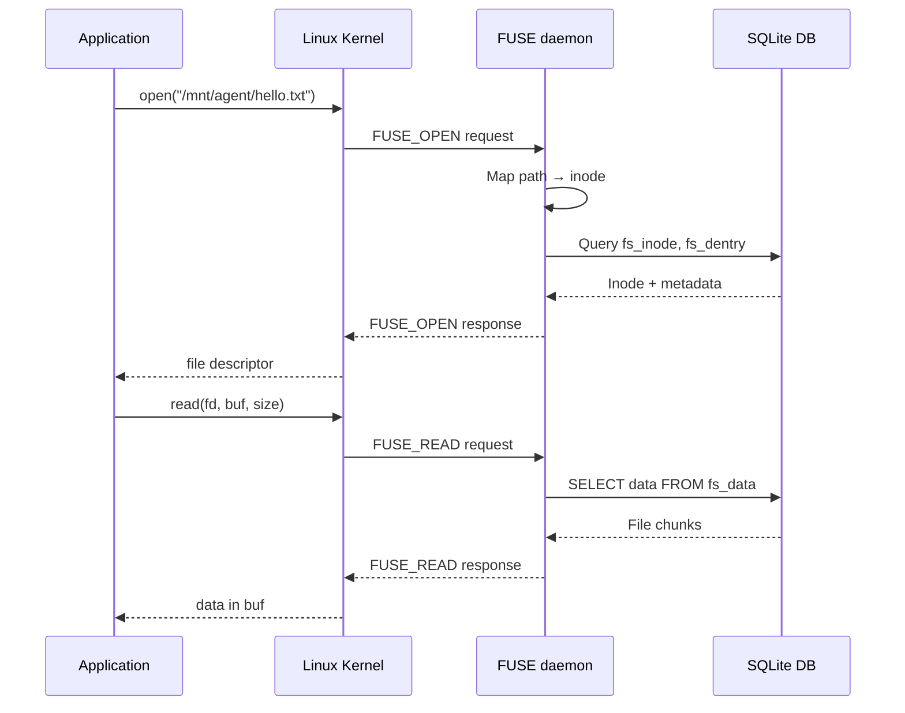
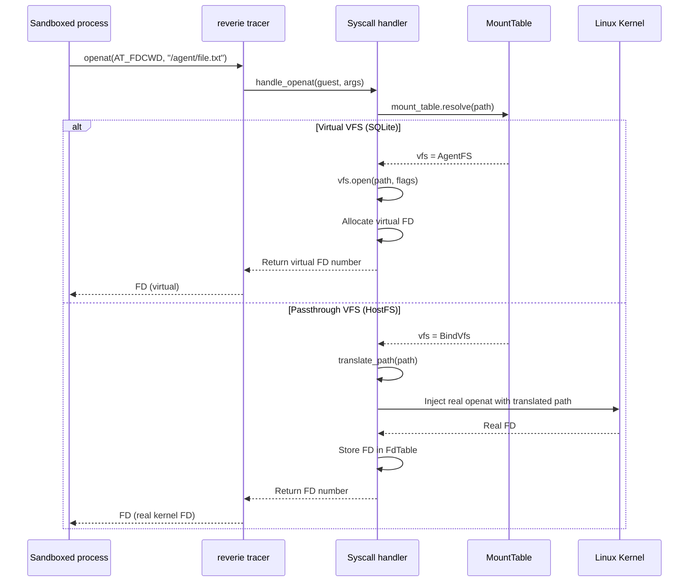

# Syscall Interception — How AgentFS Intercepts System Calls

**AgentFS uses two different mechanisms to intercept filesystem operations: FUSE mounting for host-level access, and reverie syscall interception for sandboxed processes.**

## Two Interception Mechanisms

```mermaid
flowchart TD
    A[Agent process] --> B{Access method?}
    
    B -->|FUSE/NFS mount| C[Kernel VFS layer]
    C --> D[FUSE daemon / NFS server]
    D --> E[SQLite operations]
    
    B -->|Sandbox (reverie)| F[ptrace/seccomp]
    F --> G[Syscall handler]
    G --> H{Virtual VFS?}
    H -->|Yes (SQLite)| I[Virtual FD, VFS ops]
    H -->|No (passthrough)| J[Translate path, inject to kernel]
    J --> K[Kernel handles syscall]
```

## FUSE Mount Path (Linux)

Source: `cli/src/fuse.rs` (1,230 lines)



The FUSE daemon runs as a background process, receiving requests from the kernel and translating them to SQLite operations.

## Sandbox Syscall Interception (reverie)

Source: `sandbox/src/syscall/file.rs` (1,876 lines)

The sandbox uses **reverie**, a syscall interception framework, to hook system calls from sandboxed processes:



**Aha:** The sandbox has a unified mount table that can mix virtual and passthrough VFS backends. A sandboxed process might see `/agent` as SQLite-backed AgentFS while `/project` is a passthrough bind mount to the real host filesystem.

## Mount Table Resolution

Source: `sandbox/src/vfs/mount.rs` (368 lines)

```rust
pub struct MountTable {
    mounts: Vec<(PathBuf, BoxedVfs)>,
}
```

Path resolution walks the mount table longest-prefix-first:

```
Mount table:
  /agent    → AgentFS (virtual, SQLite-backed)
  /project  → BindVfs (passthrough, host /home/user/project)
  /tmp      → BindVfs (passthrough, host /tmp)

Sandboxed process:
  open("/agent/hello.txt")  → AgentFS.open()
  open("/project/src/main.rs") → openat(AT_FDCWD, "/home/user/project/src/main.rs")
  open("/etc/passwd") → NOT FOUND (not mounted)
```

## File Descriptor Table

Source: `sandbox/src/vfs/fdtable.rs` (766 lines)

The FD table tracks both virtual and passthrough file descriptors:

| FD Type | Stored As | Operations |
|---------|-----------|------------|
| Virtual | `FdEntry::Virtual { file_ops, flags, path }` | VFS methods (pread, pwrite, etc.) |
| Passthrough | `FdEntry::Passthrough(kernel_fd)` | Injected to kernel |
| Directory (virtual) | `FdEntry::Virtual { path: Some(...) }` | Used for relative path resolution |

**Aha:** The `FdEntry::Passthrough` variant stores a real kernel file descriptor. This means for passthrough mounts, the sandboxed process gets real kernel FDs — maximum performance, no interception overhead for I/O operations after the initial open.

## What's Next

- [03 — OverlayFS](03-overlayfs.md) — Copy-on-write implementation
- [01 — SQLite VFS](01-sqlite-vfs.md) — Return to SQLite VFS
- [00 — Overview](00-overview.md) — Return to overview
