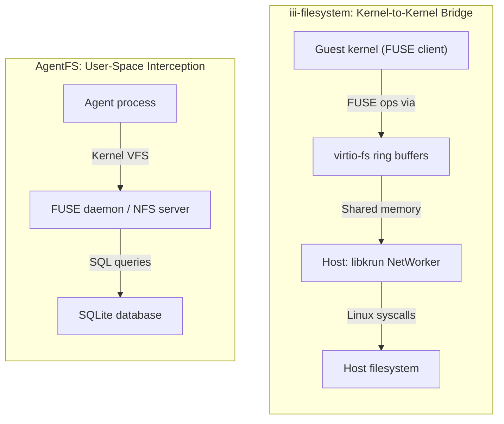
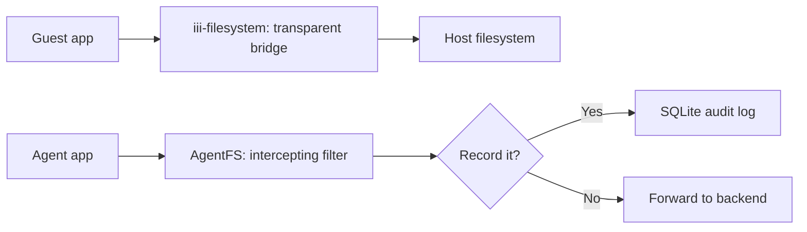

# VFS Setup Comparison — iii-filesystem vs AgentFS

**iii-filesystem and AgentFS set up their virtual filesystems in fundamentally different ways — one bridges kernel-to-kernel via virtio-fs, the other intercepts user-space syscalls via FUSE or reverie.**

## The Core Difference



**iii-filesystem** bridges the **guest kernel** to the **host filesystem** via virtio-fs ring buffers. The guest kernel's FUSE client talks to iii-init's PassthroughFs, which makes real Linux syscalls. No userspace interception — it's kernel-to-kernel.

**AgentFS** intercepts at the **userspace level** — either via a FUSE daemon (kernel forwards to userspace) or via reverie syscall interception (ptrace/seccomp). The interception layer translates operations to SQLite queries.

## Detailed VFS Setup Comparison

### 1. Where the VFS Layer Lives

| Aspect | iii-filesystem | AgentFS |
|--------|---------------|---------|
| **VFS location** | Inside guest kernel (FUSE client) + iii-init (host userspace) | Userspace FUSE daemon / reverie tracer |
| **Who initiates** | Guest kernel mounts virtio-fs as root filesystem | Userspace mounts via `agentfs mount` |
| **Protocol** | virtio-fs (kernel protocol over shared memory rings) | FUSE (kernel-to-userspace) or NFS v3 (userspace TCP) |
| **Ring buffers** | Yes — rx_ring and tx_ring | No — syscalls or TCP |

### 2. How File Operations Flow

#### iii-filesystem Flow

```
Guest app: open("/etc/config.yaml")
    ↓
Guest kernel: VFS → FUSE client → virtio-fs driver
    ↓
Shared memory: rx_ring (guest → host)
    ↓
libkrun NetWorker thread: reads frame
    ↓
iii-init PassthroughFs: translate FUSE op → Linux syscall
    ↓
Host kernel: open("/host/path/etc/config.yaml")
    ↓
Host filesystem: returns fd
    ↓
iii-init: write response to tx_ring
    ↓
Shared memory: tx_ring (host → guest)
    ↓
Guest kernel: returns fd to guest app
```

#### AgentFS FUSE Flow

```
Agent app: open("/mnt/agent/hello.txt")
    ↓
Kernel VFS: recognizes FUSE mount → forwards to FUSE daemon
    ↓
/dev/fuse: FUSE daemon reads request
    ↓
AgentFS FUSE handler: parse path → query SQLite
    ↓
SQLite: SELECT * FROM fs_inode WHERE path = '/hello.txt'
    ↓
FUSE daemon: write response to /dev/fuse
    ↓
Kernel VFS: returns fd to agent app
```

#### AgentFS Sandbox (reverie) Flow

```
Sandboxed process: openat(AT_FDCWD, "/agent/hello.txt")
    ↓
Kernel: syscall trapped by ptrace/seccomp
    ↓
Reverie: intercept syscall, pass to handler
    ↓
MountTable.resolve("/agent/hello.txt")
    ↓
If virtual (AgentFS): vfs.open() → SQLite query
If passthrough (BindVfs): translate path → inject to kernel
    ↓
Handler: return virtual FD or inject real syscall
    ↓
Sandboxed process: receives fd
```

### 3. Inode Management

| Aspect | iii-filesystem | AgentFS |
|--------|---------------|---------|
| **Inode source** | Host filesystem inodes | SQLite AUTOINCREMENT |
| **Mapping** | `MultikeyBTreeMap` (FUSE inode ↔ host ino+dev+mnt_id) | Direct: SQLite row ID = inode number |
| **Deduplication** | Dual-key: FUSE inode number AND host identity | None needed — SQLite is the source |
| **Persistence** | Volatile (recreated on VM boot) | Persistent (stored in SQLite) |

### 4. Mount Setup Sequence

#### iii-filesystem Setup (at VM boot)

```
1. libkrun creates VM with virtio-fs device
2. VM boots, iii-init runs as PID 1
3. pivot_to_tmpfs_root() — replace virtiofs root with tmpfs
4. Bind-mount all rootfs entries from virtiofs into tmpfs
5. Mount devtmpfs, proc, sysfs, etc.
6. PassthroughFs is now the guest's root filesystem
7. User worker process runs inside this environment
```

#### AgentFS Setup (FUSE mount)

```
1. User runs: agentfs mount my-agent ./mnt
2. CLI daemon opens SQLite database
3. FUSE daemon starts, mounts at ./mnt
4. Kernel routes filesystem ops for ./mnt to FUSE daemon
5. FUSE daemon translates ops to SQLite queries
6. User accesses files via standard filesystem API
```

#### AgentFS Setup (Sandbox with reverie)

```
1. User runs: agentfs run --agent my-agent /bin/bash
2. CLI creates MountTable with AgentFS at /agent, BindVfs at /project
3. Reverie starts tracing the sandboxed process
4. Process starts, all syscalls intercepted
5. MountTable resolves each path to appropriate VFS
6. Process runs with mixed virtual + passthrough filesystems
```

### 5. Performance Characteristics

| Metric | iii-filesystem | AgentFS FUSE | AgentFS Sandbox |
|--------|---------------|-------------|-----------------|
| **Syscall overhead** | None (direct host syscalls) | FUSE context switch + userspace | Ptrace overhead per syscall |
| **Data copy** | Zero-copy via ring buffers | Copy via /dev/fuse | Copy via reverie |
| **I/O path length** | Guest kernel → host kernel (2 hops) | Kernel → userspace → SQLite (3 hops) | Userspace → reverie → kernel/SQLite (3-4 hops) |
| **Best for** | High-throughput VM workloads | Host-level file access | Sandboxed agent execution |

### 6. Threading Model

| Aspect | iii-filesystem | AgentFS |
|--------|---------------|---------|
| **Main thread** | Dedicated OS thread (smoltcp poll) | FUSE daemon thread or reverie tracer |
| **I/O handling** | Sync (Linux syscalls) | Async (tokio for SDK) / sync (FUSE) |
| **Concurrent ops** | DashMap for handles, RwLock for inodes | SQLite WAL mode for concurrent reads |

## Key Architectural Insight

**iii-filesystem is a bridge, AgentFS is a filter.**



iii-filesystem's job is to make the guest VM see exactly what's on the host — it's a transparent bridge. The guest has full access to host files (bounded by the root pivot's allowlist). There's no transformation, no audit, no isolation beyond the VM boundary.

**Aha:** This is why iii-filesystem cannot answer "what files did the worker create?" — it has no audit trail. The interception layer is where the magic happens, and iii-filesystem deliberately doesn't have one. AgentFS, by contrast, records every operation in SQLite.

AgentFS's job is to **intercept and transform** — every file operation goes through the interception layer, which can:
- Record it in SQLite (auditability)
- Redirect it to a different layer (OverlayFS copy-on-write)
- Block it (sandbox restrictions)
- Transform it (path translation)

This is why AgentFS can answer "what files did the agent create?" with a SQL query, while iii-filesystem cannot — the interception layer is where the magic happens.

## What's Next

- [03 — OverlayFS](03-overlayfs.md) — AgentFS copy-on-write implementation
- [01 — SQLite VFS](01-sqlite-vfs.md) — Return to SQLite VFS
- [00 — Overview](00-overview.md) — Return to overview
